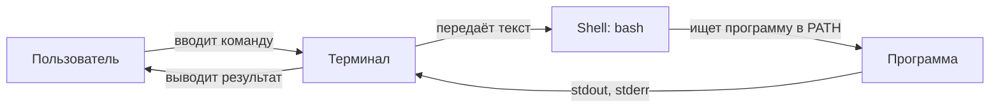
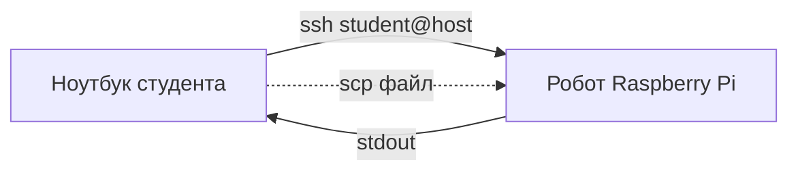

# Занятие 1: Ubuntu и командная строка

## Цель занятия

К концу занятия студент перемещается по файловой системе, запускает команды, понимает права доступа и `sudo`, ставит пакеты через `apt`, читает справку и подключается к другой машине по SSH. Это выравнивание для тех, кто не работал с Linux-терминалом.

## Связь с календарём курса

Занятие 1 из 30, этап 1 (окружение и инструменты). Открывает блок тем 1–5, который готовит среду для ROS2. Без терминала невозможно выполнять практики, начиная с занятия 6 («Что такое ROS2»). Подробности темы — [`lectures_content.md`](lectures_content.md), тема 1.

## Структура 40+40+40

- **0–40 минут** — лекция (уровень 1): терминал, файловая система, права, пакеты, SSH.
- **40–80 минут** — практика (уровень 2): [`../2_practice/01_ubuntu_cli.md`](../2_practice/01_ubuntu_cli.md).
- **80–120 минут** — кейс робота (уровень 3): терминал внутри контейнера `3_Robot/TIAgo_humble/`, SSH к Raspberry Pi робота.
- **После занятия** — ДЗ: [`../2_homework/hw_01_ubuntu.md`](../2_homework/hw_01_ubuntu.md).

Поминутная раскладка:

| Время | Блок | Содержание |
| --- | --- | --- |
| 0–5 | Вступление | Что такое терминал, зачем он в робототехнике. |
| 5–15 | Навигация и файлы | `pwd`, `ls`, `cd`, `mkdir`, `cp`, `mv`, `rm`, `cat`, `grep`. |
| 15–22 | Права и пользователи | `sudo`, `chmod`, почему не работать постоянно под root. |
| 22–30 | Пакеты и справка | `apt`, `man`, `--help`, переменные окружения и `PATH`. |
| 30–40 | SSH | IP/порт/ключ, `ssh-keygen`, `ssh`, `scp`, разбор отказов. |
| 40–80 | Практика | Студенты повторяют шаги практики 01 в devcontainer, включая SSH к другой машине (в классе — временный сервер или соседний компьютер в сети; запасной вариант — `ssh localhost`). |
| 80–120 | Кейс TIAgo | Терминал в контейнере робота + смелые тесты + SSH к Raspberry Pi. |

## Лекционная часть (уровень 1, 0–40 минут)

### Ключевые тезисы

- Терминал — разговор с компьютером короткими командами вместо кликов мышью.
- Все инструменты ROS2 запускаются из командной строки; к роботу подключаются удалённо.
- `PATH` — список папок, где shell ищет программы.
- `sudo` даёт временные права администратора; постоянная работа под root опасна.
- SSH — «дверь» в другую машину: IP — номер дома, порт — квартира, ключ — ключ от двери.

### Порядок объяснения

1. **Что такое терминал и зачем** — робот это компьютер без графики; его настраивают и отлаживают командами.
2. **Навигация и файлы** — `pwd`, `ls -la`, `cd`, `mkdir -p`, `cp`, `mv`, `rm`, `cat`, `grep`. Аналогия: папки как каталог в библиотеке.
3. **Права** — три пары прав `rwx` для владельца, группы, остальных; `sudo` и `chmod`.
4. **Пакеты и справка** — `apt update` / `apt install`, `man` и `--help`; `PATH` и стандартные потоки `stdout`/`stderr`.
5. **SSH** — пара ключей, `ssh user@host`, `ssh -p PORT`, `scp`, `ssh-copy-id`; разбор «Connection refused» и «Permission denied».

### Фразы преподавателя

- «Робот — это компьютер без графики. Вы будете управлять им командами, а не мышью.»
- «`sudo` — временные права администратора. Не работайте постоянно под root: случайная ошибка сломает систему.»
- «SSH — дверь в другую машину. IP — номер дома, порт — квартира, ключ — ключ от двери.»
- «`rm` удаляет навсегда, без корзины. Проверяйте путь перед удалением.»

### Схемы





### Фрагменты кода и команд

```bash
pwd
ls -la
mkdir -p ~/ros2_ws/src
cat /etc/os-release
sudo apt install -y tree
echo $PATH
which bash
```

```bash
ssh-keygen -t ed25519 -C "student@laptop"
ssh-copy-id user@host
ssh user@host
ssh -p 2222 user@host
scp file.txt user@host:/путь/
scp -r dir user@host:/путь/
```

## Практическая часть (уровень 2, 40–80 минут)

Файл: [`../2_practice/01_ubuntu_cli.md`](../2_practice/01_ubuntu_cli.md).

Студенты внутри Dev Container уровня 2 (`.devcontainer/`, Ubuntu 24.04 + ROS2 Jazzy):

1. Проверяют `pwd`, `whoami` — видят, что работают пользователем `ubuntu`, не root.
2. Создают папку и файл, меняют права через `chmod`.
3. Ставят пакет `tree` через `sudo apt install` и читают справку `--help` / `man`.
4. Изучают `PATH` и переменные окружения (`echo $PATH`, `export ROBOT_NAME=tiago`).
5. Создают пару SSH-ключей и подключаются к другой машине (в классе — временный SSH-сервер или соседний компьютер в сети; запасной вариант — `ssh localhost`).
6. Дополнительно копируют файл через `scp`.

ROS2 на хост не ставится — всё выполняется внутри контейнера.

## Кейс робота TIAgo (уровень 3, 80–120 минут)

### Что показать в архитектуре

- Контейнер робота живёт в `3_Robot/TIAgo_humble/` (ROS2 Humble, Ubuntu 22.04). Это отдельный, более тяжёлый контейнер.
- Терминал в контейнере робота — тот же bash, что и на занятии, но с ROS2 Humble.
- Установленный ROS2 — это просто файлы в `/opt/ros/humble/`.
- Реальный ровер MentorPi M1 (этап 3, занятия 25–30) — Raspberry Pi, к которому подключаются по SSH: `ssh student@<ip-робота>`.

### Смелые тесты

**Тест 1. «Заблудиться в файловой системе и вернуться»** (в контейнере робота, безопасно).

```bash
cd /opt/ros/humble
pwd
ls
du -sh /opt/ros/humble
cd ~
pwd
```

- Цель: показать, что ROS2 — это обычные файлы на диске, по которым можно безопасно «гулять».
- Ожидаемый результат: `du -sh` показывает объём установленного ROS2; `pwd` возвращает домашнюю папку.
- Возврат в норму: `cd ~` — ничего не менялось.

**Тест 2. «Разобрать отказ SSH»** (в контейнере робота, безопасно).

```bash
ssh student@localhost -p 2222   # порт, на котором никто не слушает
ssh student@<ip-робота>         # реальный ровер, ключ ещё не добавлен
```

- Цель: увидеть и прочитать два разных отказа — «Connection refused» (нет сервера/не тот порт) и «Permission denied» (ключ не принят).
- Ожидаемый результат: `Connection refused` → сервер не запущен или не тот порт; `Permission denied` → публичный ключ не на целевой машине.
- Возврат в норму: не требуется (ничего не изменялось).

**Тест 3. SSH к Raspberry Pi реального ровера** — **только с инструктором** (этап 3).

```bash
ssh student@<ip-робота>
scp <файл> student@<ip-робота>:/путь/
```

- Цель: увидеть, что робот — другая машина в сети, а не локальная папка.
- Ожидаемый результат: вход по ключу без пароля после `ssh-copy-id`.
- На занятии 1 выполняется как демонстрация инструктора, если ровер доступен; иначе — переносится на занятия 25–30.

## Домашнее задание

Файл: [`../2_homework/hw_01_ubuntu.md`](../2_homework/hw_01_ubuntu.md).

Шаг к модели робота: это фундамент, а не элемент модели. Студент проверяет `bash --version`, повторяет навигацию, готовит workspace `~/ros2_ws/src/` и создаёт SSH-ключ. Сам элемент модели появится с занятия 4.

## Типичные ошибки

| Ошибка | Симптом | Исправление |
| --- | --- | --- |
| Путают `cd` и `ls` | `cd /tmp` не работает | `cd` — переход, `ls` — просмотр |
| `sudo cd` | `sudo` не работает с `cd` | `sudo` — для прав, не для навигации |
| Потеря пути после `sudo` | `~` указывает не туда | Обычные файлы редактировать без `sudo` |
| `rm -rf` не то | Файл исчез навсегда | Проверять `pwd` и путь |
| `Permission denied` по SSH | Публичный ключ не на целевой машине | `ssh-copy-id user@host` |
| `Connection refused` по SSH | `sshd` не запущен или не тот порт | `service ssh status`, `ssh -p PORT` |

## План Б

Если контейнер робота `3_Robot/TIAgo_humble/` не готов или не запускается:

- Показать тот же терминал в контейнере уровня 2 — команды идентичны.
- Показать структуру `/opt/ros/` на схеме и объяснить, что ROS2 ставится в контейнер, а не на хост.
- SSH-часть отработать на `ssh localhost` внутри контейнера уровня 2 (как в практике).
- Рассказать про Raspberry Pi ровера по [`../2_knowledge/home_setup.md`](../2_knowledge/home_setup.md) и схеме, без живого подключения.

## Вопросы аудитории и резерв времени

- Чем `cd` отличается от `ls`? Что делает `cd` без аргумента?
- Зачем нужен `sudo`, если мы и так в контейнере?
- Почему публичный ключ можно показывать, а приватный — нет?
- Что значит `bash: foo: command not found`?

Резерв: если SSH-тесты заняли меньше времени — разобрать стандартные потоки (`>`, `>>`, `2>`, `|`) и `grep` на логах.

## Связи с материалами

- Статья базы знаний — [`../2_knowledge/ubuntu_cli.md`](../2_knowledge/ubuntu_cli.md).
- Настройка окружения дома — [`../2_knowledge/home_setup.md`](../2_knowledge/home_setup.md).
- Практика — [`../2_practice/01_ubuntu_cli.md`](../2_practice/01_ubuntu_cli.md).
- Домашнее задание — [`../2_homework/hw_01_ubuntu.md`](../2_homework/hw_01_ubuntu.md).
- Следующее занятие 2 «Контейнеризация и Git» — [`lectures_content.md`](lectures_content.md), тема 2.
- Источники: [Ubuntu Server docs: Command line](https://ubuntu.com/server/docs/command-line-tutorials), [Ubuntu: OpenSSH Server](https://ubuntu.com/server/docs/openssh-server).
