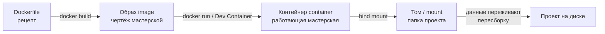
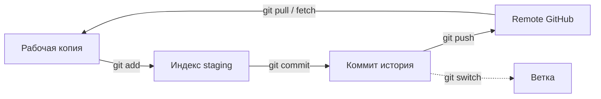

# Занятие 2: Контейнеризация и Git

## Цель занятия

К концу занятия студент понимает образ/контейнер/том, запускает контейнер, открывает проект в Dev Container, ведёт локальную историю Git и синхронизирует её с репозиторием. Студент объясняет, почему ROS2 не ставится на хост.

## Связь с календарём курса

Занятие 2 из 30, этап 1 (окружение и инструменты). Завершает подготовку среды: контейнер воспроизводит окружение, Git хранит историю наработок студента по собственной модели робота. Подробности — [`lectures_content.md`](lectures_content.md), тема 2.

## Структура 40+40+40

- **0–40 минут** — лекция (уровень 1): Docker, Dev Container, Git.
- **40–80 минут** — практика (уровень 2): [`../2_practice/02_container_git.md`](../2_practice/02_container_git.md).
- **80–120 минут** — кейс робота (уровень 3): контейнеры `3_Robot/`, `.gitignore` и история коммитов.
- **После занятия** — ДЗ: [`../2_homework/hw_02_setup.md`](../2_homework/hw_02_setup.md).

Поминутная раскладка:

| Время | Блок | Содержание |
| --- | --- | --- |
| 0–6 | Вступление | Проблема «работает у меня, не работает у тебя». |
| 6–16 | Docker | Образ, контейнер, том; `docker run`, `docker exec`, `docker ps`. |
| 16–24 | Dev Container | `devcontainer.json`, как открыть проект в контейнере. |
| 24–40 | Git | Репозиторий, коммит, ветка, remote, `.gitignore`. |
| 40–80 | Практика | Пересборка Dev Container + полный Git-цикл в учебном репозитории. |
| 80–120 | Кейс TIAgo | Контейнеры робота, `.gitignore`, история коммитов, смелый тест. |

## Лекционная часть (уровень 1, 0–40 минут)

### Ключевые тезисы

- Образ — чертёж, контейнер — работающая мастерская, том — шкаф с данными, которые переживают пересборку.
- Все студенты запускают один образ — поэтому окружение одинаковое в классе и дома.
- ROS2, Gazebo, Nav2, MoveIt2 тянут десятки зависимостей; держать их на хосте — ломать систему.
- Git — журнал лабораторных работ: `git add` выбирает, `git commit` сохраняет, `git push` отправляет.
- Файлы сборки (`build/`, `install/`, `log/`) и секреты в историю не попадают — их исключает `.gitignore`.

### Порядок объяснения

1. **Проблема и решение** — разные версии ОС и библиотек → контейнер упаковывает всё нужное.
2. **Docker** — Dockerfile → `docker build` → образ; `docker run` → контейнер; `docker exec` — войти в запущенный.
3. **Dev Container** — VS Code читает `devcontainer.json`, собирает образ, запускает контейнер, открывает терминал.
4. **Как в проекте** — `.devcontainer/` для уровня 2, `3_Robot/TIAgo_humble/.devcontainer/` для уровня 3.
5. **Git локально** — `git init`, `git add`, `git commit`, `git status`, `git log`, `git diff`, ветки.
6. **Git + remote** — `git clone`, `git remote -v`, `git pull`, `git push`, работа в своей ветке.
7. **Связь с курсом** — коммиты по ДЗ ведут историю к собственной модели робота.

### Фразы преподавателя

- «Контейнер — переносная мастерская. Образ — её чертёж, том — шкаф с вашими данными.»
- «Проблема „у меня работает, у тебя нет“ решается тем, что все запускают один и тот же образ.»
- «`git add` выбирает, `git commit` сохраняет. Без `git add` коммит пустой.»
- «Ключи и пароли, попавшие в коммит, остаются в истории навсегда. Исключайте их до первого `git add`.»

### Схемы





### Фрагменты кода и команд

```bash
docker run -it --rm ubuntu:24.04 bash
docker ps
docker exec -it <имя> bash
```

```bash
git init -b main
git add README.md
git commit -m "Первый коммит"
git log --oneline
git switch -c feature/x
git push -u origin main
```

```gitignore
build/
install/
log/
__pycache__/
*.pyc
.env
*.key
*.pem
id_ed25519
```

## Практическая часть (уровень 2, 40–80 минут)

Файл: [`../2_practice/02_container_git.md`](../2_practice/02_container_git.md).

Студенты внутри Dev Container уровня 2:

1. Пересобирают Dev Container («Dev Containers: Rebuild Container») и проверяют `hostname`/`whoami`.
2. Смотрят на контейнер со стороны Docker: `docker ps` (на хосте), `docker exec`.
3. Инициализируют учебный репозиторий, настраивают автора (`git config`).
4. Делают первый коммит, добавляют `.gitignore`, создают ветку `feature/sensor`.
5. Смотрят `git diff` и откатывают правку через `git restore`.

ROS2 на хост не ставится; Docker-демон работает на хосте, не в контейнере.

## Кейс робота TIAgo (уровень 3, 80–120 минут)

### Что показать в архитектуре

- Уровень 2 — один общий контейнер `.devcontainer/`; уровень 3 — отдельный тяжёлый контейнер `3_Robot/TIAgo_humble/` (образ `osrf/ros:humble-desktop` + пакеты TIAGo, сборка `colcon build`).
- Dockerfile и `devcontainer.json` контейнера робота: `postCreateCommand` → `post_create.sh` (подготовка, overlay), `postStartCommand` → `post_start.sh` (клонирует пакеты через `vcs import`, ставит зависимости, собирает workspace).
- `.gitignore` проекта: `build/`, `install/`, `log/`, ключи не попадают в историю.
- История коммитов пакетов TIAGo в `ros2_ws/src/`.

### Смелые тесты

**Тест 1. «Зайти в контейнер робота и увидеть ROS-процессы»** (в симуляции).

```bash
# на хосте: найти контейнер и войти вторым терминалом
docker ps
docker exec -it <имя-контейнера-робота> bash

# внутри: посмотреть процессы ROS2
ps aux | grep -i ros | head
ros2 node list
```

- Цель: увидеть, что контейнер робота — изолированная система со своими процессами.
- Ожидаемый результат: `ros2 node list` показывает узлы запущенной симуляции (полный разбор ROS Graph — на занятии 6).
- Возврат в норму: выйти `exit`; процессы не трогали.

**Тест 2. «Остановить узел и наблюдать эффект»** — **только в симуляции**.

```bash
ros2 launch tiago_gazebo tiago_gazebo.launch.py is_public_sim:=True
# в другом терминале:
ros2 node list
pkill -f robot_state_publisher
ros2 node list
```

- Цель: увидеть, что узлы независимы и их исчезновение видно в списке узлов.
- Ожидаемый результат: после `pkill` узел `robot_state_publisher` исчезает из `ros2 node list`, остальные продолжают работать.
- Возврат в норму: остановить симуляцию `Ctrl+C` и запустить заново командой `ros2 launch tiago_gazebo tiago_gazebo.launch.py is_public_sim:=True`.

## Домашнее задание

Файл: [`../2_homework/hw_02_setup.md`](../2_homework/hw_02_setup.md).

Шаг к модели робота: студент заводит отдельный репозиторий `~/my_robot/`, создаёт `.gitignore` и делает первый коммит с идеей модели. Дальше каждое ДЗ добавляет в этот репозиторий новый элемент. Настройка окружения дома — [`../2_knowledge/home_setup.md`](../2_knowledge/home_setup.md).

## Типичные ошибки

| Ошибка | Симптом | Исправление |
| --- | --- | --- |
| Изменили Dockerfile, а в контейнере по-старому | Не пересобран контейнер | «Dev Containers: Rebuild Container» |
| Файлы, созданные в контейнере, пропали | Созданы вне смонтированной папки | Работать в workspace |
| Коммит пустой | Забыли `git add` | `git add` перед `git commit` |
| В историю попали `build/`, `install/` | Нет `.gitignore` до первого коммита | Создать `.gitignore`, убрать из индекса |
| `git push` отклонён | Ветка отстала от remote | `git pull` перед `git push` |
| Секрет закоммичен | Ключ в репозитории | Сменить ключ и удалить из истории |

## План Б

Если контейнер робота `3_Robot/TIAgo_humble/` не запускается:

- Показать Docker-команды на контейнере уровня 2 (`docker ps`, `docker exec`).
- Показать структуру `3_Robot/TIAgo_humble/.devcontainer/` (Dockerfile, `devcontainer.json`) как текст и объяснить, что делает каждая часть.
- Показать `.gitignore` проекта и историю коммитов (`git log --oneline`) на самом репозитории курса.
- Если недоступен Docker вообще — разобрать схему «образ → контейнер → том» и `devcontainer.json` без запуска.

## Вопросы аудитории и резерв времени

- Чем образ отличается от контейнера, а контейнер — от тома?
- Почему ROS2 не ставится на хост, а живёт в контейнере?
- Что делает `git add` и почему без него коммит пустой?
- Почему `docker ps` может быть пустым внутри контейнера?

Резерв: если Git-цикл прошёл быстро — разобрать слияние веток (`git merge`) и конфликт на простом примере.

## Связи с материалами

- Статьи базы знаний — [`../2_knowledge/docker_devcontainer.md`](../2_knowledge/docker_devcontainer.md), [`../2_knowledge/git.md`](../2_knowledge/git.md).
- Настройка окружения дома — [`../2_knowledge/home_setup.md`](../2_knowledge/home_setup.md).
- Практика — [`../2_practice/02_container_git.md`](../2_practice/02_container_git.md).
- Домашнее задание — [`../2_homework/hw_02_setup.md`](../2_homework/hw_02_setup.md).
- Контейнер робота — [`../3_Robot/TIAgo_humble/README.md`](../3_Robot/TIAgo_humble/README.md).
- Следующее занятие 3 «Агентная инженерия с opencode» — [`lectures_content.md`](lectures_content.md), тема 3.
- Источники: [Docker overview](https://docs.docker.com/get-started/), [Developing inside a Container](https://code.visualstudio.com/docs/devcontainers/containers), [Pro Git (рус.)](https://git-scm.com/book/ru/v2).
