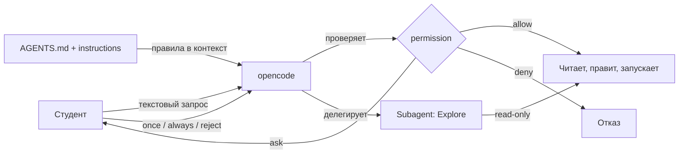

# Занятие 3: Агентная инженерия с opencode

## Цель занятия

К концу занятия студент запускает opencode, формулирует запрос, читает ответ и понимает, что агент делает с проектом и какие у него права. Студент отличает Plan от Build и знает роль `AGENTS.md`.

## Связь с календарём курса

Занятие 3 из 30, этап 1 (окружение и инструменты). Даёт инструмент-ускоритель, которым студент пользуется при сборке собственной модели робота (с занятия 4) и при чтении кода TIAgo. Подробности — [`lectures_content.md`](lectures_content.md), тема 3.

## Структура 40+40+40

- **0–40 минут** — лекция (уровень 1): агент, vibe-coding, agent engineering, permission, `AGENTS.md`.
- **40–80 минут** — практика (уровень 2): [`../2_practice/03_opencode.md`](../2_practice/03_opencode.md).
- **80–120 минут** — кейс робота (уровень 3): opencode читает код TIAgo.
- **После занятия** — ДЗ: [`../2_homework/hw_03_opencode.md`](../2_homework/hw_03_opencode.md).

Поминутная раскладка:

| Время | Блок | Содержание |
| --- | --- | --- |
| 0–8 | Вступление | Что такое AI-агент для кода; vibe-coding. |
| 8–18 | Agent engineering | Управление агентом: `AGENTS.md`, permission, субагенты. |
| 18–28 | Как выглядит в opencode | `opencode`, `opencode run`, Plan vs Build, права allow/ask/deny. |
| 28–40 | Границы | Агент ускоряет, но не заменяет понимание ROS2. |
| 40–80 | Практика | Первый запрос, чтение прав, read-only запрос через Plan. |
| 80–120 | Кейс TIAgo | opencode объясняет структуру `ros2_ws/src/`, смелые тесты. |

## Лекционная часть (уровень 1, 0–40 минут)

### Ключевые тезисы

- AI-агент для кода — программа, которая по текстовому запросу читает, пишет и запускает код.
- vibe-coding — описываешь результат словами; агент предлагает и применяет изменения.
- agent engineering — управление агентом через `AGENTS.md`, права `permission` и субагентов.
- Primary-агенты: **Build** (все инструменты) и **Plan** (правки/команды требуют подтверждения). Subagent-ы: **General**, **Explore** (read-only).
- Права: `allow` (без спроса), `ask` (спросить), `deny` (запретить).

### Порядок объяснения

1. **Что такое агент** — стажёр с отличной памятью, работающий в вашей папке.
2. **Vibe-coding** — формулируешь «что», агент делает «как».
3. **Agent engineering** — `AGENTS.md` задаёт правила; `permission` ограничивает права; субагенты решают подзадачи.
4. **Как в opencode** — `opencode` (TUI), `opencode run "..."`, переключение Plan/Build клавишей Tab.
5. **Границы** — агент может ошибаться; на зачёте отвечает студент; не отправлять агенту секреты.

### Фразы преподавателя

- «Агент — стажёр с отличной памятью. Он ускоряет, но отвечаете на зачёте вы.»
- «Сначала понимание, потом ускорение. Агент — инструмент, как `colcon` или `git`.»
- «`permission` — это права стажёра: что без спроса, что с вопросом, что нельзя.»
- «`AGENTS.md` — письменные правила для агента. Без него он действует хаотично.»

### Схемы



### Фрагменты кода и команд

```bash
opencode
opencode run "объясни структуру пакета"
opencode run --agent plan "разбери этот код"
opencode agent list
opencode agent create
opencode --version
```

```jsonc
"permission": {
  "edit": "allow",
  "bash": { "*": "ask", "ls": "allow" },
  "webfetch": "ask",
  "read": "allow",
  "grep": "allow",
  "glob": "allow"
}
```

## Практическая часть (уровень 2, 40–80 минут)

Файл: [`../2_practice/03_opencode.md`](../2_practice/03_opencode.md).

Студенты:

1. Проверяют opencode: `opencode --version`, `opencode agent list`.
2. Читают блок `permission` в [`opencode.jsonc`](../opencode.jsonc) и объясняют, что агент может без спроса.
3. Делают безопасный read-only запрос через агента Plan о структуре репозитория.
4. Спрашивают про `3_Robot/TIAgo_humble` и его `AGENTS.md`.
5. Сверяют ответ агента с фактическим содержимым папок (не выдумал ли файлы).

opencode — отдельный инструмент; ROS2 на хост не ставится. В курсе opencode запускается на хосте, а не в контейнере.

## Кейс робота TIAgo (уровень 3, 80–120 минут)

### Что показать в архитектуре

- `3_Robot/TIAgo_humble/AGENTS.md` — правила работы агента в проекте робота (совместимость с PAL Robotics, ROS2-способ, минимум своего кода).
- Пакеты в `ros2_ws/src/`: `tiago_robot`, `omni_base_robot`, `pmb2_navigation`, `tiago_moveit_config`, `play_motion2` и др.
- opencode читает и объясняет структуру и назначение пакетов.

### Смелые тесты

**Тест 1. «Проверить, не выдумывает ли агент»** (безопасно, read-only).

```bash
opencode run --agent plan "Перечисли пакеты в 3_Robot/TIAgo_humble/ros2_ws/src и за что отвечает tiago_description"
```

Затем сверить с фактом:

```bash
ls 3_Robot/TIAgo_humble/ros2_ws/src
ls 3_Robot/TIAgo_humble/ros2_ws/src/tiago_robot/tiago_description
```

- Цель: научиться не доверять ответу «на слово».
- Ожидаемый результат: ответ совпадает со списком пакетов; если агент назвал несуществующий пакет — это найдено сверкой.
- Возврат в норму: не требуется (агент Plan ничего не менял).

**Тест 2. «Сравнить Plan и Build»** — **с инструктором**.

```bash
opencode run --agent plan "Найди, где в TIAgo задан лидар"
opencode run --agent build "Найди, где в TIAgo задан лидар"
```

- Цель: увидеть разницу в правах — Plan не меняет файлы, Build может.
- Ожидаемый результат: оба отвечают про `pal_urdf_utils`/`base_sensors`, но Build дополнительно может предложить правки.
- Возврат в норму: если Build что-то изменил — `git status` и `git restore` в `3_Robot/TIAgo_humble/`.

## Домашнее задание

Файл: [`../2_homework/hw_03_opencode.md`](../2_homework/hw_03_opencode.md).

Шаг к модели робота: задание готовит инструмент, а не элемент модели. Студент инициализирует opencode в своём клоне, изучает `AGENTS.md`, выполняет разобранный read-only запрос и заводит дневник `~/my_robot/diary.md` с примерами «где агент ускоряет» и «где ошибается».

## Типичные ошибки

| Ошибка | Симптом | Исправление |
| --- | --- | --- |
| Слепое применение кода | Команда не работает, файл испорчен | Разбирать каждый шаг до выполнения |
| Работа без `AGENTS.md` | Агент действует хаотично | Создать/дополнить `AGENTS.md` (`/init`) |
| Не знать прав агента | Агент правит/запускает неожиданно | Прочитать блок `permission` в `opencode.jsonc` |
| Путать Plan и Build | Просили «посмотреть», а агент менял файлы | Для read-only — Plan или `@explore` |
| Доверять всему ответу | Ответ правдоподобен, но неверен | Сверять с `ls`, `cat` и документацией |

## План Б

Если opencode недоступен (нет модели/провайдера):

- Показать скриншоты/пример диалога и разобрать структуру ответа.
- Показать [`opencode.jsonc`](../opencode.jsonc) и `AGENTS.md` как текст — объяснить `permission` и правила.
- Показать структуру `ros2_ws/src/` через `ls` и объяснить назначение пакетов вручную.
- Если не работает только у части студентов — выполнить `opencode auth login` и выбрать провайдера.

## Вопросы аудитории и резерв времени

- Чем агент Plan отличается от Build? Когда брать какой?
- Что означает `"bash": { "*": "ask" }` в правах?
- Зачем нужен `AGENTS.md` и что будет без него?
- Почему для чтения кода безопаснее `@explore`, а не Build?

Резерв: если запросы прошли быстро — показать вызов субагента через `@explore` и разобрать, чем он отличается от primary-агента.

## Связи с материалами

- Статья базы знаний — [`../2_knowledge/opencode_agent.md`](../2_knowledge/opencode_agent.md).
- Практика — [`../2_practice/03_opencode.md`](../2_practice/03_opencode.md).
- Домашнее задание — [`../2_homework/hw_03_opencode.md`](../2_homework/hw_03_opencode.md).
- Правила проекта — [`AGENTS.md`](../AGENTS.md), [`opencode.jsonc`](../opencode.jsonc).
- Код робота — [`../3_Robot/TIAgo_humble/AGENTS.md`](../3_Robot/TIAgo_humble/AGENTS.md).
- Следующее занятие 4 «Проект робота и URDF в RobotCAD» — [`lectures_content.md`](lectures_content.md), тема 4.
- Источники: [opencode docs](https://opencode.ai/docs/), [opencode: Agents](https://opencode.ai/docs/agents/), [opencode: Permissions](https://opencode.ai/docs/permissions/).
