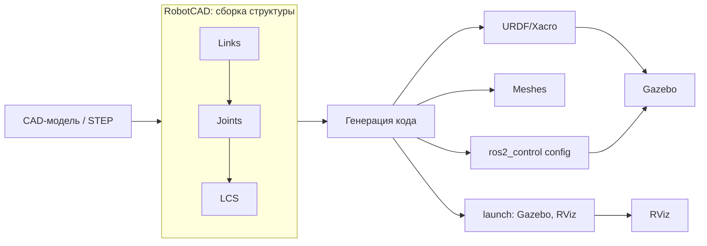

# Занятие 4: Проект робота и URDF в RobotCAD

## Цель занятия

К концу занятия студент понимает цепочку CAD → links/joints/LCS → URDF и собирает в RobotCAD простую модель (платформа с колесом). Это первый шаг к собственной виртуальной модели робота.

## Связь с календарём курса

Занятие 4 из 30, этап 1 (окружение и инструменты). Открывает переход от среды к собственно роботу: результат RobotCAD — основа модели, которую студент доводит через ДЗ. Тема 17 вернётся к URDF уже внутри ROS2. Подробности — [`lectures_content.md`](lectures_content.md), тема 4.

## Структура 40+40+40

- **0–40 минут** — лекция (уровень 1): CAD, link, joint, LCS, URDF.
- **40–80 минут** — практика (уровень 2): [`../2_practice/04_robotcad.md`](../2_practice/04_robotcad.md).
- **80–120 минут** — кейс робота (уровень 3): сравнение с URDF TIAgo.
- **После занятия** — ДЗ: [`../2_homework/hw_04_robotcad.md`](../2_homework/hw_04_robotcad.md).

Поминутная раскладка:

| Время | Блок | Содержание |
| --- | --- | --- |
| 0–8 | Вступление | Что такое RobotCAD, зачем не писать URDF вручную. |
| 8–18 | Понятия | link, joint, LCS, Collisions/Visuals/Reals. |
| 18–28 | Цепочка | CAD → links/joints/LCS → URDF/Xacro → Gazebo/RViz. |
| 28–40 | Что генерируется | URDF, меши, launch, конфиг `ros2_control`, масса/инерция. |
| 40–80 | Практика | Сборка «платформа + колесо» в RobotCAD, выгрузка URDF (план Б — разбор URDF). |
| 80–120 | Кейс TIAgo | URDF `tiago_description/`, сравнение, смелый тест «сломанный URDF». |

## Лекционная часть (уровень 1, 0–40 минут)

### Ключевые тезисы

- RobotCAD — верстак FreeCAD, который из CAD-модели собирает модель робота и генерирует URDF/Xacro.
- link — жёсткая часть (платформа, колесо, рука); joint — подвижная связь; LCS — локальная система координат.
- RobotCAD считает массу, инерцию и центр масс по материалу — не нужно вводить вручную.
- URDF — «паспорт тела робота»: links, joints, геометрия, массы.
- Имена links/joints должны совпадать с конфигами `ros2_control`.

### Порядок объяснения

1. **Что такое RobotCAD** — верстак FreeCAD, превращающий CAD (например STEP) в описание робота.
2. **Зачем** — не считать руками положение, массу и инерцию каждого звена.
3. **Понятия** — link / joint / LCS; три вида геометрии: Collisions, Visuals, Reals.
4. **Цепочка** — CAD → links/joints/LCS → URDF/Xacro → Gazebo/RViz.
5. **Что выгружается** — URDF/Xacro, меши, launch-файлы, конфиг `ros2_control` и сенсоры.
6. **Связь с курсом** — результат станет моделью, которую студент оживит в занятиях 17–18.

### Фразы преподавателя

- «CAD — чертёж деталей, RobotCAD — сборка деталей в робота с подписанными осями.»
- «URDF — паспорт тела робота: звенья, сочленения, масса, инерция.»
- «Не пишите URDF руками — пусть RobotCAD считает массу и инерцию за вас.»
- «Без массы и инерции модель „улетает“ в симуляции.»

### Схемы



### Фрагменты кода и команд

Фрагмент сгенерированного URDF (что студент увидит в `urdf/`):

```xml
<link name="base_link">
  <inertial>
    <mass value="2.5"/>
    <origin xyz="0 0 0.1"/>
  </inertial>
  <visual>
    <geometry>
      <mesh filename="package://my_robot/meshes/base_link.stl"/>
    </geometry>
  </visual>
</link>

<joint name="wheel_joint" type="continuous">
  <parent link="base_link"/>
  <child link="wheel_link"/>
  <axis xyz="0 1 0"/>
</joint>
```

Масса `2.5` и `xyz="0 0 0.1"` рассчитаны RobotCAD по материалу.

## Практическая часть (уровень 2, 40–80 минут)

Файл: [`../2_practice/04_robotcad.md`](../2_practice/04_robotcad.md).

Студенты:

1. Открывают FreeCAD и верстак RobotCAD.
2. Создают две детали (платформа `Box`, колесо `Cylinder`).
3. Задают link `base_link` и `wheel_link`, joint `wheel_joint` (тип `continuous`), привязывают по LCS.
4. Назначают материал и запускают расчёт массы/инерции.
5. Генерируют URDF и читают `urdf/*.urdf.xacro` (links, joints, `<inertial>`).

План Б (если GUI недоступен): разобрать готовый `simple.urdf` — назвать links, joints, ось вращения. Генерация кода — задача RobotCAD; запуск в Gazebo — позже, в контейнере.

## Кейс робота TIAgo (уровень 3, 80–120 минут)

### Что показать в архитектуре

- `ros2_ws/src/tiago_robot/tiago_description/` — реальный URDF, собранный по той же логике: `robots/tiago.urdf.xacro` включает подописания `urdf/arm/`, `urdf/head/`, `urdf/torso/`, `urdf/end_effector/`, плюс `omni_base_description`.
- `meshes/` — меши звеньев (arm, head, torso).
- `launch/robot_state_publisher.launch.py` и `module/10_robot_state_publisher.yaml` — описание публикуется в ROS2.
- Сравнение: простая модель «платформа + колесо» студента vs разбитый на модули URDF TIAgo.

### Смелые тесты

**Тест 1. «Сосчитать звенья и сочленения TIAgo»** (в контейнере робота, read-only).

```bash
cd ~/ros2_ws/src/tiago_robot/tiago_description
grep -rl "<joint" urdf/ | head
grep -rho "<link name=\"" robots/ urdf/ | wc -l
grep -rho "<joint name=\"" robots/ urdf/ | wc -l
```

- Цель: увидеть, что большой робот — это десятки links/joints, а не одна строка.
- Ожидаемый результат: счётчик links/joints заметно больше, чем у студенческой модели из двух звеньев.
- Возврат в норму: не требуется (только чтение).

**Тест 2. «Сломанный URDF»** — **в симуляции/с инструктором**.

```bash
# на копии простого URDF из практики (план Б)
cp simple.urdf broken.urdf
# удалить имя сочленения, чтобы парсер выдал ошибку
sed -i 's/joint name="wheel_joint"/joint name=""/' broken.urdf
check_urdf broken.urdf
```

- Цель: увидеть, что URDF — обычный текст, который проверяет парсер, и что опечатка ломает модель.
- Ожидаемый результат: `check_urdf` сообщает об ошибке (нет имени joint / некорректная ссылка parent–child).
- Возврат в норму: `rm broken.urdf` (оригинал `simple.urdf` не тронут).
- Если `check_urdf` не установлен — `sudo apt install -y liburdfdom-tools`.

## Домашнее задание

Файл: [`../2_homework/hw_04_robotcad.md`](../2_homework/hw_04_robotcad.md).

Шаг к модели робота: первый реальный элемент — платформа и два колеса с двумя сочленениями `continuous`. Студент сохраняет проект FreeCAD, генерирует URDF и фиксирует links/joints/LCS в дневнике `~/my_robot/diary.md`. Этот URDF станет симулируемым роботом в занятиях 17–18.

## Типичные ошибки

| Ошибка | Симптом | Исправление |
| --- | --- | --- |
| Не задана масса/инерция | Модель «улетает»/дёргается в Gazebo | Назначить материал, пересчитать массу/инерцию |
| Не заданы Collisions | Симуляция пуста, хотя RViz показывает робота | Добавить Collisions каждому звену |
| Имена links/joints не совпадают с конфигом | `ros2_control` не находит сустав | Сверить имена URDF и `controllers.yaml` |
| Путают link и joint | Сустав задан как звено или наоборот | link — жёсткая часть, joint — подвижная связь |
| Верстак не в списке | Не перезапущен FreeCAD после установки | Перезапустить FreeCAD |

## План Б

Если RobotCAD/FreeCAD GUI недоступен или не установлен:

- Выполнить план Б практики: разобрать `simple.urdf` в текстовом виде.
- Показать URDF TIAgo в `tiago_description/robots/tiago.urdf.xacro` как текст и объяснить include-структуру.
- Показать `meshes/` и `launch/` пакета `tiago_description`.
- Если и контейнер робота недоступен — разобрать структуру по `robotcad.md` и схеме цепочки.

## Вопросы аудитории и резерв времени

- Чем link отличается от joint?
- Зачем нужна LCS при задании сочленения?
- Откуда в URDF берётся масса, если её не вводили вручную?
- Почему колесо — сочленение `continuous`, а не `revolute`?

Резерв: если сборка модели прошла быстро — добавить второе колесо и посмотреть, как изменился URDF (доп. задание практики).

## Связи с материалами

- Статья базы знаний — [`../2_knowledge/robotcad.md`](../2_knowledge/robotcad.md).
- URDF/Xacro — [`../2_knowledge/urdf_xacro.md`](../2_knowledge/urdf_xacro.md).
- Практика — [`../2_practice/04_robotcad.md`](../2_practice/04_robotcad.md).
- Домашнее задание — [`../2_homework/hw_04_robotcad.md`](../2_homework/hw_04_robotcad.md).
- URDF робота — [`../3_Robot/TIAgo_humble/ros2_ws/src/tiago_robot/tiago_description/`](../3_Robot/TIAgo_humble/ros2_ws/src/tiago_robot/tiago_description/).
- Следующее занятие 5 «Датчики» — [`lectures_content.md`](lectures_content.md), тема 5.
- Источники: [RobotCAD (freecad.robotcad)](https://github.com/drfenixion/freecad.robotcad), [FreeCAD: External workbenches](https://wiki.freecad.org/External_workbenches), [URDF — ROS2 docs](https://docs.ros.org/en/jazzy/Tutorials/Intermediate/URDF/URDF-Main.html).
