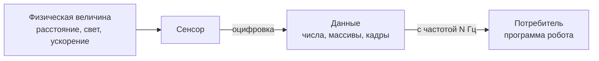
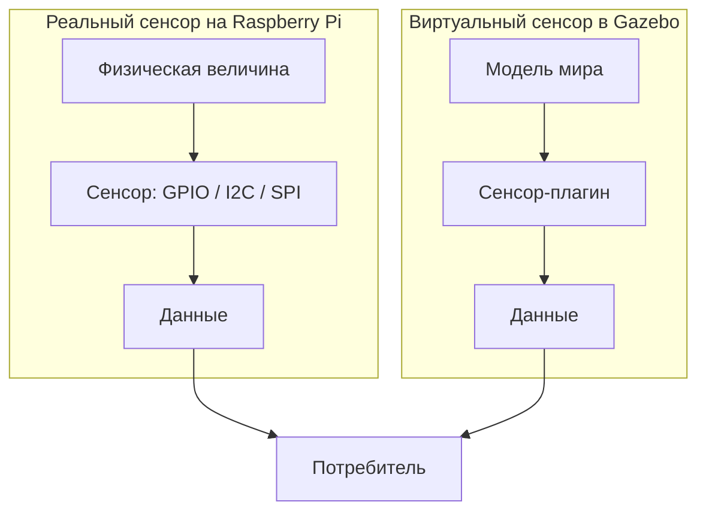

# Занятие 5: Датчики — виртуальные и реальные сенсоры

## Цель занятия

К концу занятия студент понимает путь «физическая величина → сенсор → данные → потребитель» и отличие симуляционного сенсора от реального. Студент знает, какие данные дают лидар, камера, IMU и энкодер, и что такое частота опроса.

## Связь с календарём курса

Занятие 5 из 30, этап 1 (окружение и инструменты). Связывает физический мир с данными и готовит к симуляции и восприятию. Выбранные сенсоры станут узлами, публикующими данные, в занятиях 6–9. Подробности — [`lectures_content.md`](lectures_content.md), тема 5.

## Структура 40+40+40

- **0–40 минут** — лекция (уровень 1): сенсор, оцифровка, частота, виртуальный/реальный, Raspberry Pi.
- **40–80 минут** — практика (уровень 2): [`../2_practice/05_sensors.md`](../2_practice/05_sensors.md).
- **80–120 минут** — кейс робота (уровень 3): `/scan`, камера, IMU в TIAgo.
- **После занятия** — ДЗ: [`../2_homework/hw_05_sensors.md`](../2_homework/hw_05_sensors.md).

Поминутная раскладка:

| Время | Блок | Содержание |
| --- | --- | --- |
| 0–8 | Вступление | Сенсор превращает физическую величину в данные. |
| 8–18 | Понятия | Оцифровка, частота, тип данных. |
| 18–28 | Виртуальный vs реальный | Gazebo-плагин считает по модели мира, но тип данных тот же. |
| 28–40 | Реальные датчики | Raspberry Pi, GPIO/I2C/SPI; обзор датчиков и частот. |
| 40–80 | Практика | Таблица датчиков, `lsusb`, `ls /dev`, `i2cdetect`, сравнение. |
| 80–120 | Кейс TIAgo | Лидар, камера, IMU в TIAgo, смелые тесты. |

## Лекционная часть (уровень 1, 0–40 минут)

### Ключевые тезисы

- Сенсор измеряет физическую величину и отдаёт результат числами; робот «видит» мир только через сенсоры.
- Оцифровка — превращение непрерывной величины в число; частота — сколько раз в секунду выдаётся значение.
- Виртуальный сенсор в Gazebo считает значение по модели мира, но отдаёт тот же тип данных, что и реальный.
- Программе-потребителю неважно, реальный сенсор или виртуальный.
- Реальные датчики подключаются к Raspberry Pi по GPIO/I2C/SPI и появляются в Linux как файлы/адреса.

### Порядок объяснения

1. **Что такое сенсор** — робот не видит комнату напрямую, он читает показания датчиков.
2. **Аналогия** — сенсоры как органы чувств: камера — глаза, IMU — вестибулярный аппарат, дальномер — рука.
3. **Оцифровка и частота** — путь «физическая величина → сенсор → данные → потребитель».
4. **Виртуальный vs реальный** — разница только в шаге измерения; тип данных одинаковый.
5. **Реальные датчики** — Raspberry Pi, GPIO/I2C/SPI; обзор датчиков и типичных частот.

### Фразы преподавателя

- «Робот видит мир только через сенсоры — как мы через органы чувств.»
- «Виртуальный сенсор даёт те же данные, что и реальный. Потребителю всё равно.»
- «Частота — сколько раз в секунду сенсор выдаёт значение. 10 Гц = 10 раз в секунду.»
- «Реальный датчик в Linux — это файл в `/dev` или адрес на шине I2C.»

### Схемы





### Фрагменты кода и команд

Описание лидара в Gazebo (файл мира, SDF):

```xml
<sensor name="gpu_lidar" type="gpu_lidar">
  <topic>lidar</topic>
  <update_rate>10</update_rate>
  <ray>
    <scan>
      <horizontal>
        <samples>640</samples>
        <min_angle>-1.396263</min_angle>
        <max_angle>1.396263</max_angle>
      </horizontal>
    </scan>
    <range>
      <min>0.08</min>
      <max>10.0</max>
    </range>
  </ray>
  <always_on>1</always_on>
</sensor>
```

```bash
lsusb
ls /dev
i2cdetect -l
i2cdetect -y 1
```

## Практическая часть (уровень 2, 40–80 минут)

Файл: [`../2_practice/05_sensors.md`](../2_practice/05_sensors.md).

Студенты внутри Dev Container уровня 2:

1. Заполняют таблицу «датчик → физическая величина → данные → частота» для лидара, камеры, IMU, энкодера.
2. Смотрят USB-устройства через `lsusb`.
3. Смотрят файлы устройств через `ls /dev` (`ttyUSB*`, `video*`, `i2c-*`).
4. Пробуют `i2cdetect -l` и `i2cdetect -y 1` (на Raspberry Pi шины есть, в контейнере — часто нет).
5. Отвечают, чем данные виртуального и реального сенсора отличаются для потребителя (ответ: ничем).

План Б практики: разобрать типы сообщений ROS2 (`LaserScan`, `Image`, `Imu`) и сопоставить поля с физическими величинами.

## Кейс робота TIAgo (уровень 3, 80–120 минут)

### Что показать в архитектуре

- Сенсоры TIAgo объявлены в Xacro: лидар по умолчанию `sick-571` публикует темы `scan_front_raw` и `scan_rear_raw` (в `omni_base_description/urdf/base/base_sensors.urdf.xacro`, `update_rate` по умолчанию 10).
- Камера по умолчанию `orbbec-astra`; в `tiago_description/urdf/head/head.urdf.xacro` подключаются `xtion_pro_live` и `orbbec_astra`.
- Те же типы данных приходят в ROS2-темы — полный разбор `ros2 topic` на занятии 9.

### Смелые тесты

**Тест 1. «Подслушать датчик»** — **в симуляции** (read-only, превью занятия 9).

```bash
ros2 launch tiago_gazebo tiago_gazebo.launch.py is_public_sim:=True
# в другом терминале:
ros2 topic list | grep scan
ros2 topic echo /scan_front_raw --once
ros2 topic hz /scan_front_raw
```

- Цель: увидеть данные лидара — массив дальностей — и его частоту.
- Ожидаемый результат: `echo --once` печатает `ranges[]` с дальностями; `hz` показывает ~10 Гц (совпадает с `update_rate`).
- Возврат в норму: `Ctrl+C` на `echo`/`hz` (они ничего не меняли), затем остановить симуляцию.

**Тест 2. «Ослепить навигацию»** — **только с инструктором** (этап 3, реальный ровер).

```text
На реальном ровере MentorPi M1 перекрыть лидар ладонью и наблюдать,
как меняются дальности в /scan на ближних углах.
```

- Цель: увидеть, что данные сенсора — это физика, а не абстракция.
- Ожидаемый результат: дальности в перекрытом секторе резко уменьшаются.
- Возврат в норму: убрать руку; данные возвращаются.
- На занятии 5 — демонстрация инструктора; выполняется на занятиях 25–30.

## Домашнее задание

Файл: [`../2_homework/hw_05_sensors.md`](../2_homework/hw_05_sensors.md).

Шаг к модели робота: к платформе с колёсами добавляется список сенсоров. Студент выбирает набор (лидар, IMU, энкодеры, камера), указывает для каждого данные, частоту и потребителя, и записывает в дневник `~/my_robot/diary.md`. Эти сенсоры станут источниками данных в занятиях 6–9.

## Типичные ошибки

| Ошибка | Симптом | Исправление |
| --- | --- | --- |
| Неверная частота опроса | Робот реагирует с задержкой или перегружен | Выбрать частоту под задачу: лидар ~10 Гц, IMU — сотни Гц |
| Читают сенсор до инициализации | Данные пустые/нулевые в начале | Дать сенсору запуститься |
| Путают величину и тип данных | В поле скорости пишут расстояние | Сопоставить: расстояние → метры, скорость → м/с |
| Думают, что виртуальный сенсор «ненастоящий» | Сомнение в переносе на железо | Тип данных одинаковый — потребителя менять не нужно |
| Путают камеру и лидар | Ждут одинаковые данные | Камера — пиксели, лидар — расстояния по углам |

## План Б

Если симуляция TIAgo не запускается:

- Показать `base_sensors.urdf.xacro` и `head.urdf.xacro` как текст: где заданы `ros_topic` и `update_rate`.
- Выполнить план Б практики: разобрать типы `sensor_msgs` (`LaserScan`, `Image`, `Imu`) по полям.
- Показать схему «физическая величина → сенсор → данные → потребитель» и таблицу датчиков.
- Рассказать про Raspberry Pi ровера по [`../2_knowledge/sensors.md`](../2_knowledge/sensors.md) без живого железа.

## Вопросы аудитории и резерв времени

- Почему программе-потребителю неважно, реальный сенсор или виртуальный?
- Что означает частота 10 Гц и что будет, если поставить её слишком низкой?
- Где Linux «видит» подключённый датчик — в `lsusb`, в `/dev` или в `i2cdetect`?
- Почему IMU опрашивают чаще, чем камеру?

Резерв: если тесты прошли быстро — сопоставить поля `LaserScan` (`ranges[]`, `angle_min`, `range_max`) с физическим смыслом и обсудить, как эти данные попадут в тему (превью занятия 9).

## Связи с материалами

- Статья базы знаний — [`../2_knowledge/sensors.md`](../2_knowledge/sensors.md).
- Практика — [`../2_practice/05_sensors.md`](../2_practice/05_sensors.md).
- Домашнее задание — [`../2_homework/hw_05_sensors.md`](../2_homework/hw_05_sensors.md).
- Сенсоры TIAgo — [`../3_Robot/TIAgo_humble/ros2_ws/src/omni_base_robot/omni_base_description/urdf/base/base_sensors.urdf.xacro`](../3_Robot/TIAgo_humble/ros2_ws/src/omni_base_robot/omni_base_description/urdf/base/base_sensors.urdf.xacro).
- Как данные попадают в тему — [`../2_knowledge/topics.md`](../2_knowledge/topics.md) (занятие 9).
- Следующее занятие 6 «Что такое ROS2: архитектура и middleware» — [`lectures_content.md`](lectures_content.md), тема 6.
- Источники: [Gazebo Sensors](https://gazebosim.org/docs/latest/sensors/), [Raspberry Pi documentation](https://www.raspberrypi.com/documentation/), [sensor_msgs — ROS2](https://docs.ros.org/en/jazzy/p/sensor_msgs/interfaces.html).
