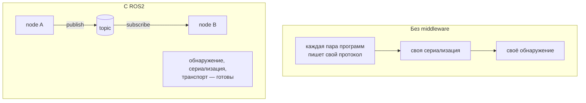
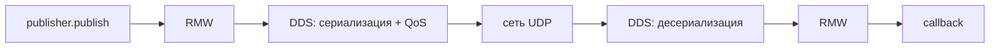
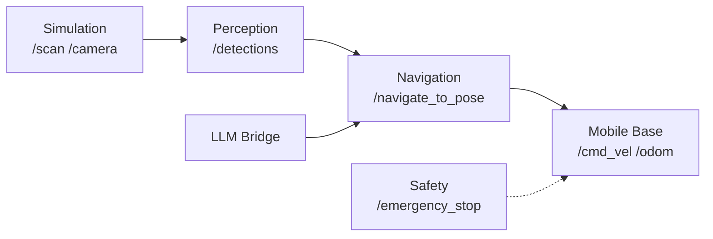
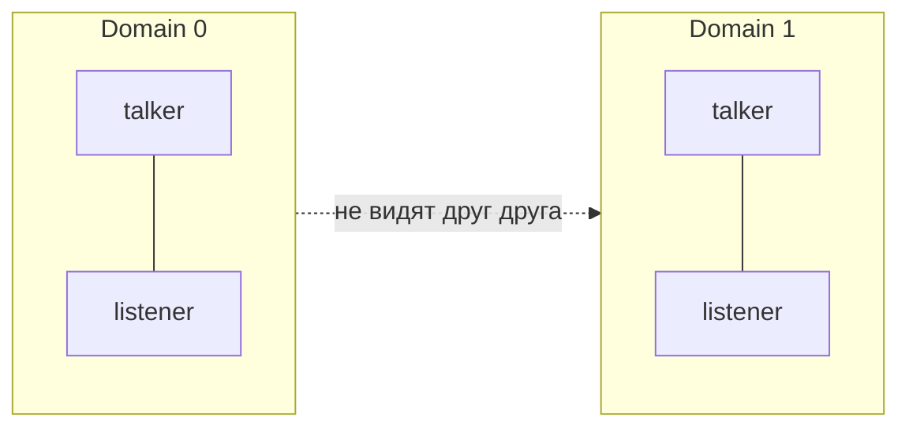

# Занятие 6: Что такое ROS2 — архитектура, ROS Graph и middleware

## Цель занятия

К концу занятия студент объясняет, зачем роботу middleware, перечисляет подсистемы робота, прослеживает путь сообщения `publish → RMW → DDS → сеть → DDS → RMW → callback` и понимает, как `ROS_DOMAIN_ID` изолирует группы роботов в одной сети.

## Связь с календарём курса

Занятие 6 из 30, этап 1 (окружение и инструменты). Это первое занятие, где студент видит ROS2 целиком — как среду обмена сообщениями, а не набор инструментов. Сенсоры из занятия 5 становятся источниками данных, а в занятиях 7–9 узлы превратятся в реальные пакеты и программы. Подробности — [`lectures_content.md`](lectures_content.md), тема 6.

## Структура 40+40+40

- **0–40 минут** — лекция (уровень 1): middleware, node, ROS Graph, путь сообщения, Executor, подсистемы, DOMAIN ID.
- **40–80 минут** — практика (уровень 2): [`../2_practice/06_ros_architecture.md`](../2_practice/06_ros_architecture.md).
- **80–120 минут** — кейс робота (уровень 3): подсистемы TIAgo, CycloneDDS, смелые тесты с `ROS_DOMAIN_ID`.
- **После занятия** — ДЗ: [`../2_homework/hw_06_ros_architecture.md`](../2_homework/hw_06_ros_architecture.md).

Поминутная раскладка:

| Время | Блок | Содержание |
| --- | --- | --- |
| 0–8 | Вступление | ROS2 — среда обмена сообщениями; аналогия «городская инфраструктура». |
| 8–18 | Node и ROS Graph | Узел — одна задача; граф — карта связей; topic/service/action. |
| 18–28 | Middleware | Путь сообщения `publish → RMW → DDS → сеть → callback`; Executor обзорно. |
| 28–40 | Подсистемы и DOMAIN ID | Деление робота на подсистемы; изоляция графов по `ROS_DOMAIN_ID`. |
| 40–80 | Практика | `ros2 doctor`, `printenv RMW_IMPLEMENTATION`, `rqt_graph`, `ros2 node list`, изоляция. |
| 80–120 | Кейс TIAgo | Подсистемы TIAgo, CycloneDDS, смелые тесты. |

## Лекционная часть (уровень 1, 0–40 минут)

### Ключевые тезисы

- ROS2 — не библиотека и не операционная система, а среда, где программы робота обмениваются сообщениями.
- Без middleware каждый раз пишем свой протокол, сериализацию и обнаружение узлов.
- Node — программа, решающая одну задачу; ROS Graph — сеть узлов и связей.
- Middleware — слой между ROS2 API и сетью: DDS передаёт данные, RMW — адаптер к конкретной реализации DDS, discovery находит узлы.
- `ROS_DOMAIN_ID` разбивает систему на изолированные домены: узлы из разных доменов не видят друг друга.
- Студент пишет только бизнес-логику в callbacks; вызовом callbacks управляет Executor.

### Порядок объяснения

1. **Что такое ROS2** — среда, где отдельные программы робота обмениваются сообщениями и командами.
2. **Аналогия** — городская инфраструктура: дороги (DDS), почта (RMW), адреса (topics), светофоры (QoS).
3. **Подсистемы робота** — Mobile Base, Navigation, Manipulation, Perception, Safety, LLM Bridge, Simulation; каждая — группа узлов с чёткими интерфейсами.
4. **Node и ROS Graph** — узел решает одну задачу, граф показывает связи; три способа связи (topic/service/action).
5. **Путь сообщения** — `publish(msg) → RMW → DDS → сеть → DDS → RMW → callback`.
6. **Обмен между роботами и DOMAIN ID** — роботы в одной сети по умолчанию видят друг друга; `ROS_DOMAIN_ID` (0–101) изолирует группы; один домен — для обмена данными, разные — чтобы не мешать друг другу.
7. **Вывод** — студент пишет бизнес-логику, сеть делает middleware.

### Фразы преподавателя

- «ROS2 — это не программа, а инфраструктура, по которой программы робота общаются.»
- «Узел — это одна программа с одной задачей. Граф — карта того, кто с кем говорит.»
- «Сообщение не летит напрямую: его сериализует DDS, доставляет сеть, а на той стороне срабатывает ваш callback.»
- «`ROS_DOMAIN_ID` — как этаж в здании: соседи по этажу слышат друг друга, с других этажей — нет.»
- «Вы пишете только логику в callbacks. Порядок их вызова решает Executor.»
- «Один домен — когда роботам нужно общаться. Разные — когда они не должны мешать друг другу.»

### Схемы

Программы робота без middleware и с ROS2:



Путь сообщения publisher → subscriber:



Подсистемы робота (обзорная, подробно в [`../2_knowledge/subsystem.md`](../2_knowledge/subsystem.md)):



Разделение двух роботов по `ROS_DOMAIN_ID`:



### Фрагменты кода и команд

```bash
export ROS_DOMAIN_ID=1
export RMW_IMPLEMENTATION=rmw_cyclonedds_cpp
printenv RMW_IMPLEMENTATION
ros2 doctor --report
rqt_graph
ros2 node list
```

## Практическая часть (уровень 2, 40–80 минут)

Файл: [`../2_practice/06_ros_architecture.md`](../2_practice/06_ros_architecture.md).

Студенты внутри Dev Container уровня 2:

1. Запускают `ros2 doctor --report` и читают раздел про middleware.
2. Проверяют `printenv RMW_IMPLEMENTATION` (пусто = дефолт Fast DDS).
3. Поднимают `talker` и `listener`, смотрят граф через `ros2 node list` и `rqt_graph`.
4. Проверяют выбранную RMW implementation и обсуждают, что кросс-вендорная совместимость зависит от конкретных реализаций и настроек.
5. Показывают изоляцию: listener в домене 1 не получает сообщения от talker в домене 0.

План Б практики: если нет графического интерфейса для `rqt_graph`, использовать `ros2 node list` и `ros2 topic list` и нарисовать граф на доске.

## Кейс робота TIAgo (уровень 3, 80–120 минут)

### Что показать в архитектуре

- Подсистемы TIAgo (карта — в [`3_Robot/TIAgo_humble/docs/tiago_architecture.md`](../3_Robot/TIAgo_humble/docs/tiago_architecture.md)): пользовательский слой, планирование (Nav2, MoveIt2), восприятие (YOLO, LiDAR, камера), координация (twist_mux, ros2_control), сенсоры/симуляция (Gazebo).
- Middleware: TIAgo использует CycloneDDS (`RMW_IMPLEMENTATION=rmw_cyclonedds_cpp`) — рекомендовано PAL Robotics для multi-robot.
- `ROS_DOMAIN_ID` по умолчанию 0; два экземпляра TIAgo в одной сети изолируют разными доменами.

### Смелые тесты

**Тест 1. «Граф исчез»** — сменить `ROS_DOMAIN_ID` и показать изоляцию (в контейнере TIAgo):

```bash
# терминал 1: симуляция (домен 0 по умолчанию)
ros2 launch tiago_gazebo tiago_gazebo.launch.py is_public_sim:=True

# терминал 2: граф виден
ros2 node list    # ~15 узлов TIAgo

# терминал 3: тот же контейнер, но другой домен — граф «исчез»
export ROS_DOMAIN_ID=56
ros2 daemon stop
ros2 node list    # пусто — изоляция работает
```

- Цель: увидеть, что ROS Graph зависит от `ROS_DOMAIN_ID`.
- Ожидаемый результат: в домене 0 узлы видны, в домене 56 список пуст.
- Возврат в норму: `unset ROS_DOMAIN_ID` и `ros2 daemon stop` в третьем терминале; симуляцию не трогаем.

**Тест 2. «Проверить выбранный middleware»** — посмотреть конфигурацию RMW (в контейнере уровня 2):

```bash
printenv RMW_IMPLEMENTATION
ros2 doctor --report
```

- Цель: увидеть, что middleware выбирается конфигурацией среды, а не самим кодом узла.
- Ожидаемый результат: CLI показывает отчёт; пустая переменная означает использование настройки по умолчанию, а не отсутствие middleware.
- Не делать вывода о кросс-вендорной несовместимости только по одному учебному запуску.

**Тест 3. «Разобрать подсистемы TIAgo»** — увидеть узлы по подсистемам:

```bash
ros2 node list | grep -E 'controller|slam|planner|move_group|twist'
ros2 topic info /cmd_vel            # кто подписчик? Mobile Base
ros2 action info /navigate_to_pose  # кто сервер? Navigation
```

- Цель: сопоставить список узлов с подсистемами из схемы.
- Ожидаемый результат: студент относит каждый узел к подсистеме (Navigation, Mobile Base, Manipulation, …).
- Возврат в норму: команды только читают — ничего менять не нужно.

## Домашнее задание

Файл: [`../2_homework/hw_06_ros_architecture.md`](../2_homework/hw_06_ros_architecture.md).

Шаг к модели робота: студент фиксирует идею своей модели, перечисляет подсистемы, узлы и их интерфейсы (pub/sub), рисует граф связей и выбирает `ROS_DOMAIN_ID`. Эти узлы в занятиях 7–9 станут пакетами и программами.

## Типичные ошибки

| Ошибка | Симптом | Исправление |
| --- | --- | --- |
| Путают ROS2 с библиотекой или ОС | Ищут `import ros2` или ждут «установить ROS2 как Windows» | ROS2 — middleware; подключается API `rclpy`/`rclcpp`, запускается в контейнере |
| Ждут, что ROS2 сам передаёт данные без DDS | Не понимают, откуда discovery и multicast | DDS — транспорт, RMW — адаптер к нему |
| Разные `ROS_DOMAIN_ID` у узлов одной системы | Узлы не видят друг друга | Выставить одинаковый `ROS_DOMAIN_ID` у всех узлов системы |
| Узлы не видят друг друга | Domain, network/discovery, RMW, QoS или namespace | Проверить каждый параметр; для учебной системы начать с одинакового RMW |
| Путают домен и физическую сеть | Думают, что домен — отдельная машина | Домен — логическая изоляция внутри одной сети |

## План Б

Если симуляция TIAgo не запускается:

- Показать карту подсистем из [`3_Robot/TIAgo_humble/docs/tiago_architecture.md`](../3_Robot/TIAgo_humble/docs/tiago_architecture.md) как текст.
- Выполнить план Б практики: `ros2 node list` / `ros2 topic list` и нарисовать граф на доске.
- Показать `RMW_IMPLEMENTATION=rmw_cyclonedds_cpp` в `.bashrc` контейнера TIAgo и объяснить, что это и зачем.
- Рассказать про `ROS_DOMAIN_ID` по [`../2_knowledge/robots_communication.md`](../2_knowledge/robots_communication.md) без живой симуляции.

## Вопросы аудитории и резерв времени

- Почему `printenv RMW_IMPLEMENTATION` пусто, но middleware работает?
- Что общего у DDS, RMW и discovery — и кто из них «служба доставки»?
- Когда нескольким роботам нужен один домен, а когда разные?
- Почему у всех узлов одной системы должен быть одинаковый `ROS_DOMAIN_ID`?

Резерв: если тесты прошли быстро — показать `ros2 topic info /scan --verbose` и обсудить, как QoS влияет на доставку (превью занятия 16).

## Связи с материалами

- Статья базы знаний — [`../2_knowledge/ros_architecture.md`](../2_knowledge/ros_architecture.md).
- DDS — [`../2_knowledge/dds_protocol.md`](../2_knowledge/dds_protocol.md).
- RMW — [`../2_knowledge/rmw.md`](../2_knowledge/rmw.md).
- Discovery — [`../2_knowledge/discovery.md`](../2_knowledge/discovery.md).
- Подсистемы — [`../2_knowledge/subsystem.md`](../2_knowledge/subsystem.md).
- Домены и несколько роботов — [`../2_knowledge/robots_communication.md`](../2_knowledge/robots_communication.md).
- Практика — [`../2_practice/06_ros_architecture.md`](../2_practice/06_ros_architecture.md).
- Демонстрация — [`../1_demo/demo_06_ros_architecture.md`](../1_demo/demo_06_ros_architecture.md).
- Домашнее задание — [`../2_homework/hw_06_ros_architecture.md`](../2_homework/hw_06_ros_architecture.md).
- Карта подсистем TIAgo — [`3_Robot/TIAgo_humble/docs/tiago_architecture.md`](../3_Robot/TIAgo_humble/docs/tiago_architecture.md).
- Следующее занятие 7 «Workspace, package и сборка» — [`lectures_content.md`](lectures_content.md), тема 7.
- Вариант материалов lecture-v2 — [`lecture-v2_plan_06_ros_architecture_v1.md`](lecture-v2_plan_06_ros_architecture_v1.md).
- Источники: [ROS2 Concepts](https://docs.ros.org/en/jazzy/Concepts.html), [About different middleware vendors](https://docs.ros.org/en/jazzy/Concepts/Intermediate/About-Different-Middleware-Vendors.html), [About discovery](https://docs.ros.org/en/jazzy/Concepts/Intermediate/About-Discovery.html), [About Domain ID](https://docs.ros.org/en/jazzy/Concepts/Intermediate/About-Domain-ID.html).
