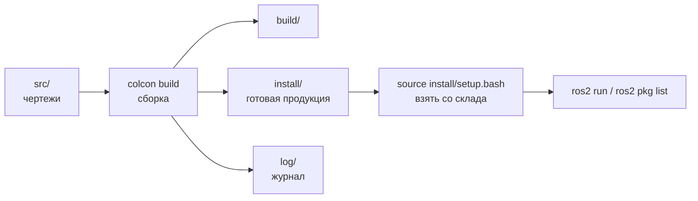
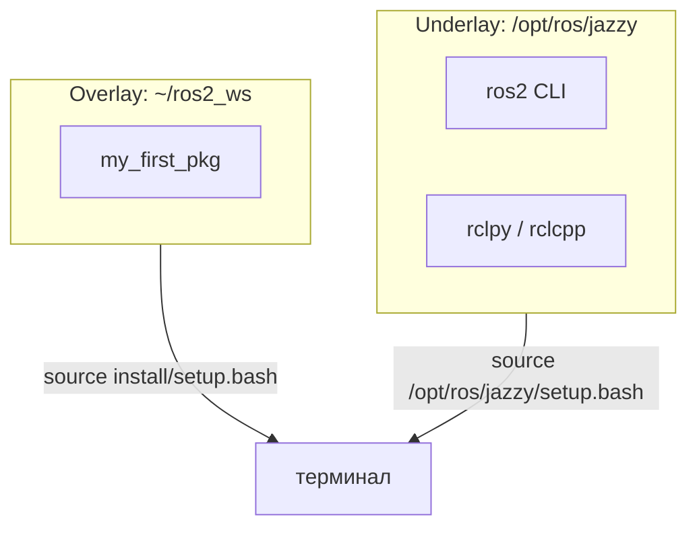
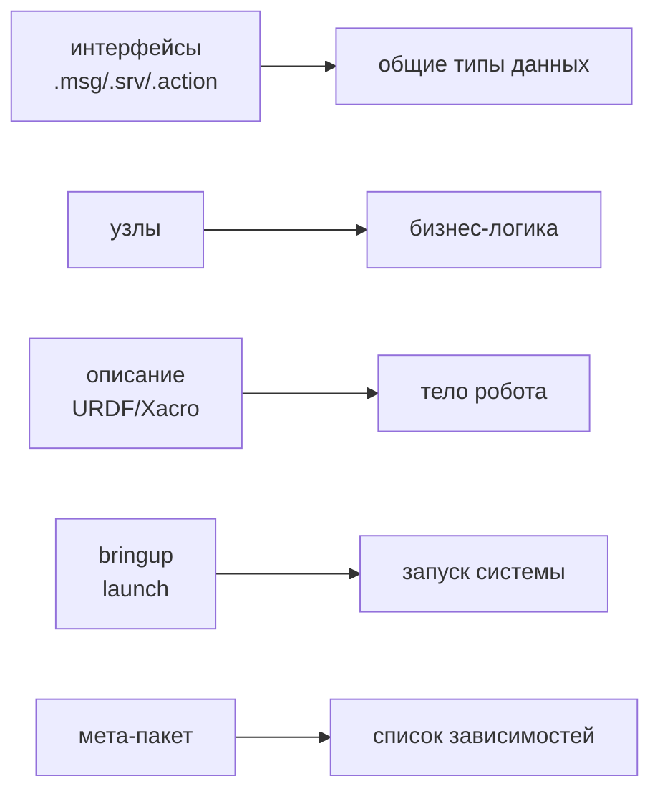

# Занятие 7: Workspace, package и сборка через colcon

## Цель занятия

К концу занятия студент создаёт workspace, пакет через `ros2 pkg create`, собирает его `colcon build`, подключает через `source install/setup.bash` и понимает, какие бывают пакеты и зачем.

## Связь с календарём курса

Занятие 7 из 30, этап 1 (окружение и инструменты). Это первое занятие, где студент пишет и собирает код: узлы из занятия 6 («архитектура на бумаге») превращаются в реальные пакеты и workspace. В занятиях 8–9 в эти пакеты лягут первые узлы. Подробности — [`lectures_content.md`](lectures_content.md), тема 7.

## Структура 40+40+40

- **0–40 минут** — лекция (уровень 1): workspace, `src/`/`build/`/`install/`/`log/`, underlay/overlay, `ros2 pkg create`, `colcon build`, типы пакетов.
- **40–80 минут** — практика (уровень 2): [`../2_practice/07_workspace.md`](../2_practice/07_workspace.md).
- **80–120 минут** — кейс робота (уровень 3): структура `ros2_ws/src/` TIAgo, типы пакетов, смелые тесты.
- **После занятия** — ДЗ: [`../2_homework/hw_07_workspace.md`](../2_homework/hw_07_workspace.md).

Поминутная раскладка:

| Время | Блок | Содержание |
| --- | --- | --- |
| 0–8 | Вступление | ROS2 не на хосте; workspace — папка с кодом и результатами сборки; аналогия «мастерская». |
| 8–18 | Workspace и слои | `src/`, `build/`, `install/`, `log/`; underlay/overlay; зачем `source install/setup.bash`. |
| 18–30 | Пакеты | `ros2 pkg create`; `ament_python` vs `ament_cmake`; `package.xml`; типы пакетов. |
| 30–40 | colcon | `colcon build`, флаги, повторная сборка, чистка. |
| 40–80 | Практика | Создать workspace, пакет, собрать, подключить, проверить. |
| 80–120 | Кейс TIAgo | Разбор `ros2_ws/src/`, типы пакетов, смелые тесты. |

## Лекционная часть (уровень 1, 0–40 минут)

### Ключевые тезисы

- ROS2 не ставится на хост — всё в контейнере.
- Workspace — папка с исходниками (`src/`) и результатами сборки (`build/`, `install/`, `log/`).
- Underlay — базовая установка ROS2; overlay — ваш workspace поверх неё.
- Пакет — минимальная единица кода, зависимостей и сборки; создаётся только `ros2 pkg create`.
- `ament_python` для Python-узлов, `ament_cmake` для C++-узлов, интерфейсов и мета-пакетов.
- Пакеты делятся по назначению: интерфейсы, узлы, описание (URDF), bringup, конфиги, мета-пакеты.
- `colcon build` собирает всё; `source install/setup.bash` подключает результат.

### Порядок объяснения

1. **Где живёт код** — ROS2 не на хосте; код робота живёт в контейнере и организован в workspace.
2. **Workspace** — `src/` (чертежи), `build/` (сборка), `install/` (готовое), `log/` (журнал); аналогия «мастерская».
3. **Underlay/overlay** — базовая установка ROS2 (underlay) + ваш workspace (overlay); overlay добавляет и перекрывает пакеты.
4. **Пакет** — минимальная единица; `ros2 pkg create --build-type ament_python my_pkg`; `package.xml` как манифест.
5. **Типы пакетов** — интерфейсы, узлы, описание (URDF), bringup, конфиги, мета-пакеты; зачем разделять.
6. **Сборка** — `colcon build`, `source install/setup.bash`; почему без `source` пакет не виден.
7. **Вывод** — путь «workspace → пакет → сборка → подключение» — фундамент всех следующих занятий.

### Фразы преподавателя

- «Workspace — это мастерская: `src/` — чертежи, `colcon build` — сборка, `install/` — готовая продукция.»
- «`source install/setup.bash` — это вы берёте изделие со склада и кладёте на верстак.»
- «Underlay — базовый набор инструментов ROS2, overlay — ваша личная полка с инструментами.»
- «Пакет — одна папка с одной зоной ответственности: интерфейсы, узлы, описание, запуск.»
- «Собрал — подключи. Новый терминал не помнит про ваше подключение.»
- «Без `colcon` десятки пакетов пришлось бы собирать вручную, следя за порядком зависимостей.»

### Схемы

Workspace как мастерская:



Underlay и overlay:



Типы пакетов:



### Фрагменты команд

```bash
mkdir -p ~/ros2_ws/src
cd ~/ros2_ws
ros2 pkg create --build-type ament_python my_first_pkg --destination-directory src
colcon build
source install/setup.bash
ros2 pkg list | grep my_first_pkg
```

## Практическая часть (уровень 2, 40–80 минут)

Файл: [`../2_practice/07_workspace.md`](../2_practice/07_workspace.md).

Студенты внутри Dev Container уровня 2:

1. Создают `~/ros2_ws/src`.
2. Создают пакет `my_first_pkg` (`ament_python`).
3. Смотрят структуру пакета (`tree`).
4. Собирают `colcon build`.
5. Подключают `source install/setup.bash`.
6. Проверяют `ros2 pkg list | grep my_first_pkg`.

План Б практики: если контейнер не поднялся — разобрать команды и структуру пакета по [`../2_knowledge/workspace.md`](../2_knowledge/workspace.md) на доске.

## Кейс робота TIAgo (уровень 3, 80–120 минут)

### Что показать в архитектуре

Workspace TIAgo — `3_Robot/TIAgo_humble/ros2_ws/` — тот же принцип, но в масштабе: `src/`, `build/`, `install/`, `log/`, сборка через `colcon build`. Пакеты в `src/` — живые примеры всех типов:

- **description** — `tiago_description/` (`urdf/`, `meshes/`, `robots/`).
- **bringup** — `tiago_bringup/` (`launch/`, `config/`).
- **интерфейсы** — `pal_msgs/` (десятки `pal_*_msgs`).
- **конфиги** — `tiago_controller_configuration/`, `tiago_moveit_config/`.
- **мета-пакеты** — `tiago_robot`, `pmb2_robot`, `tiago_navigation` (пустой `CMakeLists.txt` + список `exec_depend`).

### Смелые тесты

**Тест 1. «Карта пакетов»** — пересчитать пакеты workspace (в контейнере TIAgo):

```bash
cd ~/ros2_ws
colcon list | wc -l            # сколько пакетов всего
colcon list --names-only
```

- Цель: увидеть, что реальный робот — это десятки пакетов, а не один.
- Ожидаемый результат: `colcon list` выводит несколько десятков пакетов.
- Возврат в норму: команды только читают.

**Тест 2. «Найди типы пакетов»** — сопоставить папки с типами:

```bash
cd ~/ros2_ws/src
ls tiago_robot                    # tiago_bringup, tiago_description, tiago_controller_configuration, tiago_robot
cat tiago_robot/tiago_robot/package.xml    # мета-пакет: exec_depend на description/bringup/config
ls tiago_robot/tiago_description  # urdf, meshes, robots → описание
ls tiago_robot/tiago_bringup      # launch, config → bringup
ls pal_msgs                       # pal_*_msgs → интерфейсы
```

- Цель: отнести каждый пакет к типу (описание, bringup, интерфейсы, мета-пакет).
- Ожидаемый результат: студент объясняет, почему `tiago_description` — описание, а `tiago_robot` — мета-пакет.
- Возврат в норму: команды только читают.

**Тест 3. «Пересобери один пакет»** — пересобрать один пакет, не трогая остальные:

```bash
cd ~/ros2_ws
colcon build --packages-select tiago_description
```

- Цель: показать, что `colcon` собирает пакет выборочно, а зависимости берёт из уже собранного `install/`.
- Ожидаемый результат: `Summary: 1 package finished`; остальные пакеты не пересобираются.
- Возврат в норму: пересборка одного пакета ничего не ломает; при необходимости — `colcon build` для полной сборки.

## Домашнее задание

Файл: [`../2_homework/hw_07_workspace.md`](../2_homework/hw_07_workspace.md).

Шаг к модели робота: студент создаёт workspace своей модели (`~/my_robot/ros2_ws`) и первый пакет, собирает, фиксирует структуру в дневнике и коммитит в Git (с `.gitignore` для `build/`, `install/`, `log/`). В занятиях 8–9 в эти пакеты лягут первые узлы.

## Типичные ошибки

| Ошибка | Симптом | Исправление |
| --- | --- | --- |
| Забыли `source install/setup.bash` | `ros2 pkg list` не видит пакет | Выполнить `source` в текущем терминале |
| Пакет не в `src/` | `colcon build` не видит пакет | Создать через `--destination-directory src` |
| Забыли `--build-type ament_python` | Создался `ament_cmake`-пакет | Пересоздать с правильным флагом |
| Коммитят `build/`/`install/`/`log/` | В Git попадают артефакты сборки | Добавить папки в `.gitignore` |
| Путают overlay и underlay | Ждут, что пакет виден без `source` | Overlay подключается явно: `source install/setup.bash` |

## План Б

Если контейнер TIAgo не запускается:

- Показать структуру `ros2_ws/src/` как текст (список папок и типов пакетов из [`3_Robot/TIAgo_humble/docs/tiago_architecture.md`](../../3_Robot/TIAgo_humble/docs/tiago_architecture.md)).
- Показать `tiago.repos` — откуда берутся пакеты.
- Показать `package.xml` мета-пакета `tiago_robot` и пустой `CMakeLists.txt` как текст.
- Выполнить план Б практики в контейнере уровня 2 (создать workspace и пакет там).

## Вопросы аудитории и резерв времени

- Почему `build/`, `install/`, `log/` нельзя редактировать вручную?
- Зачем пакет создавать официальной командой `ros2 pkg create`, а не вручную?
- Чем мета-пакет отличается от обычного пакета?
- Почему в TIAgo пакеты разнесены по типам (description, bringup, msgs)?

Резерв: если тесты прошли быстро — показать `colcon graph` (граф зависимостей пакетов) и `ros2 pkg executables tiago_bringup`.

## Связи с материалами

- Workspace — [`../2_knowledge/workspace.md`](../2_knowledge/workspace.md).
- Пакеты — [`../2_knowledge/packages.md`](../2_knowledge/packages.md).
- colcon — [`../2_knowledge/colcon.md`](../2_knowledge/colcon.md).
- Практика — [`../2_practice/07_workspace.md`](../2_practice/07_workspace.md).
- Демонстрация — [`../1_demo/demo_07_workspace.md`](../1_demo/demo_07_workspace.md).
- Домашнее задание — [`../2_homework/hw_07_workspace.md`](../2_homework/hw_07_workspace.md).
- Архитектура TIAgo — [`3_Robot/TIAgo_humble/docs/tiago_architecture.md`](../../3_Robot/TIAgo_humble/docs/tiago_architecture.md).
- Следующее занятие 8 «Node, Executor и callbacks» — [`lectures_content.md`](lectures_content.md), тема 8.
- Источники: [Creating a workspace](https://docs.ros.org/en/jazzy/Tutorials/Beginner-Client-Libraries/Creating-A-Workspace/Creating-A-Workspace.html), [Creating a package](https://docs.ros.org/en/jazzy/Tutorials/Beginner-Client-Libraries/Creating-Your-First-ROS2-Package.html), [Using colcon](https://docs.ros.org/en/jazzy/Tutorials/Beginner-Client-Libraries/Colcon-Tutorial.html), [colcon docs](https://colcon.readthedocs.io/).
