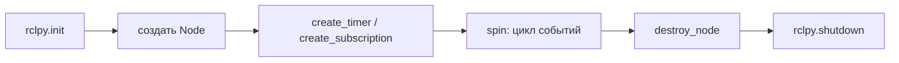
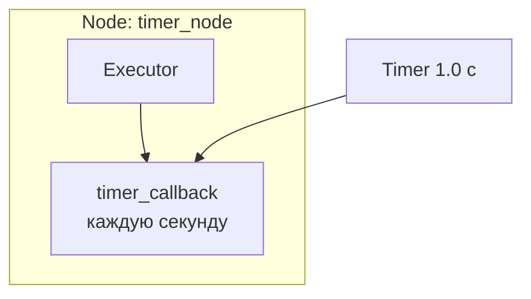

# Занятие 8: Node, Executor и callbacks

## Цель занятия

К концу занятия студент понимает, что такое node, зачем Executor вызывает callbacks и почему без `spin()` узел не обрабатывает события. Студент пишет минимальный Python-узел с timer callback, запускает его через `ros2 run` и находит в `ros2 node list` и `ros2 node info`.

## Связь с календарём курса

Занятие 8 из 30, этап 1 (архитектура ROS2 и базовые механизмы). Пакеты из занятия 7 наполняются первым кодом: студент видит, что узел — это программа, а `spin()` — то, что заставляет её реагировать на события. Это фундамент для занятий 9–11 (publisher, service, action — всё это callbacks внутри узла). Подробности — [`lectures_content.md`](lectures_content.md), тема 8.

## Структура 40+40+40

- **0–40 минут** — лекция (уровень 1): node, жизненный цикл узла, `rclpy`/`rclcpp`, Executor, callbacks, `spin()`, callback groups.
- **40–80 минут** — практика (уровень 2): [`../2_practice/08_node.md`](../2_practice/08_node.md).
- **80–120 минут** — кейс робота (уровень 3): узлы `tiago_bringup/`, смелые тесты.
- **После занятия** — ДЗ: [`../2_homework/hw_08_node.md`](../2_homework/hw_08_node.md).

Поминутная раскладка:

| Время | Блок | Содержание |
| --- | --- | --- |
| 0–8 | Вступление | Узел — программа с одной задачей; аналогия «сотрудник в офисе». |
| 8–18 | Жизненный цикл узла | `rclpy.init` → создать Node → зарегистрировать события → `spin` → `destroy` → `shutdown`; `rclpy` vs `rclcpp`. |
| 18–30 | Executor и callbacks | Executor как диспетчер; callback как обработчик; `spin()` запускает Executor. |
| 30–40 | Threads и callback groups | Single/multi-threaded; mutually exclusive/reentrant — обзорно. |
| 40–80 | Практика | Узел с timer callback; `ros2 run`, `ros2 node list`, `ros2 node info`; эффект без `spin()`. |
| 80–120 | Кейс TIAgo | `ros2 node list`, `ros2 node info` узлов, смелые тесты. |

## Лекционная часть (уровень 1, 0–40 минут)

### Ключевые тезисы

- Node — программа, решающая одну задачу робота (camera, lidar, motor_controller).
- Один узел = одна ответственность.
- Клиентские библиотеки: `rclpy` (Python, основной в курсе) и `rclcpp` (C++).
- Executor — диспетчер, который вызывает callbacks; callback — ваша функция-обработчик события.
- `spin()` запускает Executor; без него callbacks не выполняются.
- По умолчанию Executor single-threaded; есть multi-threaded и callback groups (обзорно).
- CLI: `ros2 node list`, `ros2 node info`, `rqt_graph`.

### Порядок объяснения

1. **Что такое node** — программа с одной задачей; в графе ROS2 каждый прямоугольник — узел.
2. **Аналогия** — node = сотрудник, Executor = секретарь, callback = рабочая задача.
3. **Жизненный цикл узла** — `init → Node → события → spin → destroy → shutdown`.
4. **`rclpy` и `rclcpp`** — одна модель на двух языках; в курсе Python.
5. **Executor и callbacks** — событие (таймер/сообщение/запрос) → Executor → нужный callback.
6. **`spin()`** — без него Executor не крутится, узел «молчит».
7. **Threads и callback groups** — single vs multi-threaded; mutually exclusive vs reentrant (обзорно).
8. **CLI** — как увидеть узел со стороны: `ros2 node list`, `ros2 node info`, `rqt_graph`.

### Фразы преподавателя

- «Узел — это не файл и не функция, а работающая программа с одной задачей.»
- «Executor — секретарь: он разбирает входящие события и передаёт их нужному обработчику.»
- «`spin()` — это кнопка "работать": пока её не нажали, ни один callback не вызовется.»
- «Вы пишете только callback — что делать при событии. Откуда пришло событие, решает Executor.»
- «Callback должен быть быстрым. Если он блокируется, весь узел стоит.»
- «`ros2 node list` показывает, кто сейчас жив в графе. Убили узел — он исчез из списка.»

### Схемы

Жизненный цикл узла:



Executor вызывает callbacks:



### Фрагменты кода

```python
class TimerNode(Node):
    def __init__(self):
        super().__init__('timer_node')
        self._timer = self.create_timer(1.0, self._timer_callback)

    def _timer_callback(self):
        self.get_logger().info('Tick')

def main(args=None):
    rclpy.init(args=args)
    node = TimerNode()
    rclpy.spin(node)          # ← без этой строки callback не вызовется
    node.destroy_node()
    rclpy.shutdown()
```

## Практическая часть (уровень 2, 40–80 минут)

Файл: [`../2_practice/08_node.md`](../2_practice/08_node.md).

Студенты внутри Dev Container уровня 2:

1. Пишут узел `timer_node` с timer callback.
2. Объявляют точку входа в `setup.py`.
3. Собирают `colcon build` и подключают `source install/setup.bash`.
4. Запускают `ros2 run my_first_pkg timer_node`.
5. Находят узел в `ros2 node list` и `ros2 node info`.
6. Запускают `no_spin_node` и видят: без `spin()` callback не вызывается.

План Б практики: если контейнер не поднялся — разобрать код узла и роль `spin()` по [`../2_knowledge/nodes.md`](../2_knowledge/nodes.md) на доске.

## Кейс робота TIAgo (уровень 3, 80–120 минут)

### Что показать в архитектуре

Базовый запуск TIAGo поднимает ~15 узлов, каждый со своим Executor и callbacks: `robot_state_publisher`, `controller_manager`, `DiffDriveController`, `joint_state_broadcaster`, `twist_mux`, `gazebo_ros`, `rviz2`. Один узел = одна задача:

- `DiffDriveController` — принимает `/cmd_vel`, вращает колёса, публикует `/odom`;
- `joint_state_broadcaster` — публикует `/joint_states`;
- `twist_mux` — выбирает команду скорости по приоритету;
- `robot_state_publisher` — публикует `/robot_description` и TF.

Карта подсистем и полный список — [`3_Robot/TIAgo_humble/docs/tiago_architecture.md`](../../3_Robot/TIAgo_humble/docs/tiago_architecture.md).

### Смелые тесты

**Тест 1. «Кто жив в графе»** — посчитать узлы (в контейнере TIAgo):

```bash
ros2 node list
ros2 node list | wc -l
```

- Цель: увидеть, что работающий робот — это ~15 независимых узлов, а не одна программа.
- Ожидаемый результат: список из ~15 имён; `wc -l` даёт их количество.
- Возврат в норму: команды только читают.

**Тест 2. «Кто за что отвечает»** — сопоставить узел и задачу:

```bash
ros2 node info /robot_state_publisher
ros2 node info /DiffDriveController
ros2 node info /twist_mux
```

- Цель: по publishers/subscribers понять, что делает узел. У `DiffDriveController` в Subscribers — `/cmd_vel`, в Publishers — `/odom`; у `robot_state_publisher` в Publishers — `/robot_description` и `/tf`.
- Ожидаемый результат: студент объясняет, почему `DiffDriveController` — привод базы, а `twist_mux` — диспетчер скорости.
- Возврат в норму: команды только читают.

**Тест 3. «Убить узел и посмотреть discovery»:**

```bash
ros2 node list                 # запомнить список
# в другом терминале остановить один узел (Ctrl+C)
ros2 node list                 # снова
```

- Цель: увидеть, что узлы независимы и discovery следит за их появлением и исчезновением.
- Команды: `ros2 node list` → остановить один узел (`Ctrl+C`) → подождать пару секунд → снова `ros2 node list`.
- Ожидаемый результат: остановленный узел исчез из списка, остальные продолжают работать.
- Возврат в норму: перезапустить узел.

**Тест 4. «rqt_graph»:**

```bash
rqt_graph
```

- Цель: увидеть граф узлов и топиков визуально.
- Ожидаемый результат: узлы — прямоугольники, топики — овалы, связи — стрелки.
- Возврат в норму: закрыть окно.

## Домашнее задание

Файл: [`../2_homework/hw_08_node.md`](../2_homework/hw_08_node.md).

Шаг к модели робота: студент добавляет в `my_robot_base` первый узел `robot_state_node` с timer callback (heartbeat), собирает, запускает, проверяет в `ros2 node list`/`ros2 node info`, экспериментирует с отсутствием `spin()` и коммитит. В занятии 9 этот узел начнёт публиковать состояние в topic.

## Типичные ошибки

| Ошибка | Симптом | Исправление |
| --- | --- | --- |
| Забыли `spin()` | Узел создаётся и завершается, callback не срабатывает | Добавить `rclpy.spin(node)` |
| Блокирующий код в callback | Таймер «замирает», узел виснет | Callback делать быстрым |
| Не обновлён `entry_points` | `ros2 run` не находит команду | Обновить `setup.py` и пересобрать |
| Путают node и package | Ожидают `ros2 node list` = список пакетов | Node — программа, package — папка с кодом |
| Имя узла занято | Ошибка запуска второго экземпляра | Уникальное имя узла |

## План Б

Если контейнер TIAgo не запускается:

- Показать схему подсистем и список узлов из [`3_Robot/TIAgo_humble/docs/tiago_architecture.md`](../../3_Robot/TIAgo_humble/docs/tiago_architecture.md) как текст.
- Показать фрагмент `ros2 node info`-вывода типового узла TIAgo как пример.
- Выполнить практику уровня 2 в контейнере уровня 2 (создать узел и показать `spin()`).

## Вопросы аудитории и резерв времени

- Почему `ros2 node list` показывает узел только пока он запущен?
- Чем node отличается от package?
- Что произойдёт, если callback выполняется дольше периода таймера?
- Зачем делить робота на ~15 узлов, если можно написать один?

Резерв: если тесты прошли быстро — показать `ros2 node info /gazebo_ros` и обсудить, почему Gazebo — тоже узел; показать `rqt_graph` с фильтрацией по узлу.

## Связи с материалами

- База знаний — [`../2_knowledge/nodes.md`](../2_knowledge/nodes.md).
- Практика — [`../2_practice/08_node.md`](../2_practice/08_node.md).
- Демонстрация — [`../1_demo/demo_08_node.md`](../1_demo/demo_08_node.md).
- Слайды — [`../1_slides/lecture_08_node.md`](../1_slides/lecture_08_node.md).
- Домашнее задание — [`../2_homework/hw_08_node.md`](../2_homework/hw_08_node.md).
- Архитектура TIAgo — [`3_Robot/TIAgo_humble/docs/tiago_architecture.md`](../../3_Robot/TIAgo_humble/docs/tiago_architecture.md).
- Предыдущее занятие 7 — [`lecture_plan_07_workspace.md`](lecture_plan_07_workspace.md).
- Следующее занятие 9 «Topic, publisher, subscriber» — [`lectures_content.md`](lectures_content.md), тема 9.
- Источники: [Understanding ROS 2 nodes](https://docs.ros.org/en/jazzy/Tutorials/Beginner-CLI-Tools/Understanding-ROS2-Nodes/Understanding-ROS2-Nodes.html), [About Executors](https://docs.ros.org/en/jazzy/Concepts/Intermediate/About-Executors.html), [Using callback groups](https://docs.ros.org/en/jazzy/How-To-Guides/Using-callback-groups.html), [rclpy API](https://docs.ros2.org/latest/api/rclpy/).
