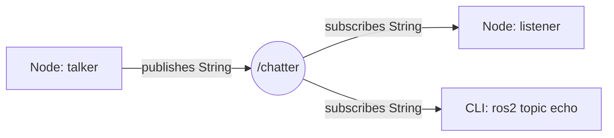
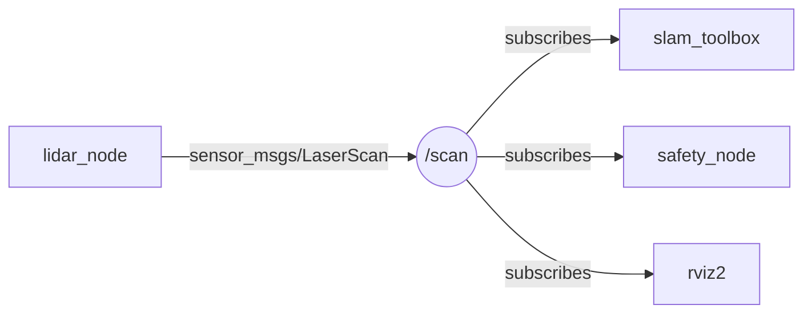

# Занятие 9: Topic, publisher, subscriber и message types

## Цель занятия

К концу занятия студент пишет publisher и subscriber на Python, выбирает message type, понимает, что topic — именованный поток с фиксированным типом, и проверяет обмен через `ros2 topic`. В кейсе робота студент видит, что движение TIAgo — это данные в `/cmd_vel`, а лидар — данные в `/scan`.

## Связь с календарём курса

Занятие 9 из 30, этап 1 (архитектура ROS2 и базовые механизмы). Узел из занятия 8 перестаёт «молчать»: publisher и subscriber — это первые callbacks, которые обмениваются данными. Topic завершает блок «три механизма связи» (topic → service → action, занятия 9–11). Подробности — [`lectures_content.md`](lectures_content.md), тема 9.

## Структура 40+40+40

- **0–40 минут** — лекция (уровень 1): topic, publisher/subscriber, message types, CLI.
- **40–80 минут** — практика (уровень 2): [`../2_practice/09_topic.md`](../2_practice/09_topic.md).
- **80–120 минут** — кейс робота (уровень 3): `/cmd_vel`, `/odom`, `/scan`, смелые тесты.
- **После занятия** — ДЗ: [`../2_homework/hw_09_topic.md`](../2_homework/hw_09_topic.md).

Поминутная раскладка:

| Время | Блок | Содержание |
| --- | --- | --- |
| 0–8 | Вступление | Topic — именованный канал; аналогия «Telegram-канал». |
| 8–18 | Publisher и subscriber | `create_publisher`, `create_subscription`, callback; модель «многие ко многим». |
| 18–28 | Message types | `std_msgs`, `geometry_msgs`, `sensor_msgs`; `ros2 interface show`. |
| 28–36 | CLI и имена | `ros2 topic list/echo/hz/info/pub`; namespace и зарезервированные имена. |
| 36–40 | Итог и переход | Типичные ошибки (типы, QoS, namespace); анонс уровня 3. |
| 40–80 | Практика | Пакет `my_topic_pkg`, узлы `talker`/`listener`, проверка из CLI. |
| 80–120 | Кейс TIAgo | `/cmd_vel`, `/odom`, `/scan`, смелые тесты. |

## Лекционная часть (уровень 1, 0–40 минут)

### Ключевые тезисы

- Topic — именованный поток сообщений с фиксированным типом.
- Publisher публикует, subscriber читает; они не знают друг о друге — только имя topic и тип.
- Связь «многие ко многим»: один topic — несколько publisher'ов и subscriber'ов.
- Message type задаётся парой «пакет / имя»: `std_msgs/msg/String`, `geometry_msgs/msg/Twist`, `sensor_msgs/msg/LaserScan`.
- CLI: `ros2 topic list/echo/hz/info/pub`.
- Имя topic бывает абсолютным (`/cmd_vel`) или относительным (дописывается namespace); имена с `_` — скрытые.

### Порядок объяснения

1. **Что такое topic** — именованный канал, по которому узлы обмениваются сообщениями.
2. **Аналогия** — Telegram-канал: автор публикует, подписчики читают; но в ROS2 у сообщений строгий тип.
3. **Publisher и subscriber** — `create_publisher`, `create_subscription`, callback; поток данных только от publisher к subscriber.
4. **Message types** — стандартные пакеты `std_msgs`, `geometry_msgs`, `sensor_msgs`; `ros2 interface show`.
5. **CLI** — как увидеть и потрогать topic со стороны: `list`, `echo`, `hz`, `info`, `pub`.
6. **Имена и namespace** — абсолютные/относительные имена, namespace, скрытые и зарезервированные имена.
7. **Типичные ошибки** — несовпадение типов, QoS mismatch, путаница из-за namespace.

### Фразы преподавателя

- «Topic — это канал с фиксированным типом сообщений. Publisher пишет, subscriber читает.»
- «Publisher и subscriber не знают друг о друге. Они договариваются только об имени канала и типе.»
- «Данные лидара читают сразу три узла: SLAM, safety и визуализатор. Для этого и нужна модель "многие ко многим".»
- «Нельзя опубликовать число в канал, который ждёт строку, — тип у сообщения строгий.»
- «`ros2 topic pub` — это ручная вставка сообщения в любой канал, чтобы посмотреть, как реагирует система.»

### Схемы

Поток сообщений:



Модель «многие ко многим» на примере лидара:



### Фрагменты кода

```python
# publisher
self.publisher = self.create_publisher(String, 'chatter', 10)
msg = String()
msg.data = f'Hello #{self.count}'
self.publisher.publish(msg)

# subscriber
self.subscription = self.create_subscription(
    String, 'chatter', self.callback, 10)

def callback(self, msg):
    self.get_logger().info(f'I heard: "{msg.data}"')
```

## Практическая часть (уровень 2, 40–80 минут)

Файл: [`../2_practice/09_topic.md`](../2_practice/09_topic.md).

Студенты внутри Dev Container уровня 2:

1. Создают пакет `my_topic_pkg` (`--dependencies rclpy std_msgs`).
2. Пишут `talker.py` (publisher) и `listener.py` (subscriber).
3. Объявляют точки входа в `setup.py`, собирают `colcon build`.
4. Запускают оба узла и видят обмен.
5. Проверяют из CLI: `ros2 topic echo`, `hz`, `info`, `pub`.

План Б практики: если контейнер не поднялся — разобрать код publisher/subscriber и CLI-команды по [`../2_knowledge/topics.md`](../2_knowledge/topics.md) на доске.

## Кейс робота TIAgo (уровень 3, 80–120 минут)

### Что показать в архитектуре

Темы TIAgo — это и есть topics с конкретными типами:

| Topic | Тип | Кто публикует | Кто читает |
| --- | --- | --- | --- |
| `/scan` | `sensor_msgs/msg/LaserScan` | лидар | SLAM, safety, rviz2 |
| `/odom` | `nav_msgs/msg/Odometry` | `DiffDriveController` | SLAM, Nav2 |
| `/cmd_vel` | `geometry_msgs/msg/Twist` | Nav2 / teleop | `twist_mux` → привод |
| `/joint_states` | `sensor_msgs/msg/JointState` | `joint_state_broadcaster` | `robot_state_publisher` |

Путь команды скорости: Nav2 публикует в `/cmd_vel` → `velocity_smoother` → `twist_mux` (выбирает источник по приоритету) → `/cmd_vel_unstamped` → `DiffDriveController`. Карта подсистем — [`3_Robot/TIAgo_humble/docs/tiago_architecture.md`](../../3_Robot/TIAgo_humble/docs/tiago_architecture.md).

### Смелые тесты

**Тест 1. «Прямая команда в `/cmd_vel`»** (только в симуляции):

```bash
ros2 topic list | grep cmd
ros2 topic info /cmd_vel --verbose
ros2 topic pub /cmd_vel geometry_msgs/msg/Twist "{linear: {x: 0.2}, angular: {z: 0.0}}" --rate 10
```

- Цель: увидеть, что движение — это просто данные в topic.
- Ожидаемый результат: робот в Gazebo едет вперёд.
- Возможный сбой: робот не едет — проверить подписчиков (`ros2 topic info /cmd_vel --verbose`) и тип сообщения.
- Возврат в норму: `Ctrl+C`, затем `ros2 topic pub /cmd_vel geometry_msgs/msg/Twist "{linear: {x: 0.0}, angular: {z: 0.0}}" --once`.

**Тест 2. «Заглушить `/scan`»:**

```bash
ros2 topic echo /scan --once        # убедиться, что данные идут
ros2 topic info /scan               # кто публикует
```

- Цель: увидеть, что без данных лидара SLAM/визуализация «слепнут».
- Команды: запустить `ros2 topic hz /scan`; если остановить публикатор `/scan` — частота упадёт до 0, лучи в RViz замирают.
- Возврат в норму: перезапустить узел-публикатор `/scan` (симуляцию).

**Тест 3. «Конфликт команд через `twist_mux`»** (только в симуляции):

```bash
ros2 topic info /cmd_vel --verbose   # источники скорости
ros2 topic list | grep cmd_vel       # входы twist_mux
```

- Цель: увидеть приоритеты при одновременных источниках скорости.
- Команды: выяснить входные темы через `ros2 topic info /cmd_vel --verbose`; публиковать в разные входы `twist_mux` одновременно и наблюдать, чья команда проходит.
- Ожидаемый результат: побеждает источник с более высоким приоритетом; `rqt_graph` показывает `twist_mux` между издателями и `/cmd_vel`.
- Осторожно: только в симуляции, не на реальном ровере без инструктора.

Приоритеты `twist_mux`: Nav2 (0, низкий) < teleop (1) < joy (2) < emergency_stop (3, высокий). Подробнее — [`3_Robot/TIAgo_humble/docs/tiago_architecture.md`](../../3_Robot/TIAgo_humble/docs/tiago_architecture.md).

## Домашнее задание

Файл: [`../2_homework/hw_09_topic.md`](../2_homework/hw_09_topic.md).

Шаг к модели робота: студент добавляет в `my_robot_base` два узла — `sensor_node` (publisher в `/sensor_data`) и `monitor_node` (subscriber), проверяет обмен из CLI и коммитит. Так в модели появляется первый поток данных.

## Типичные ошибки

| Ошибка | Симптом | Исправление |
| --- | --- | --- |
| Разные типы у pub и sub | Нет соединения, 0 subscriber в `ros2 topic info` | Одинаковый тип сообщения |
| QoS mismatch | Pub и sub не соединяются без ошибок | Совместимый QoS (занятие 16) |
| Путаница из-за namespace | Topic не виден под ожидаемым именем | `ros2 topic list` показывает полное имя |
| Неправильное имя topic | Subscriber не получает данные | Сверить `/chatter` vs `chatter` |
| Забыли `source setup.bash` | `ros2 topic list` пуст | `source install/setup.bash` |

## План Б

Если контейнер TIAgo не запускается:

- Показать таблицу topics TIAgo (`/cmd_vel`, `/odom`, `/scan`) и схему `twist_mux` из [`3_Robot/TIAgo_humble/docs/tiago_architecture.md`](../../3_Robot/TIAgo_humble/docs/tiago_architecture.md) как текст.
- Показать типовой вывод `ros2 topic info /cmd_vel --verbose` как пример.
- Полностью выполнить практику уровня 2 и показать `ros2 topic pub` на `talker`/`listener`.

## Вопросы аудитории и резерв времени

- Почему `ros2 topic echo /scan` видит данные лидара, хотя мы не писали никакого subscriber-узла?
- Что будет, если два узла публикуют в один topic с разными типами?
- Чем topic отличается от вызова функции между узлами?
- Зачем `/cmd_vel` идёт через `twist_mux`, а не напрямую в привод?

Резерв: показать `ros2 interface show geometry_msgs/msg/Twist` и разобрать поля `linear`/`angular`; показать `rqt_graph` с `/scan` и тремя subscriber'ами.

## Связи с материалами

- База знаний — [`../2_knowledge/topics.md`](../2_knowledge/topics.md).
- Практика — [`../2_practice/09_topic.md`](../2_practice/09_topic.md).
- Демонстрация — [`../1_demo/demo_09_topics.md`](../1_demo/demo_09_topics.md).
- Слайды — [`../1_slides/lecture_09_topic.md`](../1_slides/lecture_09_topic.md).
- Домашнее задание — [`../2_homework/hw_09_topic.md`](../2_homework/hw_09_topic.md).
- Архитектура TIAgo — [`3_Robot/TIAgo_humble/docs/tiago_architecture.md`](../../3_Robot/TIAgo_humble/docs/tiago_architecture.md).
- Предыдущее занятие 8 — [`lecture_plan_08_node.md`](lecture_plan_08_node.md).
- Следующее занятие 10 «Service и client» — [`lectures_content.md`](lectures_content.md), тема 10.
- Источники: [Understanding ROS 2 topics](https://docs.ros.org/en/jazzy/Tutorials/Beginner-CLI-Tools/Understanding-ROS2-Topics/Understanding-ROS2-Topics.html), [Writing a simple publisher and subscriber (Python)](https://docs.ros.org/en/jazzy/Tutorials/Beginner-Client-Libraries/Writing-A-Simple-Py-Publisher-And-Subscriber.html), [About Topics](https://docs.ros.org/en/jazzy/Concepts/Basic/About-Topics.html), [About QoS settings](https://docs.ros.org/en/jazzy/Concepts/Intermediate/About-Quality-of-Service-Settings.html).
