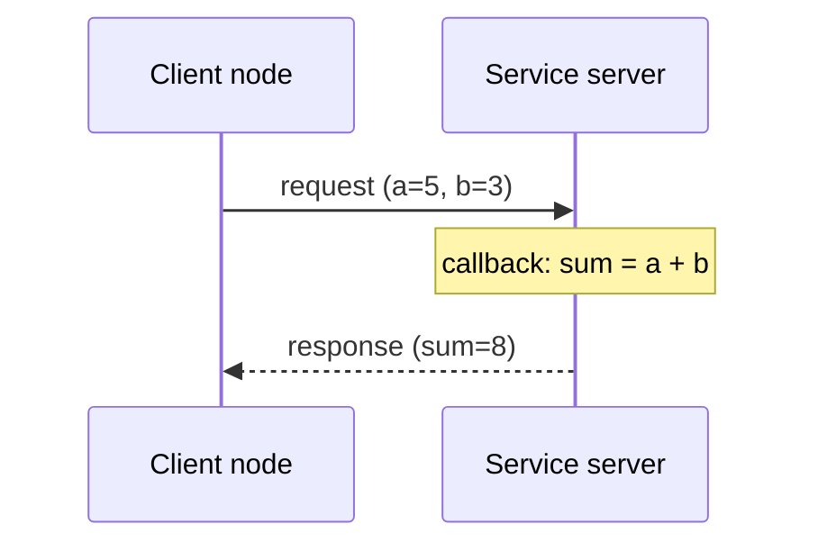
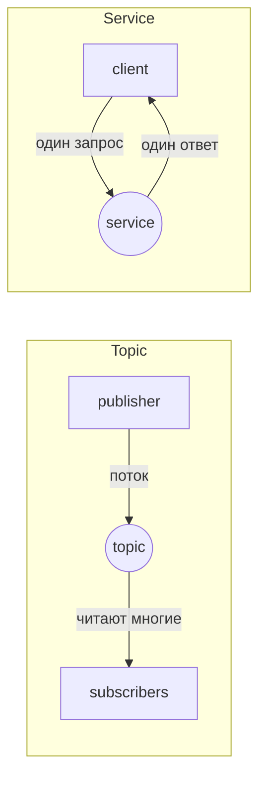

# Занятие 10: Service и client

## Цель занятия

К концу занятия студент понимает, когда нужен service, пишет service server и client на Python, вызывает service из кода и из CLI, и отличает service от topic. В кейсе робота студент видит, что аварийная остановка TIAgo — это service `/emergency_stop`.

## Связь с календарём курса

Занятие 10 из 30, этап 1 (архитектура ROS2 и базовые механизмы). Topic из занятия 9 решает потоки, но не даёт ответа на запрос. Service добавляет запрос-ответ и завершает блок «три механизма связи» (topic → service → action, занятия 9–11). Подробности — [`lectures_content.md`](lectures_content.md), тема 10.

## Структура 40+40+40

- **0–40 минут** — лекция (уровень 1): service, request/response, server/client, sync/async, CLI.
- **40–80 минут** — практика (уровень 2): [`../2_practice/10_service.md`](../2_practice/10_service.md).
- **80–120 минут** — кейс робота (уровень 3): `/emergency_stop`, смелые тесты.
- **После занятия** — ДЗ: [`../2_homework/hw_10_service.md`](../2_homework/hw_10_service.md).

Поминутная раскладка:

| Время | Блок | Содержание |
| --- | --- | --- |
| 0–8 | Вступление | Service — запрос-ответ; аналогия «звонок в справочную». |
| 8–18 | Server и client | `create_service`, `create_client`, callback; тип из request/response. |
| 18–28 | Синхронный/асинхронный вызов | `call_async`, `Future`, `spin_until_future_complete`, done-callback. |
| 28–36 | CLI и сравнение с topic | `ros2 service list/type/call/find`; таблица topic vs service. |
| 36–40 | Итог и переход | Типичные ошибки (готовность server, типы, таймауты); анонс уровня 3. |
| 40–80 | Практика | Пакет `my_service_pkg`, узлы `add_two_ints_server`/`add_two_ints_client`, вызов из CLI. |
| 80–120 | Кейс TIAgo | `/emergency_stop`, смелые тесты. |

## Лекционная часть (уровень 1, 0–40 минут)

### Ключевые тезисы

- Service — короткий запрос-ответ по схеме «точка-точка» с ожиданием ответа.
- Тип service — две части: `Request` (что отправить) и `Response` (что получить).
- Server предоставляет service и callback; client вызывает service и ждёт ответ.
- В rclpy вызов всегда асинхронный (`call_async` возвращает `Future`); блокирующее ожидание — через `spin_until_future_complete`.
- CLI: `ros2 service list/type/call/find`.
- Правило выбора: поток данных — topic; конкретный ответ на запрос — service; долгая задача с прогрессом — action.

### Порядок объяснения

1. **Что такое service** — пара «запрос-ответ», точка-точка, с ожиданием ответа.
2. **Аналогия** — звонок в справочную службу: спросил — дождался ответа, связь завершилась.
3. **Server и client** — `create_service` с callback, `create_client` с `wait_for_service`.
4. **Тип service** — `example_interfaces/srv/AddTwoInts`: `Request` (`a`, `b`) и `Response` (`sum`).
5. **Синхронный/асинхронный вызов** — `call_async` → `Future`; `spin_until_future_complete` или done-callback.
6. **CLI** — `ros2 service list/type/call/find`; ручной вызов без написания кода.
7. **Сравнение с topic** — таблица; правило выбора.

### Фразы преподавателя

- «Topic — это радио: вещает всем без ответа. Service — телефонный звонок: спросил и дождался ответа.»
- «Server предоставляет service и обрабатывает запрос в callback. Client вызывает service и ждёт ответ.»
- «`ros2 service call` — ручной вызов любого service, чтобы увидеть ответ, не запуская Python.»
- «Если данные идут непрерывно — topic. Если нужен ответ на конкретный запрос — service.»
- «Client обязан дождаться готовности server через `wait_for_service()`, иначе вызов уйдёт в пустоту.»

### Схемы

Запрос-ответ:



Сравнение с topic:



### Фрагменты кода

```python
# server
self.srv = self.create_service(AddTwoInts, 'add_two_ints', self.callback)

def callback(self, request, response):
    response.sum = request.a + request.b
    return response

# client
self.cli = self.create_client(AddTwoInts, 'add_two_ints')
while not self.cli.wait_for_service(timeout_sec=1.0):
    self.get_logger().info('waiting for service...')
future = self.cli.call_async(request)
```

## Практическая часть (уровень 2, 40–80 минут)

Файл: [`../2_practice/10_service.md`](../2_practice/10_service.md).

Студенты внутри Dev Container уровня 2:

1. Создают пакет `my_service_pkg` (`--dependencies rclpy example_interfaces`).
2. Пишут `add_two_ints_server.py` и `add_two_ints_client.py`.
3. Объявляют точки входа в `setup.py`, собирают `colcon build`.
4. Запускают server и client, видят `Result: 8`.
5. Вызывают service из CLI: `ros2 service list/type/call/find`.

План Б практики: если контейнер не поднялся — разобрать код server/client и CLI-команды по [`../2_knowledge/services.md`](../2_knowledge/services.md) на доске.

## Кейс робота TIAgo (уровень 3, 80–120 минут)

### Что показать в архитектуре

Service в TIAgo — это команды с подтверждением:

| Service | Тип | Назначение |
| --- | --- | --- |
| `/emergency_stop` | `std_srvs/srv/Trigger` | Аварийная остановка |
| `/controller_manager/list_controllers` | `controller_manager_msgs/srv/ListControllers` | Список контроллеров приводов |
| `/controller_manager/switch_controller` | `controller_manager_msgs/srv/SwitchController` | Включить/выключить контроллеры |

`/emergency_stop` поднимает приоритет в `twist_mux` до максимума (3) — робот не едет ни при каких обстоятельствах. Подробнее — [`3_Robot/TIAgo_humble/docs/safety.md`](../../3_Robot/TIAgo_humble/docs/safety.md).

> Примечание: имя `/reset_motors` из ранней спецификации в текущей сборке TIAgo отсутствует; реальный сброс приводов выполняется через `controller_manager` (`switch_controller`). В демонстрации используем подтверждённый `/emergency_stop`.

### Смелые тесты

**Тест 1. «Вызов `/emergency_stop`»** (только в симуляции):

```bash
# найти service аварийной остановки
ros2 service list | grep -i stop

# тип service
ros2 service type /emergency_stop
# std_srvs/srv/Trigger

# активировать аварийную остановку
ros2 service call /emergency_stop std_srvs/srv/Trigger "{}"
```

- Цель: увидеть остановку робота по service.
- Ожидаемый результат: робот останавливается; `twist_mux` блокирует все команды скорости.
- Проверка: `ros2 topic echo /mobile_base_controller/cmd_vel_unstamped` показывает нулевую скорость даже при командах телеопа.
- Возможный сбой: имя service отличается — искать по `ros2 service list` и `ros2 service type`.
- Возврат в норму: перезапустить симуляцию (снять E-stop) — `Ctrl+C` и снова `ros2 launch tiago_gazebo tiago_gazebo.launch.py is_public_sim:=True`.
- Осторожно: только в симуляции.

**Тест 2. «Вызов service на несуществующий server»** (безопасно, можно в обоих контейнерах):

```bash
# тип несуществующего service — ошибка сразу
ros2 service type /nonexistent_service
# Ожидаемо: ошибка "service '/nonexistent_service' not found"

# вызвать service с типом, но без запущенного server — вечное ожидание
ros2 service call /add_two_ints example_interfaces/srv/AddTwoInts "{a: 1, b: 2}"
# Ожидаемо: команда ждёт появления server, ответа нет → Ctrl+C
```

- Цель: разобрать две разные ошибки — «service не найден» и «server не готов».
- Ожидаемый результат: `ros2 service type` сразу печатает ошибку; `ros2 service call` зависает в ожидании, пока не появится server.
- Возврат в норму: `Ctrl+C`; затем запустить server и повторить `ros2 service call` — ответ приходит.

**Тест 3. «Стоп и возврат в норму»** (только в симуляции):

```bash
# 1. робот едет (телеоп или команда в /cmd_vel)
ros2 topic pub /cmd_vel geometry_msgs/msg/Twist "{linear: {x: 0.2}, angular: {z: 0.0}}" --rate 10

# 2. стоп по service
ros2 service call /emergency_stop std_srvs/srv/Trigger "{}"

# 3. возврат в норму
Ctrl+C   # остановить публикацию скорости
ros2 topic pub /cmd_vel geometry_msgs/msg/Twist "{linear: {x: 0.0}, angular: {z: 0.0}}" --once
```

- Цель: увидеть полный цикл «едет → остановлен по service → скорость сброшена».
- Ожидаемый результат: после E-stop робот игнорирует команды скорости; после перезапуска симуляции снова управляется.
- Осторожно: только в симуляции.

## Домашнее задание

Файл: [`../2_homework/hw_10_service.md`](../2_homework/hw_10_service.md).

Шаг к модели робота: студент добавляет в `sensor_node` service server `/sensor_enable` (`std_srvs/srv/SetBool`) и узел `sensor_control_client`, проверяет включение/выключение датчика из CLI и коммитит. Так в модели появляется первая команда с подтверждением.

## Типичные ошибки

| Ошибка | Симптом | Исправление |
| --- | --- | --- |
| Client вызывает service до готовности server | Исключение или вечное ожидание | `wait_for_service()` перед `call_async()` |
| Server без `spin()` | Service виден, но не отвечает | Добавить `rclpy.spin(server)` |
| Несовпадение типов server и client | Нет соединения | Одинаковый тип `example_interfaces/srv/AddTwoInts` |
| Неправильные имена полей запроса | `ros2 service call` возвращает `0` | Сверить `a`, `b`, `sum` |
| Долгий callback на сервере | Client долго ждёт ответ | Быстрая обработка; долгие задачи — action |

## План Б

Если контейнер TIAgo не запускается:

- Показать таблицу services TIAgo и схему E-stop из [`3_Robot/TIAgo_humble/docs/safety.md`](../../3_Robot/TIAgo_humble/docs/safety.md) как текст.
- Показать типовой вывод `ros2 service call /emergency_stop std_srvs/srv/Trigger "{}"` как пример.
- Полностью выполнить практику уровня 2 и продемонстрировать `ros2 service call` на `add_two_ints`.
- Выполнить тест 2 («несуществующий server») в контейнере уровня 2 — он не требует симуляции.

## Вопросы аудитории и резерв времени

- Почему `ros2 service call` зависает, если server не запущен, а `ros2 service type` сразу выдаёт ошибку?
- Чем service отличается от topic и когда выбрать service?
- Зачем нужен `wait_for_service()`, если DDS сам находит узлы?
- Почему аварийную остановку делают service, а не topic?

Резерв: показать `ros2 interface show example_interfaces/srv/AddTwoInts` и разобрать структуру `Request`/`Response`; показать `ros2 service list -t` в контейнере TIAgo и найти `controller_manager` services.

## Связи с материалами

- База знаний — [`../2_knowledge/services.md`](../2_knowledge/services.md).
- Практика — [`../2_practice/10_service.md`](../2_practice/10_service.md).
- Демонстрация — [`../1_demo/demo_10_services.md`](../1_demo/demo_10_services.md).
- Слайды — [`../1_slides/lecture_10_service.md`](../1_slides/lecture_10_service.md).
- Домашнее задание — [`../2_homework/hw_10_service.md`](../2_homework/hw_10_service.md).
- Архитектура TIAgo — [`3_Robot/TIAgo_humble/docs/safety.md`](../../3_Robot/TIAgo_humble/docs/safety.md) и [`3_Robot/TIAgo_humble/docs/tiago_architecture.md`](../../3_Robot/TIAgo_humble/docs/tiago_architecture.md).
- Предыдущее занятие 9 — [`lecture_plan_09_topic.md`](lecture_plan_09_topic.md).
- Следующее занятие 11 «Action server и action client» — [`lectures_content.md`](lectures_content.md), тема 11.
- Источники: [Understanding ROS 2 services](https://docs.ros.org/en/jazzy/Tutorials/Beginner-CLI-Tools/Understanding-ROS2-Services/Understanding-ROS2-Services.html), [Writing a simple service and client (Python)](https://docs.ros.org/en/jazzy/Tutorials/Beginner-Client-Libraries/Writing-A-Simple-Py-Service-And-Client.html), [About services](https://docs.ros.org/en/jazzy/Concepts/Basic/About-Services.html).
