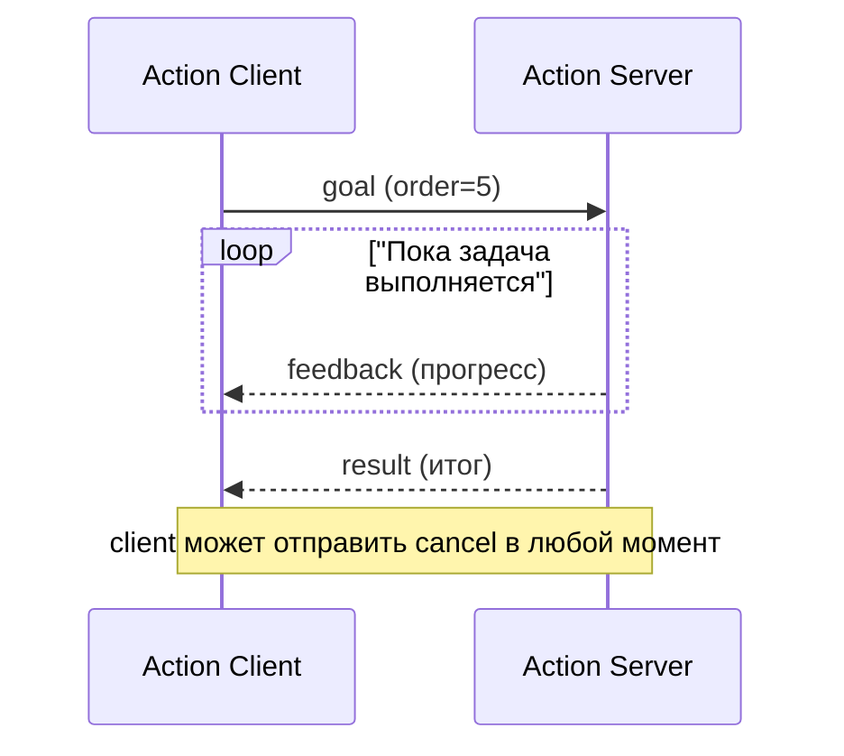
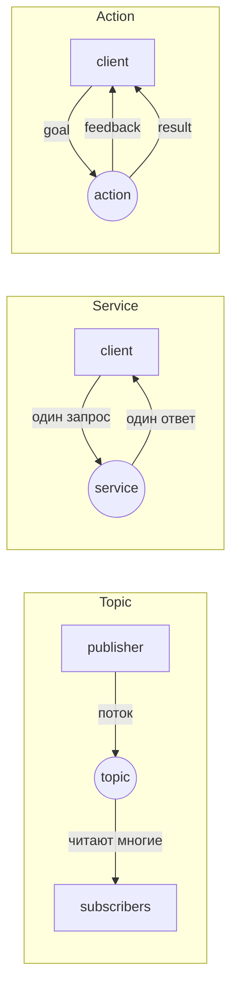

# Занятие 11: Action server и action client

## Цель занятия

К концу занятия студент понимает отличие action от topic и service, знает goal/feedback/result/cancel, пишет action server и client на Python, отменяет goal и читает feedback из CLI. В кейсе робота студент видит жизненный цикл action вживую на `/navigate_to_pose` TIAgo.

## Связь с календарём курса

Занятие 11 из 30, этап 1 (архитектура ROS2 и базовые механизмы). Action завершает блок «три механизма связи» (topic → service → action, занятия 9–11): у задачи появляются цель, прогресс, отмена и результат. После занятия — зачёт 1 (занятие 12). Подробности — [`lectures_content.md`](lectures_content.md), тема 11.

## Структура 40+40+40

- **0–40 минут** — лекция (уровень 1): action, goal/feedback/result/cancel, server/client, CLI.
- **40–80 минут** — практика (уровень 2): [`../2_practice/11_action.md`](../2_practice/11_action.md).
- **80–120 минут** — кейс робота (уровень 3): `/navigate_to_pose`, смелые тесты.
- **После занятия** — ДЗ: [`../2_homework/hw_11_action.md`](../2_homework/hw_11_action.md).

Поминутная раскладка:

| Время | Блок | Содержание |
| --- | --- | --- |
| 0–8 | Вступление | Action — длительная задача; аналогия «доставка пиццы». |
| 8–18 | goal/feedback/result/cancel | Четыре элемента action; `execute_callback`, `publish_feedback`, `succeed`/`canceled`. |
| 18–28 | Server и client | `ActionServer`, `ActionClient`, `send_goal_async`, три callback; `MultiThreadedExecutor`. |
| 28–36 | CLI и сравнение | `ros2 action list/info/send_goal --feedback`; таблица topic vs service vs action. |
| 36–40 | Итог и переход | Типичные ошибки; анонс уровня 3 и зачёта 1. |
| 40–80 | Практика | Пакет `my_action_pkg`, узлы `fibonacci_action_server`/`fibonacci_action_client`, отмена из CLI. |
| 80–120 | Кейс TIAgo | `/navigate_to_pose`, смелые тесты. |

## Лекционная часть (уровень 1, 0–40 минут)

### Ключевые тезисы

- Action — длительная задача с четырьмя элементами: goal, feedback, result, cancel.
- Server выполняет goal в `execute_callback`: публикует feedback, обрабатывает cancel, завершает `succeed()`/`canceled()`/`abort()`.
- Client отправляет goal через `send_goal_async()` и обрабатывает три события: goal-response, feedback, result.
- Для отмены во время выполнения нужен `MultiThreadedExecutor`.
- CLI: `ros2 action list/info/send_goal --feedback`.
- Правило выбора: поток — topic; короткий ответ — service; долгая задача с прогрессом и отменой — action.

### Порядок объяснения

1. **Что такое action** — задача с целью, прогрессом, итогом и отменой.
2. **Аналогия** — доставка пиццы: заказ → статус → доставка → отмена.
3. **Четыре элемента** — goal/feedback/result/cancel на схеме.
4. **Action server** — `ActionServer` и `execute_callback`; `publish_feedback`, `is_cancel_requested`, `succeed`/`canceled`.
5. **Action client** — `ActionClient`, `send_goal_async`, три callback.
6. **CLI** — `ros2 action list/info/send_goal --feedback`; отмена по `Ctrl+C`.
7. **Сравнение с topic и service** — таблица и правило выбора.

### Фразы преподавателя

- «Action — это доставка пиццы: заказ — goal, статус курьера — feedback, доставка — result, отмена заказа — cancel.»
- «Topic — радио без ответа. Service — телефонный звонок. Action — заказ с отслеживанием статуса.»
- «Server публикует progress через `publish_feedback`, а завершает задачу `succeed()` или `canceled()`.»
- «Чтобы отмена сработала во время долгой работы, нужен `MultiThreadedExecutor` — иначе server "занят" в `time.sleep`.»
- «`ros2 action send_goal --feedback` — увидеть весь жизненный цикл action без написания кода.»

### Схемы

Жизненный цикл action:



Сравнение трёх механизмов:



### Фрагменты кода

```python
# server
self._action_server = ActionServer(
    self, Fibonacci, 'fibonacci', self.execute_callback)

def execute_callback(self, goal_handle):
    ...
    goal_handle.publish_feedback(feedback_msg)
    if goal_handle.is_cancel_requested:
        goal_handle.canceled()
        return Fibonacci.Result(sequence=...)
    goal_handle.succeed()
    return Fibonacci.Result(sequence=...)

# client
self._action_client = ActionClient(self, Fibonacci, 'fibonacci')
self._action_client.send_goal_async(goal_msg, feedback_callback=self.feedback_callback)
```

## Практическая часть (уровень 2, 40–80 минут)

Файл: [`../2_practice/11_action.md`](../2_practice/11_action.md).

Студенты внутри Dev Container уровня 2:

1. Создают пакет `my_action_pkg` (`--dependencies rclpy example_interfaces`).
2. Пишут `fibonacci_action_server.py` (feedback, cancel, result) и `fibonacci_action_client.py` (goal, feedback, отмена).
3. Объявляют точки входа в `setup.py`, собирают `colcon build`.
4. Запускают server и client, видят feedback, отмену и result.
5. Проверяют из CLI: `ros2 action list/info/send_goal --feedback`.

План Б практики: если контейнер не поднялся — разобрать код server/client и CLI-команды по [`../2_knowledge/actions.md`](../2_knowledge/actions.md) на доске.

## Кейс робота TIAgo (уровень 3, 80–120 минут)

### Что показать в архитектуре

Action в TIAgo — ядро навигации и манипуляции:

| Action | Тип | Feedback |
| --- | --- | --- |
| `/navigate_to_pose` | `nav2_msgs/action/NavigateToPose` | Оставшееся расстояние |
| `/follow_path` | `nav2_msgs/action/FollowPath` | Текущая точка пути |
| MoveIt2 planning | `moveit_msgs` | Прогресс траектории |

`/navigate_to_pose` — самый наглядный: goal — точка на карте, feedback — дистанция, отмена — остановка. Подробнее — [`3_Robot/TIAgo_humble/docs/navigation.md`](../../3_Robot/TIAgo_humble/docs/navigation.md).

### Смелые тесты

**Тест 1. «Goal, feedback и отмена в `/navigate_to_pose`»** (только в симуляции):

```bash
# убедиться, что Nav2 запущен
ros2 node list | grep -E "planner|controller|bt_navigator"

# посмотреть action
ros2 action info /navigate_to_pose

# отправить goal и видеть feedback
ros2 action send_goal /navigate_to_pose nav2_msgs/action/NavigateToPose \
  "{pose: {header: {frame_id: 'map'}, pose: {position: {x: 1.0, y: 0.0, z: 0.0}, orientation: {w: 1.0}}}}" \
  --feedback
```

- Цель: увидеть жизненный цикл action вживую.
- Ожидаемый результат: поток feedback (оставшаяся дистанция), робот едет к цели; `Ctrl+C` отменяет goal, робот останавливается.
- Возможный сбой: goal отклонён — нет карты или не запущена навигация (темы 19–20); перед goal указать 2D Pose Estimate в RViz.
- Осторожно: только в симуляции.

**Тест 2. «Внутренности action»** (безопасно, можно в обоих контейнерах):

```bash
# action — это топики и сервисы под капотом
ros2 topic list | grep fibonacci
# /fibonacci/_action/feedback
# /fibonacci/_action/status

ros2 service list | grep fibonacci
# /fibonacci/_action/send_goal
# /fibonacci/_action/get_result
# /fibonacci/_action/cancel_goal
```

- Цель: показать, что action построен поверх topic и service.
- Ожидаемый результат: видны два топика и три сервиса одного action.
- Проводится на `fibonacci` из практики уровня 2 или на `/navigate_to_pose` в TIAgo.

**Тест 3. «Topic vs service vs action на живом роботе»** (только в симуляции):

```bash
# topic — поток данных (скан лидара)
ros2 topic echo /scan_raw --once

# service — команда с подтверждением (аварийная остановка)
ros2 service call /emergency_stop std_srvs/srv/Trigger "{}"

# action — долгая задача с прогрессом (навигация)
ros2 action send_goal /navigate_to_pose nav2_msgs/action/NavigateToPose \
  "{pose: {header: {frame_id: 'map'}, pose: {position: {x: 1.0, y: 0.0, z: 0.0}, orientation: {w: 1.0}}}}" \
  --feedback
```

- Цель: на одном роботе показать три механизма рядом.
- Ожидаемый результат: `/scan_raw` — данные, `/emergency_stop` — мгновенный ответ, `/navigate_to_pose` — длительная задача с feedback.
- Возврат в норму: перезапустить симуляцию после E-stop.

## Домашнее задание

Файл: [`../2_homework/hw_11_action.md`](../2_homework/hw_11_action.md).

Шаг к модели робота: студент добавляет action server `/mission` (`example_interfaces/action/Fibonacci`) в `mission_node` и client `mission_client`, проверяет feedback и отмену из CLI и коммитит. Это прообраз навигации и манипуляции в модели.

## Типичные ошибки

| Ошибка | Симптом | Исправление |
| --- | --- | --- |
| Server не публикует feedback | Client не видит прогресс | `goal_handle.publish_feedback(...)` в цикле |
| Cancel не обрабатывается | Client отправил cancel, server продолжает | Проверять `is_cancel_requested` в цикле |
| Обычный `spin()` вместо `MultiThreadedExecutor` | Cancel не срабатывает во время `time.sleep` | `rclpy.spin(node, executor=MultiThreadedExecutor())` |
| Server не вызывает `succeed()`/`canceled()` | Client вечно ждёт result | Явный финал в `execute_callback` |
| Client не ждёт server | Goal не отправляется | `wait_for_server()` перед `send_goal_async()` |

## План Б

Если контейнер TIAgo не запускается:

- Показать таблицу actions TIAgo и схему навигации из [`3_Robot/TIAgo_humble/docs/navigation.md`](../../3_Robot/TIAgo_humble/docs/navigation.md) как текст.
- Показать типовой вывод `ros2 action send_goal /navigate_to_pose ... --feedback` как пример.
- Полностью выполнить практику уровня 2 и продемонстрировать `ros2 action send_goal --feedback` на `fibonacci`.
- Выполнить тест 2 («внутренности action») в контейнере уровня 2 — он не требует симуляции.

## Вопросы аудитории и резерв времени

- Чем action отличается от service, если и там, и там client и server?
- Почему для отмены нужен `MultiThreadedExecutor`?
- Почему навигацию делают action, а не service или topic?
- Зачем action внутри нужны и топики, и сервисы?

Резерв: показать `ros2 interface show example_interfaces/action/Fibonacci` и разобрать три блока (goal/feedback/result); повторить задания зачёта 1 по темам 6–11.

## Связи с материалами

- База знаний — [`../2_knowledge/actions.md`](../2_knowledge/actions.md).
- Практика — [`../2_practice/11_action.md`](../2_practice/11_action.md).
- Демонстрация — [`../1_demo/demo_11_action.md`](../1_demo/demo_11_action.md).
- Слайды — [`../1_slides/lecture_11_action.md`](../1_slides/lecture_11_action.md).
- Домашнее задание — [`../2_homework/hw_11_action.md`](../2_homework/hw_11_action.md).
- Зачёт 1 — [`exam_01.md`](exam_01.md).
- Архитектура TIAgo — [`3_Robot/TIAgo_humble/docs/navigation.md`](../../3_Robot/TIAgo_humble/docs/navigation.md) и [`3_Robot/TIAgo_humble/docs/tiago_architecture.md`](../../3_Robot/TIAgo_humble/docs/tiago_architecture.md).
- Предыдущее занятие 10 — [`lecture_plan_10_service.md`](lecture_plan_10_service.md).
- Источники: [Writing an action server and client (Python)](https://docs.ros.org/en/jazzy/Tutorials/Intermediate/Writing-an-Action-Server-Client/Py.html), [Understanding actions](https://docs.ros.org/en/jazzy/Tutorials/Beginner-CLI-Tools/Understanding-ROS2-Actions/Understanding-ROS2-Actions.html), [Navigation2 docs](https://docs.nav2.org/).
