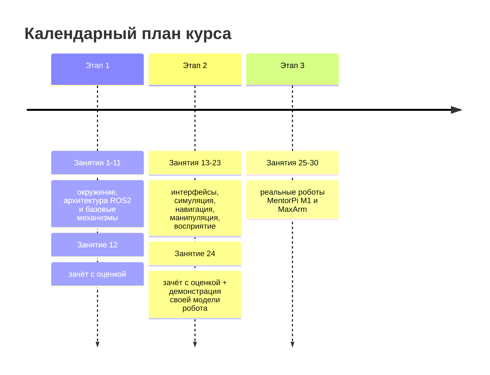

# lectures_content.md

## Назначение документа

Этот документ — содержательная спецификация годового курса «Основы продвинутой робототехники» (2 семестра, 30 занятий по 120 минут). Он создается как внутренний договор между ИИ-агентами (например, `opencode`): что именно входит в каждое занятие, как тема раскрывается на трех уровнях и как она продолжается в домашнем задании.

Документ не является публичной программой и не заменяет планы занятий `1_lecture/*.md`. Его задача — дать агенту достаточную детализацию, чтобы он мог углублять любую тему без повторного обсуждения архитектуры курса.

Документ обновляет формат прежней двухчасовой лекции (`1_lecture/lecture_content.md`) под годовой календарь. Прежний документ остаётся архивом и НЕ изменяется.

## Модель курса

Курс — 30 занятий по 120 минут. Каждое занятие устроено одинаково: 40 минут лекции (уровень 1) + 40 минут практики в классе (уровень 2) + 40 минут практики по кейсу робота TIAgo (уровень 3).

После каждого занятия студент получает домашнее задание в `2_homework/`. Домашние задания шаг за шагом ведут студента к собственной виртуальной модели робота: каждое задание добавляет в модель новый элемент (пакет, узел, сенсор, управление, навигацию, манипуляцию).

Три этапа:

| Этап | Занятия | Содержание |
| --- | --- | --- |
| Этап 1 (семестр 1) | 1-11 | Окружение и инструменты + архитектура ROS2 и базовые механизмы коммуникации. |
| | 12 | Зачёт с оценкой: задания на понимание архитектуры + демонстрация наработок по домашнему роботу. |
| Этап 2 (семестр 2) | 13-23 | Интерфейсы, конфигурация, симуляция, навигация, манипуляция, восприятие и поведение. |
| | 24 | Зачёт с оценкой: задания на понимание архитектуры + демонстрация собственной виртуальной модели робота. |
| Этап 3 | 25-30 | Работа с реальными роботами MentorPi M1 и MaxArm. |

Тема — одно занятие. Большая тема делится на 2-3 занятия. Позиции зачётов (12 и 24) фиксированы.

## Среда выполнения

ROS2 не устанавливается на хост. Хост используется только для Docker/Dev Containers, редактора, Git и доступа к файлам проекта.

| Место | Среда | Контейнер |
| --- | --- | --- |
| Компьютерный класс | клон проекта + готовые контейнеры | общий контейнер уровня 2 (`.devcontainer/`, ROS2 Jazzy) + контейнер `3_Robot/TIAgo_humble/` (ROS2 Humble) |
| Дом | `git clone` проекта + тот же devcontainer | тот же общий контейнер уровня 2 + контейнер TIAgo для уровня 3 |

- Уровень 2: общий контейнер `.devcontainer/` с ROS2 Jazzy, Ubuntu 24.04, `colcon`, примерами `2_code/` и Gazebo/Ignition только там, где нужна симуляция.
- Уровень 3: контейнер `3_Robot/TIAgo_humble/` с ROS2 Humble, Ubuntu 22.04, Gazebo Classic 11, Nav2, MoveIt2, `ros2_control`, workspace робота.
- Домашние задания выполняются дома в devcontainer: ROS2 Jazzy для уровня 2, TIAgo в ROS2 Humble для уровня 3.

Команды в практиках, демонстрациях и ДЗ пишутся так, чтобы выполняться внутри соответствующего контейнера без установки ROS2 на хост.

## Общий план тем

Курс состоит из 23 тем (занятия 1-11 и 13-23), двух зачётов (занятия 12 и 24) и этапа реальных роботов (25-30). Темы пронумерованы по номеру занятия. Первые три темы — окружение и инструменты; далее — ROS2, интерфейсы, симуляция, навигация и манипуляция, восприятие и поведение, интеграция.

1. Ubuntu и командная строка.
2. Контейнеризация и Git: Docker, Dev Container, версионирование.
3. Агентная инженерия с opencode (vibe-coding, agent engineering).
4. Проект робота и URDF в RobotCAD.
5. Датчики: виртуальные и реальные сенсоры.
6. Что такое ROS2: архитектура, ROS Graph и middleware (DDS/RMW/discovery).
7. Workspace, package и сборка через `colcon`.
8. Node, Executor и callbacks.
9. Topic, publisher, subscriber и message types.
10. Service и client.
11. Action server и action client.
12. Зачёт 1 (этап 1).
13. Собственные интерфейсы: `.msg`, `.srv`, `.action`.
14. Parameters и launch.
15. tf2 и дерево координат.
16. QoS и Lifecycle.
17. Simulation-first: URDF/Xacro и `rviz2`.
18. Simulation-first: Gazebo/Ignition и `ros2_control`.
19. Мост к Nav2: карта, SLAM, локализация.
20. Мост к Nav2: costmaps, planner, controller, `/navigate_to_pose`.
21. Мост к MoveIt2.
22. Восприятие и поведение: YOLO и LLM bridge.
23. Мини-проект: связать узлы в систему.
24. Зачёт 2 (этап 2).

Изменения относительно прежнего плана и их обоснование:

- «Что такое ROS2», «Архитектура и ROS Graph» и «Middleware» объединены в тему 6: три последовательных занятия чистой теории без кода затягивали старт практики. Понятия (node, ROS Graph, DDS/RMW/discovery) связаны одной историей, а практика (запуск demo-узлов, `rqt_graph`, `ros2 node list`) сразу закрепляет их.
- Action перенесён до зачёта 1 (тема 11): три механизма связи (topic, service, action) образуют единый блок, и зачёт 1 проверяет их вместе.
- Добавлена тема 13 «Собственные интерфейсы»: без неё студент не может описать типы данных собственного робота; раньше интерфейсы упоминались только как «не успеваем».
- «Parameters» и «Launch» объединены в тему 14: параметры и launch работают в паре (launch задаёт узлам параметры из YAML), и раздельное изучение дублировало материал.
- Nav2 разделена на два занятия (19 и 20): тема 19 — карта, SLAM, локализация; тема 20 — costmaps, planner, controller и `/navigate_to_pose`. MoveIt2 остаётся одним занятием (21).
- QoS и Lifecycle остаются одной темой (обе — «как сообщения доставляются / как узлы управляются»), YOLO и LLM bridge — одной темой (обе — AI-компоненты с общей границей безопасности).
- Мини-проект выделен в отдельную тему 23: это момент интеграции и подготовка к демонстрации на зачёте 2.

## Карта уровней 1, 2, 3 и ДЗ

| Занятие / тема | Уровень 1 (40 мин лекция) | Уровень 2 (40 мин практика) | Уровень 3 (40 мин кейс TIAgo) | ДЗ в `2_homework/` |
| --- | --- | --- | --- | --- |
| 1. Ubuntu и командная строка | терминал, файловая система, пакеты, права, SSH | `2_knowledge/ubuntu_cli.md`, `2_practice/01_ubuntu_cli.md` | терминал в контейнере `3_Robot/`, SSH к Raspberry Pi робота | `hw_01_ubuntu.md` — терминал, навигация, SSH-ключи |
| 2. Контейнеризация и Git | образ, контейнер, том, devcontainer; репозиторий, коммит, ветка | `2_knowledge/docker_devcontainer.md`, `git.md`, `2_practice/02_container_git.md` | контейнеры `3_Robot/`, `.gitignore` и история коммитов | `hw_02_setup.md` — devcontainer, окружение дома, первый коммит |
| 3. Агентная инженерия opencode | vibe-coding, агент, permission, AGENTS.md | `2_knowledge/opencode_agent.md`, `2_practice/03_opencode.md` | использование opencode для чтения кода TIAgo | `hw_03_opencode.md` — первый запрос к opencode |
| 4. Проект робота и URDF в RobotCAD | CAD→URDF, links, joints, LCS | `2_knowledge/robotcad.md`, `2_practice/04_robotcad.md` | сравнение с URDF TIAgo | `hw_04_robotcad.md` — набросок своей модели |
| 5. Датчики | сенсор→данные→потребитель, Raspberry Pi | `2_knowledge/sensors.md`, `2_practice/05_sensors.md` | `/scan`, `/camera`, IMU в TIAgo | `hw_05_sensors.md` — сенсоры своей модели |
| 6. ROS2, архитектура и middleware | middleware, nodes, ROS Graph, DDS/RMW/discovery, DOMAIN ID | `2_knowledge/ros_architecture.md`, `dds_protocol.md`, `rmw.md`, `discovery.md`, `2_practice/06_ros_architecture.md` | схема подсистем, RMW и DOMAIN ID в контейнере робота | `hw_06_ros_architecture.md` — идея модели + перечень узлов |
| 7. Workspace, package, `colcon` | `ros2 pkg create`, `colcon build`, `setup.bash` | `2_knowledge/workspace.md`, `packages.md`, `colcon.md`, `2_practice/07_workspace.md` | `ros2_ws/src/` | `hw_07_workspace.md` — первый пакет своей модели |
| 8. Node, Executor, callbacks | `spin()`, `rclpy`, `rqt_graph` | `2_knowledge/nodes.md`, `2_practice/08_node.md` | узлы `tiago_bringup` | `hw_08_node.md` — первый узел своей модели |
| 9. Topic, publisher, subscriber | pub/sub, message types, `ros2 topic` | `2_knowledge/topics.md`, `2_practice/09_topic.md`, `1_demo/demo_09_topics.md` | `/cmd_vel`, `/odom`, `/scan` | `hw_09_topic.md` — свой publisher/subscriber |
| 10. Service и client | запрос-ответ, `ros2 service` | `2_knowledge/services.md`, `2_practice/10_service.md`, `1_demo/demo_10_services.md` | `/emergency_stop` | `hw_10_service.md` — service в своей модели |
| 11. Action server и client | goal/feedback/cancel/result | `2_knowledge/actions.md`, `2_practice/11_action.md` | `/navigate_to_pose` | `hw_11_action.md` — action в своей модели |
| 12. Зачёт 1 | — | — | — | сдача наработок |
| 13. Собственные интерфейсы | `.msg`/`.srv`/`.action`, `ros2 interface` | `2_knowledge/interfaces.md`, `2_practice/13_interfaces.md` | `pal_msgs`, `nav2_msgs`, `moveit_msgs` | `hw_13_interfaces.md` — интерфейсы своей модели |
| 14. Parameters и launch | declare/get, YAML, `ros2 param`; Python launch, `ros2 launch` | `2_knowledge/parameters.md`, `launch.md`, `2_practice/14_parameters_launch.md` | `tiago_controller_configuration/`, `nav2_params.yaml`, `tiago_bringup/launch/` | `hw_14_parameters_launch.md` — параметры и launch своей модели |
| 15. tf2 | дерево координат, `tf2_echo`, `view_frames` | `2_knowledge/tf2.md`, `2_practice/15_tf2.md`, `1_demo/demo_15_tf2.md` | `map→odom→base_link→lidar` | `hw_15_tf2.md` — tf-дерево своей модели |
| 16. QoS и Lifecycle | reliability/durability/history + состояния узла | `2_knowledge/qos.md`, `lifecycle.md`, `2_practice/16_qos_lifecycle.md` | QoS `/scan`, lifecycle драйверов | `hw_16_qos_lifecycle.md` — QoS для сенсоров своей модели |
| 17. Simulation-first: URDF/rviz2 | URDF/Xacro, `robot_state_publisher`, `rviz2` | `2_knowledge/urdf_xacro.md`, `simulation.md`, `2_practice/17_urdf.md` | `tiago_description/` | `hw_17_urdf.md` — URDF своей модели |
| 18. Simulation-first: Gazebo/ros2_control | Gazebo, `diff_drive_controller`, plugin | `2_knowledge/simulation.md`, `ros2_control.md`, `2_practice/18_gazebo_control.md` | `tiago_gazebo/`, `ros2_control` | `hw_18_gazebo_control.md` — симуляция своей модели |
| 19. Мост к Nav2: карта, SLAM, локализация | карта, `slam_toolbox`, `amcl`, `map→odom` | `2_knowledge/nav2_bridge.md`, `2_practice/19_nav2_slam.md`, `1_demo/demo_19_nav2_slam.md` | `pmb2_navigation/`, `pal_maps/` | `hw_19_nav2_slam.md` — карта своей модели |
| 20. Мост к Nav2: costmaps, planner, controller, `/navigate_to_pose` | costmap, planner, controller, goal | `2_knowledge/nav2_bridge.md`, `2_practice/20_nav2_navigate.md`, `1_demo/demo_20_nav2_navigate.md` | `pmb2_navigation/`, `nav2_params.yaml` | `hw_20_nav2_navigate.md` — навигация своей модели |
| 21. Мост к MoveIt2 | планирование, planning scene, `move_group` | `2_knowledge/moveit2_bridge.md`, `2_practice/21_moveit2.md`, `1_demo/demo_21_moveit2.md` | `tiago_moveit_config/` | `hw_21_moveit2.md` — манипуляция своей модели |
| 22. Мост к YOLO и LLM bridge | `/detections`, policy/safety layer | `2_knowledge/yolo_bridge.md`, `llm_bridge.md`, `safety.md`, `2_practice/22_yolo_llm.md`, `1_demo/demo_22_yolo_perception.md`, `1_demo/demo_22_llm_bridge_safety.md` | `tiago_yolo`, `tiago_llm_bridge` (планируется) | `hw_22_yolo_llm.md` — perception/behavior своей модели |
| 23. Мини-проект | интеграция узлов, запуск системы | `2_practice/23_mini_project.md`, `2_code/mini_project/` | сопоставление с архитектурой TIAgo | `hw_23_mini_project.md` — собрать модель в систему |
| 24. Зачёт 2 | — | — | — | демонстрация своей модели |

## Предлагаемый календарь на 30 занятий

Эта раскладка — предложение. При её принятии нужно обновить календарь в `COURSE_ARCHITECTURE.md` (раздел «Календарный план»).

| Занятие | Тема |
| --- | --- |
| 1 | Ubuntu и командная строка |
| 2 | Контейнеризация и Git: Docker, Dev Container, версионирование |
| 3 | Агентная инженерия с opencode |
| 4 | Проект робота и URDF в RobotCAD |
| 5 | Датчики: виртуальные и реальные сенсоры |
| 6 | Что такое ROS2: архитектура, ROS Graph и middleware |
| 7 | Workspace, package и сборка через `colcon` |
| 8 | Node, Executor и callbacks |
| 9 | Topic, publisher, subscriber и message types |
| 10 | Service и client |
| 11 | Action server и action client |
| 12 | **Зачёт 1 (этап 1)** |
| 13 | Собственные интерфейсы: `.msg`, `.srv`, `.action` |
| 14 | Parameters и launch |
| 15 | tf2 и дерево координат |
| 16 | QoS и Lifecycle |
| 17 | Simulation-first: URDF/Xacro и `rviz2` |
| 18 | Simulation-first: Gazebo/Ignition и `ros2_control` |
| 19 | Мост к Nav2: карта, SLAM, локализация |
| 20 | Мост к Nav2: costmaps, planner, controller, `/navigate_to_pose` |
| 21 | Мост к MoveIt2 |
| 22 | Восприятие и поведение: YOLO и LLM bridge |
| 23 | Мини-проект: связать узлы в систему |
| 24 | **Зачёт 2 (этап 2) + демонстрация своей модели** |
| 25 | MentorPi M1: архитектура ровера, Raspberry Pi, ROS2, omni-колёса |
| 26 | MentorPi M1: лидар, RGBD-камера, управление движением и сбор данных |
| 27 | MentorPi M1: навигация на реальном ровере |
| 28 | MaxArm: архитектура манипулятора, ESP32, вакуумный захват, рельса |
| 29 | MaxArm: камера распознавания, вентилятор, работа с объектами |
| 30 | Итоговое занятие: комплексная задача на реальных роботах |

Темы реальных роботов (25-30) здесь не детализируются в виде полных занятий — они относятся к этапу 3 и раскрываются в разделе «Предварительный план этапа 3» ниже и в `3_Robot/MentorPi_M1/` и `3_Robot/MaxArm/`.

## Детализация тем

### Тема 1. Ubuntu и командная строка

- Роль: выровнять участников, которые не работали с Linux-терминалом. Без этого невозможно выполнять практики курса.
- Учебная цель: студент перемещается по файловой системе, запускает команды, понимает права доступа, устанавливает пакеты, читает справку и подключается к другим машинам по SSH.
- Ключевые концепты: терминал, shell, файловая система, PATH, права доступа, `apt`, `man`/`--help`, стандартные потоки (stdin/stdout/stderr), SSH.
- Новые термины: терминал, shell, переменная окружения, права доступа, пакет, SSH-ключ. Объясняются при первом использовании.
- Порядок объяснения:
  1. Что такое терминал и зачем он нужен в робототехнике: все инструменты ROS2 управляются из командной строки.
  2. Аналогия: терминал — разговор с компьютером короткими командами вместо кликов мышью.
  3. Навигация и файлы: `pwd`, `ls`, `cd`, `mkdir`, `cp`, `mv`, `rm`.
  4. Права и пользователи: `sudo`, `chmod`, почему нельзя всё делать под root.
  5. Пакеты и справка: `apt`, `man`, `--help`.
  6. SSH и обращение к другим устройствам по адресу:
     - Робот и сервер — это другие машины в сети; к ним обращаются по адресу, а не как к локальным файлам.
     - Аналогия: IP-адрес — номер дома, порт — квартира, SSH-ключ — ключ от двери.
     - Ключи: `ssh-keygen` создаёт пару ключей; публичный ключ кладут на робота/сервер, приватный хранят у себя.
     - Подключение: `ssh user@host`; нестандартный порт — `ssh -p PORT user@host`.
     - Копирование файлов: `scp file user@host:/путь`, каталог — `scp -r dir user@host:/путь`.
     - Практический сценарий: подключиться к Raspberry Pi робота (`ssh student@<ip-робота>`), скопировать конфиг или логи на сервер (`scp`), разобрать отказы «Connection refused» и «Permission denied».
- Фрагменты кода: `ls -la`, `mkdir -p ~/ros2_ws/src`, `cat /etc/os-release`, `ssh user@host`.
- CLI-команды: `pwd`, `ls`, `cd`, `mkdir`, `cp`, `mv`, `rm`, `cat`, `grep`, `sudo`, `apt`, `man`, `ssh`, `scp`, `ssh-keygen`, `ssh-copy-id`.
- Источники: [Ubuntu Server docs: Command line](https://ubuntu.com/server/docs/command-line-tutorials), [Linux Journey](https://linuxjourney.com/), [OpenSSH](https://www.openssh.com/), [Ubuntu: OpenSSH Server](https://ubuntu.com/server/docs/openssh-server).
- Уровень 2: `2_knowledge/ubuntu_cli.md`, `2_practice/01_ubuntu_cli.md`.
- Уровень 3: тот же терминал используется внутри контейнера `3_Robot/TIAgo_humble/`; показать `docker exec` в контейнер робота и SSH-доступ к Raspberry Pi реального ровера (этап 3).
- Типичные ошибки: путаница `cd` с `ls`, потеря пути после `sudo`, редактирование системных файлов без резервной копии, попытка SSH без публичного ключа на целевой машине.
- ДЗ: настроить терминал дома, повторить базовые команды, проверить `bash --version` и создать SSH-ключ.
- Расширенный комплект lecture-v2: [содержание](lecture-v2_content_01_ubuntu_v1.md), [план](lecture-v2_plan_01_ubuntu_v1.md), [слайды](../1_slides/lecture-v2_slides_01_ubuntu_v1.md), [практика](../2_practice/practice-v2_01_ubuntu_v1.md), [ДЗ](../2_homework/homework-v2_01_ubuntu_v1.md).

### Тема 2. Контейнеризация и Git: Docker, Dev Container, версионирование

- Роль: объяснить, почему ROS2 не ставится на хост, как воспроизводится окружение и как версионировать проект и собственные наработки.
- Учебная цель: студент понимает образ/контейнер/том, запускает контейнер, открывает проект в Dev Container, ведёт локальную историю Git и синхронизирует её с репозиторием.
- Ключевые концепты: образ, контейнер, том, Dockerfile, devcontainer.json, Dev Container; репозиторий, коммит, ветка, remote, push/pull, `.gitignore`.
- Новые термины: образ, контейнер, том, Dev Container, репозиторий, коммит, ветка, remote. Объясняются при первом использовании.
- Порядок объяснения:
  1. Проблема «работает у меня, не работает у тебя» и как контейнер её решает.
  2. Аналогия: контейнер — переносная мастерская с полным набором инструментов; образ — чертёж мастерской.
  3. Docker-команды: `docker pull`, `docker run`, `docker exec`, `docker ps`.
  4. Dev Container: открытие проекта в VS Code автоматически собирает и запускает окружение из `devcontainer.json`.
  5. Как это устроено в проекте: `.devcontainer/` для уровня 2, `3_Robot/TIAgo_humble/` для уровня 3.
  6. Git локально: зачем версионировать код робота; `git init`, `git add`, `git commit`, `git status`, `git log`, `git diff`, ветки, `.gitignore`.
  7. Git через репозиторий: `git clone`, `git remote`, `git fetch`/`git pull`, `git push`, ветка и слияние/PR; как студент ведёт свою модель робота.
  8. Связь с курсом: `git clone` проекта дома (см. раздел «Домашняя установка окружения»), коммиты по ДЗ, история как журнал прогресса к собственной модели робота.
- Фрагменты кода: `docker run -it ubuntu:24.04 bash`, фрагмент `devcontainer.json`, последовательность `git init` → `git add` → `git commit`.
- CLI-команды: `docker --version`, `docker run`, `docker ps`, `docker exec`, `code .`; `git --version`, `git init`, `git status`, `git add`, `git commit`, `git log --oneline`, `git diff`, `git switch -c`, `git clone`, `git remote -v`, `git pull`, `git push`.
- Источники: [Docker overview](https://docs.docker.com/get-started/), [Developing inside a Container](https://code.visualstudio.com/docs/devcontainers/containers), [Dev Container spec](https://containers.dev/), [Pro Git (рус.)](https://git-scm.com/book/ru/v2), [Git reference](https://git-scm.com/docs), [GitHub Docs](https://docs.github.com/).
- Уровень 2: `2_knowledge/docker_devcontainer.md`, `2_knowledge/git.md`, `2_practice/02_container_git.md`.
- Уровень 3: показать Dockerfile контейнера робота и его зависимости; показать `.gitignore` проекта и историю коммитов пакетов TIAGo.
- Типичные ошибки: забыли пересобрать контейнер после изменения Dockerfile; правка файлов в контейнере без тома (теряются); коммит без `.gitignore` (в историю попадают `build/`, `install/`, бинарники, ключи); `push` не в свою ветку; секреты в истории.
- Смелые тесты (уровень 3): зайти в контейнер робота (`docker exec`), посмотреть процессы ROS2, остановить один узел и наблюдать эффект в ROS Graph, затем перезапустить.
- ДЗ: собрать и запустить devcontainer курса и настроить окружение дома (см. раздел «Домашняя установка окружения»); сделать первый коммит своей модели робота.

### Тема 3. Агентная инженерия с opencode

- Роль: дать инструмент-ускоритель — vibe-coding и agent engineering для кода, настройки среды и проектирования.
- Учебная цель: студент запускает opencode, формулирует запрос, читает ответ и понимает, что агент делает с его проектом и какие права он имеет.
- Ключевые концепты: AI-агент, vibe-coding, agent engineering, permission, AGENTS.md, primary/subagent.
- Новые термины: агент, vibe-coding, permission, AGENTS.md. Объясняются при первом использовании.
- Порядок объяснения:
  1. Что такое AI-агент для кода: программа, которая по текстовому запросу читает, пишет и запускает код.
  2. Vibe-coding: описываешь результат словами, агент предлагает и применяет изменения.
  3. Agent engineering: управление агентом через инструкции (`AGENTS.md`), ограничение прав (permission) и специализированных субагентов.
  4. Как выглядит в opencode: `opencode`, `opencode run "запрос"`, план (Plan) vs сборка (Build), права `allow/ask/deny`.
  5. Границы: агент ускоряет, но студент обязан понимать результат; агент не заменяет знание ROS2.
- Фрагменты кода: `opencode run "объясни структуру пакета"`, пример `AGENTS.md`.
- CLI-команды: `opencode`, `opencode run`, `opencode agent`, `opencode --help`.
- Источники: [opencode.ai](https://opencode.ai/), [opencode docs](https://opencode.ai/docs/), [opencode agents](https://opencode.ai/docs/agents/), [opencode CLI](https://opencode.ai/docs/cli/).
- Уровень 2: `2_knowledge/opencode_agent.md`, `2_practice/03_opencode.md`.
- Уровень 3: использовать opencode, чтобы прочитать структуру `ros2_ws/src/` и объяснить назначение пакетов.
- Типичные ошибки: слепое применение кода без проверки, запуск агента без понимания его прав, отсутствие `AGENTS.md` → агент действует хаотично.
- ДЗ: инициализировать opencode в своём клоне проекта и сделать первый разобранный запрос.
- Расширенный комплект lecture-v2: [содержание](lecture-v2_content_03_opencode_v1.md), [план](lecture-v2_plan_03_opencode_v1.md), [слайды](../1_slides/lecture-v2_slides_03_opencode_v1.md), [практика](../2_practice/practice-v2_03_opencode_v1.md), [ДЗ](../2_homework/homework-v2_03_opencode_v1.md).

### Тема 4. Проект робота и URDF в RobotCAD

- Роль: первое знакомство с цифровым двойником. Студент делает первый шаг к собственной модели робота из CAD-геометрии.
- Учебная цель: студент понимает цепочку CAD → links/joints/LCS → URDF и собирает в RobotCAD простую модель (например, платформу с колесом).
- Ключевые концепты: CAD-модель, STEP, link, joint, LCS (локальная система координат), URDF.
- Новые термины: CAD, STEP, link, joint, LCS, URDF. Объясняются при первом использовании.
- Порядок объяснения:
  1. Что такое RobotCAD: верстак FreeCAD, который из CAD-модели (например, STEP) собирает модель робота и генерирует URDF/Xacro.
  2. Зачем: не писать URDF вручную — указываешь звенья, сочленения и координатные системы, а описания генерируются.
  3. Аналогия: CAD — чертёж деталей, RobotCAD — сборка деталей в робота с подписанными осями.
  4. Как это устроено: указываешь links (звенья), joints (сочленения) и LCS (локальные системы координат); RobotCAD рассчитывает массу, инерцию, центры масс и генерирует URDF/Xacro, меши, launch-файлы для Gazebo и RViz, конфиги `ros2_control` и сенсоры.
  5. Связь с курсом: результат RobotCAD — основа модели робота, которую студент доводит через ДЗ (тема 17 возвращается к URDF уже в ROS2).
- Схемы: Mermaid-диаграмма `CAD (STEP) → RobotCAD (links/joints/LCS) → URDF/Xacro → Gazebo/RViz`.
- Фрагменты кода: не показывать API; показать структуру сгенерированного пакета (URDF, meshes, launch).
- CLI-команды: команды FreeCAD и установка верстака через Addon Manager.
- Источники: [FreeCAD](https://www.freecad.org/), [FreeCAD: External workbenches](https://wiki.freecad.org/External_workbenches), [RobotCAD (freecad.robotcad)](https://github.com/drfenixion/freecad.robotcad).
- Уровень 2: `2_knowledge/robotcad.md`, `2_practice/04_robotcad.md`.
- Уровень 3: сравнить с `tiago_description/urdf/` и `meshes/` — реальный URDF, сгенерированный похожим способом.
- Типичные ошибки: не задана масса/инерция → модель «улетает» в симуляции; не совпадают имена links/joints с конфигами `ros2_control`.
- ДЗ: сделать набросок своей модели в RobotCAD (платформа + колёса).
- Расширенный комплект lecture-v2: [содержание](lecture-v2_content_04_robotcad_v1.md), [план](lecture-v2_plan_04_robotcad_v1.md), [слайды](../1_slides/lecture-v2_slides_04_robotcad_v1.md), [практика](../2_practice/practice-v2_04_robotcad_v1.md), [ДЗ](../2_homework/homework-v2_04_robotcad_v1.md).

### Тема 5. Датчики: виртуальные и реальные сенсоры

- Роль: связать физический мир с данными и подготовить к симуляции и восприятию. Ввести Raspberry Pi как платформу реального датчика.
- Учебная цель: студент понимает путь «физическая величина → сенсор → данные → потребитель» и отличие симуляционного сенсора от реального.
- Ключевые концепты: сенсор, оцифровка, частота, симулируемый сенсор, Raspberry Pi.
- Новые термины: сенсор, частота, одноплатный компьютер (Raspberry Pi). Объясняются при первом использовании.
- Порядок объяснения:
  1. Сенсор превращает физическую величину в данные; робот «видит» мир только через сенсоры.
  2. Аналогия: сенсоры — органы чувств робота.
  3. Виртуальные сенсоры могут публиковать совместимые ROS 2 message types, что позволяет раньше разрабатывать потребителя; физические значения, шум, задержка, калибровка и timestamps при этом могут отличаться от реального датчика.
  4. Реальные датчики на Raspberry Pi: подключение по GPIO/I2C/SPI; дальше данные попадают в ROS2 (тема 9).
- Фрагменты кода: не нужны на этом этапе; публикация сенсорных данных появляется в теме 9.
- CLI-команды: `lsusb`, `i2cdetect` (проверка подключённых устройств).
- Источники: [Gazebo sensors](https://gazebosim.org/docs), [Raspberry Pi documentation](https://www.raspberrypi.com/documentation/).
- Уровень 2: `2_knowledge/sensors.md`, `2_practice/05_sensors.md`.
- Уровень 3: `/scan` (LiDAR), `/camera/image_raw`, IMU в TIAgo и на ровере MentorPi M1 (этап 3).
- Типичные ошибки: считать одинаковый message type гарантией одинаковых измерений; выбрать неподходящую частоту; перепутать физическую величину, формат данных и потребителя; предполагать, что устройство на host автоматически доступно внутри контейнера.
- ДЗ: описать сенсоры своей будущей модели (какие данные и с какой частотой).
- Расширенный комплект lecture-v2: [содержание](lecture-v2_content_05_sensors_v1.md), [план](lecture-v2_plan_05_sensors_v1.md), [слайды](../1_slides/lecture-v2_slides_05_sensors_v1.md), [практика](../2_practice/practice-v2_05_sensors_v1.md), [ДЗ](../2_homework/homework-v2_05_sensors_v1.md).

### Тема 6. Что такое ROS2: архитектура, ROS Graph и middleware

- Учебная цель: студент объясняет, зачем роботу middleware, перечисляет подсистемы робота, понимает, как DDS/RMW/discovery доставляет сообщения между узлами, и как DOMAIN ID изолирует группы роботов.
- Ключевые концепты: middleware, node, ROS Graph, Executor, DDS, RMW, discovery, подсистема, DOMAIN ID.
- Новые термины: middleware, node, ROS Graph, DDS, RMW, discovery, подсистема, DOMAIN ID. (Executor подробно — в теме 8.)
- Порядок объяснения:
  1. ROS2 — среда, где отдельные программы робота обмениваются сообщениями и командами; без неё каждый раз пишем свой протокол, сериализацию и обнаружение узлов.
  2. Аналогия: ROS2 — городская инфраструктура (дороги, почта, адреса); программы робота — жители, которые ею пользуются.
  3. Робот делится на подсистемы (Mobile Base, Navigation, Manipulation, Perception, Safety, LLM Bridge, Simulation); каждая — группа узлов с чёткими интерфейсами.
  4. Node — программа, решающая одну задачу; ROS Graph — сеть узлов и связей между ними.
  5. Middleware — слой между ROS2 API и сетью: путь сообщения `publish(msg) → RMW → DDS → сеть → DDS → RMW → callback`.
  6. Обмен данными между несколькими роботами и DOMAIN ID:
     - Роботы в одной сети по умолчанию видят друг друга: discovery находит узлы на всех машинах.
     - DOMAIN ID (число 0–101) разбивает систему на домены: узлы из разных доменов не видят друг друга.
     - Аналогия: DOMAIN ID — отдельный канал/комната в общем здании; кто в одной комнате — общается, из разных — нет.
     - Когда нужен один домен: несколько роботов должны обмениваться данными (координация флота). Когда разные: чтобы роботы с одинаковыми именами topics не мешали друг другу.
     - Как задать: `export ROS_DOMAIN_ID=<n>` перед запуском; у всех узлов одной системы значение одинаковое.
  7. Вывод: студент пишет только бизнес-логику в callbacks, сеть делает middleware.
- Схемы: «программы без middleware vs с ROS2»; путь сообщения publisher→subscriber; ROS Graph из 3-4 узлов; подсистемы робота; разделение двух роботов по DOMAIN ID.
- Фрагменты кода: `export ROS_DOMAIN_ID=1`, `export RMW_IMPLEMENTATION=rmw_cyclonedds_cpp`.
- CLI-команды: `rqt_graph`, `ros2 node list`, `printenv RMW_IMPLEMENTATION`, `ros2 doctor --report`, `export ROS_DOMAIN_ID=<n>`.
- Источники: [ROS2 Concepts](https://docs.ros.org/en/jazzy/Concepts.html), [About different middleware vendors](https://docs.ros.org/en/jazzy/Concepts/Intermediate/About-Different-Middleware-Vendors.html), [About discovery](https://docs.ros.org/en/jazzy/Concepts/Intermediate/About-Discovery.html), [About Domain ID](https://docs.ros.org/en/jazzy/Concepts/Intermediate/About-Domain-ID.html).
- Уровень 2: `2_knowledge/ros_architecture.md`, `dds_protocol.md`, `rmw.md`, `discovery.md`, `2_practice/06_ros_architecture.md`.
- Уровень 3: обзорная схема подсистем робота из `3_Robot/TIAgo_humble/AGENTS.md`; RMW (Cyclone DDS) и DOMAIN ID в контейнере робота.
- Типичные ошибки: путаница ROS2 с операционной системой или библиотекой; ожидание, что ROS2 сам передаёт данные (без DDS); разные DOMAIN ID у узлов одной системы (не видят друг друга).
- ДЗ: зафиксировать идею своей модели и перечень узлов с их интерфейсами.
- Расширенный комплект lecture-v2: [содержание](lecture-v2_content_06_ros_architecture_v1.md), [план](lecture-v2_plan_06_ros_architecture_v1.md), [слайды](../1_slides/lecture-v2_slides_06_ros_architecture_v1.md), [практика](../2_practice/practice-v2_06_ros_architecture_v1.md), [ДЗ](../2_homework/homework-v2_06_ros_architecture_v1.md).
- Расширенный комплект lecture-v2: [содержание](lecture-v2_content_06_ros_architecture_v1.md), [план](lecture-v2_plan_06_ros_architecture_v1.md), [слайды](../1_slides/lecture-v2_slides_06_ros_architecture_v1.md), [практика](../2_practice/practice-v2_06_ros_architecture_v1.md), [ДЗ](../2_homework/homework-v2_06_ros_architecture_v1.md).

### Тема 7. Workspace, package и сборка через `colcon`

- Учебная цель: студент создаёт workspace, пакет через `ros2 pkg create`, собирает `colcon build`, готовит пакет к запуску и понимает, какие бывают пакеты и зачем.
- Ключевые концепты: контейнер, workspace, package, `colcon`, `setup.bash`, `ament_python`, `ament_cmake`.
- Новые термины: workspace, package, `colcon`, `ament_python`, `ament_cmake`, мета-пакет. Объясняются при первом использовании.
- Порядок объяснения:
  1. ROS2 не ставится на хост — всё в контейнере.
  2. Workspace: `src/` — исходники, `build/`, `install/`, `log/` — результаты.
  3. Аналогия: workspace — мастерская; `src/` — чертежи; `colcon build` — сборка; `install/` — готовые артефакты.
  4. `ros2 pkg create --build-type ament_python my_pkg`, `colcon build`, `source install/setup.bash`.
  5. Почему `source install/setup.bash` нужен перед `ros2 run`.
  6. Какие бывают пакеты и для чего их создают:
     - Пакет — минимальная единица кода, зависимостей и сборки.
     - По типу сборки: `ament_python` (Python-узлы) и `ament_cmake` (C++-узлы; также нужен для пакетов интерфейсов и библиотек). Курс начинается с `ament_python`, C++ — ссылкой.
     - По назначению: пакет интерфейсов (`.msg`/`.srv`/`.action`) — общие типы данных; пакет узлов — исполняемые программы; пакет описания (description) — URDF/Xacro, меши, конфиги; пакет bringup — launch-файлы и параметры запуска системы; мета-пакет — только список зависимостей, объединяющий несколько пакетов.
     - Зачем разделение: интерфейсы, узлы, описание и запуск меняются независимо и переиспользуются.
- Фрагменты кода: структура пакета.
- CLI-команды: `ros2 --help`, `ros2 run demo_nodes_cpp talker`, `ros2 pkg create`, `colcon build`, `source install/setup.bash`, `ros2 pkg list`.
- Источники: [ROS2 Jazzy Installation](https://docs.ros.org/en/jazzy/Installation.html), [Creating a workspace](https://docs.ros.org/en/jazzy/Tutorials/Beginner-Client-Libraries/Creating-A-Workspace/Creating-A-Workspace.html), [Creating a package](https://docs.ros.org/en/jazzy/Tutorials/Beginner-Client-Libraries/Creating-Your-First-ROS2-Package.html).
- Уровень 2: `2_knowledge/workspace.md`, `packages.md`, `colcon.md`, `2_practice/07_workspace.md`.
- Уровень 3: структура `ros2_ws/src/` с пакетами TIAgo (`tiago_bringup`, `tiago_description`, `pmb2_navigation`, `tiago_moveit_config` и др.) — наглядный пример разных типов пакетов.
- Типичные ошибки: забыли `source install/setup.bash`, имя пакета не совпадает с именем папки, пакет создан не в `src/`.
- ДЗ: создать свой первый пакет.
- Расширенный комплект lecture-v2: [содержание](lecture-v2_content_07_workspace_v1.md), [план](lecture-v2_plan_07_workspace_v1.md), [слайды](../1_slides/lecture-v2_slides_07_workspace_v1.md), [практика](../2_practice/practice-v2_07_workspace_v1.md), [ДЗ](../2_homework/homework-v2_07_workspace_v1.md).
- Расширенный комплект lecture-v2: [содержание](lecture-v2_content_07_workspace_v1.md), [план](lecture-v2_plan_07_workspace_v1.md), [слайды](../1_slides/lecture-v2_slides_07_workspace_v1.md), [практика](../2_practice/practice-v2_07_workspace_v1.md), [ДЗ](../2_homework/homework-v2_07_workspace_v1.md).

### Тема 8. Node, Executor и callbacks

- Учебная цель: студент понимает, что такое node, как Executor вызывает callbacks и почему без `spin()` узел не обрабатывает события.
- Ключевые концепты: node, Executor, callback, `spin()`.
- Порядок объяснения:
  1. Node — программа с одной задачей (camera_node, lidar_node, motor_controller).
  2. Код: `rclpy.init()`, класс `Node`, `create_timer()`, `get_logger()`, `rclpy.spin()`.
  3. Executor ждёт события и вызывает callbacks.
  4. Типичная ошибка: узел создан, но `spin()` не вызван — callbacks не выполняются.
- Фрагменты кода: минимальный node (5-10 строк).
- CLI-команды: `ros2 run my_pkg my_node`, `ros2 node list`, `ros2 node info`, `rqt_graph`.
- Источники: [Understanding nodes](https://docs.ros.org/en/jazzy/Tutorials/Beginner-CLI-Tools/Understanding-ROS2-Nodes/Understanding-ROS2-Nodes.html), [About Executors](https://docs.ros.org/en/jazzy/Concepts/Intermediate/About-Executors.html).
- Уровень 2: `2_knowledge/nodes.md`, `2_practice/08_node.md`.
- Уровень 3: узлы `tiago_bringup/` с узкой ответственностью.
- Смелые тесты (уровень 3):
  - «Убить узел и посмотреть discovery»:
    - Цель: увидеть, что узлы независимы и discovery следит за их появлением и исчезновением.
    - Команды: `ros2 node list` → остановить один узел (`Ctrl+C`) → подождать пару секунд → снова `ros2 node list`.
    - Ожидаемый результат: остановленный узел исчез из списка, остальные продолжают работать.
    - Возврат в норму: перезапустить узел.
- Типичные ошибки: забыли `spin()`, блокирующий код в callback, неправильное имя executable в `setup.py`.
- ДЗ: первый узел своей модели.
- Расширенный комплект lecture-v2: [содержание](lecture-v2_content_08_node_v1.md), [план](lecture-v2_plan_08_node_v1.md), [слайды](../1_slides/lecture-v2_slides_08_node_v1.md), [практика](../2_practice/practice-v2_08_node_v1.md), [ДЗ](../2_homework/homework-v2_08_node_v1.md).
- Расширенный комплект lecture-v2: [содержание](lecture-v2_content_08_node_v1.md), [план](lecture-v2_plan_08_node_v1.md), [слайды](../1_slides/lecture-v2_slides_08_node_v1.md), [практика](../2_practice/practice-v2_08_node_v1.md), [ДЗ](../2_homework/homework-v2_08_node_v1.md).

### Тема 9. Topic, publisher, subscriber и message types

- Учебная цель: студент пишет publisher и subscriber, выбирает message type и проверяет обмен через `ros2 topic`.
- Ключевые концепты: topic, publisher, subscriber, message type.
- Порядок объяснения:
  1. Topic — именованный канал; publishers пишут, subscribers читают.
  2. Аналогия: Telegram-канал «Новости робота»; у сообщений строгий тип.
  3. Код: `create_publisher()`, `create_subscription()`, callback.
- Фрагменты кода: publisher и subscriber (по 8-10 строк).
- CLI-команды: `ros2 topic list`, `ros2 topic echo`, `ros2 topic pub`, `ros2 topic hz`, `ros2 topic info`.
- Источники: [Writing a simple publisher and subscriber (Python)](https://docs.ros.org/en/jazzy/Tutorials/Beginner-Client-Libraries/Writing-A-Simple-Py-Publisher-And-Subscriber.html).
- Уровень 2: `2_knowledge/topics.md`, `2_practice/09_topic.md`, `1_demo/demo_09_topics.md`.
- Уровень 3: `/cmd_vel` (Twist), `/odom` (Odometry), `/scan` (LaserScan), `/camera/image_raw` (Image), `/joint_states`.
- Смелые тесты (уровень 3, в симуляции):
  - «Прямая команда в `/cmd_vel`»:
    - Цель: увидеть, что движение — это просто данные в теме.
    - Команды: `ros2 topic list | grep cmd`; затем `ros2 topic pub /cmd_vel geometry_msgs/msg/Twist "{linear: {x: 0.2}, angular: {z: 0.0}}" --rate 10`.
    - Ожидаемый результат: робот в Gazebo едет вперёд.
    - Возможный сбой: робот не едет — проверить подписчиков (`ros2 topic info /cmd_vel --verbose`) и правильность message type.
    - Возврат в норму: `Ctrl+C`, затем `ros2 topic pub /cmd_vel geometry_msgs/msg/Twist "{linear: {x: 0.0}, angular: {z: 0.0}}" --once`.
  - «Конфликт команд через `twist_mux`»:
    - Цель: увидеть приоритеты при одновременных источниках скорости.
    - Команды: выяснить входные темы через `ros2 topic info /cmd_vel --verbose`; публиковать в разные входы `twist_mux` одновременно и наблюдать, чья команда проходит.
    - Ожидаемый результат: побеждает источник с более высоким приоритетом; `rqt_graph` показывает `twist_mux` между издателями и `/cmd_vel`.
    - Осторожно: только в симуляции; не на реальном ровере без инструктора.
- Типичные ошибки: разные message types у pub и sub, неправильное QoS, topic не виден из-за namespace.
- ДЗ: свой publisher/subscriber.
- Расширенный комплект lecture-v2: [содержание](lecture-v2_content_09_topic_v1.md), [план](lecture-v2_plan_09_topic_v1.md), [слайды](../1_slides/lecture-v2_slides_09_topic_v1.md), [практика](../2_practice/practice-v2_09_topic_v1.md), [ДЗ](../2_homework/homework-v2_09_topic_v1.md).
- Расширенный комплект lecture-v2: [содержание](lecture-v2_content_09_topic_v1.md), [план](lecture-v2_plan_09_topic_v1.md), [слайды](../1_slides/lecture-v2_slides_09_topic_v1.md), [практика](../2_practice/practice-v2_09_topic_v1.md), [ДЗ](../2_homework/homework-v2_09_topic_v1.md).

### Тема 10. Service и client

- Учебная цель: студент понимает, когда нужен service, и пишет service server и client.
- Ключевые концепты: service, request/response, server/client.
- Порядок объяснения:
  1. Service — запрос-ответ, точка-точка, с ожиданием ответа.
  2. Аналогия: звонок в справочную.
  3. Код: `create_service()`, `create_client()`, `send_request()`.
- Фрагменты кода: server «сложить два числа» и client (по 10-12 строк).
- CLI-команды: `ros2 service list`, `ros2 service type`, `ros2 service call`.
- Источники: [Writing a simple service and client (Python)](https://docs.ros.org/en/jazzy/Tutorials/Beginner-Client-Libraries/Writing-A-Simple-Py-Service-And-Client.html).
- Уровень 2: `2_knowledge/services.md`, `2_practice/10_service.md`, `1_demo/demo_10_services.md`.
- Уровень 3: `/emergency_stop`, `/reset_motors`.
- Смелые тесты (уровень 3, в симуляции):
  - «Вызов `/emergency_stop`»:
    - Цель: увидеть остановку робота по сервису.
    - Команды: `ros2 service list` (найти сервис аварийной остановки); `ros2 service call /emergency_stop std_srvs/srv/Trigger "{}"`.
    - Ожидаемый результат: робот останавливается.
    - Возможный сбой: имя сервиса отличается — искать по `ros2 service list` и `ros2 service type`.
    - Возврат в норму: повторный вызов (снять остановку) или перезапуск узла безопасности.
    - Осторожно: только в симуляции.
- Типичные ошибки: client вызывает service до готовности server, забыли `spin()`, неправильный тип запроса.
- ДЗ: service в своей модели.
- Расширенный комплект lecture-v2: [содержание](lecture-v2_content_10_service_v1.md), [план](lecture-v2_plan_10_service_v1.md), [слайды](../1_slides/lecture-v2_slides_10_service_v1.md), [практика](../2_practice/practice-v2_10_service_v1.md), [ДЗ](../2_homework/homework-v2_10_service_v1.md).
- Расширенный комплект lecture-v2: [содержание](lecture-v2_content_10_service_v1.md), [план](lecture-v2_plan_10_service_v1.md), [слайды](../1_slides/lecture-v2_slides_10_service_v1.md), [практика](../2_practice/practice-v2_10_service_v1.md), [ДЗ](../2_homework/homework-v2_10_service_v1.md).

### Тема 11. Action server и action client

- Учебная цель: студент понимает отличие action от topic и service, знает goal/feedback/result/cancel.
- Ключевые концепты: action, goal, feedback, result, cancel, preemption.
- Порядок объяснения:
  1. Action — длительная задача с прогрессом и отменой.
  2. Аналогия: доставка пиццы (заказ → статус → доставка → отмена).
  3. Код: `ActionServer()`, `ActionClient()`, `send_goal_async()` (rclpy).
- Фрагменты кода: action «счёт от 1 до N» с feedback (по 15-20 строк).
- CLI-команды: `ros2 action list`, `ros2 action send_goal --feedback`, `ros2 action info`.
- Источники: [Writing an action server and client (Python)](https://docs.ros.org/en/jazzy/Tutorials/Intermediate/Writing-an-Action-Server-Client/Py.html), [Understanding actions](https://docs.ros.org/en/jazzy/Tutorials/Beginner-CLI-Tools/Understanding-ROS2-Actions/Understanding-ROS2-Actions.html).
- Уровень 2: `2_knowledge/actions.md`, `2_practice/11_action.md`.
- Уровень 3: `/navigate_to_pose` (Nav2), MoveIt2 planning action.
- Смелые тесты (уровень 3, в симуляции):
  - «Goal, feedback и отмена в `/navigate_to_pose`»:
    - Цель: увидеть жизненный цикл action вживую.
    - Команды: `ros2 action list`; `ros2 action send_goal /navigate_to_pose nav2_msgs/action/NavigateToPose "{pose: {header: {frame_id: 'map'}, pose: {position: {x: 1.0, y: 0.0, z: 0.0}, orientation: {w: 1.0}}}}" --feedback`.
    - Ожидаемый результат: поток feedback (оставшаяся дистанция), робот едет к цели; `Ctrl+C` отменяет goal, робот останавливается.
    - Возможный сбой: goal отклонён — нет карты или не запущена навигация (темы 19-20).
    - Осторожно: только в симуляции.
- Типичные ошибки: goal принят, но не выполняется; cancel не обработан в callback; забыли `spin()`.
- ДЗ: action в своей модели.
- Расширенный комплект lecture-v2: [содержание](lecture-v2_content_11_action_v1.md), [план](lecture-v2_plan_11_action_v1.md), [слайды](../1_slides/lecture-v2_slides_11_action_v1.md), [практика](../2_practice/practice-v2_11_action_v1.md), [ДЗ](../2_homework/homework-v2_11_action_v1.md).
- Расширенный комплект lecture-v2: [содержание](lecture-v2_content_11_action_v1.md), [план](lecture-v2_plan_11_action_v1.md), [слайды](../1_slides/lecture-v2_slides_11_action_v1.md), [практика](../2_practice/practice-v2_11_action_v1.md), [ДЗ](../2_homework/homework-v2_11_action_v1.md).

### Тема 13. Собственные интерфейсы: `.msg`, `.srv`, `.action`

- Учебная цель: студент создаёт пакет интерфейсов, описывает собственные типы сообщений, сервисов и действий, собирает их и использует в узлах.
- Ключевые концепты: интерфейс, `.msg`, `.srv`, `.action`, `ros2 interface`.
- Новые термины: интерфейс (контракт типа данных), `.msg`, `.srv`, `.action`. Объясняются при первом использовании.
- Порядок объяснения:
  1. Стандартные типы (`std_msgs`, `geometry_msgs`) покрывают не всё; для своего робота нужны свои типы (данные конкретного датчика, команда схвата).
  2. Интерфейс — контракт: имя пакета, имя типа, список полей с типами.
  3. Аналогия: интерфейс — форма документа (бланк), которую обе стороны заполняют одинаково.
  4. Три вида: `.msg` (для topic), `.srv` (service: request/response), `.action` (action: goal/feedback/result).
  5. Как создать: пакет интерфейсов через `ros2 pkg create`, файлы в `msg/`, `srv/`, `action/`, сборка `colcon build`.
  6. Как использовать: `ros2 interface show`, импорт типа в узле.
- Фрагменты кода: `.msg` (3-4 строки), `.srv` (два блока), `.action` (три блока).
- CLI-команды: `ros2 interface list`, `ros2 interface show`, `ros2 interface package`, `ros2 pkg create`.
- Источники: [About ROS 2 interfaces](https://docs.ros.org/en/jazzy/Concepts/About-ROS-Interfaces.html), [Creating custom interfaces (msg and srv)](https://docs.ros.org/en/jazzy/Tutorials/Beginner-Client-Libraries/Custom-ROS2-Interfaces.html), [Creating an action](https://docs.ros.org/en/jazzy/Tutorials/Intermediate/Creating-an-Action.html).
- Уровень 2: `2_knowledge/interfaces.md`, `2_practice/13_interfaces.md`.
- Уровень 3: пользовательские интерфейсы в `pal_msgs/`, `nav2_msgs/`, `moveit_msgs/` — готовые примеры собственных типов.
- Типичные ошибки: не добавили файл в сборку (`CMakeLists.txt`/`package.xml`), несовпадение имён полей, не пересобрали после изменения интерфейса.
- ДЗ: определить собственные `.msg`/`.srv`/`.action` для своей модели (сообщение датчика, сервис команды, действие манипуляции).

### Тема 14. Parameters и launch

- Учебная цель: студент задаёт параметры узла через YAML и CLI, меняет поведение без перекомпиляции и запускает несколько узлов одной командой через launch-файл.
- Ключевые концепты: parameter, declaration, YAML, dynamic parameter; launch, Python launch, substitutions, arguments.
- Порядок объяснения:
  1. Parameter — настройка, меняющая поведение без перекомпиляции; аналогия — настройки телефона (яркость, громкость, язык).
  2. Код параметров: `declare_parameter()`, `get_parameter()`.
  3. Launch — сценарий запуска нескольких узлов с параметрами и аргументами; аналогия — сценарий театральной постановки (свет, звук, актёры выходят по сценарию).
  4. Код launch: `launch.py` с `Node`, `LaunchDescription`.
  5. Связь: launch задаёт узлам параметры из YAML — параметры и launch работают вместе.
- Фрагменты кода: узел с параметром `publish_rate`, YAML-файл, launch-файл, запускающий pub и sub.
- CLI-команды: `ros2 param list`, `ros2 param get`, `ros2 param set`, `ros2 param dump`, `ros2 launch <pkg> <file> --show-args`.
- Источники: [Using parameters](https://docs.ros.org/en/jazzy/Tutorials/Beginner-CLI-Tools/Understanding-ROS2-Parameters/Understanding-ROS2-Parameters.html), [Creating a launch file](https://docs.ros.org/en/jazzy/Tutorials/Intermediate/Launch/Creating-Launch-Files.html), [Launch tutorials](https://docs.ros.org/en/jazzy/Tutorials/Intermediate/Launch/Launch-Main.html).
- Уровень 2: `2_knowledge/parameters.md`, `launch.md`, `2_practice/14_parameters_launch.md`.
- Уровень 3: конфиги `tiago_controller_configuration/`, `nav2_params.yaml`; `tiago_bringup/launch/` (главный `tiago_gazebo.launch.py`).
- Смелые тесты (уровень 3, в симуляции):
  - «Изменение параметра на лету»:
    - Цель: менять поведение без перекомпиляции.
    - Команды: `ros2 param list`; выбрать узел, `ros2 param get <node> <param>`; `ros2 param set <node> <param> <value>`.
    - Ожидаемый результат: поведение меняется сразу (например, частота публикации видна через `ros2 topic hz`, скорость — в движении).
    - Возврат в норму: вернуть прежнее значение параметра.
  - «Перезапуск подсистемы через launch»:
    - Цель: понять, что launch поднимает и опускает систему целиком.
    - Команды (обобщённо): `ros2 launch <пакет> <файл>.launch.py` → `Ctrl+C` → `ros2 node list` (узлов нет) → повторный запуск.
    - Как это работает в этом проекте: у TIAGo единый launch `ros2 launch tiago_gazebo tiago_gazebo.launch.py is_public_sim:=True` поднимает Gazebo, `robot_state_publisher`, контроллеры, `tiago_bringup` и RViz; подсистема навигации включается аргументом `navigation:=True` (управляется `tiago_bringup`/Nav2), манипуляция — `moveit:=True`. То есть в TIAGo перезапуск «подсистемы» — это перезапуск launch с нужным флагом.
    - Ожидаемый результат: узлы поднялись, затем завершились, затем поднялись снова.
- Типичные ошибки: параметр не объявлен (не виден в `ros2 param list`), путь к YAML неверный, launch-файл не установлен в `setup.py`, забыт `source setup.bash`.
- ДЗ: параметры и launch своей модели (запуск нескольких узлов с конфигом).

### Тема 15. tf2 и дерево координат

- Учебная цель: студент понимает назначение transform-ов, читает дерево tf2 и проверяет связи через CLI.
- Ключевые концепты: transform, frame, tf tree, static/dynamic transform.
- Порядок объяснения:
  1. tf2 — карта систем координат робота и переходов между ними.
  2. Аналогия: GPS-координаты + поэтажный план здания.
  3. Дерево `map → odom → base_link → lidar/camera/arm`.
- Фрагменты кода: static transform broadcaster, слушатель.
- CLI-команды: `ros2 run tf2_ros tf2_echo`, `ros2 run tf2_tools view_frames`.
- Источники: [tf2 Introduction](https://docs.ros.org/en/jazzy/Tutorials/Intermediate/Tf2/Tf2-Main.html).
- Уровень 2: `2_knowledge/tf2.md`, `2_practice/15_tf2.md`, `1_demo/demo_15_tf2.md`.
- Уровень 3: `map`, `odom`, `base_link`, `base_footprint`, `lidar_link`, `camera_link`, `arm_*_link`, `gripper_link`.
- Смелые тесты (уровень 3, в симуляции):
  - «Сломать tf»:
    - Цель: увидеть, что без transform робот «теряет» связь координат.
    - Команды: `ros2 run tf2_tools view_frames` (полное дерево); остановить узел, публикующий transform (например, `robot_state_publisher` или `slam_toolbox`); снова `view_frames` и `ros2 run tf2_ros tf2_echo map base_link`.
    - Ожидаемый результат: дерево неполное, `tf2_echo` не находит transform, навигация (если запущена) ломается.
    - Возврат в норму: перезапустить остановленный узел.
    - Осторожно: ломает навигацию — только в симуляции.
- Типичные ошибки: разное время (timestamp) у transform-ов, неправильное имя frame, transform не опубликован.
- ДЗ: tf-дерево своей модели.

### Тема 16. QoS и Lifecycle

- Учебная цель: студент понимает reliability/durability/history для QoS и состояния узла для lifecycle.
- Ключевые концепты: reliability, durability, history; lifecycle states, transitions.
- Порядок объяснения:
  1. QoS — правила доставки: `/scan` best effort (кадр можно потерять), `/cmd_vel` reliable (терять нельзя).
  2. Аналогия QoS: выбор службы доставки — срочно или с подтверждением.
  3. Lifecycle — модель состояний узла: unconfigured → inactive → active → finalized.
  4. Аналогия lifecycle: запуск автомобиля (ключ → стартер → прогрев → поехали).
- Фрагменты кода: publisher с QoS; lifecycle node с переходами.
- CLI-команды: `ros2 topic echo --qos-reliability best_effort`, `ros2 lifecycle list`, `ros2 lifecycle set`.
- Источники: [About QoS](https://docs.ros.org/en/jazzy/Concepts/Intermediate/About-Quality-of-Service-Settings.html), [Managed nodes](https://docs.ros.org/en/jazzy/Tutorials/Intermediate/Managing-Nodes/Managed-Nodes.html).
- Уровень 2: `2_knowledge/qos.md`, `lifecycle.md`, `2_practice/16_qos_lifecycle.md`.
- Уровень 3: QoS `/scan`/`/cmd_vel`/`/camera`/`/odom`; lifecycle драйверов и hardware nodes.
- Смелые тесты (уровень 3, в симуляции):
  - «Заглушить `/scan` несовместимым QoS»:
    - Цель: увидеть, что pub и sub с разным reliability не соединяются.
    - Команды: `ros2 topic info /scan --verbose` (реальный QoS лидара); затем `ros2 topic echo /scan --qos-reliability reliable` (если лидар best_effort — соединения не будет).
    - Ожидаемый результат: `echo` молчит; costmap перестаёт обновляться, препятствия «пропадают».
    - Возврат в норму: `ros2 topic echo /scan --qos-reliability best_effort`.
  - «Выключить контроллер через lifecycle»:
    - Цель: увидеть модель состояний на живом узле.
    - Команды: `ros2 lifecycle list`; `ros2 lifecycle set /controller_manager deactivate`; наблюдать поведение.
    - Ожидаемый результат: контроллер останавливается, робот перестаёт ехать.
    - Возврат в норму: `ros2 lifecycle set /controller_manager configure`, затем `activate`.
    - Осторожно: не на реальном железе.
- Типичные ошибки: pub и sub не соединяются из-за разных QoS, best effort для важных команд, переход lifecycle в неверном порядке.
- ДЗ: QoS для сенсоров своей модели.

### Тема 17. Simulation-first: URDF/Xacro и `rviz2`

- Учебная цель: студент понимает назначение URDF/Xacro, запускает модель в `rviz2` и понимает, что даёт simulation-first.
- Ключевые концепты: URDF/Xacro, digital twin, `robot_state_publisher`, `rviz2`.
- Порядок объяснения:
  1. Simulation-first: проверить логику в симуляции до реального робота.
  2. Аналогия: авиасимулятор перед полётом.
  3. URDF/Xacro — links, joints, geometry, inertia, collision.
  4. `robot_state_publisher` публикует transforms из URDF; `rviz2` визуализирует модель и данные.
- Фрагменты кода: URDF/Xacro платформы с колёсами.
- CLI-команды: `ros2 launch <description> display.launch.py`, `rviz2`.
- Источники: [URDF](http://wiki.ros.org/urdf), [URDF tutorials](http://wiki.ros.org/urdf/Tutorials).
- Уровень 2: `2_knowledge/urdf_xacro.md`, `simulation.md`, `2_practice/17_urdf.md`.
- Уровень 3: `tiago_description/urdf/`, `tiago_description/meshes/`; план Б — URDF в `rviz2` без Gazebo.
- Типичные ошибки: не совпадают имена links/joints, нет mass/inertia, не запущен `robot_state_publisher`.
- ДЗ: URDF своей модели в `rviz2`.

### Тема 18. Simulation-first: Gazebo/Ignition и `ros2_control`

- Учебная цель: студент запускает модель в Gazebo, подключает `ros2_control` и управляет приводом из ROS2.
- Ключевые концепты: Gazebo/Ignition, `ros2_control`, `diff_drive_controller`, plugin.
- Порядок объяснения:
  1. Gazebo/Ignition — физика и сенсоры; `ros2_control` — слой между ROS2 и приводами.
  2. Аналогия: `ros2_control` — коробка передач между ROS2 и моторами.
  3. Цепочка: `/cmd_vel` → `diff_drive_controller` → hardware interface → симуляция/реальные приводы.
- Фрагменты кода: YAML `diff_drive_controller`, gazebo plugin.
- CLI-команды: `ros2 launch <pkg> gazebo.launch.py`, `ros2 control list_controllers`.
- Источники: [Gazebo](https://gazebosim.org/docs), [ros2_control](https://control.ros.org/).
- Уровень 2: `2_knowledge/simulation.md`, `ros2_control.md`, `2_practice/18_gazebo_control.md`.
- Уровень 3: `tiago_gazebo/`, `tiago_controller_configuration/`, `controller_manager`.
- Типичные ошибки: забыли `gazebo_ros2_control` plugin, не совпадают joint names, неправильные массы (робот «улетает»).
- ДЗ: симуляция своей модели в Gazebo с управлением.

### Тема 19. Мост к Nav2: карта, SLAM, локализация

- Учебная цель: студент понимает, как робот строит карту (`slam_toolbox`) и как локализация (`amcl`) связывает карту с одометрией.
- Ключевые концепты: Nav2, карта, SLAM, `slam_toolbox`, `amcl`, `robot_localization`, `map→odom`.
- Порядок объяснения:
  1. Карта — сетка занятости; без неё робот не знает, где стены.
  2. SLAM — одновременное построение карты и оценка положения; `slam_toolbox` строит карту из `/scan` и `/odom`.
  3. Локализация — `amcl` на готовой карте оценивает положение робота.
  4. tf: `map → odom → base_link`; transform `map→odom` публикует SLAM/AMCL.
  5. Аналогия: карта и «ты здесь» на плане здания.
- Фрагменты кода: YAML-конфиг SLAM, запуск `slam_toolbox`.
- CLI-команды: `ros2 launch <nav_bringup> slam.launch.py` (имя уточнить в `pmb2_navigation/`), `ros2 run nav2_map_server map_saver_cli -f ~/map`, `rviz2`.
- Источники: [Nav2 SLAM](https://docs.nav2.org/tutorials/docs/navigation2_with_slam.html), [slam_toolbox](https://github.com/SteveMacenski/slam_toolbox), [robot_localization](https://docs.ros.org/en/jazzy/p/robot_localization/).
- Уровень 2: `2_knowledge/nav2_bridge.md`, `2_practice/19_nav2_slam.md`, `1_demo/demo_19_nav2_slam.md`.
- Уровень 3: `pmb2_navigation/`, `slam_toolbox`, `pal_maps/` (готовые карты), `amcl`.
- Смелые тесты (уровень 3, в симуляции):
  - «Построение карты вручную»:
    - Цель: увидеть, как карта растёт по мере движения.
    - Команды: teleop или `ros2 topic pub /cmd_vel geometry_msgs/msg/Twist "{linear: {x: 0.2}, angular: {z: 0.0}}" --rate 5`; параллельно `rviz2` с темой `/map`.
    - Ожидаемый результат: в `rviz2` строится карта помещения; сохранить её через `map_saver_cli`.
    - Возврат в норму: остановить публикацию `Ctrl+C`.
    - Осторожно: только в симуляции.
- Типичные ошибки: нет `/scan` или `/odom`, неправильное tf-дерево, забыли `slam_toolbox`, карта пустая (робот не двигался).
- ДЗ: карта своей модели.

### Тема 20. Мост к Nav2: costmaps, planner, controller, `/navigate_to_pose`

- Учебная цель: студент понимает, как Nav2 планирует путь и ведёт робота к цели, и умеет отправлять goal и отменять его.
- Ключевые концепты: costmap (global/local), planner, controller (DWB), behavior tree, `/navigate_to_pose`.
- Порядок объяснения:
  1. Вход: `/scan`, `/odom`, `/tf`, карта; выход: `/cmd_vel`.
  2. Costmap — карта стоимости (где можно и нельзя ехать); global — для маршрута, local — вокруг робота.
  3. Planner — глобальный маршрут; controller — локальное управление и объезд препятствий.
  4. `/navigate_to_pose` — action: goal/feedback/result/cancel.
  5. Аналогия: навигатор в автомобиле (маршрут + руление).
- Фрагменты кода: action client для `/navigate_to_pose` (10 строк).
- CLI-команды: `ros2 action send_goal /navigate_to_pose nav2_msgs/action/NavigateToPose "..." --feedback`.
- Источники: [Nav2 Concepts](https://docs.nav2.org/concepts/index.html), [Nav2 Getting Started](https://docs.nav2.org/getting_started/index.html).
- Уровень 2: `2_knowledge/nav2_bridge.md`, `2_practice/20_nav2_navigate.md`, `1_demo/demo_20_nav2_navigate.md`.
- Уровень 3: `pmb2_navigation/`, `nav2_params.yaml` (planner/controller/costmaps).
- Смелые тесты (уровень 3, в симуляции):
  - «Goal, feedback, cancel»:
    - Цель: полный жизненный цикл навигации.
    - Команды: `ros2 action send_goal /navigate_to_pose nav2_msgs/action/NavigateToPose "{pose: {header: {frame_id: 'map'}, pose: {position: {x: 1.0, y: 0.0, z: 0.0}, orientation: {w: 1.0}}}}" --feedback`, затем `Ctrl+C` для отмены.
    - Ожидаемый результат: feedback с оставшейся дистанцией, робот едет; отмена останавливает робота.
  - «Заглушить `/scan`»:
    - Цель: увидеть зависимость Nav2 от данных лидара.
    - Команды: остановить узел, публикующий `/scan`; наблюдать costmap в `rviz2`.
    - Ожидаемый результат: costmap перестаёт обновляться, Nav2 останавливается (нет свежих данных о препятствиях).
    - Возврат в норму: перезапустить узел лидара.
  - «Сломать tf для навигации»:
    - Цель: увидеть, что без `map→odom` навигация не работает.
    - Команды: остановить узел, публикующий `map→odom` (SLAM/AMCL); отправить goal.
    - Ожидаемый результат: goal отклоняется или робот не едет; `ros2 run tf2_ros tf2_echo map base_link` молчит.
    - Возврат в норму: перезапустить узел.
    - Осторожно: ломает навигацию — только в симуляции.
- Типичные ошибки: нет карты, goal вне карты, отмена не обработана.
- ДЗ: навигация своей модели.

### Тема 21. Мост к MoveIt2

- Учебная цель: студент понимает, как MoveIt2 использует модель робота и планирует траектории через actions.
- Ключевые концепты: MoveIt2, planning scene, IK/FK, MoveGroup, trajectory.
- Порядок объяснения:
  1. MoveIt2 — стек планирования движений манипулятора с учётом столкновений.
  2. Аналогия: диспетчер движения руки, проверяющий путь до команды приводам.
  3. Вход: URDF, joint limits, planning scene; выход: trajectory через action.
  4. Интерфейс: `move_group` action server.
- Фрагменты кода: `MoveGroupInterface` для позиции схвата (5-7 строк).
- Источники: [MoveIt2 Documentation](https://moveit.picknik.ai/main/index.html).
- Уровень 2: `2_knowledge/moveit2_bridge.md`, `2_practice/21_moveit2.md`, `1_demo/demo_21_moveit2.md`.
- Уровень 3: `tiago_moveit_config/`, контроллеры `ros2_control`.
- Смелые тесты (уровень 3, в симуляции):
  - «Цель вне рабочей области»:
    - Цель: увидеть, что планировщик отказывает, а не ломает робота.
    - Команды: в `rviz2`/MoveIt2 задать цель схвата за пределами досягаемости и попытаться спланировать.
    - Ожидаемый результат: планирование падает с ошибкой; робот не движется.
    - Возврат в норму: задать достижимую цель и спланировать снова.
  - «Убить контроллер»:
    - Цель: увидеть разницу между планом (MoveIt2) и исполнением (`ros2_control`).
    - Команды: спланировать и начать выполнение траектории, затем остановить контроллер руки через `ros2 lifecycle set <arm_controller> deactivate`.
    - Ожидаемый результат: траектория перестаёт выполняться; MoveIt2 сообщает об ошибке исполнения.
    - Возврат в норму: `configure` → `activate` контроллера.
    - Осторожно: не на реальном железе.
- Типичные ошибки: цель вне рабочей области, self-collision, забыли запустить `move_group`.
- ДЗ: манипуляция своей модели.

### Тема 22. Восприятие и поведение: YOLO и LLM bridge

- Учебная цель: студент понимает, как YOLO и LLM bridge подключаются к ROS2, и где проходит граница ответственности perception/behavior.
- Ключевые концепты: YOLO, `/detections`, confidence; LLM bridge, policy layer, safety layer, high-level action.
- Порядок объяснения:
  1. YOLO: `camera_node → /camera/image_raw → yolo_node → /detections → safety/planner`. Публикует факты и confidence, приводами не управляет.
  2. LLM bridge: `команда → LLM → task planner → BT → policy → safety → Nav2/MoveIt2`. Не имеет прямого доступа к `/cmd_vel` и PWM.
  3. Правило безопасности: YOLO и LLM публикуют факты/запросы, финальное решение принимает safety/planner.
- Фрагменты кода: фрагмент YOLO-узла (подписка на image, публикация detections); схема pipeline LLM bridge.
- CLI-команды: `ros2 topic echo /detections`.
- Источники: [vision_msgs](https://github.com/ros-perception/vision_msgs), [cv_bridge](https://github.com/ros-perception/vision_opencv), [Nav2 Behavior Trees](https://docs.nav2.org/behavior_trees/index.html), [MCP Specification](https://modelcontextprotocol.io/).
- Уровень 2: `2_knowledge/yolo_bridge.md`, `llm_bridge.md`, `safety.md`, `2_practice/22_yolo_llm.md`, `1_demo/demo_22_yolo_perception.md`, `1_demo/demo_22_llm_bridge_safety.md`.
- Уровень 3: `tiago_yolo` и `tiago_llm_bridge` — планируются; камера уже публикует `/head_front_camera/rgb/image_raw`.
- Смелые тесты (уровень 3, в симуляции):
  - «Заглушить камеру»:
    - Цель: увидеть, что perception-узел зависит от потока изображения.
    - Команды: остановить узел, публикующий изображение камеры; `ros2 topic echo /detections`.
    - Ожидаемый результат: YOLO-узел перестаёт публиковать `/detections` (нет входного кадра).
    - Возврат в норму: перезапустить узел камеры.
- Типичные ошибки: LLM генерирует непредусмотренную команду, нет валидации через policy layer, YOLO-модель не загружена.
- ДЗ: perception/behavior своей модели.

### Тема 23. Мини-проект: связать узлы в систему

- Роль: интеграция всего, что сделано за курс, в единую систему и подготовка к демонстрации на зачёте 2.
- Учебная цель: студент собирает свою модель в систему из нескольких узлов, запускает её через launch и проверяет связи через CLI.
- Ключевые концепты: интеграция, launch, ROS Graph, проверка системы.
- Порядок объяснения:
  1. Мини-проект — publisher, subscriber, service, action, parameters, launch, tf2 в одном сценарии.
  2. Сценарий: робот публикует данные датчика, service-узел обрабатывает запрос, action-узел выполняет длительную задачу, launch запускает всё вместе.
  3. Проверка: `ros2 topic echo`, `ros2 service call`, `ros2 action send_goal`, `rqt_graph`.
- Уровень 2: `2_practice/23_mini_project.md`, `2_code/mini_project/`.
- Уровень 3: сопоставить свой мини-проект с архитектурой TIAgo — где publisher, где service, где action, где launch.
- Смелые тесты (уровень 3):
  - «Остановить один узел системы»:
    - Цель: проверить устойчивость собранной системы к отказу узла.
    - Команды: запустить систему через launch, затем остановить один узел (`Ctrl+C`) и проверить `rqt_graph`.
    - Ожидаемый результат: остальные узлы работают; зависящие от остановленного — теряют данные.
    - Возврат в норму: перезапустить систему через launch.
- Типичные ошибки: забыли `spin()` в одном из узлов, несовпадение имён topics, конфликт namespace.
- ДЗ: собрать всю модель в систему перед зачётом 2.

## Задания для зачётов

### Зачёт 1 (занятие 12, этап 1)

Цель: проверить понимание архитектуры ROS2 и продемонстрировать наработки по домашнему роботу. Охватывает темы 6-11 (ROS2, middleware, workspace, node, topic, service, action).

Задания на понимание архитектуры:

1. Объяснить на схеме путь сообщения от publisher к subscriber через RMW/DDS/discovery.
2. Перечислить базовые механизмы связи (topic, service, action) и сказать, когда какой нужен.
3. Запустить в контейнере уровня 2 рабочую систему из 2-3 узлов и показать её в `rqt_graph`.
4. По готовому фрагменту кода объяснить, где Executor вызывает callbacks и что делает `spin()`.
5. Создать пакет, собрать его `colcon build` и запустить узел за отведённое время.

Демонстрация наработок по домашнему роботу:

- Показать структуру workspace и пакетов своей модели.
- Продемонстрировать работающий узел и хотя бы один topic, service и action.
- Объяснить, какие подсистемы робота уже намечены и какие интерфейсы между ними.

Оценка: «зачтено с оценкой» по числу выполненных заданий и качеству объяснения архитектуры. Критерии и форма протокола — в отдельном файле зачётных материалов (предложить `2_homework/` или `1_lecture/`).

### Зачёт 2 (занятие 24, этап 2)

Цель: проверить понимание симуляции, навигации и манипуляции + продемонстрировать собственную виртуальную модель робота. Охватывает темы 13-23.

Задания на понимание архитектуры:

1. Объяснить цепочку URDF/Xacro → Gazebo → `ros2_control` → `rviz2` и назначение tf2.
2. Объяснить, какие данные Nav2 потребляет (`/scan`, `/odom`, `/tf`, карта) и что выдаёт (`/navigate_to_pose`).
3. Объяснить, как MoveIt2 использует модель робота и планирует траектории.
4. Описать QoS для `/scan` и `/cmd_vel` и обосновать выбор.
5. Объяснить границу безопасности YOLO и LLM bridge (факты/запросы, а не прямое управление приводами).
6. Показать собственный интерфейс (`.msg`/`.srv`/`.action`) своей модели и обосновать выбор полей.

Демонстрация собственной виртуальной модели робота:

- Показать URDF/Xacro своей модели в `rviz2`.
- Продемонстрировать симуляцию (Gazebo/Ignition) или план Б — модель и фрагменты кода.
- Показать связанную систему узлов через launch (мини-проект).
- Объяснить, какие темы реальных роботов (25-30) продолжат эту модель.

Оценка: «зачтено с оценкой» по пониманию архитектуры и полноте собственной модели робота.

## Предварительный план этапа 3: реальные роботы

Занятия 25-30 — работа с реальными роботами MentorPi M1 и MaxArm. Это предварительная раскладка; детали фиксируются в `3_Robot/MentorPi_M1/` и `3_Robot/MaxArm/` по мере готовности оборудования.

### Занятие 25. MentorPi M1: архитектура ровера, Raspberry Pi, ROS2, omni-колёса

- Цель: понять устройство ровера и как он подключается к ROS2-сети.
- Изучаем: Raspberry Pi с ROS2, драйвер базы, omni-колёса и их кинематика, темы движения.
- На роботе: `ros2 node list` на ровере, `/cmd_vel` (Twist), `/odom`, проверка связи по сети.
- Связь с темами 1-23: SSH (1), node (8), topic (9), DOMAIN ID (6).
- Смелые тесты (осторожно, только с инструктором): подать `/cmd_vel` и наблюдать движение; проверить изоляцию по DOMAIN ID.
- ДЗ: схема связи ровера с ROS2-средой курса.

### Занятие 26. MentorPi M1: лидар, RGBD-камера, управление движением и сбор данных

- Цель: читать данные сенсоров ровера и записывать их.
- Изучаем: `/scan` (LaserScan), изображение/облако точек камеры, запись `ros2 bag`.
- На роботе: `ros2 topic echo /scan`, `rviz2`, `ros2 bag record`.
- Связь с темами 1-23: topic (9), QoS (16), tf2 (15).
- Смелые тесты (осторожно): заглушить `/scan` и увидеть эффект; проверить QoS лидара.
- ДЗ: собрать и разобрать bag с данными ровера.

### Занятие 27. MentorPi M1: навигация на реальном ровере

- Цель: запустить Nav2 на реальном роботе.
- Изучаем: SLAM/карта, локализация, `/navigate_to_pose`.
- На роботе: построить карту лидаром, отправить goal, объехать препятствие.
- Связь с темами 1-23: Nav2 (19-20), action (11), tf2 (15).
- Смелые тесты (осторожно, только с инструктором): goal + cancel, аварийная остановка.
- ДЗ: карта своей комнаты и маршрут.

### Занятие 28. MaxArm: архитектура манипулятора, ESP32, вакуумный захват, рельса

- Цель: понять, как манипулятор на ESP32 связывается с ROS2.
- Изучаем: приводы манипулятора, ESP32, рельса, вакуумный захват; способ связи с ROS2 (micro-ROS / мост).
- На роботе: команды на ESP32, движение по рельсе, проверка захвата.
- Связь с темами 1-23: service/action (10-11), граница safety (22).
- Смелые тесты (осторожно): аварийная остановка, захват предмета.
- ДЗ: описать интерфейсы управления MaxArm.

### Занятие 29. MaxArm: камера распознавания, вентилятор, работа с объектами

- Цель: подключить распознавание к захвату.
- Изучаем: камера распознавания, координаты объекта → цель захвата, вентилятор (дополнительная функция).
- На роботе: распознать объект, подвести захват, переместить объект.
- Связь с темами 1-23: YOLO (22), tf2 (15), планирование как в MoveIt2 (21).
- Смелые тесты (осторожно): неверные координаты → отмена; проверка границы безопасности.
- ДЗ: сценарий «распознать и переместить».

### Занятие 30. Итоговое занятие: комплексная задача на реальных роботах

- Цель: объединить ровер и манипулятор в один сценарий.
- Изучаем: интеграция двух роботов в одной ROS2-системе (DOMAIN ID, общие темы).
- На роботах: ровер привозит объект, манипулятор его забирает и перемещает.
- Связь с темами 1-23: весь курс — мини-проект (23) на реальном железе.
- Смелые тесты (осторожно): сбой связи, аварийная остановка, отмена action.
- ДЗ: итоговый отчёт и демонстрация.

### Открытый вопрос: связь MaxArm (ESP32) с ROS2-средой курса

Способ связи ESP32 с ROS2 пока не зафиксирован. Варианты:

1. micro-ROS: агент micro-ROS на Raspberry Pi/хост-машине общается с ESP32 по Serial/UART; интерфейсы ESP32 становятся topics/services ROS2.
2. Мост (serial bridge): демон на хосте читает Serial от ESP32 и публикует/подписывает ROS2-интерфейсы (пользовательский пакет-мост).
3. Прямое подключение ESP32 как ROS2-узла по Wi-Fi, если прошивка поддерживает micro-ROS over Wi-Fi.

Источники: [micro-ROS](https://micro.ros.org/), [micro-ROS docs](https://micro.ros.org/docs/).

Выбор фиксируется в `3_Robot/MaxArm/` при подготовке этапа 3.

## Домашняя установка окружения

Домашнее задание темы 2 «настроить `git clone` проекта на домашнем компьютере» проверяет, что дома воспроизводится среда курса.

Место инструкции: полная пошаговая инструкция лежит в `2_knowledge/home_setup.md` (справочник, читается независимо). Само задание — в `2_homework/hw_02_setup.md`, оно ссылается на инструкцию и задаёт критерии готовности.

Инструкция должна содержать три варианта установки под Windows:

1. Прямая установка WSL (Windows Subsystem for Linux):
   - установить WSL2 через `wsl --install`;
   - установить дистрибутив Ubuntu;
   - поставить Docker Desktop с интеграцией WSL2;
   - `git clone` проекта, открыть в VS Code, собрать devcontainer.
2. Dev Container (основной рекомендуемый путь):
   - установить Docker Desktop и расширение VS Code «Dev Containers»;
   - `git clone` проекта;
   - открыть папку в VS Code и выбрать «Reopen in Container»;
   - пересобрать контейнер при первом запуске.
3. VirtualBox (резервный путь, если нет WSL2/виртуализации):
   - скачать и установить VirtualBox;
   - создать виртуальную машину Ubuntu 24.04;
   - установить Docker и VS Code внутри ВМ;
   - `git clone` проекта и собрать devcontainer.

Общие шаги для всех вариантов:

- установить Git;
- склонировать репозиторий;
- открыть проект и собрать контейнер уровня 2;
- проверить `ros2 --help` и `ros2 run demo_nodes_cpp talker`;
- при необходимости собрать контейнер `3_Robot/TIAgo_humble/` для уровня 3.

Источники: [WSL install](https://learn.microsoft.com/en-us/windows/wsl/install), [Docker Desktop](https://docs.docker.com/desktop/), [Dev Containers in VS Code](https://code.visualstudio.com/docs/devcontainers/containers), [VirtualBox](https://www.virtualbox.org/).

## RobotCAD

RobotCAD — верстак (workbench) FreeCAD для создания описаний робота. Из CAD-модели (например, STEP) или с нуля в FreeCAD студент собирает модель: задаёт звенья (links), сочленения (joints) и локальные системы координат (LCS), после чего RobotCAD генерирует пакет описания робота.

Что генерирует RobotCAD:

- URDF/Xacro (кинематика, масса, инерция, сенсоры);
- меши (meshes);
- launch-файлы для Gazebo и RViz;
- конфиги контроллеров на базе `ros2_control`;
- сенсоры на базе Gazebo;
- автоматический расчёт массы, инерции и центра масс.

Связь с курсом: результат RobotCAD — стартовая модель робота, которую студент доводит через домашние задания до собственной виртуальной модели (URDF → симуляция → навигация → манипуляция).

Источники:

- [FreeCAD](https://www.freecad.org/) — открытая параметрическая CAD-система.
- [FreeCAD: External workbenches](https://wiki.freecad.org/External_workbenches) — список внешних верстаков, включая RobotCAD.
- [RobotCAD (freecad.robotcad)](https://github.com/drfenixion/freecad.robotcad) — репозиторий верстака (также известен как «FreeCAD OVERCROSS», ранее CROSS).

## Инструменты-ускорители

Курс учит студента пользоваться упрощающими инструментами, как это делает инженер ROS2.

- Vibe-coding и agent engineering (opencode): описание результата словами, агент читает/пишет код и настройки; управление через `AGENTS.md` и права (permission). Студент обязан понимать результат. Источники: [opencode.ai](https://opencode.ai/), [opencode docs](https://opencode.ai/docs/).
- Контейнеризация и Git: Docker и Dev Container для воспроизводимой среды без установки ROS2 на хост; Git для локального версионирования и работы через репозиторий.
- Официальные генераторы ROS2: `ros2 pkg create`, генерация интерфейсов через `ament`, шаблоны launch/config, MoveIt Setup Assistant, генераторы Nav2.
- RobotCAD для генерации URDF из CAD вместо ручного написания.

Правило: официальными генераторами пользуются всегда, когда они есть; вручную средствами ИИ создаётся только новая логика проекта.

## Итоговая проверка связности

- 23 темы (занятия 1-11 и 13-23) + два зачёта (12, 24) + этап реальных роботов (25-30) согласованы по порядку; позиции зачётов (12 и 24) фиксированы.
- Первые три темы фиксированы: Ubuntu, Docker/Dev Container, opencode.
- Parameters и launch объединены в тему 14; Nav2 разделена на темы 19 и 20; MoveIt2 — одно занятие (21). Итого занятий 13-23 — одиннадцать.
- Каждая тема делится на уровни 1, 2, 3 и ДЗ; ДЗ образует сквозную цепочку к собственной виртуальной модели робота.
- Практики, ДЗ и демонстрации нумеруются по номеру занятия (`2_practice/NN_*.md`, `2_homework/hw_NN_*.md`, `1_demo/demo_NN_*`); знания (`2_knowledge/`) остаются тематическими.
- В занятиях, где применимо к TIAgo, уровень 3 дополнен смелыми тестами (цель, команды, ожидаемый результат, сбой и возврат в норму).
- Три механизма связи (topic, service, action) собраны до зачёта 1; интерфейсы, конфигурация, симуляция, навигация, манипуляция и восприятие — до зачёта 2.
- Добавлена тема собственных интерфейсов; мини-проект выделен в отдельное занятие.
- Есть задания на зачёты 12 и 24.
- Есть предварительный план этапа 3 (занятия 25-30) с раскладкой по MentorPi M1 и MaxArm и открытым вопросом связи MaxArm (ESP32) с ROS2.
- Есть инструкция по домашней установке с тремя вариантами для Windows.
- Есть раздел об инструментах-ускорителях.
- Для YOLO и LLM bridge зафиксированы ограничения безопасности.
- Все примеры кода — минимальные, на Python, актуальные для ROS2 Jazzy, с CLI-командами.
- Все практики и ДЗ подразумевают контейнерную среду.

## Открытые вопросы

1. Фиксировать ли выбор RMW в контейнере уровня 2 (по умолчанию не утверждать Cyclone DDS без проверки образа).
2. Способ связи MaxArm (ESP32) с ROS2: micro-ROS или мост (см. раздел «Предварительный план этапа 3»).
3. Патч `.devcontainer/Dockerfile` (Gazebo, Nav2, `slam-toolbox`, MoveIt2, `ros2_control`, `cv-bridge` и др.) и проверка пересборкой — до этапа «Симуляция» (занятия 17-18); см. `ROADMAP.md`, раздел «TODO (отложенные задачи)».
4. Реальный URL репозитория для `git clone` — вставить, когда репозиторий сформирован.

Решено: нумерация по номерам занятий введена (`2_practice/NN_*.md`, `2_homework/hw_NN_*.md`, `1_demo/demo_NN_*`, `1_slides/lecture_NN_*`); инструкция `2_knowledge/home_setup.md` и `2_homework/hw_02_setup.md` созданы; зачётные материалы — `1_lecture/exam_01.md` (и `exam_02.md` на этапе 3); календарь и маршрут синхронизированы в `COURSE_ARCHITECTURE.md` и `README.md`.

