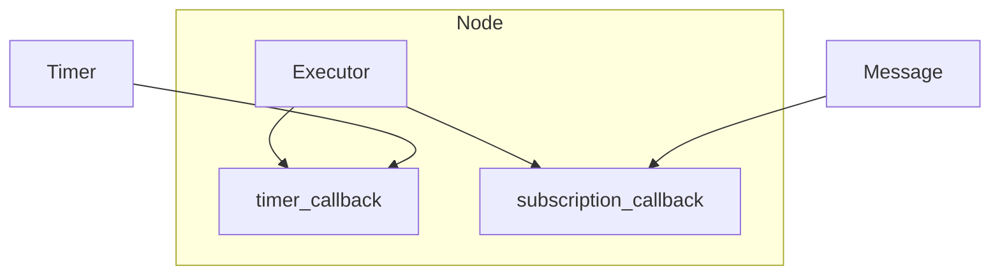

<style>
@import url('https://fonts.googleapis.com/css2?family=Inter:wght@300;400;600;700;800&family=Roboto+Mono:wght@400;600&display=swap');

:root {
  --primary: #1e40af;
  --primary-light: #2563eb;
  --accent: #3b82f6;
  --accent-light: #60a5fa;
  --green: #16a34a;
  --green-bg: #f0fdf4;
  --green-border: #86efac;
  --red: #dc2626;
  --red-bg: #fef2f2;
  --red-border: #fca5a5;
  --yellow: #d97706;
  --yellow-bg: #fffbeb;
  --yellow-border: #fcd34d;
  --gray-50: #f9fafb;
  --gray-100: #f3f4f6;
  --gray-200: #e5e7eb;
  --gray-300: #d1d5db;
  --gray-400: #9ca3af;
  --gray-500: #6b7280;
  --gray-600: #4b5563;
  --gray-700: #374151;
  --gray-800: #1f2937;
  --white: #ffffff;
  --card-bg: #f3f7ff;
  --card-border: #bfdbfe;
  --font: 'Inter', 'Segoe UI', system-ui, sans-serif;
  --mono: 'Roboto Mono', 'Consolas', monospace;
}

section {
  background: var(--white);
  color: var(--gray-800);
  font-family: var(--font);
  font-weight: 400;
  box-sizing: border-box;
  border-top: 8px solid var(--primary);
  position: relative;
  line-height: 1.6;
  font-size: 20px;
  padding: 48px 56px 52px;
}

section::after { font-size: 14px; color: var(--gray-400); }

h1, h2, h3, h4, h5, h6 { font-weight: 700; color: var(--primary); margin: 0; padding: 0; }

h1 { font-size: 50px; line-height: 1.15; letter-spacing: -0.02em; }

h2 {
  position: absolute; top: 34px; left: 56px; right: 56px;
  font-size: 32px; padding-bottom: 10px;
  border-bottom: 3px solid var(--accent);
}
h2 + * { margin-top: 94px; }

h3 { color: var(--primary-light); font-size: 22px; margin-top: 24px; margin-bottom: 8px; font-weight: 600; }
h4 { color: var(--primary); font-size: 18px; margin-top: 14px; margin-bottom: 6px; }

ul, ol { padding-left: 28px; }
li { margin-bottom: 7px; line-height: 1.6; font-size: 18px; }

strong { color: var(--primary); font-weight: 700; }
em { color: var(--green); font-style: normal; font-weight: 600; }

table { border-collapse: collapse; width: 100%; margin: 14px 0; font-size: 16px; }
th { background: var(--primary); color: var(--white); font-weight: 700; font-size: 15px; padding: 10px 14px; text-align: left; }
td { border: 1px solid var(--gray-300); padding: 9px 14px; }
tr:nth-child(even) td { background: var(--gray-50); }
td:first-child { font-weight: 600; }

code {
  background: #eef2ff; color: var(--primary); padding: 2px 7px;
  border-radius: 4px; font-family: var(--mono); font-size: 0.85em;
}

blockquote {
  border-left: 5px solid var(--accent); padding: 12px 20px;
  background: var(--card-bg); border-radius: 0 8px 8px 0;
  margin: 14px 0; font-size: 20px; color: var(--primary); font-weight: 500;
}

section.lead {
  display: flex; flex-direction: column; justify-content: center;
  background: linear-gradient(135deg, #ffffff 0%, #eff6ff 60%, #dbeafe 100%);
}
section.lead h1 { margin-bottom: 20px; font-size: 56px; }
section.lead p { font-size: 22px; color: var(--gray-700); font-weight: 400; }

section.section-break {
  display: flex; flex-direction: column; justify-content: center;
  background: linear-gradient(135deg, #1e3a8a 0%, #1e40af 50%, #2563eb 100%);
  color: var(--white); border-top: 8px solid #93c5fd;
}
section.section-break h1 { color: var(--white); font-size: 46px; }
section.section-break p { color: #bfdbfe; font-size: 20px; }

footer {
  font-size: 13px; color: var(--gray-400); position: absolute;
  left: 56px; right: 56px; bottom: 16px;
  display: flex; justify-content: space-between; align-items: center;
}

.badge {
  display: inline-block; padding: 3px 11px; border-radius: 20px;
  font-size: 13px; font-weight: 600; margin: 2px;
}
.badge-blue { background: #dbeafe; color: #1e40af; }
.badge-green { background: #dcfce7; color: #16a34a; }
.badge-yellow { background: #fef3c7; color: #92400e; }
.badge-red { background: #fee2e2; color: #dc2626; }

.callout {
  padding: 14px 20px; border-left: 5px solid var(--accent);
  border-radius: 0 8px 8px 0; margin: 12px 0; font-size: 17px;
  background: var(--card-bg);
}
.callout-green { background: var(--green-bg); border-left-color: var(--green); }
.callout-yellow { background: var(--yellow-bg); border-left-color: var(--yellow); }
.callout-red { background: var(--red-bg); border-left-color: var(--red); }

.two-col { display: flex; gap: 26px; margin-top: 6px; }
.two-col > div { flex: 1; }

.arch-node {
  padding: 10px 16px; border: 2px solid var(--accent); border-radius: 8px;
  text-align: center; font-weight: 700; font-size: 16px; color: var(--primary);
  background: var(--card-bg);
}
.arch-node-warn { background: var(--yellow-bg); border-color: var(--yellow); color: #92400e; }
.arch-node-danger { background: var(--red-bg); border-color: var(--red); color: #7f1d1d; }
.arch-node-gray { background: var(--gray-100); border-color: var(--gray-500); color: var(--gray-700); }

.l2-link { font-size: 14px; color: var(--primary-light); margin-top: 10px; }
.l3-link { font-size: 14px; color: var(--green); }
</style>

<!-- _class: lead -->
<!-- _paginate: false -->

# Node, Executor и callbacks

Лекция • 40 минут (уровень 1)

<span class="badge badge-blue">Уровень 1: Лекция</span>
<span class="badge badge-green">Уровень 2: Практика</span>
<span class="badge badge-yellow">Уровень 3: Робот TIAGo</span>

---

<!-- _class: section-break -->

# Часть 1

Узел, Executor и callbacks

---

## Что такое node

<div class="two-col">
<div>

- **Node** — программа с **одной задачей** робота
- Один узел = одна ответственность
- Узлы общаются через topics, services, actions

</div>
<div>

<div class="arch-node" style="font-size:14px;">camera_node</div>
<div class="arch-node arch-node-warn" style="font-size:14px;">motor_controller</div>
<div class="arch-node arch-node-gray" style="font-size:14px;">yolo_node</div>

</div>
</div>

<div class="callout" style="font-size:16px;">
  Узел — <strong>работающая программа</strong>, а не файл и не функция.
</div>

<div class="l2-link">Ур.2: <code>2_knowledge/nodes.md</code></div>
<div class="l3-link">Ур.3: TIAgo — ~15 узлов, каждый с одной задачей</div>

<!-- «Узел — программа, которая решает одну задачу робота: камера, лидар, привод базы.» -->

---

## Аналогия: сотрудник и секретарь

<div class="two-col">
<div>

- **Node** — сотрудник с одной задачей
- **Callback** — рабочая задача сотрудника
- **Executor** — секретарь, который разбирает входящие события

</div>
<div>

```text
Событие (таймер/сообщение/запрос)
        ↓
   Executor (секретарь)
        ↓
   callback (работа)
```

</div>
</div>

<div class="callout callout-green" style="font-size:16px;">
  Вы пишете только <strong>callback</strong>. Откуда пришло событие — решает Executor.
</div>

<div class="l2-link">Ур.2: <code>2_knowledge/nodes.md</code></div>
<div class="l3-link">Ур.3: каждый узел TIAgo — свой Executor</div>

<!-- «Node — сотрудник, Executor — его секретарь, callback — рабочая задача. Секретарь разбирает события и вызывает нужного исполнителя.» -->

---

## Жизненный цикл узла

<div class="two-col">
<div>

- `rclpy.init()` — инициализация
- создать `Node` — регистрация в графе
- зарегистрировать события (`create_timer`, `create_subscription`)
- `spin()` — цикл обработки
- `destroy_node()`, `shutdown()` — завершение

</div>
<div>

```text
rclpy.init
   → создать Node
   → создать таймеры/подписки
   → spin (цикл)
   → destroy_node
   → shutdown
```

</div>
</div>

<div class="callout callout-yellow" style="font-size:16px;">
  Управляемый жизненный цикл (managed lifecycle) — отдельная тема, занятие 16.
</div>

<div class="l2-link">Ур.2: <code>2_knowledge/nodes.md</code></div>
<div class="l3-link">Ур.3: тот же цикл у каждого узла TIAgo</div>

<!-- «Узел живёт по одному сценарию: инициализация, создание, регистрация событий, spin, корректное завершение.» -->

---

## rclpy и rclcpp

| | `rclpy` | `rclcpp` |
|---|---|---|
| Язык | Python | C++ |
| Где нужен | быстро и наглядно | производительность |
| В курсе | **основной** | ссылкой |

<div class="callout" style="font-size:16px;">
  Одна модель, два языка: узел, Executor, callbacks — всё то же самое.
</div>

<div class="l2-link">Ур.2: <code>2_knowledge/nodes.md</code></div>
<div class="l3-link">Ур.3: контроллеры TIAgo написаны на <code>rclcpp</code></div>

<!-- «rclpy для Python, rclcpp для C++. Механизмы одинаковы — меняется только синтаксис.» -->

---

## Executor и callbacks

<div class="two-col">
<div>

- **Executor** — диспетчер: ждёт события и вызывает callbacks
- **Callback** — функция-обработчик события
- Таймер, сообщение, запрос — всё превращается в вызов callback

</div>
<div>



</div>
</div>

<div class="callout callout-green" style="font-size:16px;">
  Событие → Executor → нужный callback.
</div>

<div class="l2-link">Ур.2: <code>2_knowledge/nodes.md</code></div>
<div class="l3-link">Ур.3: <code>DiffDriveController</code> — callback на <code>/cmd_vel</code></div>

<!-- «Executor — диспетчер выполнения: ловит события и вызывает нужный обработчик.» -->

---

## spin() — кнопка «работать»

<div class="two-col">
<div>

- `spin()` запускает Executor
- Без `spin()` — **ни один callback не вызовется**
- Узел создан, но «молчит» и завершается

</div>
<div>

```python
rclpy.init()
node = MyNode()
# без spin() узел создан, но событий не обрабатывает
rclpy.spin(node)  # ← запуск цикла событий
```

</div>
</div>

<div class="callout callout-red" style="font-size:16px;">
  Забыли <code>spin()</code> → таймер не срабатывает, сообщения не приходят.
</div>

<div class="l2-link">Ур.2: <code>2_practice/08_node.md</code> — эффект без <code>spin()</code></div>
<div class="l3-link">Ур.3: каждый узел TIAgo крутится в своём <code>spin</code></div>

<!-- «spin() запускает Executor. Без него узел не обрабатывает ни одного события.» -->

---

## Threads и callback groups

<div class="two-col">
<div>

- **Single-threaded** — один поток, по очереди (по умолчанию)
- **Multi-threaded** — несколько потоков параллельно
- **Callback groups**: mutually exclusive / reentrant

</div>
<div>

```python
from rclpy.executors import MultiThreadedExecutor
from rclpy.callback_groups import \
    MutuallyExclusiveCallbackGroup
```

</div>
</div>

<div class="callout callout-yellow" style="font-size:16px;">
  На этом занятии — <strong>обзорно</strong>. Главное: callback должен быть быстрым.
</div>

<div class="l2-link">Ур.2: <code>2_knowledge/nodes.md</code></div>
<div class="l3-link">Ур.3: TIAgo — контроллеры в отдельных потоках</div>

<!-- «По умолчанию один поток. Multi-threaded нужен, когда долгий callback не должен блокировать остальные.» -->

---

## Минимальный узел

```python
class TimerNode(Node):
    def __init__(self):
        super().__init__('timer_node')
        self._timer = self.create_timer(1.0, self._timer_callback)

    def _timer_callback(self):
        self.get_logger().info('Tick')

def main(args=None):
    rclpy.init(args=args)
    node = TimerNode()
    rclpy.spin(node)          # ← без неё callback не вызовется
    node.destroy_node()
    rclpy.shutdown()
```

<div class="callout callout-green" style="font-size:16px;">
  `ros2 run my_first_pkg timer_node` → `Tick` каждую секунду.
</div>

<div class="l2-link">Ур.2: <code>2_practice/08_node.md</code></div>
<div class="l3-link">Ур.3: тот же паттерн в узлах TIAgo</div>

<!-- «Пять строк логики: создаём узел, регистрируем таймер, в main запускаем spin.» -->

---

## CLI: увидеть узел со стороны

| Команда | Что показывает |
|---|---|
| `ros2 node list` | кто жив в графе |
| `ros2 node info /my_node` | publishers, subscribers, services |
| `rqt_graph` | визуальный граф связей |

```bash
ros2 node list          # /timer_node
ros2 node info /timer_node
rqt_graph
```

<div class="l2-link">Ур.2: <code>2_practice/08_node.md</code></div>
<div class="l3-link">Ур.3: те же команды по узлам TIAgo</div>

<!-- «ros2 node list — кто жив; node info — чем занят; rqt_graph — как связан.» -->

---

<!-- _class: section-break -->

# Часть 2

Кейс робота TIAgo

---

## Узлы TIAgo: кто жив в графе

<div class="two-col">
<div>

- Базовый запуск — **~15 узлов**
- `robot_state_publisher`, `controller_manager`, `DiffDriveController`, `twist_mux`, `joint_state_broadcaster`, `gazebo_ros`, `rviz2`
- Один узел = одна задача

</div>
<div>

```bash
ros2 node list
ros2 node list | wc -l
```

```text
/controller_manager
/DiffDriveController
/twist_mux
/robot_state_publisher
...
```

</div>
</div>

<div class="callout" style="font-size:16px;">
  Работающий робот — это <strong>~15 независимых узлов</strong>, а не одна программа.
</div>

<div class="l2-link">Ур.2: <code>2_practice/08_node.md</code></div>
<div class="l3-link">Ур.3: карта — <code>3_Robot/TIAgo_humble/docs/tiago_architecture.md</code></div>

<!-- «Базовый запуск TIAgo поднимает около 15 узлов, каждый со своим Executor и callbacks.» -->

---

## Кто за что отвечает

<div class="two-col">
<div>

- `DiffDriveController` — `/cmd_vel` → `/odom`
- `robot_state_publisher` — `/robot_description`, `/tf`
- `joint_state_broadcaster` — `/joint_states`
- `twist_mux` — приоритет команды скорости

</div>
<div>

```bash
ros2 node info /DiffDriveController
# Subscribers: /cmd_vel
# Publishers:  /odom

ros2 node info /robot_state_publisher
# Publishers: /robot_description, /tf
```

</div>
</div>

<div class="callout callout-green" style="font-size:16px;">
  По publishers/subscribers видно, <strong>за что отвечает узел</strong>.
</div>

<div class="l2-link">Ур.2: <code>2_knowledge/nodes.md</code></div>
<div class="l3-link">Ур.3: <code>ros2 node info</code> каждого узла</div>

<!-- «Смотрим node info и по подпискам/публикациям понимаем задачу узла.» -->

---

## Смелый тест: убить узел

```bash
ros2 node list      # запомнить список
# остановить один узел (Ctrl+C)
ros2 node list      # узел исчез, остальные работают
```

<div class="callout callout-yellow" style="font-size:16px;">
  Узлы <strong>независимы</strong>: падение одного не рушит систему. Discovery за пару секунд убирает его из графа.
</div>

<div class="callout callout-green" style="font-size:16px;">
  Возврат в норму: перезапустить узел.
</div>

<div class="l2-link">Ур.2: <code>2_practice/08_node.md</code></div>
<div class="l3-link">Ур.3: тест в контейнере TIAgo</div>

<!-- «Остановили узел — discovery убрал его из графа, остальные продолжили работать.» -->

---

## Итог: узел, Executor, callbacks

<div style="display:flex; gap:6px; align-items:center; margin-top:10px;">
  <div class="arch-node" style="font-size:13px;">создать Node</div>
  <div style="color:var(--accent); font-size:18px;">→</div>
  <div class="arch-node arch-node-warn" style="font-size:13px;">create_timer</div>
  <div style="color:var(--accent); font-size:18px;">→</div>
  <div class="arch-node arch-node-danger" style="font-size:13px;">spin()</div>
  <div style="color:var(--accent); font-size:18px;">→</div>
  <div class="arch-node arch-node-gray" style="font-size:13px;">callbacks</div>
</div>

<div class="callout callout-green" style="font-size:16px; margin-top:12px;">
  В занятиях 9–11 всё это — publisher, service, action — <strong>callbacks внутри узла</strong>.
</div>

<div class="l2-link">Ур.2: <code>2_practice/08_node.md</code> · <code>2_homework/hw_08_node.md</code></div>
<div class="l3-link">Ур.3: тот же принцип в <code>3_Robot/TIAgo_humble/</code></div>

<!-- «Фундамент: узел + Executor + callbacks. Дома — первый узел своей модели с heartbeat.» -->

---

<!-- _class: lead -->

# Вопросы?

<span class="badge badge-blue">`2_knowledge/nodes.md`</span>
<span class="badge badge-green">`2_practice/08_node.md`</span>
<span class="badge badge-yellow">`3_Robot/TIAgo_humble/`</span>

**Домашнее задание:** `2_homework/hw_08_node.md`
