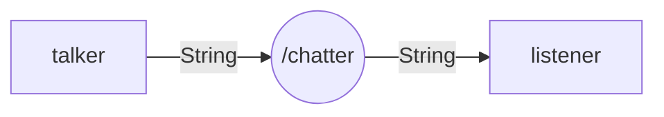
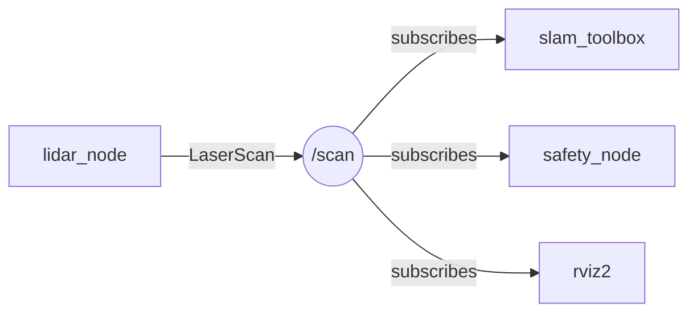

<style>
@import url('https://fonts.googleapis.com/css2?family=Inter:wght@300;400;600;700;800&family=Roboto+Mono:wght@400;600&display=swap');

:root {
  --primary: #1e40af;
  --primary-light: #2563eb;
  --accent: #3b82f6;
  --accent-light: #60a5fa;
  --green: #16a34a;
  --green-bg: #f0fdf4;
  --green-border: #86efac;
  --red: #dc2626;
  --red-bg: #fef2f2;
  --red-border: #fca5a5;
  --yellow: #d97706;
  --yellow-bg: #fffbeb;
  --yellow-border: #fcd34d;
  --gray-50: #f9fafb;
  --gray-100: #f3f4f6;
  --gray-200: #e5e7eb;
  --gray-300: #d1d5db;
  --gray-400: #9ca3af;
  --gray-500: #6b7280;
  --gray-600: #4b5563;
  --gray-700: #374151;
  --gray-800: #1f2937;
  --white: #ffffff;
  --card-bg: #f3f7ff;
  --card-border: #bfdbfe;
  --font: 'Inter', 'Segoe UI', system-ui, sans-serif;
  --mono: 'Roboto Mono', 'Consolas', monospace;
}

section {
  background: var(--white);
  color: var(--gray-800);
  font-family: var(--font);
  font-weight: 400;
  box-sizing: border-box;
  border-top: 8px solid var(--primary);
  position: relative;
  line-height: 1.6;
  font-size: 20px;
  padding: 48px 56px 52px;
}

section::after { font-size: 14px; color: var(--gray-400); }

h1, h2, h3, h4, h5, h6 { font-weight: 700; color: var(--primary); margin: 0; padding: 0; }

h1 { font-size: 50px; line-height: 1.15; letter-spacing: -0.02em; }

h2 {
  position: absolute; top: 34px; left: 56px; right: 56px;
  font-size: 32px; padding-bottom: 10px;
  border-bottom: 3px solid var(--accent);
}
h2 + * { margin-top: 94px; }

h3 { color: var(--primary-light); font-size: 22px; margin-top: 24px; margin-bottom: 8px; font-weight: 600; }
h4 { color: var(--primary); font-size: 18px; margin-top: 14px; margin-bottom: 6px; }

ul, ol { padding-left: 28px; }
li { margin-bottom: 7px; line-height: 1.6; font-size: 18px; }

strong { color: var(--primary); font-weight: 700; }
em { color: var(--green); font-style: normal; font-weight: 600; }

table { border-collapse: collapse; width: 100%; margin: 14px 0; font-size: 16px; }
th { background: var(--primary); color: var(--white); font-weight: 700; font-size: 15px; padding: 10px 14px; text-align: left; }
td { border: 1px solid var(--gray-300); padding: 9px 14px; }
tr:nth-child(even) td { background: var(--gray-50); }
td:first-child { font-weight: 600; }

code {
  background: #eef2ff; color: var(--primary); padding: 2px 7px;
  border-radius: 4px; font-family: var(--mono); font-size: 0.85em;
}

blockquote {
  border-left: 5px solid var(--accent); padding: 12px 20px;
  background: var(--card-bg); border-radius: 0 8px 8px 0;
  margin: 14px 0; font-size: 20px; color: var(--primary); font-weight: 500;
}

section.lead {
  display: flex; flex-direction: column; justify-content: center;
  background: linear-gradient(135deg, #ffffff 0%, #eff6ff 60%, #dbeafe 100%);
}
section.lead h1 { margin-bottom: 20px; font-size: 56px; }
section.lead p { font-size: 22px; color: var(--gray-700); font-weight: 400; }

section.section-break {
  display: flex; flex-direction: column; justify-content: center;
  background: linear-gradient(135deg, #1e3a8a 0%, #1e40af 50%, #2563eb 100%);
  color: var(--white); border-top: 8px solid #93c5fd;
}
section.section-break h1 { color: var(--white); font-size: 46px; }
section.section-break p { color: #bfdbfe; font-size: 20px; }

footer {
  font-size: 13px; color: var(--gray-400); position: absolute;
  left: 56px; right: 56px; bottom: 16px;
  display: flex; justify-content: space-between; align-items: center;
}

.badge {
  display: inline-block; padding: 3px 11px; border-radius: 20px;
  font-size: 13px; font-weight: 600; margin: 2px;
}
.badge-blue { background: #dbeafe; color: #1e40af; }
.badge-green { background: #dcfce7; color: #16a34a; }
.badge-yellow { background: #fef3c7; color: #92400e; }
.badge-red { background: #fee2e2; color: #dc2626; }

.callout {
  padding: 14px 20px; border-left: 5px solid var(--accent);
  border-radius: 0 8px 8px 0; margin: 12px 0; font-size: 17px;
  background: var(--card-bg);
}
.callout-green { background: var(--green-bg); border-left-color: var(--green); }
.callout-yellow { background: var(--yellow-bg); border-left-color: var(--yellow); }
.callout-red { background: var(--red-bg); border-left-color: var(--red); }

.two-col { display: flex; gap: 26px; margin-top: 6px; }
.two-col > div { flex: 1; }

.arch-node {
  padding: 10px 16px; border: 2px solid var(--accent); border-radius: 8px;
  text-align: center; font-weight: 700; font-size: 16px; color: var(--primary);
  background: var(--card-bg);
}
.arch-node-warn { background: var(--yellow-bg); border-color: var(--yellow); color: #92400e; }
.arch-node-danger { background: var(--red-bg); border-color: var(--red); color: #7f1d1d; }
.arch-node-gray { background: var(--gray-100); border-color: var(--gray-500); color: var(--gray-700); }

.l2-link { font-size: 14px; color: var(--primary-light); margin-top: 10px; }
.l3-link { font-size: 14px; color: var(--green); }
</style>

<!-- _class: lead -->
<!-- _paginate: false -->

# Topic, publisher, subscriber и message types

Лекция • 40 минут (уровень 1)

<span class="badge badge-blue">Уровень 1: Лекция</span>
<span class="badge badge-green">Уровень 2: Практика</span>
<span class="badge badge-yellow">Уровень 3: Робот TIAGo</span>

---

<!-- _class: section-break -->

# Часть 1

Topic, publisher, subscriber

---

## Что такое topic

<div class="two-col">
<div>

- **Topic** — именованный канал с фиксированным типом
- **Publisher** — публикует сообщения
- **Subscriber** — читает и обрабатывает
- Имя обычно начинается с `/`: `/chatter`, `/cmd_vel`, `/scan`

</div>
<div>



</div>
</div>

<div class="callout" style="font-size:16px;">
  Publisher и subscriber <strong>не знают друг о друге</strong> — только имя канала и тип.
</div>

<div class="l2-link">Ур.2: <code>2_knowledge/topics.md</code></div>
<div class="l3-link">Ур.3: TIAgo — <code>/cmd_vel</code>, <code>/odom</code>, <code>/scan</code></div>

<!-- «Topic — именованный поток сообщений с фиксированным типом. Publisher пишет, subscriber читает.» -->

---

## Аналогия: Telegram-канал

<div class="two-col">
<div>

- **Topic** — Telegram-канал «Новости робота»
- **Publisher** — автор канала
- **Subscriber** — подписчик
- Автор не знает, кто подписан

</div>
<div>

```text
Автор публикует в канал
        ↓
   Канал (topic)
        ↓
  Подписчики читают
```

</div>
</div>

<div class="callout callout-yellow" style="font-size:16px;">
  Отличие: в ROS2 у сообщений <strong>строгий тип</strong>, а не произвольный текст.
</div>

<div class="l2-link">Ур.2: <code>2_knowledge/topics.md</code></div>
<div class="l3-link">Ур.3: лидар публикует <code>LaserScan</code> — не строку</div>

<!-- «Topic похож на Telegram-канал. Но в ROS2 сообщения имеют строгий тип: координаты, скорость, данные лидара.» -->

---

## Publisher и subscriber

<div class="two-col">
<div>

- Publisher — `create_publisher()`
- Subscriber — `create_subscription()`
- Callback — вызывается при каждом сообщении
- Поток — только от publisher к subscriber

</div>
<div>

```python
# publisher
self.publisher = self.create_publisher(
    String, 'chatter', 10)
msg = String()
msg.data = 'Hello'
self.publisher.publish(msg)

# subscriber
self.subscription = self.create_subscription(
    String, 'chatter', self.callback, 10)
```

</div>
</div>

<div class="callout callout-green" style="font-size:16px;">
  Один topic — много publisher'ов и subscriber'ов: «многие ко многим».
</div>

<div class="l2-link">Ур.2: <code>2_practice/09_topic.md</code> — <code>talker</code>/<code>listener</code></div>
<div class="l3-link">Ур.3: <code>/scan</code> читают SLAM, safety, rviz2</div>

<!-- «Publisher публикует, subscriber подписывается и обрабатывает каждый пришедший фрейм в callback.» -->

---

## Модель «многие ко многим»



<div class="callout" style="font-size:16px;">
  Один лидар — три потребителя: <strong>SLAM</strong> строит карту, <strong>safety</strong> проверяет препятствия, <strong>rviz2</strong> визуализирует.
</div>

<div class="l2-link">Ур.2: <code>2_knowledge/topics.md</code></div>
<div class="l3-link">Ур.3: это реальная топология <code>/scan</code> в TIAgo</div>

<!-- «Данные лидара читают сразу несколько узлов. Для этого topic поддерживает связь многие ко многим.» -->

---

## Message types

| Пакет | Тип | Поля | Где |
|---|---|---|---|
| `std_msgs` | `String` | `data: string` | текст |
| `std_msgs` | `Int32` / `Float64` | `data` | числа |
| `geometry_msgs` | `Twist` | `linear`, `angular` | `/cmd_vel` |
| `geometry_msgs` | `Pose` | `position`, `orientation` | координаты |
| `sensor_msgs` | `LaserScan` | `ranges`, `angle_min` | `/scan` |
| `sensor_msgs` | `Image` | `data`, `width`, `height` | камера |

```bash
ros2 interface show std_msgs/msg/String
# string data
```

<div class="callout callout-red" style="font-size:16px;">
  Тип publisher'а и subscriber'а должен <strong>совпадать</strong> — иначе нет соединения.
</div>

<div class="l2-link">Ур.2: <code>2_knowledge/topics.md</code></div>
<div class="l3-link">Ур.3: <code>/cmd_vel</code> — <code>geometry_msgs/msg/Twist</code></div>

<!-- «Тип задаётся парой пакет/имя. Готовые типы std_msgs, geometry_msgs, sensor_msgs уже в контейнере.» -->

---

## Имена и namespace

<div class="two-col">
<div>

- **Абсолютное** — `/cmd_vel`, `/scan`
- **Относительное** — `cmd_vel` → дописывается namespace
- Узел в `/robot1` + `cmd_vel` → `/robot1/cmd_vel`
- Имена с `_` — скрытые

</div>
<div>

```text
/robot1/scan
/robot2/scan
     ↑
  namespace = «папка» для имён
```

</div>
</div>

<div class="callout callout-yellow" style="font-size:16px;">
  Namespace разделяет одинаковые имена у разных подсистем: <code>/robot1/scan</code> ≠ <code>/robot2/scan</code>.
</div>

<div class="l2-link">Ур.2: <code>2_knowledge/topics.md</code></div>
<div class="l3-link">Ур.3: TIAgo — префиксы вроде <code>/head_front_camera</code></div>

<!-- «Имя может быть абсолютным или относительным. Namespace — это папка для имён, чтобы одинаковые имена не сталкивались.» -->

---

## CLI: увидеть topic со стороны

| Команда | Что показывает |
|---|---|
| `ros2 topic list -t` | topics и их типы |
| `ros2 topic echo /chatter` | сообщения в реальном времени |
| `ros2 topic hz /chatter` | частота (сообщений/сек) |
| `ros2 topic info /chatter --verbose` | тип, pub/sub, QoS |
| `ros2 topic pub /chatter ...` | вручную отправить сообщение |

```bash
ros2 topic pub --once /chatter std_msgs/msg/String "data: 'Hello'"
```

<div class="callout callout-green" style="font-size:16px;">
  <code>ros2 topic pub</code> — ручная вставка сообщения, чтобы проверить реакцию системы.
</div>

<div class="l2-link">Ур.2: <code>2_practice/09_topic.md</code></div>
<div class="l3-link">Ур.3: те же команды по topics TIAgo</div>

<!-- «ros2 topic list/echo/hz/info/pub — инструменты, чтобы читать и трогать topic без написания кода.» -->

---

<!-- _class: section-break -->

# Часть 2

Кейс робота TIAgo

---

## Topics TIAgo: данные робота

| Topic | Тип | Кто публикует |
|---|---|---|
| `/scan` | `sensor_msgs/LaserScan` | лидар |
| `/odom` | `nav_msgs/Odometry` | `DiffDriveController` |
| `/cmd_vel` | `geometry_msgs/Twist` | Nav2 / teleop |
| `/joint_states` | `sensor_msgs/JointState` | `joint_state_broadcaster` |

```bash
ros2 topic list -t
ros2 topic info /cmd_vel --verbose
```

<div class="callout" style="font-size:16px;">
  Вся «жизнь» робота — это <strong>потоки данных в topics</strong> с конкретными типами.
</div>

<div class="l2-link">Ур.2: <code>2_knowledge/topics.md</code></div>
<div class="l3-link">Ур.3: карта — <code>3_Robot/TIAgo_humble/docs/tiago_architecture.md</code></div>

<!-- «Каждая подсистема TIAgo общается через topic с фиксированным типом: скорость, одометрия, сканы, суставы.» -->

---

## Смелый тест: команда в `/cmd_vel`

```bash
ros2 topic info /cmd_vel --verbose
ros2 topic pub /cmd_vel geometry_msgs/msg/Twist \
  "{linear: {x: 0.2}, angular: {z: 0.0}}" --rate 10
```

<div class="callout callout-yellow" style="font-size:16px;">
  Робот в Gazebo <strong>едет вперёд</strong> — движение это просто данные в topic. Только в симуляции!
</div>

<div class="callout callout-green" style="font-size:16px;">
  Возврат в норму: <code>ros2 topic pub /cmd_vel geometry_msgs/msg/Twist "{linear: {x: 0.0}, angular: {z: 0.0}}" --once</code>
</div>

<div class="l2-link">Ур.2: <code>2_practice/09_topic.md</code></div>
<div class="l3-link">Ур.3: тест в контейнере TIAgo</div>

<!-- «Мы публикуем Twist со скоростью 0.2 м/с — и робот едет. Ноль — останавливается.» -->

---

## Смелый тест: заглушить `/scan`

```bash
ros2 topic echo /scan --once
ros2 topic hz /scan
```

<div class="callout callout-yellow" style="font-size:16px;">
  Без данных лидара <strong>SLAM и визуализация «слепнут»</strong>: частота падает до 0, лучи в RViz замирают.
</div>

<div class="callout callout-green" style="font-size:16px;">
  Возврат в норму: перезапустить публикатор <code>/scan</code> (симуляцию).
</div>

<div class="l2-link">Ур.2: <code>2_knowledge/topics.md</code></div>
<div class="l3-link">Ур.3: <code>/scan</code> → SLAM, safety, rviz2</div>

<!-- «Лидар публикует ~10 Гц. Убери источник — потребители перестают получать данные и не могут строить карту.» -->

---

## twist_mux: конфликт источников

```bash
ros2 topic info /cmd_vel --verbose
ros2 topic list | grep cmd_vel
rqt_graph
```

| Приоритет | Источник |
|---|---|
| 0 (низкий) | Nav2 |
| 1 | teleop |
| 2 | joy (джойстик) |
| 3 (высокий) | emergency_stop |

<div class="callout callout-red" style="font-size:16px;">
  Побеждает источник с более высоким приоритетом. E-stop блокирует всё. <strong>Только в симуляции.</strong>
</div>

<div class="l2-link">Ур.2: <code>2_knowledge/topics.md</code></div>
<div class="l3-link">Ур.3: <code>3_Robot/TIAgo_humble/docs/tiago_architecture.md</code></div>

<!-- «twist_mux выбирает, чья команда скорости пройдёт к приводу. Это слой безопасности, а не просто переключатель.» -->

---

## Итог: topic, publisher, subscriber

<div style="display:flex; gap:6px; align-items:center; margin-top:10px;">
  <div class="arch-node" style="font-size:13px;">create_publisher</div>
  <div style="color:var(--accent); font-size:18px;">→</div>
  <div class="arch-node arch-node-warn" style="font-size:13px;">topic</div>
  <div style="color:var(--accent); font-size:18px;">→</div>
  <div class="arch-node arch-node-danger" style="font-size:13px;">create_subscription</div>
  <div style="color:var(--accent); font-size:18px;">→</div>
  <div class="arch-node arch-node-gray" style="font-size:13px;">callback</div>
</div>

<div class="callout callout-green" style="font-size:16px; margin-top:12px;">
  В занятиях 10–11 это же взаимодействие перейдёт в <strong>service (запрос-ответ)</strong> и <strong>action (длительная задача)</strong>.
</div>

<div class="l2-link">Ур.2: <code>2_practice/09_topic.md</code> · <code>2_homework/hw_09_topic.md</code></div>
<div class="l3-link">Ур.3: тот же принцип в <code>3_Robot/TIAgo_humble/</code></div>

<!-- «Фундамент: publisher → topic → subscriber → callback. Дома — свой поток данных в модели робота.» -->

---

<!-- _class: lead -->

# Вопросы?

<span class="badge badge-blue">`2_knowledge/topics.md`</span>
<span class="badge badge-green">`2_practice/09_topic.md`</span>
<span class="badge badge-yellow">`3_Robot/TIAgo_humble/`</span>

**Домашнее задание:** `2_homework/hw_09_topic.md`
