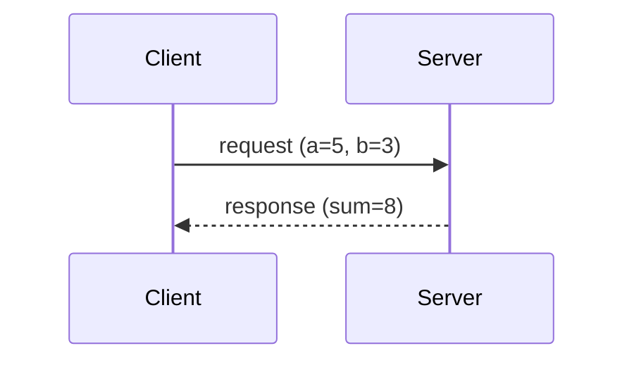

<style>
@import url('https://fonts.googleapis.com/css2?family=Inter:wght@300;400;600;700;800&family=Roboto+Mono:wght@400;600&display=swap');

:root {
  --primary: #1e40af;
  --primary-light: #2563eb;
  --accent: #3b82f6;
  --accent-light: #60a5fa;
  --green: #16a34a;
  --green-bg: #f0fdf4;
  --green-border: #86efac;
  --red: #dc2626;
  --red-bg: #fef2f2;
  --red-border: #fca5a5;
  --yellow: #d97706;
  --yellow-bg: #fffbeb;
  --yellow-border: #fcd34d;
  --gray-50: #f9fafb;
  --gray-100: #f3f4f6;
  --gray-200: #e5e7eb;
  --gray-300: #d1d5db;
  --gray-400: #9ca3af;
  --gray-500: #6b7280;
  --gray-600: #4b5563;
  --gray-700: #374151;
  --gray-800: #1f2937;
  --white: #ffffff;
  --card-bg: #f3f7ff;
  --card-border: #bfdbfe;
  --font: 'Inter', 'Segoe UI', system-ui, sans-serif;
  --mono: 'Roboto Mono', 'Consolas', monospace;
}

section {
  background: var(--white);
  color: var(--gray-800);
  font-family: var(--font);
  font-weight: 400;
  box-sizing: border-box;
  border-top: 8px solid var(--primary);
  position: relative;
  line-height: 1.6;
  font-size: 20px;
  padding: 48px 56px 52px;
}

section::after { font-size: 14px; color: var(--gray-400); }

h1, h2, h3, h4, h5, h6 { font-weight: 700; color: var(--primary); margin: 0; padding: 0; }

h1 { font-size: 50px; line-height: 1.15; letter-spacing: -0.02em; }

h2 {
  position: absolute; top: 34px; left: 56px; right: 56px;
  font-size: 32px; padding-bottom: 10px;
  border-bottom: 3px solid var(--accent);
}
h2 + * { margin-top: 94px; }

h3 { color: var(--primary-light); font-size: 22px; margin-top: 24px; margin-bottom: 8px; font-weight: 600; }
h4 { color: var(--primary); font-size: 18px; margin-top: 14px; margin-bottom: 6px; }

ul, ol { padding-left: 28px; }
li { margin-bottom: 7px; line-height: 1.6; font-size: 18px; }

strong { color: var(--primary); font-weight: 700; }
em { color: var(--green); font-style: normal; font-weight: 600; }

table { border-collapse: collapse; width: 100%; margin: 14px 0; font-size: 16px; }
th { background: var(--primary); color: var(--white); font-weight: 700; font-size: 15px; padding: 10px 14px; text-align: left; }
td { border: 1px solid var(--gray-300); padding: 9px 14px; }
tr:nth-child(even) td { background: var(--gray-50); }
td:first-child { font-weight: 600; }

code {
  background: #eef2ff; color: var(--primary); padding: 2px 7px;
  border-radius: 4px; font-family: var(--mono); font-size: 0.85em;
}

blockquote {
  border-left: 5px solid var(--accent); padding: 12px 20px;
  background: var(--card-bg); border-radius: 0 8px 8px 0;
  margin: 14px 0; font-size: 20px; color: var(--primary); font-weight: 500;
}

section.lead {
  display: flex; flex-direction: column; justify-content: center;
  background: linear-gradient(135deg, #ffffff 0%, #eff6ff 60%, #dbeafe 100%);
}
section.lead h1 { margin-bottom: 20px; font-size: 56px; }
section.lead p { font-size: 22px; color: var(--gray-700); font-weight: 400; }

section.section-break {
  display: flex; flex-direction: column; justify-content: center;
  background: linear-gradient(135deg, #1e3a8a 0%, #1e40af 50%, #2563eb 100%);
  color: var(--white); border-top: 8px solid #93c5fd;
}
section.section-break h1 { color: var(--white); font-size: 46px; }
section.section-break p { color: #bfdbfe; font-size: 20px; }

footer {
  font-size: 13px; color: var(--gray-400); position: absolute;
  left: 56px; right: 56px; bottom: 16px;
  display: flex; justify-content: space-between; align-items: center;
}

.badge {
  display: inline-block; padding: 3px 11px; border-radius: 20px;
  font-size: 13px; font-weight: 600; margin: 2px;
}
.badge-blue { background: #dbeafe; color: #1e40af; }
.badge-green { background: #dcfce7; color: #16a34a; }
.badge-yellow { background: #fef3c7; color: #92400e; }
.badge-red { background: #fee2e2; color: #dc2626; }

.callout {
  padding: 14px 20px; border-left: 5px solid var(--accent);
  border-radius: 0 8px 8px 0; margin: 12px 0; font-size: 17px;
  background: var(--card-bg);
}
.callout-green { background: var(--green-bg); border-left-color: var(--green); }
.callout-yellow { background: var(--yellow-bg); border-left-color: var(--yellow); }
.callout-red { background: var(--red-bg); border-left-color: var(--red); }

.two-col { display: flex; gap: 26px; margin-top: 6px; }
.two-col > div { flex: 1; }

.arch-node {
  padding: 10px 16px; border: 2px solid var(--accent); border-radius: 8px;
  text-align: center; font-weight: 700; font-size: 16px; color: var(--primary);
  background: var(--card-bg);
}
.arch-node-warn { background: var(--yellow-bg); border-color: var(--yellow); color: #92400e; }
.arch-node-danger { background: var(--red-bg); border-color: var(--red); color: #7f1d1d; }
.arch-node-gray { background: var(--gray-100); border-color: var(--gray-500); color: var(--gray-700); }

.l2-link { font-size: 14px; color: var(--primary-light); margin-top: 10px; }
.l3-link { font-size: 14px; color: var(--green); }
</style>

<!-- _class: lead -->
<!-- _paginate: false -->

# Service и client

Лекция • 40 минут (уровень 1)

<span class="badge badge-blue">Уровень 1: Лекция</span>
<span class="badge badge-green">Уровень 2: Практика</span>
<span class="badge badge-yellow">Уровень 3: Робот TIAGo</span>

---

<!-- _class: section-break -->

# Часть 1

Service, server, client

---

## Что такое service

<div class="two-col">
<div>

- **Service** — короткий запрос и ответ, точка-точка
- **Server** — предоставляет service, обрабатывает запрос
- **Client** — вызывает service, ждёт ответ
- Тип — две части: `Request` и `Response`

</div>
<div>



</div>
</div>

<div class="callout" style="font-size:16px;">
  Один запрос — один ответ, после чего связь <strong>завершается</strong>.
</div>

<div class="l2-link">Ур.2: <code>2_knowledge/services.md</code></div>
<div class="l3-link">Ур.3: TIAgo — <code>/emergency_stop</code></div>

<!-- «Service — пара запрос-ответ. Client отправляет request, server возвращает response.» -->

---

## Аналогия: звонок в справочную

<div class="two-col">
<div>

- **Topic** — радио: вещает всем, без ответа
- **Service** — телефон: один на один, с ответом
- Пока ждёшь ответ — линия занята
- Ответ приходит ровно один раз

</div>
<div>

```text
Client: "5 + 3?"
        ↓
   Server (обработка)
        ↓
Client: "8" (готово)
```

</div>
</div>

<div class="callout callout-yellow" style="font-size:16px;">
  Ограничение: service — не поток. Для непрерывных данных — <strong>topic</strong>, для долгих задач — <strong>action</strong>.
</div>

<div class="l2-link">Ур.2: <code>2_knowledge/services.md</code></div>
<div class="l3-link">Ур.3: E-stop — команда с подтверждением, не поток</div>

<!-- «Service похож на звонок в справочную службу: спросил и дождался ответа. Но это не поток данных.» -->

---

## Service server и client

<div class="two-col">
<div>

- Server — `create_service()`
- Client — `create_client()`
- Callback принимает `request`, заполняет `response`
- Client ждёт готовности через `wait_for_service()`

</div>
<div>

```python
# server
self.srv = self.create_service(
    AddTwoInts, 'add_two_ints', self.callback)

def callback(self, request, response):
    response.sum = request.a + request.b
    return response

# client
self.cli = self.create_client(
    AddTwoInts, 'add_two_ints')
```

</div>
</div>

<div class="callout callout-green" style="font-size:16px;">
  Server и client договариваются только об <strong>имени service</strong> и <strong>типе</strong>.
</div>

<div class="l2-link">Ур.2: <code>2_practice/10_service.md</code> — <code>add_two_ints_server</code>/<code>client</code></div>
<div class="l3-link">Ур.3: <code>/emergency_stop</code> — <code>std_srvs/srv/Trigger</code></div>

<!-- «Server регистрирует service и callback. Client создаёт client для того же имени и типа, дожидается сервера и отправляет запрос.» -->

---

## Тип service: Request и Response

| Компонент | Что это | Поля `AddTwoInts` |
|---|---|---|
| `Request` | что клиент отправляет | `a`, `b` (int64) |
| `Response` | что сервер возвращает | `sum` (int64) |

```bash
ros2 interface show example_interfaces/srv/AddTwoInts
```

```text
int64 a
int64 b
---
int64 sum
```

<div class="callout callout-red" style="font-size:16px;">
  Имена полей строгие: в запросе <code>a</code> и <code>b</code>, не <code>x</code> и <code>y</code>.
</div>

<div class="l2-link">Ур.2: <code>2_knowledge/services.md</code></div>
<div class="l3-link">Ур.3: <code>std_srvs/srv/Trigger</code> — пустой request, есть response</div>

<!-- «Тип service — это два блока: request сверху, response снизу, разделённые строкой ---.» -->

---

## Синхронный и асинхронный вызов

<div class="two-col">
<div>

- В rclpy вызов всегда **асинхронный**: `call_async()`
- Возвращает `Future` — «обещание» результата
- **Блокирующее ожидание** — `spin_until_future_complete()`
- **Callback** — `future.add_done_callback()`

</div>
<div>

```python
future = self.cli.call_async(request)

# блокирующее ожидание
rclpy.spin_until_future_complete(
    node, future)
response = future.result()

# или callback
future.add_done_callback(self.on_done)
```

</div>
</div>

<div class="callout" style="font-size:16px;">
  `spin_until_future_complete` читается как «синхронный» вызов, но внутри — тот же `Future`.
</div>

<div class="l2-link">Ур.2: <code>2_knowledge/services.md</code></div>
<div class="l3-link">Ур.3: E-stop вызывается как простой синхронный запрос</div>

<!-- «call_async не блокирует узел. Дождаться ответа можно через spin_until_future_complete или done-callback.» -->

---

## CLI: увидеть service со стороны

| Команда | Что показывает |
|---|---|
| `ros2 service list -t` | services и их типы |
| `ros2 service type /add_two_ints` | тип service |
| `ros2 service call /add_two_ints ...` | вызвать и получить ответ |
| `ros2 service find <type>` | все services заданного типа |

```bash
ros2 service call /add_two_ints \
  example_interfaces/srv/AddTwoInts "{a: 2, b: 3}"
# response: sum=5
```

<div class="callout callout-green" style="font-size:16px;">
  <code>ros2 service call</code> — ручной вызов service, чтобы увидеть ответ без написания кода.
</div>

<div class="l2-link">Ур.2: <code>2_practice/10_service.md</code></div>
<div class="l3-link">Ур.3: те же команды по services TIAgo</div>

<!-- «ros2 service list/type/call/find — инструменты, чтобы читать и вызывать service без написания кода.» -->

---

## Service или topic

| Критерий | Topic | Service |
|---|---|---|
| Направление | Однонаправленный поток | Запрос → Ответ |
| Получатели | Многие | Один |
| Ответ | Нет | Есть |
| Частота | 10–100 Гц | По запросу |
| Пример | `/scan`, `/cmd_vel` | `/emergency_stop` |

<div class="callout callout-yellow" style="font-size:16px;">
  Поток данных — <strong>topic</strong>. Ответ на конкретный запрос — <strong>service</strong>. Долгая задача с прогрессом — <strong>action</strong> (занятие 11).
</div>

<div class="l2-link">Ур.2: <code>2_knowledge/services.md</code></div>
<div class="l3-link">Ур.3: движение — topic, остановка — service</div>

<!-- «Правило: непрерывный поток — topic, ответ на запрос — service, длительная задача — action.» -->

---

<!-- _class: section-break -->

# Часть 2

Кейс робота TIAgo

---

## Services TIAgo: команды с подтверждением

| Service | Тип | Назначение |
|---|---|---|
| `/emergency_stop` | `std_srvs/srv/Trigger` | Аварийная остановка |
| `/controller_manager/list_controllers` | `controller_manager_msgs/srv/ListControllers` | Список контроллеров |
| `/controller_manager/switch_controller` | `controller_manager_msgs/srv/SwitchController` | Вкл/выкл контроллеры |

```bash
ros2 service list -t
ros2 service type /emergency_stop
```

<div class="callout" style="font-size:16px;">
  Это команды, а не потоки данных: их вызывают <strong>по необходимости</strong> и ждут ответ.
</div>

<div class="l2-link">Ур.2: <code>2_knowledge/services.md</code></div>
<div class="l3-link">Ур.3: <code>3_Robot/TIAgo_humble/docs/safety.md</code></div>

<!-- «В TIAgo service — это команды с подтверждением: остановка, сброс, список контроллеров.» -->

---

## Смелый тест: вызов `/emergency_stop`

```bash
ros2 service list | grep -i stop
ros2 service type /emergency_stop
ros2 service call /emergency_stop std_srvs/srv/Trigger "{}"
```

<div class="callout callout-yellow" style="font-size:16px;">
  Робот <strong>останавливается</strong>: `twist_mux` поднимает приоритет до максимума, все команды скорости блокируются. Только в симуляции!
</div>

<div class="callout callout-green" style="font-size:16px;">
  Возврат в норму: перезапустить симуляцию (<code>ros2 launch tiago_gazebo tiago_gazebo.launch.py is_public_sim:=True</code>).
</div>

<div class="l2-link">Ур.2: <code>2_practice/10_service.md</code></div>
<div class="l3-link">Ур.3: тест в контейнере TIAgo</div>

<!-- «Вызов service останавливает робота — аварийная остановка это команда с подтверждением, а не поток данных.» -->

---

## Смелый тест: service без server

```bash
ros2 service type /nonexistent_service
# error: service '/nonexistent_service' not found

ros2 service call /add_two_ints \
  example_interfaces/srv/AddTwoInts "{a: 1, b: 2}"
# зависает в ожидании server → Ctrl+C
```

<div class="callout callout-red" style="font-size:16px;">
  Две разные ошибки: <strong>имя не найдено</strong> — ошибка сразу; <strong>server не готов</strong> — вечное ожидание.
</div>

<div class="callout callout-green" style="font-size:16px;">
  Поэтому в client нужен <code>wait_for_service()</code> перед вызовом.
</div>

<div class="l2-link">Ур.2: <code>2_practice/10_service.md</code></div>
<div class="l3-link">Ур.3: тест не требует симуляции</div>

<!-- «Вызов в пустоту даёт разные симптомы: имя не найдено — ошибка сразу, server не готов — ожидание без ответа.» -->

---

## Итог: service, server, client

<div style="display:flex; gap:6px; align-items:center; margin-top:10px;">
  <div class="arch-node" style="font-size:13px;">create_client</div>
  <div style="color:var(--accent); font-size:18px;">→</div>
  <div class="arch-node arch-node-warn" style="font-size:13px;">request</div>
  <div style="color:var(--accent); font-size:18px;">→</div>
  <div class="arch-node arch-node-danger" style="font-size:13px;">create_service</div>
  <div style="color:var(--accent); font-size:18px;">→</div>
  <div class="arch-node arch-node-gray" style="font-size:13px;">response</div>
</div>

<div class="callout callout-green" style="font-size:16px; margin-top:12px;">
  В занятии 11 появится <strong>action</strong> — длительная задача с прогрессом, отменой и результатом.
</div>

<div class="l2-link">Ур.2: <code>2_practice/10_service.md</code> · <code>2_homework/hw_10_service.md</code></div>
<div class="l3-link">Ур.3: тот же принцип в <code>3_Robot/TIAgo_humble/</code></div>

<!-- «Фундамент: client → request → server → response. Дома — команда с подтверждением в модели робота.» -->

---

<!-- _class: lead -->

# Вопросы?

<span class="badge badge-blue">`2_knowledge/services.md`</span>
<span class="badge badge-green">`2_practice/10_service.md`</span>
<span class="badge badge-yellow">`3_Robot/TIAgo_humble/`</span>

**Домашнее задание:** `2_homework/hw_10_service.md`
