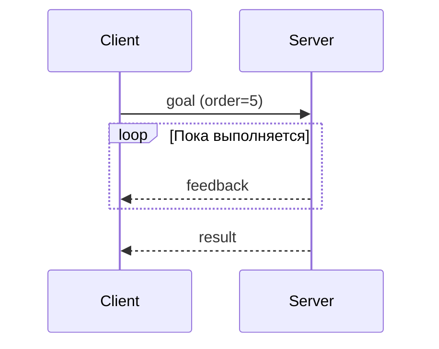

<style>
@import url('https://fonts.googleapis.com/css2?family=Inter:wght@300;400;600;700;800&family=Roboto+Mono:wght@400;600&display=swap');

:root {
  --primary: #1e40af;
  --primary-light: #2563eb;
  --accent: #3b82f6;
  --accent-light: #60a5fa;
  --green: #16a34a;
  --green-bg: #f0fdf4;
  --green-border: #86efac;
  --red: #dc2626;
  --red-bg: #fef2f2;
  --red-border: #fca5a5;
  --yellow: #d97706;
  --yellow-bg: #fffbeb;
  --yellow-border: #fcd34d;
  --gray-50: #f9fafb;
  --gray-100: #f3f4f6;
  --gray-200: #e5e7eb;
  --gray-300: #d1d5db;
  --gray-400: #9ca3af;
  --gray-500: #6b7280;
  --gray-600: #4b5563;
  --gray-700: #374151;
  --gray-800: #1f2937;
  --white: #ffffff;
  --card-bg: #f3f7ff;
  --card-border: #bfdbfe;
  --font: 'Inter', 'Segoe UI', system-ui, sans-serif;
  --mono: 'Roboto Mono', 'Consolas', monospace;
}

section {
  background: var(--white);
  color: var(--gray-800);
  font-family: var(--font);
  font-weight: 400;
  box-sizing: border-box;
  border-top: 8px solid var(--primary);
  position: relative;
  line-height: 1.6;
  font-size: 20px;
  padding: 48px 56px 52px;
}

section::after { font-size: 14px; color: var(--gray-400); }

h1, h2, h3, h4, h5, h6 { font-weight: 700; color: var(--primary); margin: 0; padding: 0; }

h1 { font-size: 50px; line-height: 1.15; letter-spacing: -0.02em; }

h2 {
  position: absolute; top: 34px; left: 56px; right: 56px;
  font-size: 32px; padding-bottom: 10px;
  border-bottom: 3px solid var(--accent);
}
h2 + * { margin-top: 94px; }

h3 { color: var(--primary-light); font-size: 22px; margin-top: 24px; margin-bottom: 8px; font-weight: 600; }
h4 { color: var(--primary); font-size: 18px; margin-top: 14px; margin-bottom: 6px; }

ul, ol { padding-left: 28px; }
li { margin-bottom: 7px; line-height: 1.6; font-size: 18px; }

strong { color: var(--primary); font-weight: 700; }
em { color: var(--green); font-style: normal; font-weight: 600; }

table { border-collapse: collapse; width: 100%; margin: 14px 0; font-size: 16px; }
th { background: var(--primary); color: var(--white); font-weight: 700; font-size: 15px; padding: 10px 14px; text-align: left; }
td { border: 1px solid var(--gray-300); padding: 9px 14px; }
tr:nth-child(even) td { background: var(--gray-50); }
td:first-child { font-weight: 600; }

code {
  background: #eef2ff; color: var(--primary); padding: 2px 7px;
  border-radius: 4px; font-family: var(--mono); font-size: 0.85em;
}

blockquote {
  border-left: 5px solid var(--accent); padding: 12px 20px;
  background: var(--card-bg); border-radius: 0 8px 8px 0;
  margin: 14px 0; font-size: 20px; color: var(--primary); font-weight: 500;
}

section.lead {
  display: flex; flex-direction: column; justify-content: center;
  background: linear-gradient(135deg, #ffffff 0%, #eff6ff 60%, #dbeafe 100%);
}
section.lead h1 { margin-bottom: 20px; font-size: 56px; }
section.lead p { font-size: 22px; color: var(--gray-700); font-weight: 400; }

section.section-break {
  display: flex; flex-direction: column; justify-content: center;
  background: linear-gradient(135deg, #1e3a8a 0%, #1e40af 50%, #2563eb 100%);
  color: var(--white); border-top: 8px solid #93c5fd;
}
section.section-break h1 { color: var(--white); font-size: 46px; }
section.section-break p { color: #bfdbfe; font-size: 20px; }

footer {
  font-size: 13px; color: var(--gray-400); position: absolute;
  left: 56px; right: 56px; bottom: 16px;
  display: flex; justify-content: space-between; align-items: center;
}

.badge {
  display: inline-block; padding: 3px 11px; border-radius: 20px;
  font-size: 13px; font-weight: 600; margin: 2px;
}
.badge-blue { background: #dbeafe; color: #1e40af; }
.badge-green { background: #dcfce7; color: #16a34a; }
.badge-yellow { background: #fef3c7; color: #92400e; }
.badge-red { background: #fee2e2; color: #dc2626; }

.callout {
  padding: 14px 20px; border-left: 5px solid var(--accent);
  border-radius: 0 8px 8px 0; margin: 12px 0; font-size: 17px;
  background: var(--card-bg);
}
.callout-green { background: var(--green-bg); border-left-color: var(--green); }
.callout-yellow { background: var(--yellow-bg); border-left-color: var(--yellow); }
.callout-red { background: var(--red-bg); border-left-color: var(--red); }

.two-col { display: flex; gap: 26px; margin-top: 6px; }
.two-col > div { flex: 1; }

.arch-node {
  padding: 10px 16px; border: 2px solid var(--accent); border-radius: 8px;
  text-align: center; font-weight: 700; font-size: 16px; color: var(--primary);
  background: var(--card-bg);
}
.arch-node-warn { background: var(--yellow-bg); border-color: var(--yellow); color: #92400e; }
.arch-node-danger { background: var(--red-bg); border-color: var(--red); color: #7f1d1d; }
.arch-node-gray { background: var(--gray-100); border-color: var(--gray-500); color: var(--gray-700); }

.l2-link { font-size: 14px; color: var(--primary-light); margin-top: 10px; }
.l3-link { font-size: 14px; color: var(--green); }
</style>

<!-- _class: lead -->
<!-- _paginate: false -->

# Action server и action client

Лекция • 40 минут (уровень 1)

<span class="badge badge-blue">Уровень 1: Лекция</span>
<span class="badge badge-green">Уровень 2: Практика</span>
<span class="badge badge-yellow">Уровень 3: Робот TIAGo</span>

---

<!-- _class: section-break -->

# Часть 1

Action: goal, feedback, result, cancel

---

## Что такое action

<div class="two-col">
<div>

- **Action** — длительная задача с прогрессом и отменой
- **Goal** — цель: что сделать
- **Feedback** — прогресс: как идёт
- **Result** — итог: чем закончилось
- **Cancel** — отмена задачи

</div>
<div>



</div>
</div>

<div class="callout" style="font-size:16px;">
  В отличие от service, client <strong>не блокируется</strong>: прогресс приходит асинхронно.
</div>

<div class="l2-link">Ур.2: <code>2_knowledge/actions.md</code></div>
<div class="l3-link">Ур.3: TIAgo — <code>/navigate_to_pose</code></div>

<!-- «Action — длительная задача: есть цель, прогресс, итог и отмена. Client свободен во время выполнения.» -->

---

## Аналогия: доставка пиццы

<div class="two-col">
<div>

- **Topic** — радио: вещает всем, без ответа
- **Service** — телефон: один на один, один ответ
- **Action** — заказ с отслеживанием статуса

</div>
<div>

```text
Goal:     "пицца Маргарита, адрес X"
Feedback: "выехал", "подъезжаю"
Result:   "доставлена"
Cancel:   "отмените заказ"
```

</div>
</div>

<div class="callout callout-yellow" style="font-size:16px;">
  Правило: поток — <strong>topic</strong>, короткий ответ — <strong>service</strong>, долгая задача с прогрессом — <strong>action</strong>.
</div>

<div class="l2-link">Ур.2: <code>2_knowledge/actions.md</code></div>
<div class="l3-link">Ур.3: навигация — заказ «доехать до точки»</div>

<!-- «Action похож на заказ доставки: цель, статус, итог и возможность отмены.» -->

---

## Action server

<div class="two-col">
<div>

- `ActionServer` + `execute_callback`
- Прогресс — `publish_feedback()`
- Отмена — `is_cancel_requested`
- Финал — `succeed()` / `canceled()` / `abort()`

</div>
<div>

```python
self._action_server = ActionServer(
    self, Fibonacci, 'fibonacci',
    self.execute_callback)

def execute_callback(self, goal_handle):
    ...
    goal_handle.publish_feedback(msg)
    if goal_handle.is_cancel_requested:
        goal_handle.canceled()
        return Fibonacci.Result(sequence=...)
    goal_handle.succeed()
    return Fibonacci.Result(sequence=...)
```

</div>
</div>

<div class="callout callout-green" style="font-size:16px;">
  Отмена во время долгой работы требует <strong>MultiThreadedExecutor</strong>.
</div>

<div class="l2-link">Ур.2: <code>2_practice/11_action.md</code></div>
<div class="l3-link">Ур.3: <code>navigate_to_pose</code> — тот же жизненный цикл</div>

<!-- «Server принимает goal и выполняет его в execute_callback: публикует прогресс, проверяет отмену, завершает succeed или canceled.» -->

---

## Action client

<div class="two-col">
<div>

- `ActionClient` + `wait_for_server()`
- Отправка — `send_goal_async()`
- Три события:
  - goal-response (принят/отклонён)
  - feedback (прогресс)
  - result (итог)

</div>
<div>

```python
self._action_client = ActionClient(
    self, Fibonacci, 'fibonacci')
self._action_client.wait_for_server()

goal_msg = Fibonacci.Goal()
goal_msg.order = 5
self._action_client.send_goal_async(
    goal_msg,
    feedback_callback=self.feedback_callback)
```

</div>
</div>

<div class="callout callout-yellow" style="font-size:16px;">
  Отмена из кода: <code>goal_handle.cancel_goal_async()</code>.
</div>

<div class="l2-link">Ур.2: <code>2_practice/11_action.md</code></div>
<div class="l3-link">Ур.3: тот же client у Nav2 и MoveIt2</div>

<!-- «Client отправляет goal через send_goal_async и обрабатывает три события: goal-response, feedback и result.» -->

---

## Тип action: три блока

| Компонент | Что это | Поля `Fibonacci` |
|---|---|---|
| `Goal` | что client отправляет | `order` (int32) |
| `Feedback` | прогресс для client | `sequence` (int32[]) |
| `Result` | итог для client | `sequence` (int32[]) |

```bash
ros2 interface show example_interfaces/action/Fibonacci
```

```text
int32 order
---
int32[] sequence
---
int32[] sequence
```

<div class="callout callout-red" style="font-size:16px;">
  Три блока разделены строкой <code>---</code>: goal сверху, feedback в середине, result снизу.
</div>

<div class="l2-link">Ур.2: <code>2_knowledge/actions.md</code></div>
<div class="l3-link">Ур.3: <code>nav2_msgs/action/NavigateToPose</code></div>

<!-- «Тип action — три блока: goal, feedback, result. Для навигации goal — точка, feedback — дистанция.» -->

---

## CLI: увидеть action со стороны

| Команда | Что показывает |
|---|---|
| `ros2 action list -t` | actions и их типы |
| `ros2 action info /fibonacci` | кто server/client, тип |
| `ros2 action send_goal ... --feedback` | отправить goal и видеть прогресс |

```bash
ros2 action send_goal /fibonacci \
  example_interfaces/action/Fibonacci "{order: 10}" --feedback
# поток feedback; Ctrl+C — отменить goal
```

<div class="callout callout-green" style="font-size:16px;">
  <code>ros2 action send_goal --feedback</code> — весь жизненный цикл action без кода.
</div>

<div class="l2-link">Ур.2: <code>2_practice/11_action.md</code></div>
<div class="l3-link">Ур.3: те же команды по actions TIAgo</div>

<!-- «ros2 action list/info/send_goal --feedback — читать и запускать action без написания Python.» -->

---

## Action, service или topic

| Критерий | Topic | Service | Action |
|---|---|---|---|
| Ответ | Нет | Один ответ | Прогресс + итог |
| Длительность | Непрерывно | Мгновенно | Секунды/минуты |
| Отмена | Нет | Нет | Есть |
| Пример | `/scan`, `/cmd_vel` | `/emergency_stop` | `/navigate_to_pose` |

<div class="callout callout-yellow" style="font-size:16px;">
  Поток — <strong>topic</strong>. Ответ на запрос — <strong>service</strong>. Долгая задача с прогрессом и отменой — <strong>action</strong>.
</div>

<div class="l2-link">Ур.2: <code>2_knowledge/actions.md</code></div>
<div class="l3-link">Ур.3: движение — topic, остановка — service, навигация — action</div>

<!-- «Правило: непрерывный поток — topic, ответ на запрос — service, длительная задача с отменой — action.» -->

---

<!-- _class: section-break -->

# Часть 2

Кейс робота TIAgo

---

## Actions TIAgo: навигация и манипуляция

| Action | Тип | Feedback |
|---|---|---|
| `/navigate_to_pose` | `nav2_msgs/action/NavigateToPose` | Оставшееся расстояние |
| `/follow_path` | `nav2_msgs/action/FollowPath` | Текущая точка пути |
| MoveIt2 planning | `moveit_msgs` | Прогресс траектории |

```bash
ros2 action list -t
ros2 action info /navigate_to_pose
```

<div class="callout" style="font-size:16px;">
  Nav2 и MoveIt2 построены вокруг actions — без них навигация и манипуляция невозможны.
</div>

<div class="l2-link">Ур.2: <code>2_knowledge/actions.md</code></div>
<div class="l3-link">Ур.3: <code>3_Robot/TIAgo_humble/docs/navigation.md</code></div>

<!-- «В TIAgo action — ядро: навигация и манипуляция — это длительные задачи с прогрессом и отменой.» -->

---

## Смелый тест: goal в `/navigate_to_pose`

```bash
ros2 action send_goal /navigate_to_pose \
  nav2_msgs/action/NavigateToPose \
  "{pose: {header: {frame_id: 'map'}, pose: {position: {x: 1.0, y: 0.0, z: 0.0}, orientation: {w: 1.0}}}}" \
  --feedback
```

<div class="callout callout-yellow" style="font-size:16px;">
  Поток feedback (оставшаяся дистанция), робот едет к цели. Только в симуляции!
</div>

<div class="callout callout-red" style="font-size:16px;">
  Goal отклонён? Нет карты или не указан 2D Pose Estimate в RViz.
</div>

<div class="l2-link">Ур.2: <code>2_practice/11_action.md</code></div>
<div class="l3-link">Ур.3: тест в контейнере TIAgo</div>

<!-- «Отправляем goal — точку на карте. Робот едет и публикует оставшееся расстояние как feedback.» -->

---

## Смелый тест: отмена goal

```bash
# продолжение предыдущего goal
# нажать Ctrl+C → goal отменён
```

<div class="callout callout-green" style="font-size:16px;">
  Робот <strong>останавливается</strong>: cancel goal — это отмена действия, а не аварийный стоп.
</div>

<div class="callout callout-yellow" style="font-size:16px;">
  Только в симуляции. Сравните с E-stop (service) из занятия 10.
</div>

<div class="l2-link">Ур.2: <code>2_practice/11_action.md</code></div>
<div class="l3-link">Ур.3: отмена — часть жизненного цикла action</div>

<!-- «Отмена goal останавливает задачу: робот прекращает движение. Это и есть cancel в действии.» -->

---

## Итог: goal, feedback, result, cancel

<div style="display:flex; gap:6px; align-items:center; margin-top:10px;">
  <div class="arch-node" style="font-size:13px;">ActionClient</div>
  <div style="color:var(--accent); font-size:18px;">→</div>
  <div class="arch-node arch-node-warn" style="font-size:13px;">goal</div>
  <div style="color:var(--accent); font-size:18px;">→</div>
  <div class="arch-node arch-node-danger" style="font-size:13px;">ActionServer</div>
  <div style="color:var(--accent); font-size:18px;">→</div>
  <div class="arch-node arch-node-gray" style="font-size:13px;">feedback + result</div>
</div>

<div class="callout callout-green" style="font-size:16px; margin-top:12px;">
  Следующее занятие 12 — <strong>зачёт 1</strong>: три механизма связи (topic, service, action) проверяются вместе.
</div>

<div class="l2-link">Ур.2: <code>2_practice/11_action.md</code> · <code>2_homework/hw_11_action.md</code></div>
<div class="l3-link">Ур.3: тот же принцип в <code>3_Robot/TIAgo_humble/</code></div>

<!-- «Фундамент: client → goal → server → feedback/result, с отменой. Дома — action в модели робота, дальше — зачёт 1.» -->

---

<!-- _class: lead -->

# Вопросы?

<span class="badge badge-blue">`2_knowledge/actions.md`</span>
<span class="badge badge-green">`2_practice/11_action.md`</span>
<span class="badge badge-yellow">`3_Robot/TIAgo_humble/`</span>

**Домашнее задание:** `2_homework/hw_11_action.md`
**Зачёт 1:** `1_lecture/exam_01.md`
