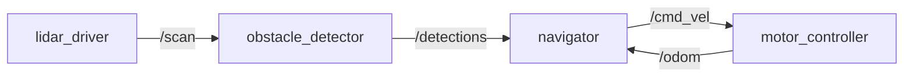

# Домашнее задание 6: архитектура своей модели — перечень узлов и интерфейсов

## Цель

Зафиксировать идею собственной модели робота как системы узлов: перечислить подсистемы, для каждой — узлы и их интерфейсы (кто что публикует и на что подписывается), выбрать `ROS_DOMAIN_ID` для изоляции.

## Связь с темой занятия

Занятие 6 показало, что робот — это набор узлов, которые обмениваются сообщениями через middleware, и что `ROS_DOMAIN_ID` изолирует группы узлов. Дома студент применяет это к своей модели: превращает список сенсоров из [`hw_05_sensors.md`](hw_05_sensors.md) в узлы с интерфейсами.

## Предварительные требования

- Идея робота и папка `~/my_robot/` из [`hw_02_setup.md`](hw_02_setup.md).
- Набросок модели (платформа + колёса) из [`hw_04_robotcad.md`](hw_04_robotcad.md).
- Список сенсоров из [`hw_05_sensors.md`](hw_05_sensors.md).
- Дневник `~/my_robot/diary.md` из [`hw_03_opencode.md`](hw_03_opencode.md).
- Статья [`../2_knowledge/ros_architecture.md`](../2_knowledge/ros_architecture.md) и [`../2_knowledge/subsystem.md`](../2_knowledge/subsystem.md).
- Выполняется дома в devcontainer (ROS2 Jazzy, уровень 2); ROS2 не устанавливается на хост.

## Шаг к виртуальной модели робота

Это шаг от «корпуса с сенсорами» к «программе робота»: студент впервые описывает модель как **распределённую систему узлов**. Эти узлы в занятиях 7–9 превратятся в реальные пакеты и исполняемые программы. Сейчас важно зафиксировать **кто с кем общается и через какие данные**.

## Шаги

### Шаг 1. Сформулировать идею модели одной фразой

В дневнике `~/my_robot/diary.md` запишите, что делает ваш робот:

```markdown
## Идея модели

Мой робот — <одна фраза: что делает и в какой среде>.
Например: «домашний курьер, который объезжает препятствия и привозит предметы в указанную точку».
```

### Шаг 2. Разделить робота на подсистемы

Выберите подсистемы из курса (не обязательно все): Mobile Base, Navigation, Manipulation, Perception, Safety, LLM Bridge, Simulation. Запишите, какие из них будут в вашей модели и зачем.

```markdown
## Подсистемы модели

- Mobile Base — двигать колёса по команде скорости.
- Perception — читать лидар и камеру, находить препятствия.
- (Manipulation — позже, если у робота будет рука.)
```

### Шаг 3. Перечислить узлы и их интерфейсы

Для каждой подсистемы перечислите узлы. Для каждого узла укажите: что публикует (`pub`) и на что подписывается (`sub`). Используйте имена тем и типы данных, как в курсе (`/cmd_vel` — `Twist`, `/scan` — `LaserScan`).

```markdown
## Узлы и интерфейсы

| Узел | Подсистема | Публикует (topic) | Подписывается (topic) |
| --- | --- | --- | --- |
| lidar_driver | Perception | /scan (sensor_msgs/LaserScan) | — |
| camera_driver | Perception | /camera/image_raw (sensor_msgs/Image) | — |
| obstacle_detector | Perception | /detections | /scan |
| motor_controller | Mobile Base | /odom (nav_msgs/Odometry) | /cmd_vel (geometry_msgs/Twist) |
| navigator | Navigation | /cmd_vel | /scan, /odom |
```

Если узел ещё не написан — это нормально: сейчас описывается архитектура, а не код.

### Шаг 4. Нарисовать ROS Graph

Нарисуйте граф связей в виде Mermaid-диаграммы в дневнике:



Проверьте: у каждой темы есть и publisher, и subscriber; нет «висящих» узлов без связей.

### Шаг 5. Выбрать `ROS_DOMAIN_ID`

Выберите домен для своей модели (число 0–101) и обоснуйте выбор. Запишите, почему в учебном классе важно не совпасть с другими студентами:

```markdown
## Домен

ROS_DOMAIN_ID=42  — чтобы мои узлы не мешали узлам других студентов в общей сети.
```

## Ожидаемый результат

- В `~/my_robot/diary.md` есть разделы «Идея модели», «Подсистемы модели», «Узлы и интерфейсы», «Домен».
- Перечислены минимум 3 узла, для каждого указаны темы публикации и подписки.
- Нарисован граф связей (Mermaid).
- Выбран `ROS_DOMAIN_ID` с обоснованием.

## Вопросы для самопроверки

1. Почему узел `motor_controller` подписывается на `/cmd_vel`, а не публикует его?
2. Что произойдёт, если у двух узлов одинаковое имя и обе публикуют в `/cmd_vel`?
3. Зачем нужен `ROS_DOMAIN_ID`, если мой робот один?
4. Какой тип данных подходит для `/scan` и почему не `String`?

## Критерии оценки

Задание выполнено, если:

- идея модели сформулирована одной фразой;
- перечислены подсистемы (минимум 2);
- перечислены минимум 3 узла с интерфейсами pub/sub;
- нарисован граф связей;
- выбран `ROS_DOMAIN_ID` с обоснованием;
- записи занесены в `~/my_robot/diary.md`.

## Типичные ошибки

| Симптом | Причина | Исправление |
| --- | --- | --- |
| Тема без publisher или subscriber | Узел описан, но не указано, откуда/куда идут данные | У каждой темы должен быть и отправитель, и получатель |
| Узел «делает всё» | Не разделил задачи по узлам | Один узел — одна задача |
| Неверный тип данных | `/scan` описан как `String` | Сопоставить: лидар → `LaserScan`, скорость → `Twist` |
| Домен выбран «наугад» | Не подумал про общую сеть класса | Обосновать выбор: изоляция от чужих узлов |
| Путают узел и подсистему | Узел назван именем подсистемы | Подсистема — группа узлов, узел — одна программа |

## Ссылки

- Статья базы знаний — [`../2_knowledge/ros_architecture.md`](../2_knowledge/ros_architecture.md).
- Подсистемы — [`../2_knowledge/subsystem.md`](../2_knowledge/subsystem.md).
- Домены и несколько роботов — [`../2_knowledge/robots_communication.md`](../2_knowledge/robots_communication.md).
- Практика занятия — [`../2_practice/06_ros_architecture.md`](../2_practice/06_ros_architecture.md).
- Следующее занятие 7 «Workspace, package и сборка» — [`../1_lecture/lectures_content.md`](../1_lecture/lectures_content.md), тема 7: узлы станут пакетами и программами.
