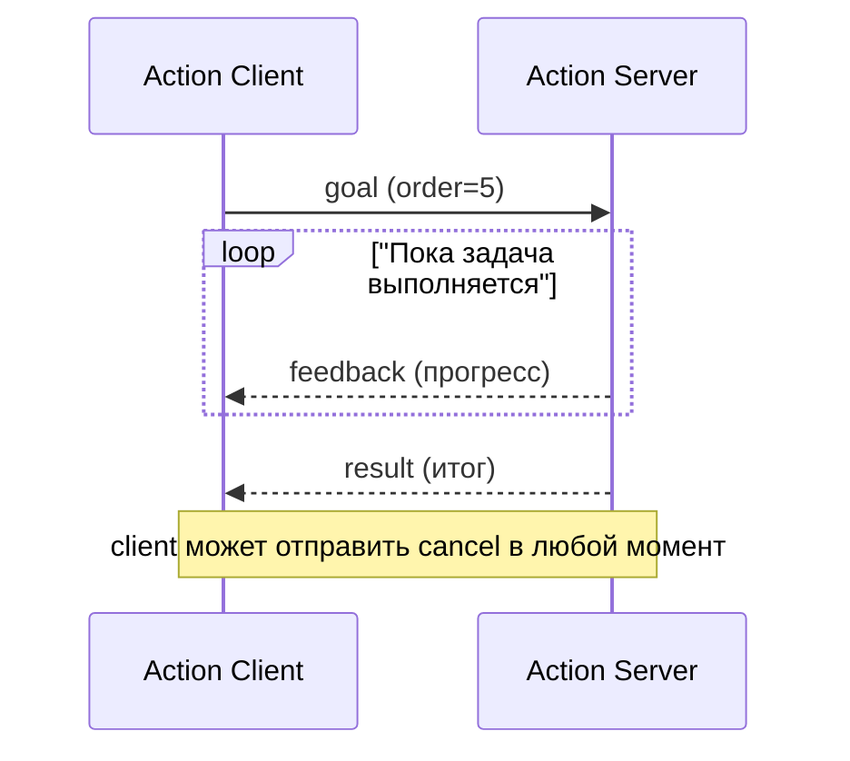

# Action — длительная задача в ROS2

## Коротко

Action — механизм для длительной задачи, у которой есть цель (goal), прогресс (feedback), итог (result) и возможность отмены (cancel). В отличие от service, action не блокирует client на время выполнения.

> Официальное определение: «Actions — это форма клиент-серверного общения в графе ROS2, предназначенная для длительных задач.» — [About actions](https://docs.ros.org/en/jazzy/Concepts/Basic/About-Actions.html)

## Что это

Action — задача, которая длится секунды или минуты. У неё четыре элемента:

- **Goal** — цель: что нужно сделать. Например, `navigate_to_pose` с координатами точки.
- **Feedback** — прогресс: промежуточные сообщения о ходе задачи. Например, «осталось 2 метра».
- **Result** — итог: финальный ответ. Например, «достиг цели» или «не удалось».
- **Cancel** — отмена: client просит server прекратить выполнение.

Два участника:

- **Action server** — узел, который принимает goal, выполняет задачу, публикует feedback и возвращает result.
- **Action client** — узел, который отправляет goal, читает feedback, может отменить задачу и получает result.

## Зачем нужно

Есть задачи, которые длятся долго:

- **Навигация** — доехать до точки на карте (5–30 секунд), сообщать оставшееся расстояние.
- **Манипуляция** — поднять предмет (3–10 секунд), сообщать прогресс траектории.
- **Зарядка** — доехать до станции и подключиться (30–60 секунд).

Topic не подходит — у него нет ответа и нет понятия «задача завершена». Service не подходит — client ждёт ответа всё время выполнения и не получает прогресса. Action решает обе проблемы: client свободен, прогресс приходит асинхронно, задачу можно отменить.

## Аналогия

Action — **доставка пиццы**:

- Вы делаете заказ — **goal** («пицца Маргарита, адрес X»).
- Курьер сообщает: «выехал», «подъезжаю» — **feedback**.
- Пицца доставлена — **result** (успех).
- Вы можете отменить заказ — **cancel**.

## Как работает в ROS2

### Action server

Сервер регистрирует action и callback, который выполняет goal.

```python
from rclpy.action import ActionServer
from example_interfaces.action import Fibonacci

self._action_server = ActionServer(
    self, Fibonacci, 'fibonacci', self.execute_callback)
```

Внутри `execute_callback` сервер:

| Метод goal_handle | Что делает |
| --- | --- |
| `publish_feedback(...)` | Отправляет клиенту прогресс |
| `is_cancel_requested` | Проверяет, попросил ли client отмену |
| `canceled()` | Подтверждает отмену цели |
| `succeed()` | Подтверждает успешное завершение |
| `abort()` | Сообщает, что задача провалилась |

### Action client

Клиент создаёт client для того же имени и типа, ждёт готовности сервера и отправляет goal.

```python
from rclpy.action import ActionClient
from example_interfaces.action import Fibonacci

self._action_client = ActionClient(self, Fibonacci, 'fibonacci')
self._action_client.wait_for_server()

goal_msg = Fibonacci.Goal()
goal_msg.order = 5
self._action_client.send_goal_async(
    goal_msg, feedback_callback=self.feedback_callback)
```

Три callback клиента:

| Callback | Когда вызывается |
| --- | --- |
| `feedback_callback` | При каждом feedback от server |
| `goal_response_callback` | Когда server принял или отклонил goal |
| `result_callback` | Когда server завершил задачу |

> Терминология: `send_goal` в rclpy называется `send_goal_async()` (отправляет goal и возвращает Future). Команда CLI называется `ros2 action send_goal`.

### Как action устроен внутри

Снаружи action — единый механизм. Внутри это комбинация **двух топиков** (feedback и status) и **трёх сервисов** (send_goal, get_result, cancel_goal), построенных поверх тех же topic и service.

| Часть | Тип | Назначение |
| --- | --- | --- |
| `.../_action/feedback` (topic) | `ActionFeedback` | Сервер публикует прогресс |
| `.../_action/status` (topic) | `GoalStatusArray` | Сервер публикует статус цели |
| `.../_action/send_goal` (service) | `SendGoal` | Client отправляет цель |
| `.../_action/get_result` (service) | `GetResult` | Client запрашивает результат |
| `.../_action/cancel_goal` (service) | `CancelGoal` | Client запрашивает отмену |

**Preemption** (вытеснение цели) — когда новая goal приходит во время выполнения старой, server может принять новую и отменить старую.

### Action, service или topic

| Критерий | Topic | Service | Action |
| --- | --- | --- | --- |
| Связь | Многие ко многим | Один к одному | Один к одному |
| Ответ | Нет | Один ответ | Прогресс + итог |
| Длительность | Непрерывно | Мгновенно (< 1 сек) | Секунды/минуты |
| Отмена | Нет | Нет | Есть |
| Пример | `/scan`, `/cmd_vel` | `/emergency_stop` | `/navigate_to_pose` |

Правило выбора:

1. Данные идут потоком и получателей много — **Topic**.
2. Нужен короткий запрос-ответ — **Service**.
3. Задача длится долго, нужен прогресс и отмена — **Action**.

## Схема



## Команды

```bash
# список всех actions
ros2 action list
ros2 action list -t

# информация об action (кто server, тип)
ros2 action info /fibonacci

# отправить goal из CLI и видеть feedback
ros2 action send_goal /fibonacci example_interfaces/action/Fibonacci "{order: 5}" --feedback
# Ctrl+C — отменить goal
```

## Код

Полный рабочий пример — в практике [11_action.md](../2_practice/11_action.md). Здесь — минимальные фрагменты.

Action server (задача с прогрессом и отменой):

```python
import time
import rclpy
from rclpy.action import ActionServer
from rclpy.executors import MultiThreadedExecutor
from rclpy.node import Node
from example_interfaces.action import Fibonacci


class FibonacciActionServer(Node):

    def __init__(self):
        super().__init__('fibonacci_action_server')
        self._action_server = ActionServer(
            self, Fibonacci, 'fibonacci', self.execute_callback)

    def execute_callback(self, goal_handle):
        feedback_msg = Fibonacci.Feedback()
        feedback_msg.sequence = [0, 1]

        for i in range(1, goal_handle.request.order):
            if goal_handle.is_cancel_requested:
                goal_handle.canceled()
                return Fibonacci.Result(sequence=feedback_msg.sequence)
            feedback_msg.sequence.append(
                feedback_msg.sequence[i] + feedback_msg.sequence[i - 1])
            goal_handle.publish_feedback(feedback_msg)
            time.sleep(1.0)

        goal_handle.succeed()
        return Fibonacci.Result(sequence=feedback_msg.sequence)


def main(args=None):
    rclpy.init(args=args)
    node = FibonacciActionServer()
    try:
        rclpy.spin(node, executor=MultiThreadedExecutor())
    except KeyboardInterrupt:
        pass
    finally:
        node.destroy_node()
        rclpy.shutdown()
```

> `MultiThreadedExecutor` нужен, чтобы server мог обрабатывать cancel во время `time.sleep` внутри `execute_callback`.

Action client:

```python
import rclpy
from rclpy.action import ActionClient
from rclpy.node import Node
from example_interfaces.action import Fibonacci


class FibonacciActionClient(Node):

    def __init__(self):
        super().__init__('fibonacci_action_client')
        self._action_client = ActionClient(self, Fibonacci, 'fibonacci')

    def send_goal(self, order):
        goal_msg = Fibonacci.Goal()
        goal_msg.order = order
        self._action_client.wait_for_server()
        self._send_goal_future = self._action_client.send_goal_async(
            goal_msg, feedback_callback=self.feedback_callback)
        self._send_goal_future.add_done_callback(self.goal_response_callback)

    def goal_response_callback(self, future):
        goal_handle = future.result()
        if not goal_handle.accepted:
            self.get_logger().info('Goal rejected')
            return
        self.get_logger().info('Goal accepted')
        goal_handle.get_result_async().add_done_callback(self.result_callback)

    def feedback_callback(self, feedback_msg):
        self.get_logger().info(f'Feedback: {feedback_msg.feedback.sequence}')

    def result_callback(self, future):
        self.get_logger().info(f'Result: {future.result().result.sequence}')
        rclpy.shutdown()
```

## Ожидаемый результат

Запустите server в одном терминале, client в другом:

```bash
ros2 run my_action_pkg fibonacci_action_server
# [INFO] [fibonacci_action_server]: Feedback: [0, 1, 1]
# [INFO] [fibonacci_action_server]: Feedback: [0, 1, 1, 2]
```

```bash
ros2 run my_action_pkg fibonacci_action_client
# [INFO] [fibonacci_action_client]: Goal accepted
# [INFO] [fibonacci_action_client]: Feedback: [0, 1, 1]
# ...
# [INFO] [fibonacci_action_client]: Result: [0, 1, 1, 2, 3, ...]
```

## Action в роботе

В TIAgo actions — ядро навигации и манипуляции:

| Action | Тип | Feedback |
| --- | --- | --- |
| `/navigate_to_pose` | `nav2_msgs/action/NavigateToPose` | Оставшееся расстояние |
| `/follow_path` | `nav2_msgs/action/FollowPath` | Текущая точка пути |
| MoveIt2 planning | `moveit_msgs` | Прогресс траектории |

Nav2 и MoveIt2 построены вокруг actions. Подробнее — [`../3_Robot/TIAgo_humble/docs/navigation.md`](../../3_Robot/TIAgo_humble/docs/navigation.md).

## Типичные ошибки

| Ошибка | Симптом | Исправление |
| --- | --- | --- |
| Server не публикует feedback | Client не видит прогресс | `goal_handle.publish_feedback(...)` в цикле |
| Cancel не обрабатывается | Client отправил cancel, server продолжает | Проверять `goal_handle.is_cancel_requested` в цикле |
| Server не вызывает `succeed()` | Client вечно ждёт result | Вызвать `succeed()`, `abort()` или `canceled()` |
| Обычный `spin()` вместо `MultiThreadedExecutor` | Cancel не срабатывает во время `time.sleep` | `rclpy.spin(node, executor=MultiThreadedExecutor())` |
| Client не ждёт server | Goal не отправляется | `wait_for_server()` перед `send_goal_async()` |
| Забыт `feedback_callback` | Goal выполняется, но прогресс не виден | Передать `feedback_callback` в `send_goal_async()` |

## Связанные темы

- [Topics](topics.md) — потоковая передача данных.
- [Services](services.md) — короткий запрос-ответ.
- [Nodes](nodes.md) — устройство узла.
- [Nav2 bridge](nav2_bridge.md) — как `/navigate_to_pose` использует action.
- [MoveIt2 bridge](moveit2_bridge.md) — как MoveIt2 использует action.
- Практика занятия 11 — [../2_practice/11_action.md](../2_practice/11_action.md).
- Домашнее задание 11 — [../2_homework/hw_11_action.md](../2_homework/hw_11_action.md).

## Источники

- [Understanding actions](https://docs.ros.org/en/jazzy/Tutorials/Beginner-CLI-Tools/Understanding-ROS2-Actions/Understanding-ROS2-Actions.html)
- [Writing an action server and client (Python)](https://docs.ros.org/en/jazzy/Tutorials/Intermediate/Writing-an-Action-Server-Client/Py.html)
- [About actions](https://docs.ros.org/en/jazzy/Concepts/Basic/About-Actions.html)
- [Navigation2 — NavigateToPose action](https://docs.nav2.org/commander_server/index.html)
