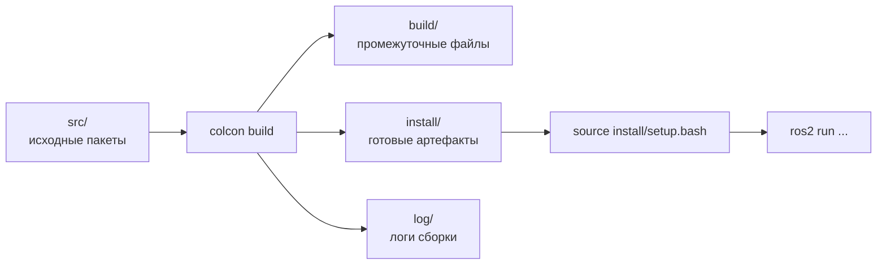

# colcon — сборщик ROS2-проекта

## Коротко

`colcon` (collective construction) — инструмент, который собирает все пакеты workspace одной командой. Он сам определяет порядок по зависимостям, компилирует C++, устанавливает Python и раскладывает результаты по `build/`, `install/`, `log/`.

> *Официальное определение*: «colcon — это мета-инструмент сборки, который упорядочивает пакеты по топологическому порядку зависимостей и собирает (или тестирует) их в правильной последовательности.» — [Using colcon](https://docs.ros.org/en/jazzy/Tutorials/Beginner-Client-Libraries/Colcon-Tutorial.html)

## Что это

`colcon` обходит все пакеты в `src/`, проверяет зависимости, компилирует C++-пакеты, устанавливает Python-пакеты и раскладывает результаты по `build/`, `install/`, `log/`.

## Зачем нужно

В проекте могут быть десятки пакетов. Без `colcon` пришлось бы вручную собирать каждый, следить за порядком (зависимости!) и раскладывать результаты. `colcon` делает это автоматически.

## Аналогия

`colcon` — **конвейер на заводе**: подаёте детали (`src/`), конвейер собирает (`build/`), на выходе готовые изделия (`install/`), а все операции записываются в журнал (`log/`).

## Схема сборки



## Основные команды

```bash
# Базовая сборка всего workspace
colcon build

# Сборка конкретного пакета (быстрее)
colcon build --packages-select my_pkg

# Сборка пакета и всех его зависимостей
colcon build --packages-up-to my_pkg

# Сборка пакетов, которые зависят от указанного
colcon build --packages-above my_pkg

# Сборка с символьными ссылками (изменения Python-кода видны без пересборки)
colcon build --symlink-install

# Продолжить сборку, даже если один пакет упал
colcon build --continue-on-error

# Выводить лог сборки сразу в терминал
colcon build --event-handlers console_direct+
```

### Прочие команды

```bash
colcon list            # список пакетов workspace
colcon list --names-only
colcon graph           # граф зависимостей пакетов
colcon test            # запустить тесты пакетов
```

## source install/setup.bash

После `colcon build` пакеты **установлены**, но **не видны** ROS2. Нужно активировать workspace:

```bash
source ~/ros2_ws/install/setup.bash
```

Эта команда добавляет пути к установленным пакетам в переменные окружения:

- `PATH` — чтобы работал `ros2 run`;
- `PYTHONPATH` — чтобы работал `import`;
- `AMENT_PREFIX_PATH` — чтобы `ros2 pkg list` видел пакеты.

Правило: **собрал — подключи**. Новый терминал не помнит про подключение, поэтому `source` нужно выполнять в каждом новом терминале (или добавить в `~/.bashrc`).

## Повторная сборка и чистка

При изменении кода достаточно пересобрать:

```bash
colcon build
```

Если изменения Python-кода не применяются — используйте `--symlink-install`, чтобы `install/` ссылался на `src/` и код подхватывался без пересборки:

```bash
colcon build --symlink-install
```

Если сборка падает с непонятной ошибкой — очистите и соберите заново:

```bash
rm -rf build/ install/ log/
colcon build
```

## Ожидаемый результат

Успешная сборка заканчивается сводкой `Summary: N packages finished`. В корне workspace появляются `build/`, `install/`, `log/`, а после `source install/setup.bash` ваш пакет виден в `ros2 pkg list`.

## Типичные ошибки

| Ошибка | Симптом | Исправление |
| --- | --- | --- |
| `colcon build` не из корня workspace | «no packages found» | `cd ~/ros2_ws && colcon build` |
| Забыли `source setup.bash` | `ros2 run` не находит пакет | `source ~/ros2_ws/install/setup.bash` |
| Ошибка в `setup.py` | Сборка падает | Проверить синтаксис `setup.py`, особенно `entry_points` |
| Пакет не в `src/` | `colcon build` не видит пакет | Переместить папку пакета в `~/ros2_ws/src/` |
| Зависимость не объявлена | `ImportError` при запуске | Добавить `<depend>` в `package.xml` и пересобрать |
| Старая версия кода в `install/` | Изменения кода не применяются | Пересобрать или использовать `--symlink-install` |

## Советы

- Для разработки на Python используйте `--symlink-install` — изменения кода в `src/` сразу видны без пересборки.
- Пересборка одного пакета быстрее полной: `colcon build --packages-select my_pkg`.
- Пакет и его зависимости: `colcon build --packages-up-to my_pkg`.

## Пример в реальном роботе

Workspace TIAgo (`ros2_ws/`) собирается одной командой `colcon build` в контейнере. При отладке одного пакета (например, `tiago_description`) пересобирают только его: `colcon build --packages-select tiago_description`. Подробнее — [`3_Robot/TIAgo_humble/docs/tiago_architecture.md`](../../3_Robot/TIAgo_humble/docs/tiago_architecture.md).

## Связанные темы

- [Workspace и окружение](workspace.md) — создание workspace
- [Пакеты](packages.md) — устройство пакета
- [Nodes](nodes.md) — код узла в пакете
- Практика 7 — [`../2_practice/07_workspace.md`](../2_practice/07_workspace.md)
- Домашнее задание 7 — [`../2_homework/hw_07_workspace.md`](../2_homework/hw_07_workspace.md)

## Источники

- [Using colcon](https://docs.ros.org/en/jazzy/Tutorials/Beginner-Client-Libraries/Colcon-Tutorial.html)
- [colcon documentation](https://colcon.readthedocs.io/)
