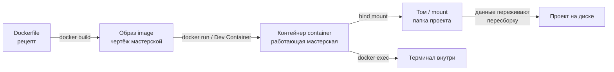

# Docker и Dev Container

## Коротко

Контейнер — переносная мастерская с ROS2 и всеми зависимостями. Образ — её чертёж, том — шкаф с данными, которые переживают пересборку. Dev Container открывает проект внутри такой мастерской одной командой, поэтому ROS2 не ставится на хост.

## Что это

- Образ (image) — неизменяемый шаблон: операционная система и программы уже упакованы.
- Контейнер (container) — запущенный экземпляр образа, изолированный процесс со своей файловой системой.
- Том (volume) — отдельное хранилище данных, которое не удаляется при пересоздании контейнера.
- Dockerfile — текстовый рецепт, по которому Docker собирает образ.
- `devcontainer.json` — описание окружения, по которому VS Code открывает проект внутри контейнера. Это и есть Dev Container.

## Зачем нужно

Проблема «у меня работает, у тебя нет» возникает из-за разных версий ОС, библиотек и инструментов. Контейнер решает её: все студенты запускают один и тот же образ, поэтому окружение одинаковое в классе и дома.

Для робототехники это критично: ROS2, Gazebo, Nav2 и MoveIt2 тянут десятки зависимостей, которые конфликтуют с другими программами и разными версиями. Держать всё это на хост-системе — значит ломать её при каждом обновлении.

## Аналогия

Контейнер — переносная мастерская с полным набором инструментов. Образ — чертёж мастерской: по нему можно построить сколько угодно одинаковых копий. Том — шкаф в мастерской: инструменты в нём обновляются, а ваши материалы лежат отдельно и не пропадают, когда мастерскую перестраивают.

## Как работает

1. Вы пишете Dockerfile — рецепт с базовым образом и командами установки.
2. `docker build` собирает образ (image) — неизменяемый слой с результатом всех команд.
3. `docker run` запускает контейнер — изолированный процесс из образа.
4. Папка проекта подключается к контейнеру через mount (том) — правки на хосте сразу видны внутри, и наоборот.
5. Dev Container автоматизирует шаги 3–4: VS Code читает `devcontainer.json`, собирает образ, запускает контейнер и открывает в нём терминал.

Файлы, созданные в контейнере вне смонтированных папок, пропадают при удалении контейнера. Поэтому весь код проекта держат в смонтированной папке (workspace), а не внутри контейнера.

## Схема



## Команды

```bash
docker --version                  # проверить, что Docker установлен
docker pull ubuntu:24.04          # скачать образ
docker run -it --rm ubuntu:24.04 bash   # запустить контейнер и войти в bash
docker ps                         # список запущенных контейнеров
docker ps -a                      # все контейнеры, включая остановленные
docker exec -it <имя> bash        # войти в уже запущенный контейнер
docker stop <имя>                 # остановить контейнер
docker images                     # список локальных образов
docker volume ls                  # список томов
```

Флаг `-it` — интерактивный терминал, `--rm` — удалить контейнер после выхода.

## Код

Минимальный Dockerfile для ROS2 Jazzy:

```dockerfile
FROM osrf/ros:jazzy-desktop

RUN apt-get update && apt-get install -y --no-install-recommends \
    git python3-pip \
    && rm -rf /var/lib/apt/lists/*

RUN echo "source /opt/ros/jazzy/setup.bash" >> ~/.bashrc
```

Минимальный `devcontainer.json`:

```json
{
  "name": "ROS2 Jazzy Course",
  "build": { "dockerfile": "Dockerfile" },
  "workspaceMount": "source=${localWorkspaceFolder},target=/workspaces/${localWorkspaceFolderBasename},type=bind",
  "workspaceFolder": "/workspaces/${localWorkspaceFolderBasename}",
  "remoteUser": "ubuntu"
}
```

Как это устроено в курсе:

- `.devcontainer/Dockerfile` (уровень 2) — на базе `osrf/ros:jazzy-desktop`, ставит `git`, `sudo`, `colcon`, `rosdep` и создаёт пользователя `ubuntu`.
- `.devcontainer/devcontainer.json` (уровень 2) — монтирует папку проекта в `/workspaces/`, задаёт `remoteUser: ubuntu`, выводит GUI через виртуальный дисплей VNC/браузер (Вариант 1, `start_gui.sh`) и ставит расширения VS Code.
- `3_Robot/TIAgo_humble/.devcontainer/` (уровень 3) — отдельный, более тяжёлый контейнер: образ собирается из `Dockerfile` (с `--network=host`), `postCreateCommand` клонирует пакеты TIAGo через `vcs import`, ставит зависимости и собирает workspace через `colcon build`. GUI выводится через виртуальный дисплей (Вариант 1, `start_gui.sh`).

## Ожидаемый результат

- `docker --version` выводит версию Docker.
- `docker run -it --rm ubuntu:24.04 bash` открывает терминал внутри контейнера Ubuntu.
- После «Dev Containers: Reopen in Container» проект открывается внутри контейнера, и `ros2 --help` работает.
- Правка файла в workspace видна и на хосте, и внутри контейнера.

## Типичные ошибки

| Симптом | Причина | Исправление |
| --- | --- | --- |
| Изменили Dockerfile, а в контейнере всё по-старому | Контейнер не пересобран | «Dev Containers: Rebuild Container» |
| Файлы, созданные внутри контейнера, пропали | Созданы вне смонтированной папки | Работайте в workspace (`/workspaces/...`) |
| `docker: command not found` в WSL | Docker Desktop не настроен на WSL2 | Включить WSL2-интеграцию в Docker Desktop |
| Нет GUI (rviz2/Gazebo) | Не запущен `start_gui.sh` или не настроен вывод GUI | См. `3_Robot/TIAgo_humble/README.md`, раздел «Работа с GUI» |
| `docker ps` пуст внутри контейнера | Docker-демон на хосте, а не внутри | Запускать `docker ps` на хосте, а не в контейнере |

## Связанные темы

- Git и версионирование — [`git.md`](git.md).
- Настройка окружения дома — [`home_setup.md`](home_setup.md).
- Практика занятия — [`../2_practice/02_container_git.md`](../2_practice/02_container_git.md).
- Домашнее задание — [`../2_homework/hw_02_setup.md`](../2_homework/hw_02_setup.md).
- Занятие 2 в спецификации курса — [`../1_lecture/lectures_content.md`](../1_lecture/lectures_content.md), тема 2.

## Источники

- [Docker overview](https://docs.docker.com/get-started/) — образ, контейнер, основные команды.
- [Dockerfile reference](https://docs.docker.com/reference/dockerfile/) — инструкции Dockerfile.
- [Docker volumes](https://docs.docker.com/storage/volumes/) — тома и хранение данных.
- [Developing inside a Container](https://code.visualstudio.com/docs/devcontainers/containers) — Dev Containers в VS Code.
- [Dev Container spec](https://containers.dev/) — спецификация `devcontainer.json`.
