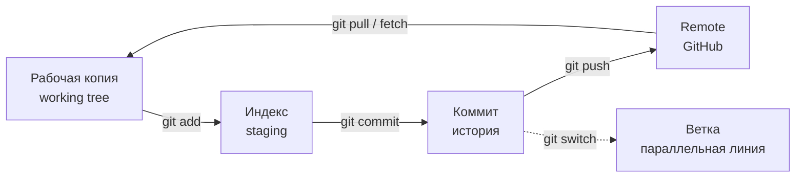

# Git и версионирование

## Коротко

Git записывает историю изменений кода, чтобы можно было вернуться к любой версии и синхронизировать работу с репозиторием. Локальный цикл — `git add` → `git commit`; работа с удалённым репозиторием — `git clone`, `git pull`, `git push`. Файлы сборки и секреты в историю не попадают — их исключает `.gitignore`.

## Что это

Репозиторий — папка, в которой Git хранит полную историю изменений. Коммит — снимок состояния файлов с сообщением «что и зачем изменилось». Ветка — отдельная линия истории, чтобы вести несколько задач параллельно. Remote — удалённая копия репозитория (например, на GitHub), с которой синхронизируются локальные коммиты.

## Зачем нужно

Робот — это код, который меняется каждый день: новые узлы, сенсоры, конфиги. Без истории версий вы не сможете откатить сломанное изменение или понять, кто и когда добавил функцию. Git нужен, чтобы:

- откатываться к рабочей версии после неудачного эксперимента;
- вести свою модель робота шаг за шагом и видеть прогресс по ДЗ;
- делиться кодом и работать вдвоём без потери правок;
- не хранить в репозитории мусор (`build/`, `install/`, логи) и секреты.

## Аналогия

Git — журнал лабораторных работ. Каждый коммит — запись в журнале: «сделал то-то, вот результат». Если опыт не удался, вы листаете журнал назад и возвращаетесь к прошлому состоянию. Ветка — отдельная тетрадь для смелого эксперимента: не получилось — выбросили, не трогая основную.

## Как работает

Рабочая копия — файлы, которые вы видите и редактируете. Индекс (staging) — промежуточная зона: вы явно выбираете, какие изменения попали в следующий коммит. Коммит — снимок, сохранённый в историю.

```text
рабочая копия  →  индекс (staging)  →  коммит (история)
   git add            git commit
```

Изменённый файл сначала попадает в индекс командой `git add`, и только потом — в историю командой `git commit`. Это позволяет собрать в один коммит несколько связанных правок.

Remote — удалённая копия. `git clone` скачивает её целиком; `git fetch` забирает новые коммиты, не меняя ваши файлы; `git pull` — fetch и слияние; `git push` отправляет ваши коммиты на remote.

## Схема



## Команды

### Локальная история

```bash
git init                # создать репозиторий в текущей папке
git status              # что изменилось и что в индексе
git add file.txt        # добавить файл в индекс
git add .               # добавить всё изменённое
git commit -m "описание"   # сохранить снимок в историю
git log --oneline       # короткая история коммитов
git diff                # изменения, ещё не попавшие в индекс
git diff --staged       # изменения, уже в индексе
git restore file.txt    # отменить правки файла (вернуть из индекса/коммита)
git restore --staged f  # убрать файл из индекса (отменить git add)
```

### Ветки

```bash
git branch                    # список веток
git switch -c feature/x       # создать ветку и переключиться на неё
git switch main               # переключиться на ветку main
git merge feature/x           # слить ветку feature/x в текущую
```

### Remote

```bash
git clone <URL>               # скачать удалённый репозиторий
git remote -v                 # показать настроенные remote
git fetch                     # забрать новые коммиты, не меняя файлы
git pull                      # fetch + слить изменения
git push -u origin main       # отправить коммиты в remote
```

## Код

Типичный цикл первого коммита:

```bash
mkdir -p ~/my_robot && cd ~/my_robot
git init -b main
echo "# My robot" > README.md
git add README.md
git commit -m "Первый коммит: описание робота"
git log --oneline
```

`.gitignore` для ROS2-проекта — в корне репозитория:

```gitignore
# результаты сборки colcon
build/
install/
log/

# кэш и бинарники
__pycache__/
*.pyc
*.o
*.so

# секреты и ключи — в историю никогда
.env
*.key
*.pem
id_ed25519
```

`build/`, `install/`, `log/` создаются сборкой `colcon build` заново — хранить их в Git бессмысленно и вредно (раздувают историю). Ключи и пароли, однажды попавшие в коммит, остаются в истории навсегда, даже если файл удалить следующей правкой. Поэтому секреты исключают сразу, до первого `git add`.

## Ожидаемый результат

- `git init` создаёт папку `.git`, и `git status` сообщает, что это репозиторий.
- После `git add` файл появляется в индексе, после `git commit` — в `git log`.
- `git diff` показывает изменения, `git restore` отменяет их.
- Файлы из `.gitignore` не появляются в `git status`.
- `git push` отправляет коммиты на remote; `git pull` забирает чужие.

## Типичные ошибки

| Симптом | Причина | Исправление |
| --- | --- | --- |
| В историю попали `build/`, `install/`, `log/` | Нет `.gitignore` до первого коммита | Создать `.gitignore` и убрать папки из отслеживания |
| Коммит пустой, «nothing to commit» | Забыли `git add` перед `git commit` | `git add` нужных файлов, затем `git commit` |
| `git push` отклонён | Локальная ветка отстала от remote | `git pull` перед `git push` |
| Push не в свою ветку / в `main` | Прямой push в общую ветку | Работать в своей ветке, изменения — через PR |
| Секрет закоммичен | Ключ добавлен в репозиторий | Сменить ключ немедленно и удалить из истории |
| Изменение потеряно | `git restore` отменил нужные правки | Проверяйте `git status` перед `git restore` |

## Связанные темы

- Docker и Dev Container — [`docker_devcontainer.md`](docker_devcontainer.md).
- Практика занятия — [`../2_practice/02_container_git.md`](../2_practice/02_container_git.md).
- Домашнее задание — [`../2_homework/hw_02_setup.md`](../2_homework/hw_02_setup.md).
- Занятие 2 в спецификации курса — [`../1_lecture/lectures_content.md`](../1_lecture/lectures_content.md), тема 2.

## Источники

- [Pro Git (рус.)](https://git-scm.com/book/ru/v2) — книга по Git, главы про основы и ветвление.
- [git init](https://git-scm.com/docs/git-init) — справочник команд Git.
- [gitignore](https://git-scm.com/docs/gitignore) — правила исключения файлов.
- [GitHub Docs](https://docs.github.com/) — работа с удалёнными репозиториями и PR.
- [Removing sensitive data from a repository](https://docs.github.com/en/authentication/keeping-your-account-and-data-secure/removing-sensitive-data-from-a-repository) — что делать, если секрет уже попал в историю.
