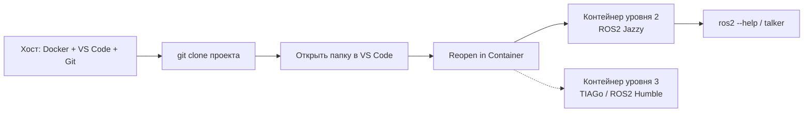

# Настройка окружения дома

## Коротко

По итогам этой инструкции у вас дома появится клон проекта и рабочий Dev Container с ROS2 Jazzy (уровень 2), а при необходимости — контейнер TIAGo с ROS2 Humble (уровень 3). ROS2 не устанавливается на хост — всё работает внутри контейнеров.

## Что это и зачем

Курс работает в контейнерах, чтобы окружение было одинаковым у всех студентов и не ломало вашу основную систему. Домашние задания выполняются дома в том же devcontainer, что и в компьютерном классе.

Контейнер — это переносная мастерская: ROS2, инструменты сборки и зависимости упакованы в образ. Ваш компьютер нужен только для Docker, редактора и Git.

## Требования к домашнему компьютеру

| Требование | Минимум | Рекомендация |
| --- | --- | --- |
| ОС | Windows 10/11, macOS, Linux | Windows 11 / Ubuntu 22.04+ |
| RAM | 8 ГБ | 16 ГБ и больше |
| Диск | 40 ГБ свободного места | SSD, 60 ГБ свободного места |
| Виртуализация | Включена в BIOS (VT-x / AMD-V) | — |
| Интернет | Для `git clone` и скачивания образов | — |

Проверка виртуализации на Windows: в PowerShell выполните `systeminfo` и найдите строку «Hyper-V Requirements» / «Virtualization Enabled In Firmware: Yes». Если «No» — включите VT-x/AMD-V в BIOS/UEFI.

Контейнер уровня 3 (TIAGo) тяжелее: для него нужен больший объём диска и RAM, а для графики (rviz2, Gazebo) — настроенный вывод GUI или GPU (см. раздел «Контейнер уровня 3»).

## Схема



## Общие шаги (для всех вариантов)

1. Установить Git.
2. Склонировать репозиторий проекта.
3. Открыть папку проекта в VS Code и собрать контейнер уровня 2.
4. Проверить `ros2 --help` и `ros2 run demo_nodes_cpp talker`.
5. При необходимости — собрать контейнер `3_Robot/TIAgo_humble/` для уровня 3.

Дальше — три варианта установки под Windows, от простого к резервному.

## Вариант 1 (Windows): прямая установка WSL2

WSL2 — слой совместимости, запускающий Linux внутри Windows. Docker Desktop работает поверх WSL2.

1. Откройте PowerShell от имени администратора и выполните:

   ```bash
   wsl --install
   ```

   Команда включает WSL2 и ставит дистрибутив Ubuntu по умолчанию. Перезагрузите компьютер, если потребуется. Источник: [Install WSL](https://learn.microsoft.com/en-us/windows/wsl/install).

2. Проверьте версию WSL:

   ```bash
   wsl -l -v
   ```

   В выводе у дистрибутива Ubuntu должна быть `VERSION 2`.

3. Установите Docker Desktop для Windows и включите интеграцию WSL2: Docker Desktop → Settings → Resources → WSL Integration → включите для Ubuntu. Источник: [Docker Desktop WSL 2 backend](https://docs.docker.com/desktop/wsl/).

4. Установите VS Code и расширение «WSL» (`ms-vscode-remote.remote-wsl`).

5. Откройте терминал Ubuntu (из меню «Пуск») и склонируйте проект:

   ```bash
   git clone <URL-репозитория> ROS2_basic_course_SESC
   cd ROS2_basic_course_SESC
   code .
   ```

6. В VS Code нажмите Ctrl+Shift+P → «Dev Containers: Reopen in Container». При первом запуске скачивается образ и собирается контейнер.

## Вариант 2 (Windows, рекомендуется): Dev Container

Основной путь — Docker Desktop + расширение Dev Containers, без ручной настройки WSL-терминала.

1. Установите Docker Desktop для Windows. Источник: [Install Docker Desktop on Windows](https://docs.docker.com/desktop/install/windows-install/).

2. Установите VS Code и расширение «Dev Containers» (`ms-vscode-remote.remote-containers`). Источник: [Developing inside a Container](https://code.visualstudio.com/docs/devcontainers/containers).

3. Склонируйте репозиторий (PowerShell или Git Bash):

   ```bash
   git clone <URL-репозитория> ROS2_basic_course_SESC
   ```

4. Откройте папку в VS Code:

   ```bash
   code ROS2_basic_course_SESC
   ```

5. В VS Code нажмите Ctrl+Shift+P → «Dev Containers: Reopen in Container». Первая сборка скачивает образ и собирает контейнер — дождитесь окончания.

6. Если после изменения конфигурации окружение устарело, пересоберите: Ctrl+Shift+P → «Dev Containers: Rebuild Container».

## Вариант 3 (Windows, резервный): VirtualBox

Резервный путь, если WSL2 и виртуализация для Docker недоступны.

1. Скачайте и установите VirtualBox. Источник: [VirtualBox](https://www.virtualbox.org/).

2. Скачайте ISO Ubuntu 24.04. Источник: [Ubuntu](https://ubuntu.com/download/server) или Desktop-редакция.

3. Создайте виртуальную машину: 4+ CPU, 8+ ГБ RAM, 60+ ГБ диска. Установите Ubuntu 24.04 в ВМ.

4. Внутри ВМ установите Docker по официальной инструкции: [Install Docker Engine on Ubuntu](https://docs.docker.com/engine/install/ubuntu/).

5. Внутри ВМ установите VS Code и расширение «Dev Containers». Источник: [Visual Studio Code on Linux](https://code.visualstudio.com/docs/setup/linux).

6. Внутри ВМ склонируйте проект и соберите контейнер:

   ```bash
   git clone <URL-репозитория> ROS2_basic_course_SESC
   cd ROS2_basic_course_SESC
   code .
   ```

   Затем Ctrl+Shift+P → «Dev Containers: Reopen in Container».

## Вариант для macOS / Linux

На macOS и Linux контейнер работает нативно, отдельной виртуализации не требуется.

- macOS: установите Docker Desktop и VS Code с расширением «Dev Containers», затем `git clone`, `code .` и «Reopen in Container». Источники: [Install Docker Desktop on Mac](https://docs.docker.com/desktop/install/mac-install/), [Dev Containers](https://code.visualstudio.com/docs/devcontainers/containers).
- Linux: установите Docker Engine и VS Code, затем те же шаги. Источник: [Install Docker Engine](https://docs.docker.com/engine/install/).

Примечание для macOS на Apple Silicon: образ уровня 2 (`osrf/ros:jazzy-desktop`) — архитектуры x86_64 и работает через эмуляцию; запуск возможен, но медленнее, чем на Intel или Linux.

## Контейнер уровня 3: TIAGo (ROS2 Humble)

Контейнер робота лежит отдельно, в папке `3_Robot/TIAgo_humble/`.

1. Откройте папку `3_Robot/TIAgo_humble/` в VS Code (отдельным окном).
2. Ctrl+Shift+P → «Dev Containers: Reopen in Container».
3. Первая сборка дольше: контейнер собирает образ, клонирует репозитории TIAGo и собирает workspace (~64 пакета).

Графика (rviz2, Gazebo) выводится через виртуальный дисплей VNC/браузер — по умолчанию Вариант 1 (`start_gui.sh` → `http://localhost:6080`). GPU не обязателен. Подробности и остальные варианты вывода — в `3_Robot/TIAgo_humble/README.md`.

## Проверка результата

Внутри контейнера уровня 2 выполните:

```bash
# Справка по CLI — команда ros2 должна быть найдена
ros2 --help

# Демо-узел, который публикует сообщения
ros2 run demo_nodes_cpp talker
```

Ожидаемый результат: `talker` каждые 0.5 с печатает строку вида `[INFO] ... Publishing: 'Hello World: 1'`. Остановите его клавишами Ctrl+C.

Дополнительно, во втором терминале контейнера можно запустить слушателя:

```bash
ros2 run demo_nodes_cpp listener
```

Слушатель должен выводить `I heard: [Hello World: N]` — значит, сообщения доставляются между узлами.

## Типичные ошибки

| Ошибка | Симптом | Исправление |
| --- | --- | --- |
| Виртуализация выключена в BIOS | Docker/WSL2 не стартует, ошибка о VT-x/AMD-V | Включить VT-x/AMD-V в BIOS/UEFI |
| WSL без Docker Desktop | `docker: command not found` в WSL | Установить Docker Desktop и включить WSL2-интеграцию |
| Недостаток RAM | Сборка или контейнер падает, зависает | Дать больше RAM (8+ ГБ), закрыть лишние программы |
| «workspace already in use» | Контейнер не открывается | Закрыть старое окно VS Code/контейнер и открыть заново |
| Контейнер не пересобран | Старые зависимости, ошибки после изменения конфигурации | «Dev Containers: Rebuild Container» |
| `ros2: command not found` | Команда не найдена внутри контейнера | Контейнер не собран или не активирован `setup.bash` |
| Нет GUI (rviz2/Gazebo) | Окно не открывается | Настроить вывод GUI/GPU — см. `3_Robot/TIAgo_humble/README.md` |

## Источники

- [Install WSL](https://learn.microsoft.com/en-us/windows/wsl/install) — установка WSL2.
- [Docker Desktop](https://docs.docker.com/desktop/) и [WSL 2 backend](https://docs.docker.com/desktop/wsl/) — Docker Desktop и интеграция WSL2.
- [Developing inside a Container](https://code.visualstudio.com/docs/devcontainers/containers) — Dev Containers в VS Code.
- [VirtualBox](https://www.virtualbox.org/) — резервный вариант виртуализации.
- [Git](https://git-scm.com/) — установка и работа с Git.
- [ROS2 Jazzy Installation](https://docs.ros.org/en/jazzy/Installation.html) — раздел «Try some examples» с `ros2 run demo_nodes_cpp talker`.

## Далее рекомендуется

- Занятие 2 «Контейнеризация и Git: Docker, Dev Container, версионирование» — [`1_lecture/lectures_content.md`](../1_lecture/lectures_content.md), тема 2.
- Карта домашних заданий — [`2_homework/README.md`](../2_homework/README.md).
- Домашнее задание к занятию 2 — [`2_homework/hw_02_setup.md`](../2_homework/hw_02_setup.md).
