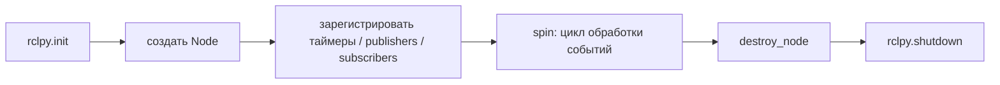
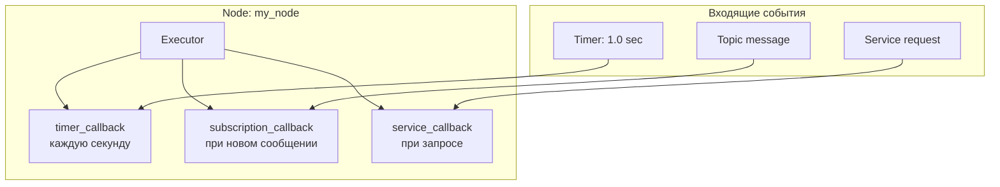
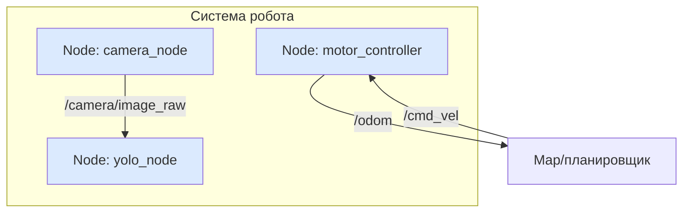

# Node, Executor и callbacks

## Коротко

Node — программа, которая решает одну задачу робота. Executor — цикл, который ловит события и вызывает ваши обработчики (callbacks). Без `spin()` Executor не запускается, и узел не обрабатывает ни одного события.

## Что это

Node (узел) — выполняемый компонент ROS2. Каждая программа робота — это узел:

- `camera_node` — захватывает кадры и публикует их в `/camera/image_raw`;
- `motor_controller` — принимает `/cmd_vel`, управляет колёсами и публикует `/odom`;
- `yolo_node` — получает изображение и публикует найденные объекты в `/detections`.

**Один узел = одна ответственность.** Не пишите узел, который одновременно читает камеру, считает одометрию и управляет моторами.

> *Официальное определение*: «Узел — это участник графа ROS 2, который использует клиентскую библиотеку для общения с другими узлами.» — [Nodes](https://docs.ros.org/en/jazzy/Concepts/Basic/About-Nodes.html)

## Зачем нужно

Деление робота на узлы даёт:

- **модульность** — переписал узел камеры, не трогая навигацию;
- **параллелизм** — узлы работают независимо друг от друга;
- **отказоустойчивость** — падение одного узла не рушит всю систему;
- **распределённость** — узлы могут жить на разных компьютерах (робот, сервер, Raspberry Pi).

## Аналогия

Node — **сотрудник в офисе**. У каждого своя задача: один читает почту, другой считает смету, третий отвечает на звонки.

Executor — **секретарь** этого сотрудника. Он разбирает входящие события (звонок, письмо, таймер) и передаёт каждое нужному обработчику — callback. Сотрудник пишет только суть работы (callback), а не следит за тем, откуда пришло событие.

## Как работает в ROS2

### Клиентские библиотеки: rclpy и rclcpp

Один и тот же узел можно написать на двух языках:

- **rclpy** — клиентская библиотека для Python. Используется в курсе (быстро и наглядно).
- **rclcpp** — клиентская библиотека для C++. Используется там, где важна производительность (драйверы, обработка данных).

Механизмы одинаковы: узел создаёт таймеры, publishers, subscribers, services; Executor вызывает callbacks. Меняется только синтаксис.

### Жизненный цикл узла

Узел живёт от создания до завершения по одному сценарию:



1. `rclpy.init()` — инициализация клиентской библиотеки.
2. Создание `Node` — узел регистрируется в графе ROS2.
3. Регистрация источников событий — `create_timer`, `create_subscription` и т.д.
4. `spin()` — Executor крутится и вызывает callbacks, пока узел не остановят.
5. `destroy_node()` и `rclpy.shutdown()` — корректное завершение.

Управляемый жизненный цикл (managed lifecycle) с явными состояниями «настроен/активирован/деактивирован» — отдельная тема, занятие 16.

### Executor и callbacks



- **Executor** — диспетчер выполнения. Ждёт событий (таймер, сообщение, запрос) и вызывает нужный callback.
- **Callback** — ваша функция, которая выполняется при событии. `timer_callback` срабатывает по таймеру, `subscription_callback` — при получении сообщения.
- **spin()** — запускает Executor. **Без `spin()` ни один callback не вызовется.**

#### Один поток или несколько

- **Single-threaded** (по умолчанию) — один поток обрабатывает все callbacks по очереди. Просто и предсказуемо.
- **Multi-threaded** — несколько потоков обрабатывают callbacks параллельно. Нужно, когда один долгий callback не должен задерживать остальные.

#### Callback groups

Группа callback'ов (callback group) задаёт, как связаны обработчики:

- **Mutually exclusive** — callbacks одной группы не выполняются одновременно (по умолчанию).
- **Reentrant** — один и тот же callback может выполняться в нескольких потоках одновременно.

В Python это `from rclpy.callback_groups import MutuallyExclusiveCallbackGroup, ReentrantCallbackGroup`, Executor — `from rclpy.executors import MultiThreadedExecutor`. Подробности — [About Executors](https://docs.ros.org/en/jazzy/Concepts/Intermediate/About-Executors.html).

### spin() — почему без него узел молчит

```python
rclpy.init()
node = MyNode()
# Без spin() узел создан, но событий не обрабатывает
rclpy.spin(node)  # ← запускает цикл обработки событий
```

Если забыть `spin()`, узел запустится, напечатает сообщение конструктора и завершится. Таймер не сработает, сообщения не придут — узел «молчит».

## Схема



Каждый прямоугольник — отдельная программа со своим Executor. Между собой узлы общаются через topics, services и actions.

## Команды

```bash
# Список всех запущенных узлов
ros2 node list
# Вывод: /my_node

# Информация об узле: publishers, subscribers, services, actions
ros2 node info /my_node

# Визуальный граф всех узлов и связей
rqt_graph
```

## Код

Минимальный узел с таймером:

```python
# my_first_pkg/my_first_pkg/timer_node.py
import rclpy
from rclpy.node import Node


class TimerNode(Node):

    def __init__(self):
        super().__init__('timer_node')          # имя узла в графе
        self._count = 0
        self._timer = self.create_timer(1.0, self._timer_callback)
        self.get_logger().info('Node started')

    def _timer_callback(self):
        self._count += 1
        self.get_logger().info(f'Tick #{self._count}')


def main(args=None):
    rclpy.init(args=args)                       # 1. инициализация
    node = TimerNode()                          # 2. создать узел
    try:
        rclpy.spin(node)                        # 3. запустить Executor
    except KeyboardInterrupt:
        pass
    finally:
        node.destroy_node()                     # 4. освободить ресурсы
        rclpy.shutdown()                        # 5. корректно завершить


if __name__ == '__main__':
    main()
```

Чтобы `ros2 run` знал, что запускать, добавьте точку входа в `setup.py`:

```python
# setup.py (фрагмент)
entry_points={
    'console_scripts': [
        'timer_node = my_first_pkg.timer_node:main',
    ],
},
```

Сборка и запуск:

```bash
cd ~/ros2_ws && colcon build && source install/setup.bash
ros2 run my_first_pkg timer_node
```

Разбор ключевых строк:

| Строка | Что делает |
| --- | --- |
| `super().__init__('timer_node')` | Регистрирует узел в ROS2 с именем `timer_node` |
| `self.create_timer(1.0, self._timer_callback)` | Таймер: раз в секунду вызывает callback |
| `self.get_logger().info(...)` | Печатает в лог ROS2 (аналог `print` с метаданными) |
| `rclpy.init(args=args)` | Инициализирует rclpy |
| `rclpy.spin(node)` | Запускает Executor — цикл ожидания событий |
| `rclpy.shutdown()` | Корректно завершает работу |

## Ожидаемый результат

```text
[INFO] [timer_node]: Node started
[INFO] [timer_node]: Tick #1
[INFO] [timer_node]: Tick #2
[INFO] [timer_node]: Tick #3
...
```

`ros2 node list` показывает `/timer_node`, а `ros2 node info /timer_node` — его имя, publishers/subscribers (пока пусто) и сервисы.

## Типичные ошибки

| Ошибка | Симптом | Исправление |
| --- | --- | --- |
| Забыли `spin()` | Узел создаётся и сразу завершается, callback не срабатывает | Добавить `rclpy.spin(node)` в `main()` |
| Блокирующий код в callback | Таймер перестаёт срабатывать, узел «висит» | Callback должен выполняться быстро; долгие операции — в отдельный поток |
| `entry_points` не обновлён | `ros2 run` не находит команду | Проверить `setup.py` → `entry_points` → `console_scripts` и пересобрать |
| Имя узла уже занято | Ошибка при запуске второго экземпляра | Имена узлов в графе уникальны; задать другое имя |
| Забыли `rclpy.init()` | `RuntimeError: rclpy.init() has not been called` | Добавить `rclpy.init(args=args)` перед созданием узла |
| Забыли `source install/setup.bash` | `ros2 run` не находит пакет | Выполнить `source ~/ros2_ws/install/setup.bash` |

## Связанные темы

- [Workspace](workspace.md) и [пакеты](packages.md) — где лежит узел.
- [colcon](colcon.md) — как собрать узел.
- [Topics](topics.md) — следующий шаг: publisher и subscriber.
- [Services](services.md) — запрос-ответ.
- [Actions](actions.md) — длительные задачи.
- Практика занятия 8 — [`../2_practice/08_node.md`](../2_practice/08_node.md).
- Домашнее задание 8 — [`../2_homework/hw_08_node.md`](../2_homework/hw_08_node.md).
- Вариант lecture-v2 занятия 8 — [`../1_lecture/lecture-v2_content_08_node_v1.md`](../1_lecture/lecture-v2_content_08_node_v1.md).

## Источники

- [Understanding ROS 2 nodes](https://docs.ros.org/en/jazzy/Tutorials/Beginner-CLI-Tools/Understanding-ROS2-Nodes/Understanding-ROS2-Nodes.html)
- [About Executors](https://docs.ros.org/en/jazzy/Concepts/Intermediate/About-Executors.html)
- [Using callback groups](https://docs.ros.org/en/jazzy/How-To-Guides/Using-callback-groups.html)
- [rclpy API (Node)](https://docs.ros2.org/latest/api/rclpy/api/node.html)
