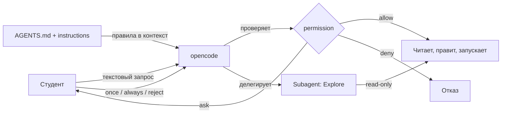

# Агентная инженерия с opencode

## Коротко

opencode — AI-агент для кода, который по текстовому запросу читает, пишет и запускает код в проекте. Студент управляет им через инструкции (`AGENTS.md`) и права (`permission`). Агент ускоряет работу, но не заменяет понимание материала.

## Что это

**AI-агент для кода** — программа, которая по текстовому запросу читает файлы, пишет код и запускает команды в терминале.

Три связанных понятия:

- **vibe-coding** — описываешь результат словами, агент предлагает и применяет изменения. Ты формулируешь «что», агент делает «как».
- **agent engineering** — управление агентом: инструкции (`AGENTS.md`), ограничение прав (`permission`), специализированные субагенты.
- **opencode** — конкретный инструмент: открытый AI-агент для терминала, не привязанный к одному провайдеру моделей. Запускается как CLI-программа.

## Зачем нужно

- Разобраться в чужом проекте: спросить, за что отвечает пакет или файл.
- Писать шаблонный код быстрее (пакеты, launch-файлы, конфиги).
- Объяснять ошибки сборки и предлагать исправления.
- Читать документацию и искать примеры по запросу.

Для курса это важно на уровне 3: агент помогает читать архитектуру робота TIAGo из `3_Robot/TIAgo_humble/`.

## Аналогия

Агент — стажёр с отличной памятью, который работает в вашей папке. Вы ставите задачу словами, он читает файлы и выполняет. Но стажёр может ошибиться и не знает контекста, поэтому вы даёте ему письменные правила (`AGENTS.md`) и требуете спрашивать разрешение на опасные действия (`permission`).

## Как это устроено в opencode

OpenCode запускается как CLI. Без подкоманды открывается TUI (текстовый интерфейс), где идёт диалог с агентом.

### Primary-агенты: Build и Plan

Агент, с которым вы говорите напрямую, называется **primary**. Их два встроенных:

- **Build** — основной агент для выполнения задач; его доступ к инструментам определяется эффективными permissions.
- **Plan** — агент для анализа и планирования; он ограничивает правки по умолчанию.

Переключаться между primary-агентами можно клавишей **Tab**.

Не считайте название Plan технической гарантией read-only: настройки пользователя и проекта влияют на итоговые разрешения. Перед действием проверьте `edit` и `bash` в фактическом `opencode.jsonc`. Для учебного исследования используйте отдельную тестовую папку.

### Subagents: General и Explore

**Subagent** — вспомогательный агент, которого primary-агент вызывает для подзадачи. Встроенные:

- **General** — для сложных вопросов и многошаговых задач; конкретные права зависят от конфигурации.
- **Explore** — специализируется на быстром исследовании файлов и ответах по коду; фактические права также определяются настройками.

Кроме них есть служебные агенты (`title`, `summary`, `compaction`), которые opencode использует сам.

Subagent можно вызвать вручную, упомянув через `@`, например `@explore найди, где объявлен узел`.

### Свои агенты

Свои агенты задаются в конфиге `opencode.json` / `opencode.jsonc` или создаются командой `opencode agent create`. У агента есть имя, `mode` (`primary` / `subagent`), модель и права.

В проекте курса уже настроены три subagent-а: `lecture-author`, `practice-coder`, `reviewer` (см. [`opencode.jsonc`](../opencode.jsonc)).

## Права: allow / ask / deny

Каждое действие агента проходит через права `permission`. Три варианта:

- `allow` — выполнять без спроса;
- `ask` — спросить разрешение;
- `deny` — запретить.

Права настраиваются по инструментам: `read`, `edit`, `glob`, `grep`, `bash`, `webfetch`, `websearch`, `task`, `skill`, `question` и другим. Для `bash` и `edit` можно задать шаблоны, где побеждает последнее совпавшее правило:

```jsonc
"permission": {
  "edit": "allow",
  "bash": {
    "*": "ask",             // все команды — спрашивать
    "ls": "allow",          // ls — без спроса
    "git status*": "allow"  // git status — без спроса
  },
  "webfetch": "ask"
}
```

Когда агент хочет выполнить действие с правом `ask`, интерфейс запрашивает решение. Формулировка кнопок и варианты зависят от текущей версии клиента.

Если права не заданы, действуют значения по умолчанию текущей версии OpenCode. Не полагайтесь на предположение, что все секретные файлы автоматически скрыты: не добавляйте секреты в запросы и проверяйте permissions до работы.

Фрагмент реальных прав из [`opencode.jsonc`](../opencode.jsonc) проекта:

```jsonc
"permission": {
  "edit": "allow",
  "bash": { "*": "ask", "ls": "allow" },
  "webfetch": "ask",
  "read": "allow",
  "grep": "allow",
  "glob": "allow"
}
```

В конфигурации курса чтение и поиск разрешены; редактирование разрешено; Bash-команды требуют подтверждения, кроме `ls`. Встроенный Plan имеет собственные ограничения, однако итоговые права могут зависеть от конфигурации и версии — сверяйте фактическое поведение перед практикой.

## Роль AGENTS.md

`AGENTS.md` — файл с инструкциями для агента. OpenCode обнаруживает проектные правила и добавляет их в контекст; конкретная область действия зависит от расположения файла и текущего рабочего каталога.

- `AGENTS.md` в корне проекта — правила только для этого проекта.
- `~/.config/opencode/AGENTS.md` — личные глобальные правила для всех проектов.
- Команда `/init` внутри opencode создаёт или улучшает `AGENTS.md` по содержимому репозитория.
- Поле `instructions` в `opencode.jsonc` подключает дополнительные файлы инструкций.

В проекте курса [`AGENTS.md`](../AGENTS.md) задаёт цель (годовой курс), правила стиля, структуру папок и главный критерий успеха. Без такого файла агент действует по общим правилам и может «уехать» не туда.

## Схема



## Команды

```bash
opencode                                      # открыть TUI (диалог с агентом)
opencode run "объясни структуру пакета"       # один запрос без интерфейса
opencode run --agent plan "разбери этот код"  # запрос агенту Plan
opencode agent list                           # список агентов
opencode agent create                         # создать своего агента (интерактивно)
opencode models                               # список доступных моделей
opencode --version                            # версия
opencode --help                               # справка
```

## Границы ответственности

Агент ускоряет, но ответственность остаётся на студенте:

- агент может ошибаться в фактах и командах — проверяйте результат;
- сгенерированный код нужно собирать и запускать, а не копировать вслепую;
- агент не заменяет знание ROS2 — на зачёте отвечает студент, а не агент;
- не отправляйте агенту секреты (ключи, пароли) и не разрешайте `rm -rf` без проверки.

Практическое правило: сначала понимание, потом ускорение. Агент — инструмент, как `colcon` или `git`.

## Типичные ошибки

| Ошибка | Симптом | Исправление |
| --- | --- | --- |
| Слепое применение кода | Команда не работает, файл испорчен | Разобрать, что делает каждый шаг, до выполнения |
| Работа без `AGENTS.md` | Агент действует хаотично, не по правилам проекта | Создать/дополнить `AGENTS.md` (команда `/init`) |
| Не знать прав агента | Агент правит файлы или запускает команды неожиданно | Прочитать блок `permission` в `opencode.jsonc` |
| Путать Plan и Build | Просили «посмотреть», а агент начал менять файлы | Для read-only использовать Plan или `@explore` |
| Доверять всему ответу | Ответ правдоподобен, но неверен | Проверять по официальной документации и запуском |

## Связанные темы

- Практика занятия 3 — [`../2_practice/03_opencode.md`](../2_practice/03_opencode.md).
- Домашнее задание 3 — [`../2_homework/hw_03_opencode.md`](../2_homework/hw_03_opencode.md).
- Контейнеры и Git (занятие 2) — [`docker_devcontainer.md`](docker_devcontainer.md), [`git.md`](git.md).
- Уровень 3: чтение кода TIAGo через opencode — [`../3_Robot/TIAgo_humble/`](../3_Robot/TIAgo_humble/).

## Источники

- [opencode — обзор](https://opencode.ai/docs/)
- [opencode: Agents](https://opencode.ai/docs/agents/)
- [opencode: CLI](https://opencode.ai/docs/cli/)
- [opencode: Rules (AGENTS.md)](https://opencode.ai/docs/rules/)
- [opencode: Permissions](https://opencode.ai/docs/permissions/)
- [opencode: Config](https://opencode.ai/docs/config/)
- Вариант материалов lecture-v2 занятия 3 — [`../1_lecture/lecture-v2_content_03_opencode_v1.md`](../1_lecture/lecture-v2_content_03_opencode_v1.md).
