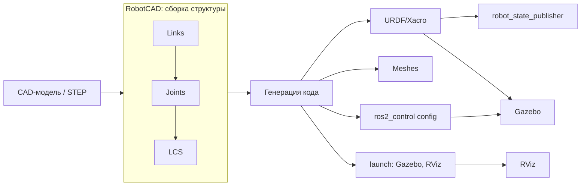

# Проект робота и URDF в RobotCAD

## Коротко

RobotCAD — верстак (workbench) FreeCAD, который превращает CAD-модель в описание робота для ROS2: звенья (links), сочленения (joints) и системы координат (LCS), а затем генерирует URDF/Xacro, меши, launch-файлы и конфиги `ros2_control`.

## Что это

FreeCAD — открытый параметрический 3D-редактор. **Верстак (workbench)** — набор инструментов внутри FreeCAD для отдельной задачи.

RobotCAD — верстак, который связывает CAD и ROS2. Исходный вариант — верстак CROSS (`galou/freecad.cross`), RobotCAD — его продолжение (форк).

В RobotCAD студент собирает робота не из текста, а из 3D-деталей и указывает структуру:

- **link** — звено: жёсткая часть робота (платформа, колесо, рука);
- **joint** — сочленение: подвижная связь между звеньями (вращение колеса, шарнир руки);
- **LCS (локальная система координат)** — точка и оси, к которым привязывают звенья и сочленения;
- **Collisions / Visuals / Reals** — три вида геометрии звена: для физики, для отображения и исходная «настоящая» геометрия.

## Зачем нужно

Писать URDF вручную — значит руками считать положение каждого звена, массу и инерцию. RobotCAD убирает эту рутину:

- ставишь звенья и сочленения в 3D — описания генерируются;
- задаёшь материал — масса и инерция считаются автоматически;
- выгружаешь готовый ROS2-пакет с launch-файлами для Gazebo и RViz.

## Аналогия

CAD — чертёж отдельных деталей. RobotCAD — сборка этих деталей в робота с подписанными осями: где колесо крутится, где рука сгибается, где «перед» робота.

## Как это работает

Цепочка: **CAD → links/joints/LCS → URDF/Xacro → Gazebo/RViz**.



Шаги внутри RobotCAD:

1. Импорт CAD-модели (например, STEP) или создание деталей с нуля в FreeCAD.
2. Создание структуры: links из выбранных объектов, joints между links.
3. Привязка placement звеньев и сочленений по граням или LCS.
4. Назначение материала и автоматический расчёт массы, инерции и центра масс.
5. Добавление контроллеров (`ros2_control`) и сенсоров (Gazebo).
6. Генерация ROS2-пакета: URDF/Xacro, меши, launch-файлы, конфиги контроллеров.

## Установка

Рекомендуемый путь — через Addon Manager FreeCAD (нужна версия FreeCAD 1.x). Из README верстака:

1. Открыть FreeCAD.
2. Edit → Preferences → Addon Manager → блок «Custom repositories» (кастомные репозитории).
3. Добавить `https://github.com/drfenixion/freecad.robotcad`, ветка `main`.
4. Tools → Addon Manager → найти RobotCAD → Install.
5. Перезапустить FreeCAD.

Есть и скрипт быстрой установки, который кладёт FreeCAD + ROS2 + Gazebo в Docker:

```bash
cd ~/ && git clone https://github.com/drfenixion/freecad.robotcad.git && cd freecad.robotcad/docker && bash run.bash -c
```

## Пример структуры сгенерированного пакета

RobotCAD не требует писать API вручную — он генерирует пакет. Типичная структура:

```text
my_robot/
├── urdf/
│   └── my_robot.urdf.xacro    # описание links/joints (Xacro)
├── meshes/
│   └── base_link.stl          # меши звеньев
├── launch/
│   ├── gazebo.launch.py       # запуск в Gazebo
│   └── rviz.launch.py         # запуск в RViz
└── config/
    └── controllers.yaml       # конфиг ros2_control
```

Фрагмент сгенерированного URDF (то, что студент увидит в `urdf/`):

```xml
<link name="base_link">
  <inertial>
    <mass value="2.5"/>
    <origin xyz="0 0 0.1"/>
  </inertial>
  <visual>
    <geometry>
      <mesh filename="package://my_robot/meshes/base_link.stl"/>
    </geometry>
  </visual>
</link>

<joint name="wheel_joint" type="continuous">
  <parent link="base_link"/>
  <child link="wheel_link"/>
  <axis xyz="0 1 0"/>
</joint>
```

Масса `2.5` и положение центра масс `xyz="0 0 0.1"` — это то, что RobotCAD рассчитал по материалу.

## Ожидаемый результат

- В FreeCAD собрана простая модель (платформа + колесо) с заданными link, joint и LCS.
- Сгенерирован пакет с URDF/Xacro, мешами, launch-файлами и конфигом контроллеров.
- URDF можно открыть и прочитать: видны links, joints, масса и инерция.

## Типичные ошибки

| Ошибка | Симптом | Исправление |
| --- | --- | --- |
| Не заданы масса/инерция | Модель «улетает» или дёргается в Gazebo | Назначить материал и пересчитать массу/инерцию |
| Не заданы Collisions | Симуляция пуста, хотя RViz показывает робота | Добавить Collisions для каждого звена |
| Имена links/joints не совпадают с конфигом | Контроллер `ros2_control` не находит сустав | Проверить, что имена в URDF и `controllers.yaml` одинаковы |
| Путают link и joint | Сустав задан как звено или наоборот | Link — жёсткая часть, joint — подвижная связь |

## Связанные темы

- URDF/Xacro и как описание читает ROS2 — [`urdf_xacro.md`](urdf_xacro.md).
- Практика занятия 4 — [`../2_practice/04_robotcad.md`](../2_practice/04_robotcad.md).
- Домашнее задание 4 — [`../2_homework/hw_04_robotcad.md`](../2_homework/hw_04_robotcad.md).
- Уровень 3: сравнение с `tiago_description/urdf/` в [`../3_Robot/TIAgo_humble/`](../3_Robot/TIAgo_humble/).

## Источники

- [RobotCAD (freecad.robotcad) — README](https://github.com/drfenixion/freecad.robotcad)
- [RobotCAD — Wiki: Common usage plan](https://github.com/drfenixion/freecad.robotcad/wiki)
- [FreeCAD](https://www.freecad.org/)
- [FreeCAD: External workbenches](https://wiki.freecad.org/External_workbenches)
- [URDF и Xacro — ROS2 docs](https://docs.ros.org/en/jazzy/Tutorials/Intermediate/URDF/URDF-Main.html)
