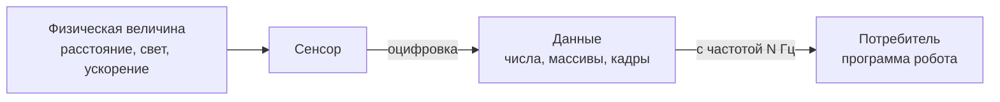
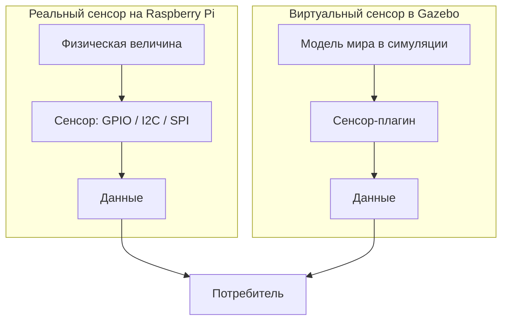

# Датчики: виртуальные и реальные сенсоры

## Коротко

Робот «видит» мир только через сенсоры. Сенсор превращает физическую величину (расстояние, свет, ускорение) в данные, которые дальше потребляют программы робота. Виртуальный сенсор в Gazebo выдаёт те же типы данных, что и реальный, поэтому на нём можно учиться до покупки железа.

## Что это

**Сенсор (датчик)** — устройство, которое измеряет физическую величину и отдаёт результат в виде чисел. Робот не «видит» комнату напрямую — он читает показания датчиков.

**Оцифровка** — превращение непрерывной физической величины в число. Например, напряжение на выходе дальномера становится числом «0.43 метра».

**Частота (частота опроса, частота дискретизации)** — сколько раз в секунду сенсор выдаёт новое значение. Измеряется в герцах (Гц). 10 Гц = 10 измерений в секунду. Чем выше частота, тем быстрее робот узнаёт об изменениях, но тем больше данных обрабатывать.

**Одноплатный компьютер (Raspberry Pi)** — маленький компьютер на одной плате, к которому подключают реальные датчики. Он читает их показания и передаёт дальше программам робота.

## Зачем нужно

Без сенсоров робот слеп: он не знает, где стена, куда повернуться и с какой скоростью крутятся колёса. Сенсоры решают задачи:

- **не врезаться** — лидар и дальномеры измеряют расстояние до препятствий;
- **видеть** — камера даёт изображение, по которому робот распознаёт объекты;
- **чувствовать движение** — IMU измеряет ускорение и повороты, энкодеры — вращение колёс;
- **строить карту** — лидар и одометрия дают данные для навигации.

## Аналогия

Сенсоры — органы чувств робота. Камера — глаза, микрофон — слух, IMU — вестибулярный аппарат, дальномер — рука, которая тянется проверить, далеко ли стена. Мозг (программа) не трогает мир сам — он читает сигналы органов чувств.

## Как работает

Путь данных всегда один и тот же: **физическая величина → сенсор → данные → потребитель**.

1. В мире что-то происходит (стена в 0.5 м, свет от окна, робот наклонился).
2. Сенсор измеряет величину и оцифровывает её.
3. Сенсор отдаёт данные с заданной частотой.
4. Потребитель — программа робота — читает данные и принимает решение.

Разница между реальным и виртуальным сенсором — только в шаге 2:

- **реальный сенсор** измеряет физику напрямую (лазер отражается от стены, гироскоп чувствует поворот) и отдаёт данные через интерфейс подключения (GPIO/I2C/SPI);
- **виртуальный сенсор** в Gazebo считает значение математически по модели мира (луч пересекает стену в симуляции), но отдаёт тот же тип данных.

Поэтому программа-потребитель не знает и не должна знать, реальный перед ней сенсор или симулируемый.

## Схема

Путь данных от физической величины к потребителю:



Реальный и виртуальный сенсор дают один и тот же тип данных:



## Обзор датчиков робота

| Датчик | Что измеряет | Какие данные даёт | Типичная частота |
| --- | --- | --- | --- |
| LiDAR (лидар) | расстояние до препятствий по углам | массив дальностей `ranges[]` + углы | 10–20 Гц |
| RGB-камера | цветное изображение | кадр из пикселей (массив) | 15–30 кадров/с |
| RGBD-камера | цвет + глубина | изображение + карта глубины | 15–30 кадров/с |
| IMU | ориентация, поворот, ускорение | угловая скорость, линейное ускорение | 100–400 Гц |
| Энкодер | угол/скорость вращения колеса | счётчик оборотов или скорость | 100–1000 Гц |
| Дальномер (ультразвук/ИК) | расстояние до ближайшего препятствия | одно число (метры) | 10–40 Гц |

Частоты — типичные значения; конкретное значение задаётся настройкой сенсора и зависит от модели.

## Команды

Команды проверки подключённых устройств (выполняются в контейнере):

```bash
lsusb            # список USB-устройств (камеры, адаптеры, лидары через USB)
ls /dev          # файлы устройств: ttyUSB*, video*, i2c-*
i2cdetect -l     # список шин I2C (нужен пакет i2c-tools)
i2cdetect -y 1   # сканировать шину 1: показать адреса подключённых датчиков
```

`lsusb` и `i2cdetect` — способ увидеть реальные датчики глазами Linux: устройство, подключённое к роботу, появляется в системе как файл или адрес.

## Код

На этом занятии код не нужен — публикация данных появится в занятии 9. Здесь важно понять, как виртуальный сенсор объявляется в Gazebo: в файле мира (SDF) задаётся тип сенсора, частота (`update_rate`) и имя потока (`topic`).

Фрагмент описания лидара в Gazebo (файл мира, SDF):

```xml
<sensor name="gpu_lidar" type="gpu_lidar">
  <topic>lidar</topic>
  <update_rate>10</update_rate>
  <ray>
    <scan>
      <horizontal>
        <samples>640</samples>
        <min_angle>-1.396263</min_angle>
        <max_angle>1.396263</max_angle>
      </horizontal>
    </scan>
    <range>
      <min>0.08</min>
      <max>10.0</max>
    </range>
  </ray>
  <always_on>1</always_on>
</sensor>
```

Что здесь важно:

- `type="gpu_lidar"` — тип сенсора;
- `<update_rate>10</update_rate>` — частота 10 Гц;
- `samples` — сколько лучей за один оборот, `min_angle`/`max_angle` — сектор обзора;
- `range` — минимальное и максимальное расстояние, которые «видит» лидар;
- `<topic>lidar</topic>` — куда публикуются данные. В ROS2 этот же поток данных приходит в именованный канал (topic) — подробно на занятии 9.

## Ожидаемый результат

- Студент объясняет путь «физическая величина → сенсор → данные → потребитель».
- Называет, какие данные даёт каждый датчик (лидар, камера, IMU, энкодер).
- Понимает, что частота — это сколько раз в секунду сенсор выдаёт значение.
- Видит разницу: реальный сенсор измеряет физику, виртуальный считает по модели мира, но тип данных одинаковый.

## Типичные ошибки

| Ошибка | Симптом | Исправление |
| --- | --- | --- |
| Неверная частота опроса | Робот реагирует с задержкой (частота слишком мала) или перегружается данными (слишком велика) | Выбрать частоту под задачу: 10 Гц достаточно для лидара, IMU — сотни Гц |
| Сенсор читают до инициализации | Данные пустые или нулевые в начале | Дать сенсору время запуститься и начать выдавать значения |
| Путают физическую величину и тип данных | В поле скорости пишут расстояние | Сопоставить: расстояние → метры/массив дальностей, скорость → м/с |
| Думают, что виртуальный сенсор «ненастоящий» | Сомнение, что симуляцию можно переносить на железо | Тип данных одинаковый — программу-потребителя менять не нужно |
| Ждут, что камера и лидар дают одно и то же | Путают изображение и массив дальностей | Камера — пиксели (2D-кадр), лидар — расстояния по углам |

## Связанные темы

- Практика занятия 5 — [`../2_practice/05_sensors.md`](../2_practice/05_sensors.md).
- Домашнее задание 5 — [`../2_homework/hw_05_sensors.md`](../2_homework/hw_05_sensors.md).
- Как данные сенсора попадают в ROS2-канал (topic) — [`topics.md`](topics.md) (занятие 9).
- Что такое ROS2 и узлы, которые читают данные — [`ros_architecture.md`](ros_architecture.md) (занятие 6).
- Simulation-first и цифровой двойник — [`simulation.md`](simulation.md).
- Описание тела робота, к которому крепятся сенсоры — [`urdf_xacro.md`](urdf_xacro.md), [`robotcad.md`](robotcad.md).

## Источники

- [Gazebo Sensors (tutorial)](https://gazebosim.org/docs/latest/sensors/)
- [Gazebo Sensors library — список типов сенсоров](https://gazebosim.org/libs/sensors/)
- [Raspberry Pi documentation](https://www.raspberrypi.com/documentation/)
- [Raspberry Pi — документация компьютера (GPIO/I2C/SPI)](https://www.raspberrypi.com/documentation/computers/raspberry-pi.html)
- [ROS2 Concepts — общая архитектура (для перехода к занятию 9)](https://docs.ros.org/en/jazzy/Concepts.html)
