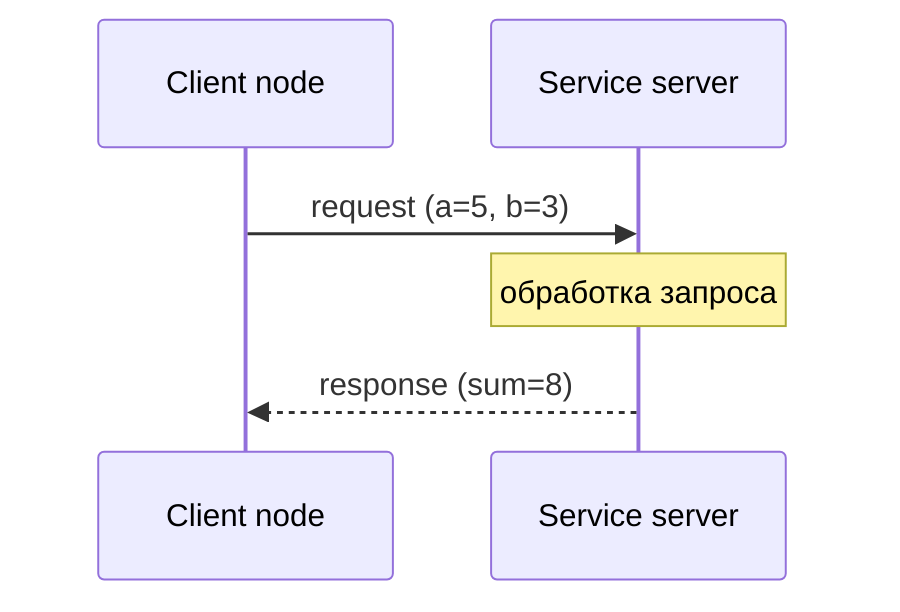

# Service — запрос-ответ в ROS2

## Коротко

Service — механизм для короткой операции по схеме «запрос → ответ». Один узел (client) отправляет запрос и ждёт ответа, другой узел (server) обрабатывает запрос и возвращает ответ. В отличие от topic, это связь точка-точка с гарантией ответа.

> Официальное определение: «Сервисы — ещё один метод общения в графе ROS2. В отличие от топиков с моделью издатель-подписчик, сервисы следуют модели клиент-сервер.» — [About services](https://docs.ros.org/en/jazzy/Concepts/Basic/About-Services.html)

## Что это

Service — пара «запрос-ответ» с фиксированным типом. Тип service состоит из двух частей:

- **Request** — что клиент отправляет серверу.
- **Response** — что сервер возвращает клиенту.

Два участника:

- **Service server** — узел, который предоставляет service: принимает запрос, обрабатывает, возвращает ответ.
- **Service client** — узел, который вызывает service: отправляет запрос и ждёт ответ.

## Зачем нужно

Topic отлично подходит для непрерывных потоков. Но есть задачи, где нужен конкретный ответ на конкретный запрос:

- «Какое сейчас состояние батареи?» — запрос и ответ.
- «Активируй аварийную остановку» — команда с подтверждением.
- «Перезагрузи драйвер лидара» — команда с результатом.

В этих сценариях topic неудобен: нет подтверждения, что получатель обработал сообщение, и нет ответа.

## Аналогия

Service — звонок в справочную службу. Вы задаёте вопрос и ждёте ответа. Пока ждёте — линия занята. Ответ приходит ровно один раз, и связь завершается.

Отличие от topic: topic — это радио (вещает всем, без ответа), service — телефонный звонок (один на один, с ответом).

## Как работает в ROS2

### Service server

Сервер регистрирует service и callback — функцию, которая получает запрос и возвращает ответ.

```python
self.srv = self.create_service(AddTwoInts, 'add_two_ints', self.callback)

def callback(self, request, response):
    response.sum = request.a + request.b
    return response
```

Ключевое: сервер должен быть внутри `rclpy.spin()`, иначе callback не вызывается.

### Service client

Клиент создаёт client для того же имени и типа, ждёт готовности сервера и отправляет запрос.

```python
self.cli = self.create_client(AddTwoInts, 'add_two_ints')
while not self.cli.wait_for_service(timeout_sec=1.0):
    self.get_logger().info('waiting for service...')
future = self.cli.call_async(request)
```

### Синхронный и асинхронный вызов

В Python-клиенте rclpy вызов всегда асинхронный: `call_async()` возвращает объект `Future` — «обещание» будущего результата.

Два способа дождаться ответа:

| Способ | Как | Когда использовать |
| --- | --- | --- |
| Блокирующее ожидание | `rclpy.spin_until_future_complete(node, future)` | Простой клиент, который только отправляет запрос |
| Callback по готовности | `future.add_done_callback(self.response_callback)` | Клиент, который параллельно делает другую работу |

Блокирующее ожидание удобно читать как «синхронный» вызов, но внутри всё равно работает через `Future`.

## Схема



## Команды

```bash
# список всех доступных services и их типов
ros2 service list
ros2 service list -t

# тип конкретного service
ros2 service type /add_two_ints

# вызвать service из командной строки
ros2 service call /add_two_ints example_interfaces/srv/AddTwoInts "{a: 5, b: 3}"
# Ожидаемый вывод: sum=8

# найти все services с заданным типом
ros2 service find example_interfaces/srv/AddTwoInts
```

`ros2 service call` — мощный инструмент отладки: можно вызвать любой service в системе и увидеть ответ, не запуская Python.

## Код

Полный рабочий пример — в практике [10_service.md](../2_practice/10_service.md). Здесь — минимальные фрагменты.

Service server:

```python
import rclpy
from rclpy.node import Node
from example_interfaces.srv import AddTwoInts


class AddTwoIntsServer(Node):

    def __init__(self):
        super().__init__('add_two_ints_server')
        self.srv = self.create_service(AddTwoInts, 'add_two_ints', self.callback)

    def callback(self, request, response):
        response.sum = request.a + request.b
        self.get_logger().info(f'{request.a} + {request.b} = {response.sum}')
        return response


def main(args=None):
    rclpy.init(args=args)
    node = AddTwoIntsServer()
    try:
        rclpy.spin(node)
    except KeyboardInterrupt:
        pass
    finally:
        node.destroy_node()
        rclpy.shutdown()
```

Service client (блокирующее ожидание):

```python
import rclpy
from rclpy.node import Node
from example_interfaces.srv import AddTwoInts


class AddTwoIntsClient(Node):

    def __init__(self):
        super().__init__('add_two_ints_client')
        self.cli = self.create_client(AddTwoInts, 'add_two_ints')
        while not self.cli.wait_for_service(timeout_sec=1.0):
            self.get_logger().info('waiting for service...')

    def call(self, a, b):
        req = AddTwoInts.Request()
        req.a = a
        req.b = b
        return self.cli.call_async(req)


def main(args=None):
    rclpy.init(args=args)
    client = AddTwoIntsClient()
    future = client.call(5, 3)
    rclpy.spin_until_future_complete(client, future)
    response = future.result()
    client.get_logger().info(f'Result: {response.sum}')
    client.destroy_node()
    rclpy.shutdown()
```

## Ожидаемый результат

Запустите server в одном терминале, затем client в другом:

```bash
ros2 run my_service_pkg add_two_ints_server
# [INFO] [add_two_ints_server]: 5 + 3 = 8
```

```bash
ros2 run my_service_pkg add_two_ints_client
# [INFO] [add_two_ints_client]: Result: 8
```

## Service или topic

| Критерий | Topic | Service |
| --- | --- | --- |
| Направление | Однонаправленный поток | Запрос → Ответ |
| Получатели | Многие | Один |
| Ответ | Нет | Есть |
| Частота | Высокая (10–100 Гц) | Низкая (по запросу) |
| Гарантия доставки | Через QoS | Неявная: есть ответ = доставлено |
| Пример | `/scan`, `/cmd_vel` | `/emergency_stop`, диагностика |

Правило: данные идут непрерывно и получателей может быть несколько — topic. Нужен конкретный ответ на конкретный запрос — service. Долгая задача с прогрессом — action (занятие 11).

## Типичные ошибки

| Ошибка | Симптом | Исправление |
| --- | --- | --- |
| Client вызывает service до готовности server | Исключение или вечное ожидание | `wait_for_service()` перед `call_async()` |
| Server без `spin()` | Service виден в `ros2 service list`, но не отвечает | Добавить `rclpy.spin(server)` |
| Несовпадение типов server и client | Нет соединения, `ros2 service call` не находит service | Одинаковый тип (`example_interfaces/srv/AddTwoInts`) |
| Неправильные имена полей запроса | `ros2 service call` возвращает `0` | Сверить поля: `a`, `b`, `sum` для `AddTwoInts` |
| Долгий callback на сервере | Client долго ждёт ответ | Быстрая обработка; долгие задачи — action |
| Забыт `future.result()` в client | Ответ получен, но результат не прочитан | Вызвать `future.result()` после `spin_until_future_complete` |

## Связанные темы

- [Topics](topics.md) — потоковая передача данных.
- [Actions](actions.md) — длительные задачи с прогрессом.
- [Nodes](nodes.md) — устройство узла.
- Практика занятия 10 — [../2_practice/10_service.md](../2_practice/10_service.md).
- Домашнее задание 10 — [../2_homework/hw_10_service.md](../2_homework/hw_10_service.md).

## Источники

- [Understanding services](https://docs.ros.org/en/jazzy/Tutorials/Beginner-CLI-Tools/Understanding-ROS2-Services/Understanding-ROS2-Services.html)
- [Writing a simple service and client (Python)](https://docs.ros.org/en/jazzy/Tutorials/Beginner-Client-Libraries/Writing-A-Simple-Py-Service-And-Client.html)
- [About services](https://docs.ros.org/en/jazzy/Concepts/Basic/About-Services.html)
