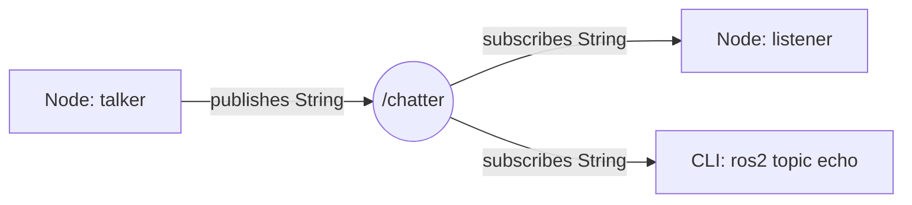
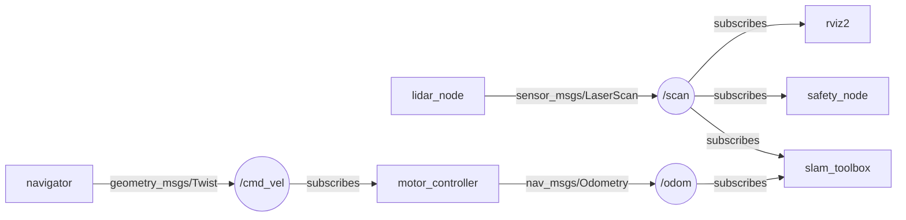

# Topic, publisher, subscriber и message types

## Коротко

Topic — именованный поток сообщений с фиксированным типом. Publisher (отправитель) публикует сообщения в topic, subscriber (подписчик) читает их. Один publisher может отправлять многим subscriber'ам, и наоборот — это связь «многие ко многим».

> *Официальное определение*: «Топики — это важный элемент графа ROS 2, который служит шиной для обмена сообщениями между узлами.» — [Topics](https://docs.ros.org/en/jazzy/Concepts/Basic/About-Topics.html)

## Что это

- **Topic** — именованный канал с фиксированным типом сообщений. Имя обычно начинается с `/`: `/chatter`, `/cmd_vel`, `/scan`.
- **Publisher** — объект в узле, который отправляет сообщения в topic.
- **Subscriber** — объект в узле, который получает сообщения из topic и вызывает callback для каждого.
- **Message** — структура данных, которой обмениваются узлы. У сообщения строгий тип, например `std_msgs/msg/String` или `geometry_msgs/msg/Twist`.

Publisher и subscriber не знают друг о друге: они знают только имя topic и тип сообщения. ROS2 сам находит совпадение имени и типа и связывает их (discovery).

## Зачем нужно

Большинство данных в роботе — это непрерывные потоки:

- `/scan` — лидар публикует измерения ~10 раз в секунду;
- `/camera/image_raw` — камера публикует кадры ~30 раз в секунду;
- `/cmd_vel` — команды скорости для колёс;
- `/odom` — одометрия (пройденный путь) ~50 раз в секунду.

Topic — естественный способ передавать потоковые данные. Subscriber'ов может быть много: данные лидара одновременно читают SLAM (строит карту), safety-узел (проверяет препятствия) и визуализатор.

## Аналогия

Topic — **Telegram-канал**. Автор публикует сообщения в канал, подписчики читают. Автор не знает, кто подписан. Подписчики не знают, кто ещё читает. Сообщения приходят в порядке публикации.

**Но**: в ROS2 у сообщений строгий тип, а не произвольный текст. Нельзя опубликовать число в topic, который ждёт строку.

## Типы сообщений

Тип сообщения задаётся парой «пакет / имя»: `std_msgs/msg/String`. ROS2 поставляет стандартные пакеты типов:

| Пакет | Тип | Поля | Где используется |
| --- | --- | --- | --- |
| `std_msgs` | `String` | `data: string` | Текст, отладка |
| `std_msgs` | `Int32`, `Float64` | `data: int/float` | Числа, счётчики |
| `geometry_msgs` | `Twist` | `linear: Vector3, angular: Vector3` | `/cmd_vel` |
| `geometry_msgs` | `Pose` | `position: Point, orientation: Quaternion` | Координаты |
| `sensor_msgs` | `LaserScan` | `ranges: float32[]`, `angle_min`, ... | `/scan` |
| `sensor_msgs` | `Image` | `data: uint8[]`, `width`, `height`, ... | `/camera/image_raw` |
| `nav_msgs` | `Odometry` | `pose: Pose, twist: Twist` | `/odom` |

Посмотреть структуру типа можно из CLI:

```bash
ros2 interface show std_msgs/msg/String
# string data
```

В курсе используются готовые `std_msgs` и `geometry_msgs` — они уже установлены в контейнере. Собственные `.msg`-файлы — занятие 13.

## Как работает в ROS2

### Publisher

```python
import rclpy
from rclpy.node import Node
from std_msgs.msg import String


class Talker(Node):

    def __init__(self):
        super().__init__('talker')                    # имя узла
        # тип String, topic 'chatter', глубина очереди 10
        self.publisher = self.create_publisher(String, 'chatter', 10)
        self.count = 0
        self.timer = self.create_timer(1.0, self.timer_callback)

    def timer_callback(self):
        msg = String()                                # создать сообщение
        msg.data = f'Hello #{self.count}'             # заполнить поле data
        self.publisher.publish(msg)                   # отправить в topic
        self.get_logger().info(f'Published: "{msg.data}"')
        self.count += 1
```

### Subscriber

```python
class Listener(Node):

    def __init__(self):
        super().__init__('listener')
        # тип String, topic 'chatter', callback, глубина очереди 10
        self.subscription = self.create_subscription(
            String, 'chatter', self.callback, 10)

    def callback(self, msg):
        self.get_logger().info(f'I heard: "{msg.data}"')
```

Ключевые строки:

| Строка | Что делает |
| --- | --- |
| `self.create_publisher(String, 'chatter', 10)` | Publisher для topic `chatter`, тип `String`, очередь 10 |
| `msg = String()`, `msg.data = ...` | Создание и заполнение сообщения |
| `self.publisher.publish(msg)` | Отправка сообщения в topic |
| `self.create_subscription(String, 'chatter', self.callback, 10)` | Subscriber: тип, topic, callback, очередь 10 |

**Callback вызывается при каждом пришедшем сообщении.** Если сообщений много — callback вызывается часто. Не делайте в callback долгих операций.

### Имена и namespace

Имя topic бывает:

- **абсолютным** — начинается с `/`: `/cmd_vel`, `/scan`;
- **относительным** — без ведущего `/`: `cmd_vel`. Тогда ROS2 дописывает namespace узла: узел в namespace `/robot1` с topic `cmd_vel` получит `/robot1/cmd_vel`.

**Namespace** — это «папка» для имён. Он нужен, чтобы разделить одинаковые имена у разных подсистем: у `/robot1` и `/robot2` может быть свой `/robot1/scan` и `/robot2/scan`.

Служебные и зарезервированные имена:

- имена, начинающиеся с `_`, — скрытые: `ros2 topic list` их не показывает без флага `--include-hidden-topics`;
- `/rosout` — служебный topic, куда узлы пишут логи;
- `/parameter_events` — topic, куда узлы публикуют изменения параметров (занятие 14).

Подробнее о правилах имён — [About Names](https://docs.ros.org/en/jazzy/Concepts/Basic/About-Names.html).

## Схема



Направление потока — от publisher к subscriber. Связь «многие ко многим»: у одного topic может быть несколько publisher'ов и несколько subscriber'ов.

В роботе TIAgo:



`/scan` читают три узла: SLAM (строит карту), safety_node (проверяет препятствия), rviz2 (визуализирует). Именно для этого нужна модель «многие ко многим».

## Команды

```bash
# Список активных topics
ros2 topic list
# Список с типами сообщений
ros2 topic list -t

# Чтение сообщений в реальном времени
ros2 topic echo /chatter

# Информация: тип, число publisher/subscriber
ros2 topic info /chatter
# Детально, включая QoS
ros2 topic info /chatter --verbose

# Частота публикации (сообщений в секунду)
ros2 topic hz /chatter

# Публикация одного сообщения из CLI
ros2 topic pub --once /chatter std_msgs/msg/String "data: 'Hello from CLI'"

# Непрерывная публикация с частотой
ros2 topic pub /chatter std_msgs/msg/String "data: 'Hello'" --rate 10
```

`ros2 topic pub` — главный инструмент отладки: можно вручную вставить сообщение в любой topic и посмотреть, как реагирует система.

## Код

Полный рабочий пример (пакет `my_topic_pkg`, два узла) — в практике [`../2_practice/09_topic.md`](../2_practice/09_topic.md). Короткая версия — в разделе «Как работает в ROS2» выше.

## Ожидаемый результат

Запущены `talker` (publisher) и `listener` (subscriber):

```text
# talker
[INFO] [talker]: Published: "Hello #0"
[INFO] [talker]: Published: "Hello #1"

# listener
[INFO] [listener]: I heard: "Hello #0"
[INFO] [listener]: I heard: "Hello #1"
```

`ros2 topic echo /chatter` показывает те же сообщения, `ros2 topic hz /chatter` — частоту `~1.0` Hz, `ros2 topic info /chatter` — тип `std_msgs/msg/String` и по одному publisher/subscriber.

## Типичные ошибки

| Ошибка | Симптом | Исправление |
| --- | --- | --- |
| Разные типы у pub и sub | Нет соединения, `ros2 topic info` показывает 0 subscriber | Использовать одинаковый тип сообщения |
| QoS mismatch | Pub и sub не соединяются, ошибок нет | Проверить QoS: у pub и sub должны быть совместимы (занятие 16) |
| Неправильное имя topic | Subscriber не получает данные | Сверить имена: `/chatter` ≠ `chatter` (в абсолютных именах нужен ведущий `/`) |
| Путаница из-за namespace | Topic не виден под ожидаемым именем | `ros2 topic list` показывает полное имя с namespace, например `/robot1/scan` |
| Забыли `source setup.bash` | `ros2 topic list` не показывает ваш topic | `source ~/ros2_ws/install/setup.bash` |
| Блокирующий код в callback | Subscriber перестаёт получать сообщения | Callback должен выполняться быстро |

## Связанные темы

- [Nodes](nodes.md) — как устроен узел, где живут publisher и subscriber.
- [Services](services.md) — когда topic недостаточно: запрос-ответ.
- [Actions](actions.md) — длительные задачи с прогрессом.
- [QoS](qos.md) — настройка доставки сообщений.
- Практика занятия 9 — [`../2_practice/09_topic.md`](../2_practice/09_topic.md).
- Домашнее задание 9 — [`../2_homework/hw_09_topic.md`](../2_homework/hw_09_topic.md).
- Вариант lecture-v2 занятия 9 — [`../1_lecture/lecture-v2_content_09_topic_v1.md`](../1_lecture/lecture-v2_content_09_topic_v1.md).

## Источники

- [Understanding ROS 2 topics](https://docs.ros.org/en/jazzy/Tutorials/Beginner-CLI-Tools/Understanding-ROS2-Topics/Understanding-ROS2-Topics.html)
- [About Topics](https://docs.ros.org/en/jazzy/Concepts/Basic/About-Topics.html)
- [Writing a simple publisher and subscriber (Python)](https://docs.ros.org/en/jazzy/Tutorials/Beginner-Client-Libraries/Writing-A-Simple-Py-Publisher-And-Subscriber.html)
- [About QoS settings](https://docs.ros.org/en/jazzy/Concepts/Intermediate/About-Quality-of-Service-Settings.html)
- [About Names](https://docs.ros.org/en/jazzy/Concepts/Basic/About-Names.html)
