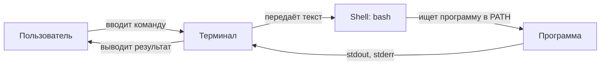
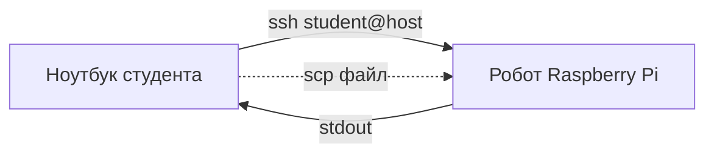

# Ubuntu и командная строка

## Коротко

Терминал — основной способ управления роботом и его программами. Инструменты ROS2 курса запускаются внутри контейнера из командной строки, а к роботу при наличии сети подключаются удалённо по SSH.

## Что это

Терминал — программа, в которой вы вводите команды текстом. Он показывает приглашение (prompt) и выводит результат. Shell (оболочка) — программа, которая читает вашу команду, запускает её и возвращает ответ. По умолчанию в Ubuntu это `bash`.

Через терминал вы работаете с:

- файловой системой — перемещаетесь по папкам, создаёте и удаляете файлы;
- правами доступа — решаете, кто может читать и запускать файлы;
- пакетами — устанавливаете программы через `apt`;
- справкой — читаете `man` и `--help`;
- удалёнными машинами — подключаетесь к роботу по SSH.

## Зачем нужно

Робот — это компьютер без привычного графического интерфейса. Его настраивают, запускают и отлаживают командами. Конкретные задачи:

- запускать ROS2-узлы и инструменты (`ros2 run`, `ros2 topic` — появятся с темы 6);
- редактировать конфиги и читать логи робота;
- устанавливать недостающие пакеты;
- подключаться к Raspberry Pi робота по SSH, чтобы управлять им с ноутбука.

## Аналогия

Терминал — разговор с компьютером короткими фразами. Вместо того чтобы кликать по папкам мышью, вы говорите: «покажи, где я» (`pwd`), «перейди туда» (`cd`), «создай папку» (`mkdir`).

SSH — дверь в другой компьютер. IP-адрес — номер дома, порт — квартира, SSH-ключ — ключ от двери. Вы подключаетесь к роботу в соседней комнате так же, как открываете свою дверь.

## Как работает

Команда — это имя программы и её аргументы:

```text
ls -la /home/ubuntu
↑   ↑      ↑
│   │      └─ аргумент (что показать)
│   └──────── опция (как показать)
└──────────── имя программы
```

Shell разбирает строку, находит программу `ls` и передаёт ей аргументы. Где искать программу, shell узнаёт из переменной окружения `PATH`.

Файловая система — дерево с корнем `/`:

```text
/               корень
├── home/ubuntu  ваша домашняя папка (~)
├── etc/         системные настройки
├── bin/, usr/bin/  исполняемые программы
└── var/, tmp/   данные и временные файлы
```

Права доступа — три пары прав для владельца, группы и остальных: `r` (читать), `w` (писать), `x` (выполнять). Запись `-rw-r--r--` значит: обычный файл, владелец читает и пишет, остальные только читают.

## Схема





## Команды

### Навигация

```bash
pwd            # показать текущую папку → /home/ubuntu
ls             # список файлов и папок в текущей папке
ls -la         # подробно (права, размер) + скрытые файлы (начинаются с .)
cd ~           # перейти в домашнюю папку (~ = /home/ubuntu)
cd /tmp        # перейти в /tmp по абсолютному пути
cd ..          # перейти на уровень вверх
```

### Файлы и папки

```bash
mkdir -p ~/ros2_ws/src   # создать папку src вместе с родительской ros2_ws
touch notes.txt          # создать пустой файл
cp notes.txt notes2.txt  # скопировать файл
mv notes2.txt archive/   # переместить (или переименовать)
rm notes.txt             # удалить файл (без корзины — навсегда)
cat /etc/os-release      # вывести содержимое файла
grep PRETTY /etc/os-release  # найти строки, содержащие PRETTY
```

### Права и sudo

```bash
ls -l notes.txt        # показать права: -rw-r--r-- 1 ubuntu ubuntu ...
chmod +x script.sh     # добавить право на выполнение
sudo apt update        # выполнить команду от имени администратора (root)
```

`sudo` даёт временные права администратора. Без него нельзя менять системные файлы и ставить пакеты. Не работайте постоянно под root — случайная ошибка сломает систему.

### Пакеты и справка

```bash
sudo apt update                          # обновить список пакетов
sudo apt install -y tree                 # установить пакет tree
man ls                                   # руководство по ls (выход — q)
ls --help                                # короткая справка по ls
```

### Переменные окружения и PATH

```bash
echo $PATH          # показать список папок, где shell ищет программы
echo $HOME          # показать переменную HOME (/home/ubuntu)
printenv            # показать все переменные окружения
export MY_VAR=42    # задать переменную для текущей сессии
which bash          # показать путь к программе bash (/usr/bin/bash)
```

### Стандартные потоки

Каждая программа пишет в два потока: `stdout` (обычный вывод) и `stderr` (ошибки).

```bash
ls > files.txt         # сохранить вывод в файл (перезаписать)
ls >> files.txt        # дописать вывод в конец файла
cat notes.txt | grep a # передать вывод одной команды на вход другой
ls /не_существует 2> err.txt  # направить только ошибки в файл
```

### SSH

```bash
ssh-keygen -t ed25519 -C "student@laptop" -f ~/.ssh/course_robot_ed25519
ssh-copy-id -i ~/.ssh/course_robot_ed25519.pub user@host
ssh -i ~/.ssh/course_robot_ed25519 user@host
ssh -p 2222 -i ~/.ssh/course_robot_ed25519 user@host
scp -i ~/.ssh/course_robot_ed25519 file.txt user@host:/путь/
scp -r -i ~/.ssh/course_robot_ed25519 dir user@host:/путь/
```

`ssh-keygen` создаёт два файла: `course_robot_ed25519` (приватный — храните у себя, никому не показывайте) и `course_robot_ed25519.pub` (публичный — его можно добавить на целевой компьютер). Имя ключа специально отличается от стандартного, чтобы не затронуть уже существующий `id_ed25519`. Если файл с таким именем уже есть, выберите новое имя или отмените генерацию — не подтверждайте перезапись автоматически.

В Dev Container домашний каталог может быть временным или не синхронизироваться с хостом. Перед использованием ключа для реального робота проверьте, где он хранится, и используйте только утверждённый курсом способ переноса/доступа. Приватный ключ не помещают в Git, дневник или сдаваемые файлы.

## Код

Скрипт, который показывает стандартный сценарий: проверить окружение и создать workspace.

```bash
# где я и кто я
pwd
whoami

# какая система
cat /etc/os-release

# создать workspace для ROS2
mkdir -p ~/ros2_ws/src
ls ~/ros2_ws
```

## Ожидаемый результат

- `pwd` → `/home/ubuntu`.
- `whoami` → `ubuntu` (пользователь контейнера, не root).
- `cat /etc/os-release` → строка `Ubuntu 24.04` (или `VERSION_ID="24.04"`).
- `ls ~/ros2_ws` → `src`.

## Типичные ошибки

| Ошибка | Симптом | Исправление |
| --- | --- | --- |
| Путают `cd` и `ls` | `ls /tmp` работает, а `cd /tmp` нет (ввели `cd` без пути) | `cd` — переход, `ls` — просмотр; `cd` без аргумента идёт в `~` |
| Потеряли путь после `sudo` | `sudo cd` не работает, `~` указывает не туда | `sudo` — для прав, не для навигации; обычные файлы редактируйте без `sudo` |
| Удалили не то через `rm` | Файл исчез навсегда | Проверяйте путь; осторожно с `rm -rf` |
| Редактируют системный файл без копии | Сломан конфиг | Сделайте резервную копию: `cp file file.bak` |
| `Permission denied` по SSH | Публичный ключ не лежит на целевой машине | `ssh-copy-id user@host` или вручную в `~/.ssh/authorized_keys` |
| `Connection refused` по SSH | На машине не запущен сервер `sshd` или не тот порт | Проверить `service ssh status` и порт (`ssh -p PORT`) |
| Команда не найдена | `bash: foo: command not found` | Программы нет в `PATH`; установите её или укажите полный путь |

## Связанные темы

- Практика занятия 1 — [`../2_practice/01_ubuntu_cli.md`](../2_practice/01_ubuntu_cli.md).
- Домашнее задание 1 — [`../2_homework/hw_01_ubuntu.md`](../2_homework/hw_01_ubuntu.md).
- Настройка окружения дома — [`home_setup.md`](home_setup.md).
- Вариант материалов lecture-v2 занятия 1 — [`../1_lecture/lecture-v2_content_01_ubuntu_v1.md`](../1_lecture/lecture-v2_content_01_ubuntu_v1.md).
- Занятие 2 «Контейнеризация и Git» — [`../1_lecture/lectures_content.md`](../1_lecture/lectures_content.md), тема 2.

## Источники

- [Ubuntu Server docs: Command line](https://ubuntu.com/server/docs/command-line-tutorials)
- [Linux Journey](https://linuxjourney.com/)
- [OpenSSH](https://www.openssh.com/)
- [Ubuntu: OpenSSH Server](https://ubuntu.com/server/docs/openssh-server)
