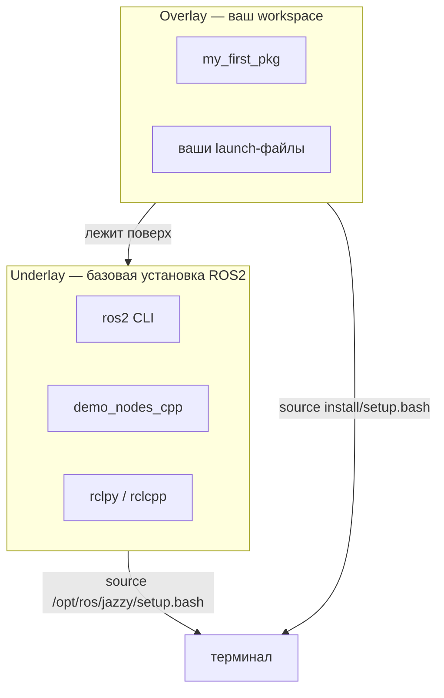

# Workspace в ROS2

## Коротко

Workspace (рабочее пространство) — папка, где лежат исходники пакетов и результаты их сборки. Сборку делает `colcon`, а готовые пакеты подключаются командой `source install/setup.bash`. Работа идёт в контейнере — ROS2 не устанавливается на хост.

> *Официальное определение*: «Workspace — это директория, содержащая пакеты ROS 2.» — [Creating a workspace](https://docs.ros.org/en/jazzy/Tutorials/Beginner-Client-Libraries/Creating-A-Workspace/Creating-A-Workspace.html)

## Что это

Workspace — корневая папка ROS2-проекта. Внутри четыре папки:

| Папка | Назначение | Кто создаёт |
| --- | --- | --- |
| `src/` | Исходные коды пакетов | Вы |
| `build/` | Промежуточные файлы сборки | `colcon build` |
| `install/` | Готовые к запуску артефакты | `colcon build` |
| `log/` | Логи сборки | `colcon build` |

**Не редактируйте `build/`, `install/`, `log/` вручную.** Эти папки создаёт и управляет ими `colcon`.

## Зачем нужно

Workspace отделяет исходный код от результатов сборки. Вы работаете только в `src/`. Сборка, зависимости и окружение изолированы в рамках workspace.

Несколько workspace могут сосуществовать независимо: один для учебных примеров, другой для проекта робота.

## Аналогия

Workspace — **мастерская**:

- `src/` — чертежи и детали;
- `colcon build` — сборка изделия;
- `install/` — готовая продукция на складе;
- `source install/setup.bash` — вы берёте изделие со склада и кладёте на верстак.

## Как это устроено в ROS2: underlay и overlay

ROS2 собирается **слоями**. Базовая установка (сам ROS2 в `/opt/ros/jazzy`) — это **underlay** (нижний слой). Ваш workspace поверх него — **overlay** (верхний слой).



Как это работает:

1. В контейнере ROS2 активирован заранее (`source /opt/ros/jazzy/setup.bash`) — это underlay.
2. Когда вы делаете `source install/setup.bash`, ваш workspace становится overlay поверх underlay.
3. Overlay **добавляет** новые пакеты (ваш `my_first_pkg`) и может **перекрывать** пакеты из underlay (если имя совпадает).

Зачем это нужно: вы пользуетесь готовым ROS2 и при этом добавляете только свой код, не трогая базовую установку.

## Контейнерная среда

ROS2 **не устанавливается на хост**. Вся работа — внутри Dev Container уровня 2:

```text
Хост (ваш компьютер)
└── Docker
    └── Dev Container (Ubuntu 24.04 + ROS2 Jazzy)
        └── Terminal → ros2 ... , colcon ...
```

Такой подход даёт одинаковое окружение у всех студентов, изоляцию и воспроизводимость.

## Команды

Полный путь «создать workspace → собрать → подключить»:

```bash
# 1. Создать папку src внутри workspace
mkdir -p ~/ros2_ws/src

# 2. Перейти в workspace
cd ~/ros2_ws

# 3. Создать пакет (см. packages.md)
ros2 pkg create --build-type ament_python my_first_pkg --destination-directory src

# 4. Собрать workspace
colcon build

# 5. Подключить собранные пакеты
source install/setup.bash

# 6. Проверить, что пакет виден
ros2 pkg list | grep my_first_pkg
```

## Код

Минимальный пример создания и сборки пустого workspace:

```bash
mkdir -p ~/ros2_ws/src
cd ~/ros2_ws
ros2 pkg create --build-type ament_python my_first_pkg --destination-directory src
colcon build
```

## Ожидаемый результат

После `colcon build` в корне workspace появляются четыре папки:

```text
~/ros2_ws/
├── src/       ← исходники (my_first_pkg)
├── build/     ← промежуточные файлы (не трогать)
├── install/   ← готовые пакеты (не трогать)
└── log/       ← логи сборки
```

Команда `ros2 pkg list | grep my_first_pkg` выводит имя вашего пакета — workspace подключён.

## Типичные ошибки

| Ошибка | Симптом | Исправление |
| --- | --- | --- |
| Забыли `source install/setup.bash` | `ros2 pkg list` не показывает ваш пакет | `source ~/ros2_ws/install/setup.bash` |
| Пакет создан не в `src/` | `colcon build` не видит пакет | Создать пакет через `--destination-directory src` или переместить в `src/` |
| Команда `ros2` не найдена | `bash: ros2: command not found` | Контейнер не запущен; поднять Dev Container |
| `colcon build` вызван не из корня workspace | Ошибка сборки | `cd ~/ros2_ws && colcon build` |
| Подключили overlay, не активировав underlay | `ros2` не находит базовые пакеты | Underlay (`/opt/ros/jazzy/setup.bash`) в контейнере активируется автоматически |

## Пример в реальном роботе

TIAGo использует такой же workspace: `ros2_ws/` с `src/`, `build/`, `install/`, `log/`. Пакеты загружаются из репозиториев PAL Robotics (`tiago.repos`), а весь workspace собирается одной командой `colcon build` в контейнере `3_Robot/TIAgo_humble/`. Подробнее — [`3_Robot/TIAgo_humble/docs/tiago_architecture.md`](../../3_Robot/TIAgo_humble/docs/tiago_architecture.md).

## Связанные темы

- [Пакеты](packages.md) — какие бывают пакеты и зачем
- [colcon](colcon.md) — детально о сборке
- [Nodes](nodes.md) — написание первого узла
- Практика 7 — [`../2_practice/07_workspace.md`](../2_practice/07_workspace.md)
- Домашнее задание 7 — [`../2_homework/hw_07_workspace.md`](../2_homework/hw_07_workspace.md)

## Источники

- [Creating a workspace](https://docs.ros.org/en/jazzy/Tutorials/Beginner-Client-Libraries/Creating-A-Workspace/Creating-A-Workspace.html)
- [ROS2 Jazzy Installation](https://docs.ros.org/en/jazzy/Installation.html)
